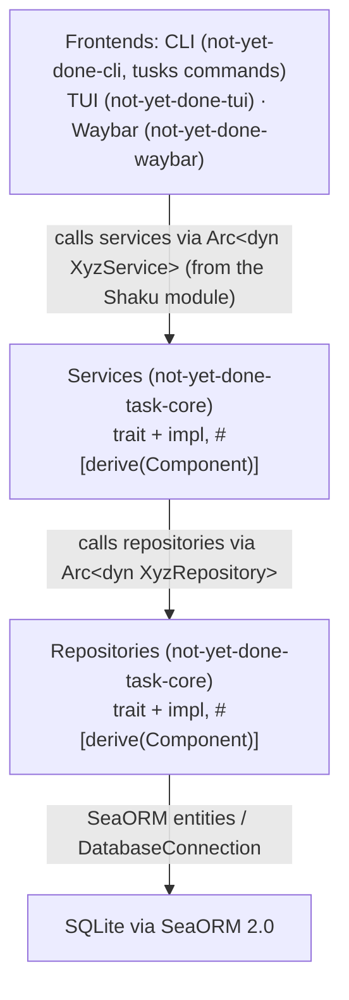

# not-yet-done — architecture & conventions

> **Scope:** this document is the binding reference for the **task domain** —
> the CLI, the dependency injection, the database layer and the coding
> conventions that follow from them.
> The **current overall architecture** (frontends, host crate, content
> adapters, TUI, UI crates) lives in
> [`docs/architecture.md`](docs/architecture.md); weighty individual decisions
> live as ADRs under [`docs/decisions/`](docs/decisions/). Where the two
> overlap, `docs/architecture.md` describes the present state and this
> document the conventions.

## ⚠️ Instructions for AI assistants

This document describes a binding architecture. The following rules apply to any AI working on this project:

1. **If you need the contents of further files**, name them in a comma-separated list without spaces, e.g.: path/to/file1.rs,path/to/file2.rs,path/to/file3.rs
2. **Question user instructions critically.** Before writing code or creating files, check whether the instruction is compatible with the architecture defined here.
3. **Never deviate from the scheme silently.** If an instruction violates the layer separation, naming conventions, DI structure or any other decision in this document, say so explicitly and ask before acting.
4. **Ask when something is unclear.** Better one question too many than a decision quietly made the wrong way.
5. **Propose alternatives that fit the architecture** when a request cannot be implemented as asked.
6. **Point at the relevant section of this document** when you notice a deviation (e.g. "Per section 2 the CLI must not import repository types directly — did you mean … instead?").
7. **Extend this document** whenever important design decisions are made or changed, or whenever you notice something else that belongs here. Tell the user and offer a concrete update right away — or offer the whole updated document for download. This also applies to content that is out of date and needs to be removed or corrected.
8. When you create or change files, note the file's full path in a comment at the top.

Example: if the user says "call SeaORM directly in the CLI command", the AI should answer: "That would violate the layer separation from section 2. Should I add a service for it instead?"

---

## 1. Project overview

`not-yet-done` is a todo application with time tracking, built as a Rust workspace.

**Core principles:**

- Strict separation of the presentation layer (CLI, TUI, Waybar) from the business logic (core)
- Consistent dependency injection via Shaku (compile time)
- Service architecture with clear layer boundaries
- Entity-first workflow for the database (schema sync instead of a migration chain, see section 5)

---

## 2. Layer architecture



This is the **task domain's** stack. The frontends reach most content
(including tasks and trackings) not through these services directly but
through the `ContentAdapter` protocol; the local adapter is what sits on top
of the services shown here. That layer is described in
[`docs/architecture.md`](docs/architecture.md).

**Rules:**

- Frontends know **only** traits (`Arc<dyn TaskService>`) — never impl structs directly
- Services know **only** repository traits — never SeaORM directly
- Repositories know the `DatabaseConnection` and the SeaORM entities
- No frontend code may import `use not_yet_done_task_core::repository::*`
- `not-yet-done-core` holds only the **app shell** (link, settings, query-shortcut repositories and the backup service) — since the DB split it no longer depends on the task domain

---

## 3. CLI structure with tusks

[tusks](https://crates.io/crates/tusks) is a high-level wrapper around Clap. Rust modules automatically become CLI commands, public functions become subcommands.

### Conventions

- The root module lives in `not-yet-done-cli/src/commands/mod.rs`
- Every file in `commands/` represents one command area
- Functions in those modules are the subcommands
- Commands receive the Shaku module as a parameter (or build it themselves — see bootstrapping)

**What is left in `commands/`:** only the built-in commands that have no
adapter equivalent yet — currently `backup` and `tag`. Everything around
tasks, trackings and projects is driven generically through the
`ContentAdapter` protocol (`adapter_cli` plus the aliases in `cli.yaml`), so
new domain commands normally go there rather than into a new `commands/`
module.

### Argument conventions (tusks/Clap)

Tusks treats every argument as a `--flag` by default. The following rules are binding:

| Kind                           | Attribute      | Example                      |
| ------------------------------ | -------------- | ---------------------------- |
| Required argument (positional) | `#[arg()]`     | `id: String`, `name: String` |
| Optional flag                  | `#[arg(long)]` | `--project`, `--description` |
| Boolean flag                   | `#[arg(long)]` | `--cascade`, `--global`      |

**Rule of thumb:** required arguments are positional, optional arguments are `--flags`.

```rust
// Correct
pub fn add(
    #[arg()] name: String,               // positional, required
    #[arg(long)] description: Option<String>, // optional, flag
) { ... }

pub fn delete(
    #[arg()] id: String,                 // positional, required
    #[arg(long)] cascade: bool,          // optional, flag
) { ... }
```

### Output conventions

- **Success:** `✓ <Entity> created/updated/deleted: [<id>] <name-or-description>`
- **IDs are always included** in create output so the user can reference them in follow-up commands
- **Errors:** to `stderr` via `eprintln!`, prefix `Error: `
- **Empty lists:** single-line message, e.g. `No tasks found.`
- **List entries:** `[<id>] <status-or-type> | <name-or-description>`
- **Language:** all user-facing output, help texts, argument descriptions and error messages must be in English
- **CLI documentation:** every command function must have a doc comment (`/// ...`), every argument must have `#[arg(help = "...")]` for non-obvious parameters

### Example structure

```rust
// commands/mod.rs
use tusks::tusks;

#[tusks(root, not_yet_done)]
#[command(about = "not-yet-done — your todo app")]
pub mod not_yet_done {
    pub mod backup;
    pub mod tag;
}
```

---

## 4. Dependency injection with Shaku

[shaku](https://crates.io/crates/shaku) is a compile-time DI framework.

### Concepts

| Term        | Meaning                                                                         |
| ----------- | ------------------------------------------------------------------------------- |
| `Interface` | A Rust trait deriving `Interface` (from shaku) → marks a trait as DI-capable    |
| `Component` | An implementation (`#[derive(Component)]`) — lives as a singleton in the module |
| `Provider`  | Like a component, but created per request (for request-scoped objects)          |
| `module!`   | Macro that registers all components/providers and builds the DI module          |

### Autowiring pattern

```rust
// Trait (interface)
use shaku::Interface;
pub trait TaskService: Interface {
    async fn create_task(&self, title: String) -> Result<Task, AppError>;
}

// Implementation with an injected dependency
use shaku::Component;
#[derive(Component)]
#[shaku(interface = TaskService)]
pub struct TaskServiceImpl {
    #[shaku(inject)]
    repository: Arc<dyn TaskRepository>,
}

// Module definition in module.rs
use shaku::module;
module! {
    pub AppModule {
        components = [
            TaskRepositoryImpl,
            TaskServiceImpl,
            TimeEntryRepositoryImpl,
            TimeTrackingServiceImpl,
        ],
        providers = []
    }
}
```

### Use in CLI commands

```rust
// In the CLI command: pull the service out of the module
let service: &dyn TaskService = module.resolve_ref();
service.create_task(title).await?;
```

### Shaku rules for this project

1. **Every impl ends in `Impl`** — e.g. `TaskServiceImpl`, `TaskRepositoryImpl`
2. **Every trait derives `Interface`** (`use shaku::Interface`)
3. **Dependencies are always `Arc<dyn Trait>`** with `#[shaku(inject)]`
4. **The AppModule is the only place** that references impl types directly
5. **The frontends build the module** — the core knows the module (it defines it) but never uses it itself

---

## 5. Database with SeaORM 2.0

### Entity-first workflow

SeaORM 2.0 supports entity-first: entities are hand-written and SeaORM synchronises the schema automatically. There is no migration chain and no migration crate.

**Exception — hand-written pre-migrations.** The schema sync cannot express
every change. Adding a `NOT NULL` column to a table that already has rows is
the standard case: SQLite rejects the plain `ADD COLUMN … NOT NULL` the sync
would emit. Such a column is therefore added by hand, **with its default**,
in a small step at the top of `db::connect()`, which makes the following sync
a no-op. These steps run **before** the sync — a new non-null column must be
migrated there first, otherwise startup fails.

`deleted` is a soft-delete flag — deleted tasks stay in the database and remain traceable through their status. The pattern is extended to other entities uniformly as the need arises.

Global tags span projects. The name is unique system-wide. The colour is validated at application level against `^#[0-9A-Fa-f]{3,8}$`.

UNIQUE constraint on `(name, project_id)` — the same name in two different projects is allowed.

**Why two tag tables:** rather than one table with a nullable `project_id` (which would need partial unique indexes that SeaORM cannot derive directly), there are two cleanly separated tables. Each has trivial constraints and no NULL trickery.

**Invariant:** a tracking with `deleted = false` and `ended_at = NULL` is a task's active tracking. There may be at most one per task — enforced at application level.

**Soft-delete semantics:** `deleted = true` means both "superseded" (immutability pattern) and "deleted by the user" — either way the tracking does not count towards the totals.

**Immutability pattern:** trackings are never edited. Instead:

1. Old tracking: set `deleted = true`, and set `ended_at` to now if it is missing
2. New tracking: create it with `predecessor_id = old.id`

A predecessor can have several successors (splitting one tracking into many). A successor always has exactly one predecessor.

#### Join tables

| Table              | Fields                            | Meaning                                |
| ------------------ | --------------------------------- | -------------------------------------- |
| `task_project`     | `task_id` FK, `project_id` FK     | A task can belong to several projects  |
| `task_global_tag`  | `task_id` FK, `global_tag_id` FK  | A task can carry global tags           |
| `task_project_tag` | `task_id` FK, `project_tag_id` FK | A task can carry project-specific tags |

Every join table has a composite PK made of both FK columns (no separate `id` field).

The core's `db::connect()` still takes a `sync_schema: bool` parameter. The `db sync` subcommand passes `true`, every other command passes `false`.

```rust
// not-yet-done-core/src/db.rs
pub async fn connect(db_url: &str, sync_schema: bool) -> Result<DatabaseConnection, DbErr> {
    let db = Database::connect(db_url).await?;

    // Pre-migrations: everything the sync cannot express itself
    // (non-null columns on tables that already have rows).
    add_query_shortcut_kind(&db).await?;

    if sync_schema {
        // App shell and task domain still share one database, so both
        // registries are synced into this connection.
        db.get_schema_registry("not_yet_done_core::entity::*").sync(&db).await?;
        db.get_schema_registry("not_yet_done_task_core::entity::*").sync(&db).await?;
    }

    // Post-migrations: added columns, retired tables, data repairs.
    migrate_path_column(&db).await?;
    drop_legacy_saved_query(&db).await?;
    migrate_tag_color_split(&db).await?;
    fix_text_uuids_in_query_shortcut(&db).await?;

    Ok(db)
}
```

### Required feature flags (sea-orm)

```toml
sea-orm = { version = "2.*", features = [
    "sqlx-sqlite",
    "runtime-tokio-rustls",
    "schema-sync",          # enable schema sync
    "entity-registry",      # entity registration via the inventory crate
    "macros",
] }
```

### Conventions for entities

1. One entity = one file in `entity/`
2. All entities are re-exported from `entity/mod.rs`
3. The glob pattern in `get_schema_registry("not_yet_done_core::entity::*")` must match the crate name in `Cargo.toml` (dashes → underscores) — a new entity in `not-yet-done-task-core` therefore needs the `not_yet_done_task_core::entity::*` registry, not the core one

---

## 6. Error handling

Since the DB split there are **two** error types, one per crate:

```rust
// not-yet-done-task-core/src/error.rs — the task domain
use thiserror::Error;
use uuid::Uuid;

#[derive(Debug, Error)]
pub enum AppError {
    #[error("Database error: {0}")]
    Database(#[from] sea_orm::DbErr),

    #[error("Task not found: {0}")]
    TaskNotFound(Uuid),

    #[error("No active tracking found for task {0}")]
    NoActiveTracking(Uuid),

    #[error("Task {0} already has an active tracking — stop it first before starting a new one")]
    TrackingAlreadyActive(Uuid),
    // … project/tag/tracking variants, see the file
}
```

```rust
// not-yet-done-core/src/error.rs — the app shell
#[derive(Debug, Error)]
pub enum CoreError {
    #[error("Database error: {0}")]
    Database(#[from] sea_orm::DbErr),

    #[error("Backup failed: {0}")]
    BackupFailed(String),
    // … only what the link/settings/query-shortcut repositories surface
}
```

- Entity ids are `Uuid`, never `i32` — messages carry the id so the user can pass it on
- Task-domain services and repositories return `Result<T, AppError>`, the shell's return `Result<T, CoreError>`
- `CoreError` stays deliberately slim: it is the reason core no longer has to depend on task-core
- Frontends turn both into human-readable output (never a panic)

---

## 7. Coding conventions

| Area          | Convention                                                                                                                                                                   |
| ------------- | ---------------------------------------------------------------------------------------------------------------------------------------------------------------------------- |
| Naming scheme | Traits: `XyzService`, `XyzRepository` / impls: `XyzServiceImpl`                                                                                                              |
| Errors        | `Result<T, AppError>` in the core; no `unwrap()` in services                                                                                                                 |
| Async         | Tokio as the runtime; all DB ops are `async`                                                                                                                                 |
| Tests         | Unit tests in `#[cfg(test)]` blocks; SeaORM `mock` feature                                                                                                                   |
| Edition       | Rust 2024 (`edition = "2024"` in every crate)                                                                                                                                |
| Resolver      | `resolver = "3"` in the workspace                                                                                                                                            |
| Time zones    | Always UTC internally (`chrono::Utc`); user input without an explicit time zone is read as the user's local time (`chrono::Local`); all timestamps are printed in local time |

### Time-zone convention

The application works exclusively in UTC internally. At the boundaries to the outside world:

- **Input:** dates and times without an explicit time zone are read as the user's local time and converted to UTC immediately (`chrono::Local → chrono::Utc`).
- **Output:** every timestamp is converted to the user's local time before it is printed (`chrono::Utc → chrono::Local`).
- **Explicit time zones:** should a user enter times with an offset (e.g. `2026-03-22T10:00+05:30`), that offset is respected and never overwritten.
- **In the database** only UTC values are stored (`DateTimeUtc` in the SeaORM entities).

---

## 8. Communication between components

The rule holds throughout: widgets read `&App`, mutations run exclusively
through `App::handle_key()`. From there a keystroke goes to the active view,
which handles it internally and reports back to the app only through the
message and request enums (`SubViewMessage`, `ViewRequest`) — a view never
reaches into the app's state itself. The former task-tab-specific entry point
(`handle_tasks_action`) disappeared with the legacy tabs; there is no
per-tab mutation function any more.
