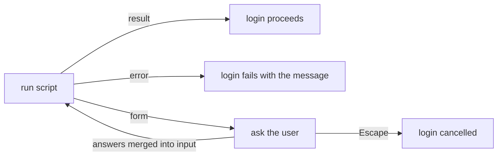

# not-yet-done

A terminal-based task and time tracking application with a rich TUI, CLI, and Waybar integration.

<!-- screenshot: full TUI with tasks tree view, action bar, status bar visible -->


## Features

- **Hierarchical task management** — organize tasks in a tree structure with unlimited nesting
- **Time tracking** — start/stop tracking per task, with parallel tracking support
- **Rich TUI** — keyboard-driven interface with fuzzy filter, text search, hop-style jump navigation, saved filters, favorites, and configurable columns
- **Mouse support** — optional (`mouse` cargo feature): click tabs, panes, rows and popup entries, double-click to open, sort by clicking a column header, drag-select inside a single popup or pane instead of across whole terminal rows, copy on release, wheel scrolling
- **CLI** — full command-line interface for scripting and automation
- **Waybar module** — CFFI module showing the active tracking in your status bar
- **Per-task notes** — Markdown notes per task, auto-organized in a directory tree matching the task hierarchy
- **Scripts** — run user scripts on the focused node or a view's filtered set via the `:script` fuzzy menu, with background, capture, and interactive modes — or automatically after a reload via a hook binding
- **Filter DSL** — YAML-based query language with natural-language date expressions
- **Anonymization** — `NYD_ANON=1` masks real customer/ticket/person names with deterministic, format-preserving fakes across every adapter, for safe screenshots and screencasts of a production instance
- **Daily backups** — the core DB (`nyd.db`) is backed up once a day on startup; the split-out `tasks.db` is backed up through a configurable [lifecycle hook](#lifecycle-hooks) (`backup` bound to the adapter's `connected` event with a 24h throttle), so it happens however you launch — TUI or any `nyd tasks …` command. The Tasks/Trackings tabs also expose a manual `backup` action (`B`), and `nyd-t backup` manages them from the CLI

## Installation

```bash
# Build and install all binaries
cargo install --path not-yet-done-cli
cargo install --path not-yet-done-tui

# Build the Waybar module
cargo build --release -p not-yet-done-waybar
cp target/release/libnyd_waybar.so ~/.config/waybar/cffi/
```

No database setup step is needed: each adapter is self-contained and creates
(and schema-syncs) its backing SQLite file on first open — start the TUI or run
any `nyd <instance>` command and the store is initialized automatically.

## TUI

Start the TUI with:

```bash
not-yet-done-tui
```

### Tabs and Views

Every tab is an adapter-backed _content tab_, configured under
`~/.config/not_yet_done/views/*.yaml` and shown according to the
[tab order](#tab-order). Task and time tracking are no
exception — they are adapter-backed views like everything else.

A key the schema does not know does not break the file: the tab still
loads, and startup shows one modal listing what was ignored (with the
path, e.g. `views.0.children.0.key`). Reloading a config from inside the
TUI reports the same thing as a notification. This matters because such
a key is otherwise invisible — it sits right there in the file and does
nothing. The most common case: `key:` on a `children:` entry, which has
never been a field. A drill-down is bound by a `navigate` action instead:

```yaml
# views/jira.yaml — on the issue level
actions:
  - name: comments
    key: C # `c` is the tab-wide chord leader (`c c`, `c s`)
    type: navigate
    navigate_to: "jira:comment"
```

**Tasks** — manage your task tree. Task management lives in the
adapter-backed **`Tasks`** content tab (`views/tasks.yaml`); see
[`docs/examples/views/tasks.yaml`](docs/examples/views/tasks.yaml) for a
fully-commented reference. It has two sub-views:

| Sub-view | Key | Description                                            |
| -------- | --- | ------------------------------------------------------ |
| Tree     | `t` | Hierarchical tree view with indentation and connectors |
| List     | `v` | Flat list of all tasks matching the active filter      |

<!-- screenshot: tasks tab in tree view showing nested tasks with priority, status, notes indicator -->


#### Tasks tree expand / collapse

In tree view, branches can be folded individually:

| Key     | Action                                           |
| ------- | ------------------------------------------------ |
| `enter` | Toggle expand/collapse on cursor                 |
| `zr`    | Expand all branches                              |
| `zm`    | Collapse to the view's configured `expand_depth` |

Collapsed parents render with a `▶` glyph and a trailing `(N)` count
showing how many direct children are hidden. Expanded parents render
with `▼`. The default number of visible levels is the `expand_depth` of
the tree view in `views/tasks.yaml`:

```yaml
# views/tasks.yaml — on the tree view
expand_depth: 2 # 0 = only roots, 1 = roots + their children, ...
```

The expand state is per-session — it is not persisted across
restarts. When a fuzzy filter is active, expand state is ignored
and every matching node (plus its ancestors) is shown.

**Trackings** — view and analyze time entries. Like Tasks, this is an
adapter-backed content tab (`views/trackings.yaml`); see
[`docs/examples/views/trackings.yaml`](docs/examples/views/trackings.yaml)
for a fully-commented reference.

| Sub-view  | Key | Description                                      |
| --------- | --- | ------------------------------------------------ |
| Normal    | `a` | Individual tracking entries with start/end times |
| Condensed | `v` | One row per task, durations summed               |
| Tree      | `t` | Task tree with cumulated durations per branch    |

<!-- screenshot: trackings tab in normal view with day grouping, showing group headers and footer with totals -->


Trackings can be grouped by day, week, month, or year (`G` to cycle). Active tracking durations update live with adaptive intervals.

### Tab order

The set of top-level tabs and their digit keys is driven by a single
ordered list in `tui.yaml`. `tabs.order` is a list of tab names that
decides **which tabs are shown, in what order, and which digit key
selects each**:

```yaml
tabs:
  order:
    - Tasks
    - Trackings
    - Jira
    - Taiga
    - Confluence
    - Stoat
```

Tabs are referenced by display name — each view's `tab.name` (e.g. the
adapter-backed `Tasks` and `Trackings`). The list order assigns the
**autonumber** keys — `1`..`9`, then `0` for a tenth tab; an eleventh and
beyond get no digit and are reachable only via `Tab` / `Shift+Tab`.

Only the tabs named in `order` are shown; a configured view whose
`tab.name` is absent from the list is hidden (without being unloaded).
Tabs not referenced anywhere stay hidden until you add them.

If `tabs.order` is empty or absent, every configured tab is shown in its
natural slot order, autonumbered the same way — so existing setups keep
working unchanged. **Two tabs sharing a display name is a hard error**
(the name could no longer identify a tab) — the TUI shows a startup
modal and falls back to showing every tab.

The order is re-read on config reload via `:config` or by editing
`tui.yaml`.

### Navigation

| Key                 | Action                   |
| ------------------- | ------------------------ |
| `↑` / `↓`           | Move cursor              |
| `gg` / `gj`         | Jump to first / last row |
| `Ctrl+u` / `Ctrl+d` | Scroll half page         |
| `Ctrl+b` / `Ctrl+f` | Scroll full page         |

#### Hop-Style Jump

Press `p` to enter jump mode:

1. Type a character — all visible rows containing that character are highlighted
2. Labels appear inline after each match
3. Type the label to jump to that row
4. Single matches jump immediately

<!-- screenshot: jump mode active, showing yellow labels next to matched characters, non-matching rows dimmed -->


### Mouse

The TUI understands the mouse. What it does today:

| Input                 | Effect                                                    |
| --------------------- | --------------------------------------------------------- |
| Click a tab / sub-tab | Switch to it, exactly as its number key would             |
| Click a pane          | Focus it, exactly as the window chords would              |
| Click a row           | Put the cursor on it, exactly as `j` / `k` would          |
| Double-click a row    | Do to it what `Enter` does                                |
| Click a fold marker   | Fold or unfold that tree row                              |
| Click a column header | Sort by it: ascending → descending → unsorted             |
| Click a breadcrumb    | Climb back to that level, one `Backspace` per level       |
| Click a popup entry   | Move the popup's cursor onto it                           |
| Double-click an entry | Pick it, exactly as `Enter` would                         |
| Drag with left        | Select text — **clipped to the window under the pointer** |
| Double-click text     | Select the word under the pointer and copy it             |
| Triple-click          | Select the whole line and copy it                         |
| Double-click + drag   | Extend the selection by whole words                       |
| Triple-click + drag   | Extend the selection by whole lines                       |
| `Alt` + drag          | Select a rectangle instead of flowing text                |
| Release               | Copy the selection to the clipboard                       |
| Wheel up / down       | Scroll the pane under the pointer, cursor stays put       |
| Wheel over the tabs   | Walk through the tabs, wrapping                           |
| `Shift` + drag        | Bypass the app and use the terminal's own selection       |

One button does both jobs: a press and release on the same cell is a click and
means whatever is drawn there, anything that moved is a selection. The wheel
takes the focus with it, so a scrolled pane is also the pane the arrow keys
talk to. Nothing the mouse reaches is mouse-only; every one of these has a key.

**The wheel pans the view, it does not move the cursor.** Over a table the
content scrolls under a cursor that stays on its row — the way a wheel behaves
everywhere else, and the one thing no key does here (`j`/`k`, `ctrl+d` and `G`
all move the cursor and let the view follow). The cursor only comes along when
the window would leave it behind, and then it rides the edge the content
scrolls away from, so it never drops off-screen. Once the view sits at the top
or bottom the notch falls back to the cursor, which keeps the very first and
last row reachable with the wheel alone. Set `mouse.wheel: cursor` to get the
old behaviour back (the wheel then walks the cursor like `j`/`k`), and
`mouse.wheel_rows` for how far one notch goes:

```yaml
mouse:
  wheel: view # or: cursor
  wheel_rows: 3
```

In the chat view — the one that scrolls by physical line rather than by row —
`wheel_rows` counts lines, matching what `j`/`k` do there.

**A popup owns the input, for the mouse too.** While one is open, a click
outside it acts on nothing: no tab switches, no cursor moves, no pane takes the
focus — exactly as the number keys and `j`/`k` are ignored in favour of the
popup. Selecting text outside it still works, because the popup owns the input,
not the screen, and copying a value you can see from behind a dialog is half
the reason the selection exists. Closing stays the popup's own business:
`Esc` closes it, a click outside does not.

When drilled into a level, the breadcrumb line above the table is clickable:
each crumb goes back to that level, running the same ascent `Backspace` runs,
once per level in between. The last crumbs are where the cursor already is, so
clicking them does nothing.

Clicking a row hits the row you see, not a row counted off the top edge: the
table hands out the geometry it painted, so folded trees, rows that span
several lines and a top row half-scrolled off the edge all resolve correctly.
A click on a group header lands on the nearest selectable row, the same place
`j` would stop. Sorting by header click is additive over any sort already
set — it is the very mechanism behind `S` and the sort menu (`c s`), so the
three stay in step.

In a tree, the run in front of a row's label — the indentation, the box
connectors and the `▶` / `▼` arrow — folds and unfolds that row on a single
click, because on a tree row `Enter` is that toggle. Only rows that can
actually expand answer to it: a leaf's indentation is plain surface and
selects like the rest of the row, and so does the label text next to the
arrow. Double-clicking the marker is still one toggle, not two.

Repeated clicks pick out text the way the terminal did before the app took the
mouse: the second takes the word under the pointer, the third the whole line,
and both land on the clipboard right away. A "word" holds an identifier
together — `PROJ-1234`, a path, a URL, a `snake_case` name each come out in one
click — while quotes, brackets and the tree connectors separate. Where the
second click already means something it keeps its meaning: a table row opens, a
popup entry is picked. The third click never does, so a row's text is always
one triple-click away without dragging across it.

Keep the button down on that second or third click and the word — or the line
— is highlighted straight away, before any dragging; carry on dragging and the
selection grows by whole words or whole lines. The word the press landed in and
the word under the pointer are both taken whole, and a drag that turns back
gives up exactly what it took. Dragging straight off a single press stays
character-precise, which is what the plain drag has always been.

Where the release is going to _act_ rather than select — a table row that
opens, a popup entry that gets picked — nothing is highlighted on the press,
because a highlight is a promise about what will land on the clipboard.
Dragging there still selects by words, and the third click still takes the
line: those do end in a selection.

Popup lists work the same way and stay searchable while you click: the row you
click carries how far the cursor has to travel to reach it, and the app walks
it there with the arrow keys the popup already listens to. A list with no
cursor — the which-key hint panel — has nothing to move, so clicking it does
nothing rather than something surprising.

**Why the app selects at all.** A popup is a box painted _inside_ the terminal
grid; the terminal knows nothing about its border. Dragging across a popup
therefore grabs whole terminal rows — the popup's text plus whatever the table
behind it happens to show at the same height, in one useless blob. Once the
app reads the mouse itself, it can clip the selection to the box the drag
started in: a popup, a content pane, a bar. Lines are trimmed at the box edge,
padding is trimmed off, and blank trailing rows are dropped, so what lands in
the clipboard is what you circled.

The copy goes to the system clipboard where one is reachable, otherwise
through **OSC 52**, which means selecting inside a TUI running over SSH still
copies to the clipboard of the machine you are sitting at.

`Shift` + drag is the escape hatch and needs no configuration: terminals keep
their native selection on that modifier even while an application is reading
the mouse. Use it to grab a rectangle spanning several panes at once, or
anything else the app's own selection deliberately refuses to do.

**Turning it off.** Mouse support is the `mouse` cargo feature and is on by
default. Built without it, the app emits not one mouse-reporting escape
sequence and the terminal behaves exactly as it did before:

```bash
cargo install --path not-yet-done-tui --no-default-features --features clipboard
```

Colours come from `theme.mouse:` (see [Theme Colors](#theme-colors)), behaviour
from `mouse:` in `tui.yaml` (see [Mouse](#mouse-1)).

### Task Operations

| Key      | Action                                                        |
| -------- | ------------------------------------------------------------- |
| `a`      | Add a new task (opens editor)                                 |
| `e`      | Edit selected task                                            |
| `Ctrl+n` | Edit subtree structure (add/move/delete tasks in tree editor) |
| `d`      | Soft-delete selected task                                     |
| `u`      | Restore last deleted task                                     |
| `o`      | Open/edit notes for selected task                             |
| `s`      | Start/stop tracking on selected task                          |

### Filtering

**Fuzzy filter** — press `f` to type a fuzzy filter. Matches are shown instantly. Press `Enter` to accept, `Esc` to cancel.

**Text search** — press `/` to search. `n` / `N` jump between matches.

**Query filter** — press `Q` to open a YAML filter editor with full DSL support (see [Filter DSL](#filter-dsl)). Filters apply live on each save.

**Saved filters** — press `q` to pick from saved filters. Filters are persisted across sessions. The last active filter is restored on startup.

**Favorites** — in the saved filter picker, press `Ctrl+f` on a filter to assign a keyboard shortcut for instant activation.

### Command Line

Press `:` to open an ex-style command line. Type any CLI command without the `nyd` prefix:

```
:backup create
:task add "New task"
:track start <task-id>
```

Output is shown as a modal popup.

In-process commands (executed by the TUI itself, not via subprocess):

- `:linkprune` — bulk-delete link rows whose endpoints no longer
  resolve (deleted tasks, gone tickets, etc.). Asks for confirmation
  before any DB writes.
- `:dismiss-notifications` — clear the notification bar, sticky
  notification, and most recent query-error banner. Mirrors the
  `dismiss_notifications` keybinding (default `Z` — lower-case `z`
  is reserved as the chord prefix for tasks-tree `zr`/`zm`).
- `:cut-node` (default `mc`) — mark the currently selected task as
  the move source. The tree is _not_ touched until `:paste-node`
  runs; the cut can be cancelled with `Esc` or overwritten by
  another `:cut-node`.
- `:paste-node` (default `mp`) — reparent the cut task so the
  currently selected task becomes its new parent. Refuses any move
  that would create a cycle (target equals the cut node, or sits
  inside the cut node's subtree) and shows a modal error; in those
  cases the tree is left untouched and the cut stays armed so the
  user can pick a different target.
- `:jump <Tab>` — programmatic tab switch. Matches any content tab by
  its configured `tab.name` (case-insensitive; e.g. `Tasks`,
  `Trackings`). Content tabs don't take a sub-view, so a trailing
  `:<sub>` is reported as a modal error. Used by user scripts to drive
  the TUI from outside; also typeable directly. Modal error on unknown
  tab.
- `:focus-node [-i] <Tab>[:<view>] /<col>|<pattern>` — parks the
  cursor on a matching row of a content tab. Switches to the named
  content tab (and optional sub-view), then parks the cursor on the
  first row whose `<col>` matches `<pattern>`. Without an explicit
  column hint (`/<pattern>`), the pattern is matched against
  `label` plus all metadata values. `re:` opts into regex (e.g.
  `re:\b42\b`); `-i` switches both substring and regex matching to
  case-insensitive. Single-segment only — drill-down paths
  (`/schema/table/...`) are reserved for tree-shaped content views
  and currently return a modal error. Modal errors also on unknown
  tab/view, unknown column, no match, or ambiguous match.
  Example: `:focus-node Taiga:items /ref|acme#42`.
- `:tree-find <Tab>[:<view>] <query>` — the **tree-mode** sibling of
  `:focus-node`. Switches to the named content tab/sub-view, forces a
  fresh reload (so out-of-process CLI mutations are in the adapter
  snapshot before the search runs), then runs a server-side tree
  search and **lazily expands to the first hit**, parking the cursor
  on it. Use this — not `:focus-node` — to jump into a tree whose
  target sits several levels deep (e.g. the adapterized Tasks tab,
  where ticket nodes live under `work → client → tickets`). The tab
  name may be double-quoted to allow spaces:
  `:tree-find "Tasks" <query>`. The `<query>` is adapter-defined;
  the local task adapter additionally accepts an exact-id escape
  `id:<uuid>` (used by scripted jumps that already resolved the node
  id via the CLI). Modal errors on unknown tab/view or when the
  active view isn't a tree.
  Example: `:tree-find "Tasks" id:550e8400-…`.
- `:query <subcommand>` — namespace for saved-query operations:
  `apply` activates a saved query (read), `edit` / `new` / `delete`
  manage the saved-query bodies stored by the active content tab's
  adapter.
  - `:query apply [--var k=v]* [-t <Tab>[:<view>]] <name>` — activate
    the saved query `<name>` on a content tab and **synchronously**
    reload so a following command in the same script (typically
    `:focus-node`) sees the new rows. Without `-t` the currently
    active content tab is used; with `-t` the named tab (and
    optional sub-view) is switched to first. `<name>` is matched
    case-insensitively against the merged YAML + DB saved-query
    list of the active view and may contain whitespace. Modal
    error on unknown tab/view, unknown name, or adapter error
    during reload.
    Example: `:query apply -t Taiga:items Open issues`.

    **Query variables.** Saved queries can carry adapter-specific
    placeholders (Taiga: `${name:default}`). At apply time the
    adapter reports which variables it needs; if any required
    variable (one without a default) is unset, the TUI opens a
    small input popup before the load. Pre-fill values from
    scripts with `--var key=value` — the popup is skipped when all
    required variables are covered. Interactive entry points
    (the keyboard shortcut for a saved query, the query menu's
    Apply action) always open the popup so the user can confirm
    or override defaults.
    Example: `:query apply --var project=alpha -t Taiga:items "Open per project"`.

  - `:query edit <name>` / `:query new <name>` / `:query delete <name>`
    — manage saved-query bodies on the **active content tab**. The
    body file is owned by the adapter (one file per query under the
    adapter's per-instance data dir); `edit` opens the existing file
    in `$EDITOR`, `new` opens an empty buffer that becomes a new file
    on first save, and `delete` removes the body **and** any DB
    shortcut row for that name. Modal error when the active tab is
    not a content tab, the adapter exposes no filesystem-backed store,
    or — for `edit` — the named query doesn't exist. Names may contain
    whitespace. Adapter-specific body validation only happens at apply
    time, not on save.

- `:db-script-new <database> <script>` — Postgres-only legacy cmdline
  that creates an empty DB-level script under
  `<instance_data_dir>/db_scripts/<database>/<script>.sql` and
  immediately opens it in the editor. Refuses names containing `/`,
  `\`, leading `.`, whitespace, or that already exist. Use `x` to
  execute the script (cursor-paginated result pane) and `d` to delete
  it after a confirm popup. For folder-aware operations, prefer the
  `:db-script <sub>` namespace below.

- `:db-script <sub>` (DSF) — folder-aware namespace that operates on
  the focused content pane's selected row. Subcommands:
  - `:db-script new <name>` — create a script in the currently
    focused dir (or root if the selected row is the DB-Scripts group).
    Mkdir's parents so nested creation works.
  - `:db-script new-dir <name>` — create an empty folder in the
    focused dir. Reached via `A` on a DB-Scripts group or folder row.
  - `:db-script rename <name>` — rename the selected entry. Reached
    via `r`.
  - `:db-script move <dest>` — move the marked source (set via `m`)
    or the selected row into `<dest>`. `<dest>` is absolute when it
    starts with `/`, otherwise relative to the focused dir.
    Cross-database moves are rejected.
  - `:db-script delete` — confirm-then-delete the selected row.
    Empty folders only — non-empty folders surface a "not empty (N)"
    error from the storage layer. Reached via `d`.

  Shortcuts on DB-Scripts rows (defaults; user-overridable in
  `postgres.yaml`):
  - Group node `Scripts`: `a` add-script, `A` add-dir.
  - Folder node `DB Script Dir`: `a` add-script, `A` add-dir, `r`
    rename, `m` mark-move, `p` paste-move, `d` delete-dir.
  - Script leaf `DB Script`: `x` execute, `e` edit, `r` rename,
    `m` mark-move, `d` delete.

  Marked-source indicator appears in the status bar as `⚓ marked:
move: <node-id>` until paste or `Esc` clears it.

- `:config [name]` — open a fuzzy picker of all YAML configs under
  `~/.config/not_yet_done/`. With `name`, pre-filters or jumps
  straight to the unique match. Selecting a file opens it in
  `$EDITOR`; on save the config is re-applied in-process — granular
  for view yamls (only the affected tab is rebuilt), full for
  `tui.yaml` and adapter configs. Parse / validation errors leave
  the running config untouched and reopen the editor with the
  error rendered as a YAML-comment banner at the top of the
  buffer.

<!-- screenshot: command line open at bottom showing ":backup create" being typed -->


#### Cmdline shortcuts

Single-key shortcuts for cmdline commands can be defined in
`tui.yaml`. They bypass the `:` prompt and fire the bound command
directly. Only triggered when the key has no other typed-action
binding, so they can't shadow existing keys.

```yaml
cmdline_shortcuts:
  F2: "config tui"
  "<c-comma>": "config"
```

**Built-in defaults** (active when the section is absent from your
`tui.yaml`):

| Key  | Command      | Effect                                              |
| ---- | ------------ | --------------------------------------------------- |
| `T`  | `tag`        | Open the tag-management menu                        |
| `mc` | `cut-node`   | Mark the currently selected task as the move source |
| `mp` | `paste-node` | Move the cut task under the currently selected task |

Multi-character keys (e.g. `mc`, `mp`) participate in chord-prefix
detection: typing `m` stashes the key and waits for the second
character. Single keys can still be safely shadowed because the
shortcut lookup runs only when no typed-action handler claimed the
key, and chord-prefix detection now also considers shortcut keys
so the user gets the usual "stash + complete" semantics.

Defining `cmdline_shortcuts:` in your own `tui.yaml` replaces the
defaults wholesale — copy the entries you want to keep.

### Column Configuration

Press `c` to open the column configurator. Toggle columns on/off and reorder them. Available columns vary by view:

- **Tasks**: description, status, priority, notes, created, updated, last tracked
- **Trackings normal**: marker, task, started, ended, duration
- **Trackings condensed**: marker, task, duration
- **Trackings tree**: marker, task, own duration, cumulated duration

## CLI

There are **two** command-line binaries, by design:

| Binary  | Crate                   | Role                                                                                                                                                                                                                                                               |
| ------- | ----------------------- | ------------------------------------------------------------------------------------------------------------------------------------------------------------------------------------------------------------------------------------------------------------------ |
| `nyd`   | `not-yet-done-cli`      | Generic front-end over the `ContentAdapter` protocol — drives **foreign** systems (Jira, Confluence, Postgres, Taiga, Stoat) and our own tasks/trackings/projects _as adapters_, all through one uniform interface.                                                |
| `nyd-t` | `not-yet-done-task-cli` | Dedicated **Tasks & Time-Tracking** CLI on the native domain core (`not-yet-done-task-core`). Produces typed, domain-shaped output (e.g. `track export`'s joined tracking+task JSON, `task tree`'s nested hierarchy) and graded exit codes that scripts depend on. |

Both build on the **same core**: the in-process TUI adapters and `nyd-t` each
talk to `not-yet-done-task-core` in their own idiom. Adapters are _interop
boundaries_ (a uniform protocol for many systems); `nyd-t` is the domain's own
front-end. See [decision 0004](docs/decisions/0004-two-cli-binaries-adapter-vs-domain.md)
for the why.

### `nyd` — generic adapter front-end

`nyd` is a **thin generic front-end over the `ContentAdapter` protocol**. There
are no task-, tracking- or project-specific subcommands: tasks, trackings and
projects are reached as adapter instances (`nyd tasks …`, `nyd trackings …`,
`nyd projects …`), and the terse everyday forms (`nyd add`, `nyd track <id>`,
`nyd summary`, …) are **aliases** over those generic verbs. See
[Generic adapter commands](#generic-adapter-commands) and
[Aliases & `config edit`](#aliases--config-edit) below.

> The former hard-coded `task` / `project` / `track` / `query` / `db sync`
> commands were removed from `nyd` once their adapter replacements landed —
> `track split`/`move` are now adapter actions (`nyd trackings do split …`),
> projects are an adapter (`nyd projects do create …`), and ad-hoc filters run
> through any adapter's `--query`. The native, domain-shaped equivalents live
> in `nyd-t` (below). The only built-in commands remaining in `nyd` are `tag`
> and `backup` (which still operate on the legacy core DB).

### `nyd-t` — Tasks & Time-Tracking CLI

`nyd-t` (installed from `not-yet-done-task-cli`) is the native domain CLI. It
operates on the split-out **task database** — `NYD_TASKS_DB` when set,
otherwise the per-host default `<data-local>/not_yet_done/tasks.db` (the same
file the Tasks/Trackings adapters open when their config carries no explicit
`database:` DSN). It does **not** read the core config's `database.url` (that
points at the legacy `nyd.db`).

Run `nyd-t <group> --help` for the full, self-documenting reference; the groups
are:

```bash
# Tasks — CRUD, path resolution, subtree export
nyd-t task add "Write report" --parent <id> --project Work --tag urgent
nyd-t task list --project Work
nyd-t task tree <id|description-prefix> [--last-tracked-since 2026-04-01] [--pretty]
nyd-t task show --path /Work/Clients/Acme/Tickets [-i]   # graded exit codes: 4=not found, 5=ambiguous
nyd-t task edit <id> --description … --add-tag … --remove-project …
nyd-t task delete <id>

# Time tracking — start/stop, summary, export, reschedule
nyd-t track start <task-id> [--parallel]
nyd-t track stop [--task-id <id>]                        # omit to stop all
nyd-t track summary [--from 2026-03-01] [--to today] [--task-id <id>]
nyd-t track export [<ids>…] [--task-id <id>] [--from …] [--to …] \
                   [--active-only] [--sort-by-started-at asc|desc] [--pretty]
nyd-t track move  <id> "yesterday 9am" [--gravity start|end] [--offset +1h] [--json]
nyd-t track split <id> "10:30" [--task <other-task-id>]
nyd-t track restore <id>

# Projects, tags, schema, backups
nyd-t project add "Work" --description …       # list / edit / delete too
nyd-t tag add "urgent" --fg "#FFFFFF" --bg "#FF5733" --symbol ""   # list/edit/new/delete
nyd-t db sync                                  # create/upgrade the task DB schema
nyd-t backup create | list | restore <file>   # backs up the task DB (tasks.db)

# Ad-hoc filter queries (debug/inspect a FilterExpr before saving it)
echo 'query: [deleted, =, false]' | nyd-t query run --entity task     # JSON to stdout
nyd-t query run --entity tracking --file filter.yaml [--debug]        # --debug dumps the resolved FilterExpr
```

The `track export` / `task tree` JSON shapes and `task show` exit codes are a
**stable contract** the user's TUI batch scripts rely on (daily reports,
hour-totals, “goto task” from Jira/Taiga).

### Tags & Backup

Tag styling (fg/bg/symbol) has no generic adapter path yet, so tag management
stays a built-in command; `backup` keeps the legacy core-DB backups until it
becomes an adapter action.

```bash
# Tags (global or project-specific)
nyd tag list
nyd tag add "urgent" --fg "#FFFFFF" --bg "#FF5733" --symbol ""
nyd tag new                                   # create interactively via $EDITOR
nyd tag edit global-tag:<uuid> --name "blocked"
nyd tag delete global-tag:<uuid>

# Backups
nyd backup create
nyd backup list
nyd backup restore 20260323-185627-nyd.db
```

### Generic adapter commands

Besides the task-specific commands above, every configured adapter instance
(each `views/*.yaml`) is addressable generically as `nyd <instance> <verb>`.
The verbs drive the same `ContentAdapter` protocol the TUI uses, so they work
for _every_ adapter — tasks, trackings, Jira, Taiga, Postgres, Confluence,
Stoat — without the CLI hard-coding anything about them:

```bash
# Read verbs
nyd tasks ls                       # list children of the root
nyd tasks ls <id> --tree --depth 2 # a subtree, 2 levels deep
nyd tasks ls --query 'status=open' # filtered (adapter's query language)
nyd tasks queries                  # the stored queries of this instance (name + kind)
nyd tasks ls --query-name mine     # …run one by name; may be an extended document
nyd jira ls --query-name mine --var who=me   # bind its variables (repeatable)
nyd tasks show <id>                # one node's fields
nyd jira cat <id>                  # a node's raw text body to stdout (content nodes)
nyd tasks actions <id>             # actions available on a node
nyd tasks actions --type task:item # …or on a node type
nyd tasks do help                  # document the current level (root: also capabilities)
nyd jira  do help PROJ-123         # …of any node — descend and re-run for its children
nyd tasks values tags              # enumerate a value source
nyd tasks ls -o json               # any read verb takes -o table|json

# Name a node by a label path instead of an opaque id (--path / -p): one
# segment per level, matched against child labels by substring (case-folded
# with -i) or by regex when prefixed `re:`.
nyd tasks show --path /Inbox/Groceries -i
nyd tasks ls   --path '/Inbox/re:^Week \d+$'

# Group a tree into date/value buckets (--group-by / -g), for adapters that
# support adapter-side grouping. Spec is `col[:bucket][:order]`, where bucket
# is day|week|month|year and order is asc|desc:
nyd trackings ls --type tracking:tree-group --group-by started_at:day:desc --tree

# Mutating verb: `do <action> [id]` runs a node action. The action's input
# shape (seen in `actions`) decides how input is sourced:
nyd tasks do add -m "new body"            # editor action, body inline (else $EDITOR)
nyd tasks do add --file task.md           # editor action, body from a file
nyd tasks do add -m -                     # editor action, body from stdin
nyd tasks do toggle-tracking <id>         # no-input action
nyd tasks do delete <id> --yes            # confirm-gated action needs --yes
nyd pg do run --field name=report --field db=live   # form action

# Jira tickets round-trip through Markdown from the CLI, sharing the exact
# buffer and write-back pipeline of the TUI `edit (markdown)` action:
nyd jira do to_markdown PROJ-123 > ticket.md      # dump ticket + comments as Markdown
nyd jira do from_markdown PROJ-123 --file ticket.md   # write the edited Markdown back

# Trackings carry split/move as form actions (the generic replacement for the
# legacy `track split`/`track move`): pass the form fields with --field.
nyd trackings do split <id> --field at="2026-03-22 09:15"
nyd trackings do split <id> --field at="10:30" --field task=<other-task-id>
nyd trackings do move  <id> --field start="yesterday 9am"
nyd trackings do move  <id> --field start=2026-03-20 \
  --field gravity=start --field offset=+1h --field allow_future=true

# Projects are an adapter too: the generic verbs manage them with no
# project-specific command. create/edit/delete are all form actions.
nyd projects ls                                   # list projects
nyd projects do create --field name=Acme --field description=Widgets
nyd projects do edit <id> --field name="Acme Inc."   # omitted fields stay
nyd projects do delete <id> --field cascade=true     # also soft-delete tasks
```

Node ids are opaque and adapter-owned; for the local task/tracking forests you
can use a unique **id prefix** (like a git short hash). Where a verb takes a
node id (`ls`, `show`, `do`), `--path /A/B` is an alternative that walks down by
label — the CLI analogue of drilling in by name in the TUI. It uses only the
protocol's per-level listing, so it works for any adapter; each segment must
resolve to exactly one child (ambiguous or unmatched segments error and list
the candidates).

A **stored query** is named rather than typed: `queries` lists what an instance
has saved (the same entries the TUI's query menu shows), and
`ls --query-name NAME` runs one. Which of the two stores holds the name decides
what happens — an adapter-native body goes to the adapter as one query, an
_extended document_ (a Markdown file combining several native queries with
`and`/`or`/`without`) is executed by the framework, which runs its branches,
merges them and applies the document's own `order_by`. Names are unique across both stores, so `--query-name`
never needs to say which kind it means. `--query` (a body typed on the command
line) and `--query-name` are mutually exclusive; `--var name=value` binds a
query variable (repeatable) — since a CLI cannot prompt, a variable with
neither a binding nor a default is an error rather than a guess. `--tree` runs
one query per subtree and therefore cannot run an extended document; list its
levels one at a time.

`--group-by` rides along in the list request; only adapters that advertise
adapter-side grouping act on it (others ignore it with a warning). Grouping is
tied to the adapter's bucket node type, so select it with `--type` — or hide
that behind an alias (see below). The bucket key is ISO-formatted, so the
group order is chronological.

### Aliases & `config edit`

The generic verbs are deliberately explicit. **Aliases** give a short name to a
fixed invocation, so everyday use stays terse without the CLI growing
adapter-specific commands. They live in `~/.config/not_yet_done/cli.yaml`:

```yaml
aliases:
  toggle: [tasks, do, toggle-tracking, "{0}"] # nyd toggle <id>
  find: [tasks, ls, --query, "{@}"] # nyd find status=open
  new: [tasks, do, add, --value, "{parent}"] # nyd new --parent <id>
```

Trailing args split into **positionals** (bare tokens) and **named** values
(`--key value`), substituted into the template: `{0}`/`{1}` pick a positional,
`{@}` splices all of them, `{name}` takes a named value. The first expanded
token must name an adapter instance, so an alias is just a shorthand for a
generic verb (it can't reach the built-in commands). A small set of defaults
ships compiled in; a `cli.yaml` entry of the same name overrides one:

| Alias     | Expands to                                                                      | Replaces           |
| --------- | ------------------------------------------------------------------------------- | ------------------ |
| `add`     | `tasks do add` (editor; `-m` for inline)                                        | `task add`         |
| `edit`    | `tasks do edit {0}`                                                             | `task edit`        |
| `rm`      | `tasks do delete {0}`                                                           | `task delete`      |
| `track`   | `tasks do toggle-tracking {0}`                                                  | `track start/stop` |
| `toggle`  | `tasks do toggle-tracking {0}` (synonym)                                        | —                  |
| `tree`    | `tasks ls --tree`                                                               | `task tree`        |
| `summary` | `trackings ls --tree --type tracking:tree-group --group-by started_at:day:desc` | `track summary`    |

The adapter exposes a single `toggle-tracking` action (start when stopped, stop
when running), so the old `track start` / `track stop` pair collapses into the
one `track` alias.

> **Why aliases instead of more built-in commands?** Block D makes the CLI a
> thin, fully generic front-end over the adapter protocol so it works for every
> adapter automatically. Per-adapter convenience verbs would re-introduce the
> coupling we removed. Aliases keep that convenience in _user_ config, where it
> costs the codebase nothing and the user can shape it per workflow.

Edit config files in `$EDITOR` (seeding `cli.yaml` with a documented template
on first use):

```bash
nyd config edit cli      # ~/.config/not_yet_done/cli.yaml (default target)
nyd config edit tui      # ~/.config/not_yet_done/tui.yaml
nyd config edit tasks    # ~/.config/not_yet_done/views/tasks.yaml
```

## Filter DSL

Filters are YAML documents with a `query:` key. Used in the TUI editor (`Q`), saved filters, favorites, and any adapter's `--query` on the CLI (`nyd <instance> ls --query …`).

### Basic Syntax

```yaml
# Simple leaf: [column, operator, value]
query:
  [description, has, meeting]

# Named filter
name: Active tasks
query:
  and:
    - [deleted, =, false]
    - [status, in, [todo, in_progress]]
```

### Operators

| Operator      | Aliases     | Example                                            |
| ------------- | ----------- | -------------------------------------------------- |
| `=`           | `==`, `eq`  | `[status, =, todo]`                                |
| `!=`          | `<>`, `ne`  | `[status, !=, done]`                               |
| `>`           | `gt`        | `[priority, gt, 3]`                                |
| `>=`          | `ge`, `gte` | `[created_at, '>=', '2 weeks ago']`                |
| `<`           | `lt`        | `[priority, lt, 5]`                                |
| `<=`          | `le`, `lte` | `[started_at, '<=', yesterday]`                    |
| `like`        |             | `[description, like, '%api%']`                     |
| `not_like`    |             | `[description, not_like, '%test%']`                |
| `has`         |             | `[description, has, meeting]` → `LIKE '%meeting%'` |
| `is_null`     |             | `[parent_id, is_null]`                             |
| `is_not_null` |             | `[ended_at, is_not_null]`                          |
| `in`          |             | `[status, in, [todo, in_progress]]`                |
| `not_in`      |             | `[status, not_in, [done, cancelled]]`              |

### Tree Predicates

Tree predicates use a 2-element shorthand `[name, value]` and query the task hierarchy via the materialized `path` column. They are not comparisons — there is no column on the left of them — so they are not part of the filter language proper (`rowsieve`), which carries them through untouched for this project to resolve:

| Operator       | Example                  | Matches                                    |
| -------------- | ------------------------ | ------------------------------------------ |
| `in_tree`      | `[in_tree, Globex]`      | Globex **and** all tasks below it          |
| `has_ancestor` | `[has_ancestor, Globex]` | All tasks below Globex (not Globex itself) |

The value can be an exact description or a LIKE pattern:

```yaml
# All tasks in the Globex subtree
[in_tree, Globex]

# Tasks below any node matching "Ticket"
[has_ancestor, '%Ticket%']

# Combine with other filters
query:
  and:
    - [deleted, =, false]
    - [in_tree, Globex]
    - [status, =, todo]
```

Tree predicates work in both task and tracking filters. In tracking filters, they match against the tracked task's tree position. A misspelt name is rejected when the filter is read, rather than becoming a branch that matches nothing.

### Compound Expressions

```yaml
query:
  and:
    - [deleted, =, false]
    - or:
        - [priority, ">=", 5]
        - [description, has, urgent]
    - not: [status, =, cancelled]
```

### Date Expressions

String values are automatically resolved as natural-language dates:

| Expression     | Resolves to                |
| -------------- | -------------------------- |
| `yesterday`    | Yesterday at midnight      |
| `last monday`  | Most recent Monday         |
| `2 weeks ago`  | 14 days before now         |
| `1 month ago`  | One month before now       |
| `april 1`      | April 1st of current year  |
| `last april`   | April 1st of previous year |
| `2026-04-01`   | Exact date                 |
| `3h`           | 3 hours from now           |
| `6 months ago` | 6 months before now        |

### Available Fields

**Task filters**: `id`, `description`, `status`, `deleted`, `deleted_at`, `priority`, `parent_id`, `path`, `created_at`, `updated_at`, `last_tracked_at`

**Tracking filters**: `id`, `task_id`, `predecessor_id`, `started_at`, `ended_at`, `deleted`, `created_at`

**Task fields in tracking filters** (prefix with `t.`): `t.description`, `t.status`, `t.priority`, `t.deleted`, `t.parent_id`, etc.

### Query Options

Options are set via a top-level `options:` key:

```yaml
query:
  and:
    - [deleted, =, false]
    - [last_tracked_at, ge, 2 months ago]
options:
  include_ancestors: true
```

| Option              | Default | Description                                  |
| ------------------- | ------- | -------------------------------------------- |
| `include_ancestors` | `false` | Include all parent tasks of matching results |

This is useful for tree views: filter for recently-tracked tasks but still see the full tree structure with all parent nodes.

### Examples

```yaml
# All trackings from this month for a specific task description
name: This month meetings
query:
  and:
    - [deleted, =, false]
    - [started_at, '>=', april 1]
    - [t.description, has, meeting]

# High priority open tasks
name: Priority tasks
query:
  and:
    - [deleted, =, false]
    - [status, in, [todo, in_progress]]
    - [priority, '>=', 5]

# Trackings without an end time (still running)
query:
  [ended_at, is_null]

# Recently-tracked tasks with full tree context
name: Recent work
query:
  and:
    - [deleted, =, false]
    - [last_tracked_at, ge, 2 months ago]
options:
  include_ancestors: true

# All trackings in the Globex subtree
query:
  and:
    - [deleted, =, false]
    - [in_tree, Globex]
```

## Notes

Each task can have a Markdown notes file. Press `o` in the TUI to open notes in your configured editor.

Notes are stored at `~/.local/share/not_yet_done/notes/` in a directory tree that mirrors the task hierarchy:

```
notes/
  a1b2c3d4_project-alpha/
    e5f6a7b8_design-api.md
    e5f6a7b8_design-api/
      c9d0e1f2_schema-v2.md
```

- File names: `{id-prefix}_{slugified-description}.md`
- Empty notes (whitespace only) are automatically deleted on save
- Notes move with their task when reparented
- Notes are soft-deleted (renamed with `_deleted_at_` suffix) when a task is deleted

## Scripts

The `:script` fuzzy menu (also reachable via per-view `type: script` and
`scope: filtered_set` actions in content tabs — including the
adapter-backed `Tasks` and `Trackings` tabs) lists, runs, edits, creates
and deletes user scripts for the current context. One menu, two contexts:

| Trigger                                    | Context           | JSON argument                                                                                           | Script directory                                         |
| ------------------------------------------ | ----------------- | ------------------------------------------------------------------------------------------------------- | -------------------------------------------------------- |
| Content view `scope: filtered_set` batch   | Filtered node ids | `{"tracking_ids": [..], "filter_min_date": .., "filter_max_date": ..}`                                  | `~/.local/share/not_yet_done/scripts/<tab>/<view-path>/` |
| Content view `type: script` (or `:script`) | Selected node     | `{"node": {"ref": "..", "id": "..", "node_type": "..", "tab": "..", "instance": "..", "fields": {..}}}` | `~/.local/share/not_yet_done/scripts/<tab>/<view-path>/` |

The `<view-path>` is the **pane's** view hierarchy — the root
`ViewDef.node_type`, followed by each drilled-into `ChildDef.node_type`
— with `:` and `/` replaced by `_`. It is **not** the type of the
currently selected item, so the menu stays stable as you cycle through
a pane that mixes node types (e.g. a Taiga `items` view that merges
issues, userstories, tasks, epics → scripts all live in
`scripts/taiga/taiga_item/`). The selected item's `node_type` is still
passed in the JSON payload (`node.node_type`).

After drilling from items into comments, scripts live in
`scripts/taiga/taiga_item/taiga_comment/`.

### Menu keys

| Key      | Default   | Action                                                                                 |
| -------- | --------- | -------------------------------------------------------------------------------------- |
| `enter`  | run       | Run the highlighted script. With a typed name that doesn't match: create a new script. |
| `ctrl+e` | edit      | Open the highlighted script in `$EDITOR`.                                              |
| `ctrl+d` | delete    | Delete the highlighted script file.                                                    |
| `ctrl+h` | edit_hook | Bind the highlighted script to an event (see [Reload hooks](#reload-hooks)).           |
| `esc`    | close     | Close the menu.                                                                        |
| `+name`  | force-new | Force "create new" even when `name` fuzzy-matches an existing script.                  |

Bare names (no extension) default to `.py`.

### Wiring up a per-view trigger

`type: script` is just another action in the view YAML; default key
is opt-in per view (so unrelated content tabs aren't shadowed). The
`:script` cmdline always works regardless.

```yaml
# ~/.config/not_yet_done/views/jira.yaml
views:
  - name: tickets
    node_type: "jira:issue"
    actions:
      - name: script
        key: x
        type: script
```

### Script Modes

Declare the mode in a comment within the first 10 lines:

```python
#!/usr/bin/env python3
# mode: background
```

| Mode                   | Description                                                                      |
| ---------------------- | -------------------------------------------------------------------------------- |
| `background`           | Silent execution; stderr shown as notification (default)                         |
| `capture`              | Output captured and shown in editor                                              |
| `interactive`          | TUI yields terminal to script                                                    |
| `interactive+capture`  | Interactive + output shown in editor                                             |
| `commands`             | Background-style; script writes `{"commands": [...]}` JSON to `$NYD_OUTPUT_FILE` |
| `interactive+commands` | Interactive variant of `commands`                                                |

#### Commands mode — letting a script drive the TUI

In `commands` / `interactive+commands` mode the TUI exposes a path via
the `NYD_OUTPUT_FILE` environment variable. After the script exits,
the TUI parses that file as JSON of the form:

```json
{
  "commands": ["tree-find \"Tasks\" id:550e8400-e29b-41d4-a716-446655440000"]
}
```

Each entry is fed to the same dispatcher as the `:` cmdline, so any
in-process command works (e.g. `jump`, `tree-find`, `focus-node`,
`tag`, `cut-node` / `paste-node`, `dismiss-notifications`, …). Entries
may have an optional leading `:` — both forms are accepted.

The schema is intentionally open: unknown top-level keys are
tolerated for forward-compatibility, so future versions can add
metadata (e.g. `version`, `requires`) without breaking existing
scripts. Only `commands` is currently consumed.

Example — Taiga item that jumps to the matching local ticket task,
creating the task on the fly if it doesn't exist yet:

```python
#!/usr/bin/env python3
# mode: commands
import json, os, re, subprocess, sys

CLI = "not-yet-done-cli"

node = json.load(open(sys.argv[1]))["node"]
ref = node["fields"]["ref"]                 # e.g. "acme#42"
project, number = ref.split("#", 1)
subject = node["fields"].get("subject", "")
desc = f"#{number} - {subject}".rstrip(" -")

# `\b42\b` keeps 42 from also matching 420/421 — last segment
# opts into regex via the `re:` prefix.
ticket = f"/work/clients/{project}/tickets/re:\\b{re.escape(number)}\\b"
parent = f"/work/clients/{project}/tickets"

TAB = "Tasks"   # display name of the adapter Tasks tab

def show(p):
    return subprocess.run([CLI, "task", "show", "--path", p, "-i"],
                          capture_output=True, text=True)

def task_id_at(p):
    r = show(p)
    return json.loads(r.stdout)["id"] if r.returncode == 0 else None

task_id = task_id_at(ticket)
if task_id is None:
    p = show(parent)
    if p.returncode != 0:
        sys.exit(f"Parent path not found: {parent}\n{p.stderr}")
    parent_id = json.loads(p.stdout)["id"]
    subprocess.check_call([CLI, "task", "add", desc, "--parent", parent_id])
    task_id = task_id_at(ticket)          # re-resolve the new leaf's id

with open(os.environ["NYD_OUTPUT_FILE"], "w") as f:
    json.dump({"commands": [f'tree-find "{TAB}" id:{task_id}']}, f)
```

`:tree-find` switches to the adapter Tasks tab, reloads it (so the
just-created task is in the adapter snapshot — the reload and the jump
happen in one command, no separate refetch step), and lazily
expands to the node. Passing the resolved task **id** via the
`id:<uuid>` escape keeps the jump exact even when the Taiga subject
and the local description have drifted apart.

The mirror-image flow — selected local task → matching Taiga item —
uses `:focus-node`. The script lives under
`<data_dir>/not_yet_done/scripts/tasks/task_item/` (the `Tasks`
tab's script directory, shared by its list + tree views) and emits one
command that switches to the Taiga tab and parks the cursor on the row
whose `ref` column matches:

```python
#!/usr/bin/env python3
# mode: commands
import json, os, re, sys
node = json.load(open(sys.argv[1]))["node"]
# Convention: task description starts with "#<num> - <subject>";
# the ancestor directly above the "tickets" folder is the Taiga
# project slug.
m = re.match(r"#(\d+)\b", node["label"])
# `fields.ancestors` is a JSON-array *string* of {"id", "description"}.
ancestors = json.loads(node["fields"]["ancestors"])
i = next(
    j for j, a in enumerate(ancestors)
    if a["description"].lower() == "tickets" and j > 0
)
slug = ancestors[i - 1]["description"]
ref = f"{slug}#{m.group(1)}"
with open(os.environ["NYD_OUTPUT_FILE"], "w") as f:
    json.dump({"commands": [f"focus-node -i Taiga:items /ref|{ref}"]}, f)
```

`ancestors` walks root → parent (the task itself is not included), so
the index that holds the project slug is one less than the index of
the `tickets` folder. `-i` is mandatory here: task folder names in the
tree are typically capitalised (`Acme`) while Taiga's `ref` column
is always lower-case (`acme#43`), so without case-folding the
cross-system jump silently misses.

### Reload hooks

A script can be bound to an **event** instead of (or in addition to) a
key. The contract is unchanged — same JSON payload, same modes, same
`$NYD_OUTPUT_FILE` return channel — only the trigger differs: the TUI
runs the script itself, without a keypress.

Bind it in the script menu with `ctrl+h` on the highlighted entry. The
picker offers:

| Entry    | Meaning                                                    |
| -------- | ---------------------------------------------------------- |
| `none`   | Run manually only (the default) — clears an existing hook. |
| `reload` | Run after the view's rows (re)loaded.                      |

The binding is stored in the database next to the script's keybinding,
keyed by the same script scope (`<tab>/<view-path>`), so it survives
restarts and follows the script directory rather than a single view
instance. The menu entry shows both bindings as a suffix, e.g.
`ticket_overview.py [x] [reload]`. Deleting the script also drops its
hook.

**Only unattended modes may hook.** `background` and `commands` are
allowed; `capture`, `interactive` and their combinations are rejected
both when binding and when firing. A hook runs while a load lands —
there is nobody there to hand a terminal or an editor to.

`reload` fires at the very end of a successful load, when the pane has
settled, so the script sees the same rows the user does. It fires for
the pane whose load landed, which need not be the focused one. A load
that ended in an error fires nothing. Root loads and drill-downs both
count; lazily expanding a single tree level does not.

The typical shape is the mirror image of the manual flow — the view
reloads, the hook script reconciles something via the CLI, and hands a
command back to the TUI:

`reload → hook script → nyd/nyd-t calls → {"commands": [...]} → cmdline`

#### Loop protection

A hook script that emits `:reload` (directly, or implicitly by running
in a mode that refreshes the pane) would otherwise trigger itself
forever. Two guards prevent that:

1. **Load provenance.** Every content load carries a hook depth. Loads
   the user triggers start at 0; loads that happen while a hook script
   runs are stamped 1. Hooks only fire at depth 0 — so _a reload caused
   by a reload script runs no reload scripts_. The depth is ambient for
   the whole hook run, which also covers the reload the TUI performs by
   itself after a `commands`-mode script.
2. **In-flight guard.** A pane that is currently running its hooks will
   not start them again.

The depth limit is deliberately 1, not a larger budget: a hook that
needs several rounds of its own reloads is doing orchestration, and
that belongs in the script (which can issue as many CLI calls as it
likes before returning a single command) rather than in a chain of TUI
loads.

### Input / Output

Scripts receive two arguments:

1. **JSON file** — path to a temp file containing the context-specific JSON described above
2. **Output file** — write to this path to signal completion and optionally provide output

In `commands` mode the output file path is additionally exposed as
`$NYD_OUTPUT_FILE` for convenience (scripts that don't need the
positional output-file arg can ignore it).

### Interactive Scripts

For scripts that need a terminal (e.g. opening in a split), configure `interactive_command`:

```yaml
script:
  interactive_command: "kitty @ launch --location=vsplit sh -c '{script} {json_file} {output_file}'"
```

Placeholders: `{script}` (path to the script file), `{json_file}` (the
context JSON written to a temp file), `{output_file}` (marker file the
TUI watches for completion).

### Create-new Template Resolution

When the user types a new name and hits Enter, the scaffold inserted
into the new script is resolved in this order (first hit wins):

1. **Per-view** — `script_template:` on the active `views[]` entry in
   `~/.config/not_yet_done/views/*.yaml` (content tabs only).
2. **Global fallback** — `script.template:` in `tui.yaml`. Always
   present; ships with a generic `{"node": {...}}` scaffold.

Layer 1 is optional. Per-view overrides are useful when a view's JSON
shape or fields differ from the generic node scaffold — for example a
`scope: filtered_set` batch view (JSON `{tracking_ids, filter_min_date,
filter_max_date}`) on the Trackings tab, or a Taiga `items` view whose
nodes carry rich, named fields (`ref`/`assignee`/`status`) a tailored
starter can reference directly.

```yaml
# ~/.config/not_yet_done/views/trackings.yaml — on the batch view
script_template: |
  #!/usr/bin/env python3
  # mode: background
  import json, sys
  with open(sys.argv[1]) as f:
      data = json.load(f)
  print(f"Got {len(data['tracking_ids'])} tracking(s)")
```

```yaml
# tui.yaml
script:
  template: |
    #!/usr/bin/env python3
    # mode: background
    import json, sys
    with open(sys.argv[1]) as f:
        node = json.load(f)["node"]
    print(node["ref"])
```

```yaml
# ~/.config/not_yet_done/views/taiga.yaml
views:
  - name: items
    node_type: "taiga:item"
    script_template: |
      #!/usr/bin/env python3
      # mode: background
      import json, sys
      with open(sys.argv[1]) as f:
          node = json.load(f)["node"]
      ref = node["fields"].get("ref", "?")
      print(f"Taiga item #{ref}")
```

## View Retries

Adapter-backed views in `~/.config/not_yet_done/views/*.yaml` can opt
in to automatic retries on transient load failures. Set `retries: N`
on a view to allow `1 + N` total attempts per `list()` call (root,
drill-down, and tree expansion under that view):

```yaml
views:
  - name: databases
    node_type: "postgres:database"
    retries: 2 # 1 initial attempt + 2 retries = 3 attempts max
    actions:
      - name: refresh
        key: r
        type: reload
```

Default is `retries: 0` (legacy behaviour: error sticks immediately).

While a retry is in flight, the auth-status banner shows
`Retrying (n/total): <last error>` so you can see how many attempts
remain. When combined with an adapter-level timeout (e.g. the Postgres
adapter's `query_timeout_secs`) the banner overlays the countdown:
`Retrying (2/3) — list databases (3s/7s): <last error>`.

**Trade-off**: each retry attempt pays the adapter's own timeout
budget. A Postgres view with `query_timeout_secs: 7` and `retries: 2`
can hang up to 21s on a fully broken backend before the error becomes
sticky. Pick `retries` to match how transient the failures you
actually see are.

Adapters that talk HTTP carry their own per-request timeout in the same
spirit. The **Taiga** adapter takes `request_timeout_secs` (default 20)
in its adapter config: it caps every API call — including the metadata
fetch that the edit editor blocks on — so a dead connection surfaces an
error instead of freezing the UI, and the adapter reconnects + retries
once on a transport failure before giving up. A separate
`connect_timeout_secs` caps just the connection handshake (default
`min(request_timeout_secs, 10)`); raise it on a high-latency link where
the derived 10s cap would abort a healthy-but-slow connect. See
`docs/examples/views/taiga-adapter.yaml`.

## Auto Connect

`adapter.auto_connect` decides **when** an adapter-backed tab spawns its
initial `list()` call — i.e. when the adapter connects. Connecting is the
side-effecting step: it can open an SSH tunnel, spend a VPN round-trip, or
put a login dialog in front of you before you have asked for anything. So
it is a per-instance decision with three answers:

| Value     | The tab connects …                                       |
| --------- | -------------------------------------------------------- |
| `never`   | only when you press its `reload` key — **the default**   |
| `on_open` | the first time you open the tab                          |
| `startup` | while the TUI comes up, whether you visit the tab or not |

Only the TUI has a notion of "opening a tab", so only the TUI tells the
three apart; the CLI and Waybar run one request and connect regardless.

```yaml
tab:
  name: Postgres
  order: 5

adapter:
  type: postgres
  config: postgres-adapter.yaml
  # auto_connect: never is the default — nothing to write here

views:
  - name: databases
    node_type: "postgres:database"
    actions:
      - name: refresh
        key: r
        type: reload
```

### `never` — wait for a keypress

The default, because an instance that says nothing must not be the one
that opens a tunnel or asks for a password unasked. While the tab is
unloaded its banner reads
`Auto-connect disabled — press \`r\` to connect`(it names the first`type: reload`action of the active subtab). After you press`r` the
adapter connects and behaves normally; switching back to an
already-loaded subtab shows the cached data without re-fetching.

If the active view has no `type: reload` action configured, the banner
degrades to
`Auto-connect disabled — no \`reload\` action configured for this view`
so the misconfiguration is visible at a glance.

### `on_open` — connect on the first visit

The middle answer, and the right one for a remote instance you open most
days but not every day: no keypress, no work done for a tab you never
looked at.

```yaml
adapter:
  type: taiga
  config: taiga-adapter.yaml
  auto_connect: on_open # connect the first time I switch to this tab
```

The load starts the moment the tab becomes active — including at startup,
if it happens to be the tab the TUI opens on. It runs **once**: leaving
the tab and coming back shows the data that is already there rather than
re-fetching (keeping a tab fresh is `auto_reload`'s job, below). A load
that _failed_ leaves the tab unloaded on purpose, so the next visit
retries — which is what a flaky VPN wants. And because the tab is by
definition in front of you when it connects, any credential dialog it
raises appears on the tab it belongs to.

### `startup` — connect before you ask

Tabs whose connection is cheap and local — the task and tracking DB, a
SQLite file, the projects list — are better off loading right away, and
so is the one remote tab whose data should be there the instant you
switch to it.

```yaml
adapter:
  type: tasks
  auto_connect: startup # cheap and local: connect while the TUI starts
```

One consequence is worth knowing before you set it on a tab that logs
in: an eager tab starts connecting the moment the TUI comes up, without
you ever visiting it. If its login needs an answer — a password store to
unlock, an MFA code — the credential dialog therefore opens **at
startup, over whatever tab is in front**, rather than waiting until you
switch to the tab it belongs to. Its title leads with the tab name so
it is clear who is asking. Only one such dialog is shown at a time;
if a second adapter asks meanwhile, its form is kept and shown when you
open its tab. `on_open` is the answer that avoids all of this at the
cost of one tab switch.

### The older `manual_connect` boolean

`auto_connect` replaces `adapter.manual_connect`, which is still read so
that view files written before it keep working:

| Old                     | Means                   |
| ----------------------- | ----------------------- |
| `manual_connect: true`  | `auto_connect: never`   |
| `manual_connect: false` | `auto_connect: startup` |

An explicit `auto_connect:` wins when a file carries both — the newer key
is the more specific statement, and it is the only one that can say
`on_open` at all. New files should write `auto_connect:` only.

## Auto Reload

`adapter.auto_reload` re-fetches a tab's data on a timer:

```yaml
adapter:
  type: jira
  config: jira-adapter.yaml
  auto_connect: startup
  auto_reload: 10m # refresh every ten minutes once the tab has loaded
```

The interval is a number plus a unit — `s`, `m`, `h`, `d` (the same
spelling a hook's `when.throttle` uses). A unit is required: a bare
`10` is rejected rather than guessed at. Absent, the default, means
never.

It exists for the adapters whose data changes behind your back: a Jira
board other people work on, a chat, a queue. Without it a tab shows
whatever it fetched when you last pressed `r`, and there is no way to
tell a five-minute-old table from a five-hour-old one.

**The timer refreshes; it never connects.** It only starts running once
the instance has loaded at least once, so it composes with
`auto_connect` instead of defeating it: a tab you never open stays
unconnected, and no credential dialog appears because of a timer. Every
completed load re-arms the clock, so pressing `r` also postpones the
next automatic reload by a full interval.

A reload it fires is the _hard_ kind — the one `r` performs: the
adapter drops its caches and re-fetches, since an automatic refresh
that re-served the warm cache would keep showing exactly the rows it
was meant to replace. It refreshes the tab's **active pane** at its
current level (a drilled-in level reloads that level, not the root),
and it holds off while a fetch is already in flight. A tab does not have
to be the visible one: every loaded tab keeps its own clock and refetches
in the background, so switching to one shows data that is already fresh.

The tab bar says so. A tab with an interval carries it next to its
name — `3 Jira (10m)` — because the setting otherwise lives only in the
view file, and a table that moves on its own with nothing on screen to
explain it reads as a glitch. The hint states what is _configured_, so
it does not appear and disappear around each load; set
`tabs.auto_reload_hint: false` in `tui.yaml` to drop it.

**Trade-off**: every interval is a real round-trip to the backend, in
the background, whether or not you are looking at the tab. On a paged
or rate-limited API pick an interval you would be willing to press `r`
at by hand — `10m` for a ticket board is cheap, `30s` for the same
board is not.

Only the TUI honours it. The CLI and Waybar run one request and exit,
so they have nothing to keep fresh.

## Confluence Adapter

Read/write adapter for Atlassian Confluence Server / Data-Center
(tested against Confluence 9.2.19; Atlassian Cloud is **not** supported
— its REST surface differs enough that it needs a separate adapter).

### Setup

Two YAML files in `~/.config/not_yet_done/views/`:

- **`confluence-adapter.yaml`** — credentials, cache, TLS. See
  [`docs/examples/views/confluence-adapter.yaml`](docs/examples/views/confluence-adapter.yaml).
- **`confluence.yaml`** — tab/sub-tab layout, columns, actions. See
  [`docs/examples/views/confluence.yaml`](docs/examples/views/confluence.yaml).

Auth uses the same Crowd-SSO cookie pattern as the Jira adapter: a
user-supplied script writes
`JSESSIONID=...; crowd.token_key=...; atlassian.xsrf.token=...` to
stdout. The path lives in `auth.bindings[].provider.script`. If that
login needs to ask something first, put the script on `auth.script` and
bind the field with `provider: { type: script-result }` — see
[Authentication](#authentication).

### Sub-tabs

| Sub-tab    | Default key | Listing                                                                         |
| ---------- | ----------- | ------------------------------------------------------------------------------- |
| **spaces** | (default)   | All spaces; drill into a row to inline-expand its top-level pages               |
| **search** | (cycle)     | CQL-driven results; `q` opens the saved-queries menu (same shape as Jira/Taiga) |

Each page row recursively exposes three child branches: nested
**pages**, **attachments**, and **comments** — the same recursive
ChildDef the spaces sub-tab uses, so any depth of the page tree
behaves identically.

### Filtering spaces (`space_keys`)

By default the spaces sub-tab lists every space the user can read.
On large Crowd-SSO instances that easily reaches three digits — both
the initial fetch and the tree-mode listing become unwieldy. Add a
whitelist in `confluence-adapter.yaml`:

```yaml
space_keys:
  - DOCS
  - PROD
  - SUPPORT
```

The adapter passes the keys to the server via repeated `spaceKey=`
query params and then reorders the response to match the YAML order
(alphabetical-API order is suppressed). Keys that don't resolve
(typos, lost-access, deleted spaces) are silently skipped, so a
single bad entry never brick the whole sub-tab.

Omit the field to keep the historic "list everything" behaviour.

### Page actions

| Key       | Action            | Notes                                                                                                                              |
| --------- | ----------------- | ---------------------------------------------------------------------------------------------------------------------------------- |
| `p`       | preview           | Toggles the body.storage preview pane. First toggle lazy-hydrates `GET /content/{id}?expand=body.storage,...`.                     |
| `e`       | edit              | Opens the page's `body.storage` in `$EDITOR` (pretty-printed via `xmllint --format`). Save writes `PUT /content/{id}` `version+1`. |
| `a`       | create-child page | Opens a small `title:` + empty `<p></p>` buffer. Save POSTs as a child of the current page.                                        |
| `C`       | add comment       | Opens an empty XHTML buffer; save POSTs `type=comment, container={page_id}`. Shift+C, because `c` is the chord leader.             |
| `Shift+A` | upload attachment | Opens the FilePicker (multi-select); each chosen file is POSTed to `/rest/api/content/{id}/child/attachment` (one POST each).      |
| `y`       | clone             | Opens an editor pre-filled with the source page's title + " (Clone)" + body. Save POSTs a new page under the same parent.          |
| `Shift+D` | delete (Trash)    | Confirm popup, then `DELETE /rest/api/content/{id}`. The page survives in Confluence's Trash and can be restored from the web UI.  |
| `o`       | open in browser   | Opens the page in `$BROWSER` via the `webui` URL.                                                                                  |

On a space row, `a` creates a top-level page in that space (same
editor buffer as `a` on a page row).

### Edit conflicts — 3-way merge on `409`

If someone else edits the page upstream while you're typing, the
`PUT` returns `409`. The adapter re-fetches and runs a
[`diffy`](https://crates.io/crates/diffy)-based 3-way merge between
the version you opened, your edits, and the upstream version.

- **Disjoint changes** auto-merge silently — the new version goes
  through, the editor closes with a `Merged on top of v{n}` banner.
- **Overlapping changes** come back into the editor with
  `<<<<<<< ours` / `=======` / `>>>>>>> theirs` markers and a
  `Merge conflict — resolve and save again` banner; resolve the
  markers manually and save.

Comments don't auto-merge (they're small enough that manual re-edit
is cheaper); a `409` on a comment edit reopens the buffer with an
error banner and you re-type.

### Comment + attachment actions

| Where       | Key       | Action                                                                                                             |
| ----------- | --------- | ------------------------------------------------------------------------------------------------------------------ |
| Comment row | `p`       | Toggle body preview (body XHTML rides in on the list response — no extra round-trip).                              |
| Comment row | `e`       | Edit body via `PUT /content/{comment_id}`. Same Reopen-with-banner on `409`/parse errors as pages, no 3-way merge. |
| Comment row | `Shift+D` | Delete via `DELETE /content/{comment_id}` (generic `ConfirmDeleteContentNode` confirm popup).                      |
| Attachment  | `d`       | Download to a temp dir (cached by attachment-id) and spawn `xdg-open` detached.                                    |

### Tree-aware search (`/` on the spaces sub-tab)

The spaces sub-tab's `/` action is a **server-side** content search
(CQL via `/rest/api/content/search`) that returns hits across all
pages and expands the lazy tree to the first match. n/N cycles
through the remaining hits in tree-render order (configured-space
order → ancestor DFS → page title) — the cache survives manual
expand/collapse, so you can poke around a sub-tree between presses.

When `space_keys:` is set, the search is automatically scoped to
those spaces (`space in (...)` is injected into the CQL).

Notifications:

- `Tree find "q": 3 hits — n/N to navigate` on result land.
- Per-press status-bar hint: `n/N  Tree find "q": 2/3[, truncated]`.
- `Tree find "q": no matches` if the server returned nothing.
- `Tree find "q": loading…` while the request is in flight.

Cache invalidation: Esc on the input, `r` (reload), or opening
the input again with a fresh query all drop the cached hits and
return n/N to the local `/`-search dispatch.

Local-filter-while-typing (`f`, `fuzzy_filter`) still works
side-by-side — it filters the spaces already on screen by key/name.

### CQL saved queries

CQL bodies live as one-string-per-file under
`<XDG_DATA_HOME>/not_yet_done/confluence/<instance_id>/queries/`. The
search sub-tab's `q` menu lists every saved file; pressing Enter
applies it, `Ctrl+f` binds a chord shortcut (persisted in the shared
`query_shortcut` table).

`:query new <name>`, `:query edit <name>`, `:query delete <name>`
manage entries the same way they do for Jira/Taiga. See
[`docs/examples/views/saved/confluence/recent-pages.yaml`](docs/examples/views/saved/confluence/recent-pages.yaml)
for a seed example.

### Caveats

- **Cross-space clone** is not surfaced at adapter level — the
  TUI doesn't have a Space-Picker for adapter actions. Clone lands
  in the source space; move the resulting page via the Confluence
  UI if you need it elsewhere.
- **Permanent purge** (`DELETE ?status=trashed`) is implemented in
  the client but intentionally not surfaced as a TUI shortcut.
  Restore or purge from the Confluence web Trash.

## Stoat Adapter (Chat)

Adapter for **Stoat**, a chat platform (fork of Revolt). Unlike the
issue/wiki/DB adapters it is a **streaming** adapter: the server list
and live updates arrive push-only over a WebSocket. A single background
gateway task owns the socket (`Authenticate → Ready → events`, heartbeat,
reconnect) and keeps an in-memory tree of servers/channels/users; chat
state is deliberately **not** cached to disk (only the session token and
view sort state are persisted).

> **Status: Phase 4 (read + live + write + live structure).** Opening the tab logs in,
> discovers the WebSocket URL, and connects the gateway — the status
> banner walks `Connecting → Ready` (or `NeedsCreds → … → Ready`). The
> tree fills from the `Ready` snapshot **automatically** (no manual
> reload): **servers → channels → messages**, with a Markdown preview
> (`p`) of the selected message. Channel structure is read live from
> gateway state; message bodies are pulled over REST on demand (latest
> ~50 per channel — older-message backfill is still to come). **Live
> updates:** while you have a channel open, new/edited/deleted messages
> and reactions refresh it on arrival; a reconnect resyncs every view.
> **Write:** in a channel's message list, `a` composes a new message
> (empty `$EDITOR`, Markdown), `e` edits the selected message, `d`
> deletes it, and `+` reacts via a small emoji picker. Editing or
> deleting another user's message is rejected by the server with a clean
> error. **Live structure:** a channel created/renamed/deleted, and any
> category change (add/remove/rename/reassign/reorder), update the tree
> without a reload — only joining or leaving a whole server still needs a
> reconnect.

### Attachments

Three separate things, because "a file in a chat" is three different questions:

- **Posting** — `attach` on a channel opens the file picker (multi-select) and
  uploads the selection. Revolt caps a message at 5 files, so a larger pick is
  split across several messages rather than rejected; a single failed upload
  does not abort the batch. There is deliberately no caption: the API cannot
  add a file to an existing message, so a caption would be a second send —
  `e` on the posted message adds the text in place instead.
- **Browsing** — every file also exists as a `stoat:attachment` node below its
  message (`filename`, `size`, `content_type`, `is_image`, `url`). `open`
  downloads it into a per-message temp directory and hands the path to the OS
  viewer; `download_all` saves every file of the message into a directory you
  name. Node ids are composite (`<channel>/msg/<message>/file/<file>`) because
  Revolt has no per-attachment endpoint — files only ever ship embedded in
  their message, so the id has to carry enough to re-read the parent.
- **Seeing** — the message body renders image attachments as markdown images
  and everything else as a link, so a graphics-capable terminal draws
  screenshots **inline between the messages**. See
  [Inline images](#inline-images) for the switch and the cap; `i` on a message
  still opens its images in the OS viewer, which is what you want for anything
  you need at full size.

### Setup

Two YAML files in `~/.config/not_yet_done/views/`:

- **`stoat-adapter.yaml`** — base URL + credentials. See
  [`docs/examples/views/stoat-adapter.yaml`](docs/examples/views/stoat-adapter.yaml).
- **`stoat.yaml`** — tab/sub-tab layout. See
  [`docs/examples/views/stoat.yaml`](docs/examples/views/stoat.yaml).

You configure only the **base domain** (`url:`); the API path (`/api`)
and the WebSocket URL are self-discovered via `GET /api/`. Auth uses the
`password-login` mechanism, which declares the fields `username` +
`password` (see [Authentication](#authentication)). Stoat logs in by
email, so the **`username` field carries your login email address** —
which is what the prompt labels it. Only the returned session token is
persisted — never the password. Multi-factor auth is not supported yet
(a login that returns an MFA ticket fails with a clear message).

## Mail Adapter (IMAP)

Adapter for **IMAP mailboxes**. It differs from every other adapter in one
respect: **one instance holds many accounts**. Mail is a single workflow, and
six tabs for six mailboxes is the wrong shape for it — so all accounts sit in
one tab, each behind its own subtab, each with its own connection and its own
credentials. The layout follows the calendar adapter (a list of connections
under one instance); what is new is that an account's credentials are an
ordinary `auth:` block, so `nyd config auth mail` describes them and every
credential provider works per account.

> **Status: reading and answering work end to end.** The folder tree of each
> account is browsable — `LIST` for the hierarchy, `STATUS` for the
> unread/total counts, mailbox names decoded from IMAP's modified UTF-7
> (`Entw&APw-rfe` reads as `Entwürfe`) — a folder opens its messages as
> envelope rows, `p` shows a message, and a mail carrying files drills into
> them. `e r` answers the message under the cursor and `e n` writes a new one.
> The rest of writing (marking read, flagging, moving) is the next phase; see
> [`docs/plan-mail-adapter.md`](docs/plan-mail-adapter.md) for the phase cut.

### Subtabs are accounts

A folder level says which mailbox it means through its query:

```yaml
node_type: "mail:folder"
query: { default: "account:work" }
```

`account:<id>` names an `id:` from the adapter config; an additional
`folder:<path>` pins the subtab to one subtree (the path is the server's own
spelling, spaces and all). An instance holding a **single** account may omit
the query. With several accounts a scopeless level does **not** pick one — it
refuses and names the syntax, because a scope that was silently dropped looks
exactly like a scope matching everything.

Connecting follows the same per-account grain: opening the Work subtab logs in
Work and nothing else, and an account nobody looks at is never contacted. When
a login needs an answer, the account's label is written into the prompt header
— with several mailboxes behind one instance, "Password:" alone is not an
answerable question.

### What a folder row costs

Listing the mailboxes is **one** `LIST` per account; expanding a folder in the
tree reads that snapshot and costs no round trip at all. The counts are the
expensive part — `STATUS` is one round trip **per folder** — so they are
fetched for the folders of the level being displayed rather than for the whole
tree, and only for folders that can be selected. A `\Noselect` container (an
`Archive` that only holds `Archive/2019`) leaves both count cells **empty**
rather than showing `0`: "cannot be counted" and "counted zero" are different
answers, and a mail client that confuses them is lying about an empty inbox.

`exclude_folders:` hides paths that are never worth listing; a trailing `*`
hides a whole subtree (`Trash*`). The pattern is matched without knowing the
server's hierarchy delimiter, which differs per server and is not something the
person writing the config should have to look up.

### What a page of messages costs

A message level is one folder's mail, and opening it costs exactly two round
trips: a `UID SEARCH` for the matching set, then a `UID FETCH` of just the
window on screen. That is what makes a mailbox with forty thousand mails open
as fast as one with forty — `>` and `<` fetch the next window of the same
search rather than slicing something already downloaded. **No body is read
here**: a row is an envelope (flags, sender, subject, date, size, attachment
count), so scrolling a mailbox never pulls a single message over the wire.

Unsorted, the newest mail is first. IMAP gives that away for free — UIDs rise
with arrival, so descending UID _is_ newest-first and costs no `SORT` round
trip. Sorting with `c s` reaches the **page**, not the mailbox: the rows a sort
can compare are the ones already fetched, and the status line says so rather
than leaving you to infer it.

The level's query is handed to the server **verbatim as IMAP SEARCH**
(`UNSEEN`, `FROM boss`, `SINCE 1-Sep-2026`, `TEXT invoice`) — unlike the folder
level, nothing is parsed out of it first. It does not need to be: the account
and the mailbox are already fixed by the folder the level hangs under.

Enter on a folder that **has** subfolders expands it — that is what the arrow
in front of it promises — so the shipped view binds `m` to open the messages
of the folder under the cursor. On a folder with nothing below it Enter opens
the messages directly, and `m` does the same thing.

### Answering and composing

`e r` answers the message under the cursor. `e n` starts a new one — addressed
to the **folder**, so it works in an empty mailbox as well as in a full one,
and it is on the folder tree too.

Both open `$EDITOR` on a buffer that begins with a header block:

```
From: Ada Lovelace <ada@example.org>
To: Grace Hopper <grace@example.net>
Cc:
Subject: Re: The Q4 numbers

<the answer, written as Markdown>

>>> quoted from the original message — sent verbatim, edits below are discarded
> On 2026-09-03 14:22, Grace Hopper <grace@example.net> wrote:
>
> ...
```

**What is written is Markdown; what leaves is a proper MIME message.** The
conversion happens in the adapter — no pandoc, no helper script, so the CLI and
the TUI send the same mail.

**Plain or HTML is the original's decision, not a setting.** A reply to a mail
that carried a `text/html` part is HTML, everything else is plain text. An HTML
reply always ships a `text/plain` alternative beside it, built from the same
Markdown, the way every mail client does — a recipient reading text sees text
rather than an empty message. A _new_ mail has no original to take the decision
from and follows `compose_format:` (`html` by default).

**The quote is two different things at once.** In the buffer it is the original
turned into Markdown and prefixed with `> `, and it exists to be _read_ while
writing. What actually goes out is the original's own HTML wrapped in
`<blockquote type="cite">`, nested inside whatever quotes it already carried —
so its tables, links and inline images survive, and a thread reads as a thread.

Because the buffer's half is there to be read, it carries the message and not
the layout around it. A `<style>` block, a `<title>`, a spacer cell, a tracking
pixel, a logo linking to a home page, the few hundred zero-width characters a
newsletter pads its preview line with — none of it is visible in the sender's
own client, and none of it is quoted here. An image stands as its alt text
where it has one, and as nothing where it does not. A message that arrived as
plain text is quoted exactly as its writer typed it: the tidying is for markup
we converted, never for text somebody wrote.

That is also why the buffer's quoted region is guarded. Below the marker line:

| What you do with it     | What happens                                                                                       |
| ----------------------- | -------------------------------------------------------------------------------------------------- |
| leave it alone          | the original's HTML is quoted, as above                                                            |
| delete the whole region | a deliberate reply without a quote — fine, and not an error                                        |
| edit inside it          | **refused**, and the draft is kept: an answer typed between somebody else's lines would be dropped |

**A draft is a real file**, under `~/.local/share/not_yet_done/mail/drafts/`,
not a temp file. An editor closed by accident, or a send the server refused, is
one `e r` away from where it was. The file is deleted when the mail is out.

**After the send**, a copy is appended to the account's `\Sent` folder
(SPECIAL-USE, overridable with `sent_folder:`) and `\Answered` is set on the
message that was answered — the ↩ glyph in the flag gutter. Neither can fail
the action: they are reported as a warning on an otherwise successful send,
because telling somebody "sending failed" after the mail has left invites a
second copy.

**Which account sends** is the account whose subtab the mail was written in. A
`From:` naming a different account is refused rather than silently redirected —
the address is a check, not a switch.

### Setup

Two YAML files in `~/.config/not_yet_done/views/`:

- **`mail-adapter.yaml`** — every account: host, port, transport security and
  its `auth:` block. See
  [`docs/examples/views/mail-adapter.yaml`](docs/examples/views/mail-adapter.yaml).
- **`mail.yaml`** — the tab and one subtab per account. See
  [`docs/examples/views/mail.yaml`](docs/examples/views/mail.yaml).

Transport security is **stated, never guessed from the port**: `tls` (implicit
TLS, usually 993), `starttls` (plain connect then upgrade, usually 143) or
`none`. The last one exists for a bridge on loopback, which speaks plain text
on purpose — silently "upgrading" it would break it rather than protect
anyone.

Auth offers two mechanisms (`nyd config auth mail` prints them with their
fields):

- **`password`** — IMAP `LOGIN`. `username` is the **login name** the server
  wants, which is often but not always the e-mail address. Where a provider
  offers an app password (Gmail, for one), this is the simpler route.
- **`xoauth2`** — an OAuth 2 access token as an ordinary credential. The
  adapter runs no OAuth flow itself, so a script that refreshes the token is
  all it needs.

Both are usually sourced through one script run per account (the `pass`
route the Taiga/Kimai/Postgres adapters already use), so a locked store asks
for its passphrase through the TUI instead of opening its own pinentry window
somewhere off-screen.

**Sending needs an `smtp:` block on the account.** Without one the account
reads mail perfectly well and says so when asked to send, which is a better
answer than a guessed host failing inside a handshake:

```yaml
- id: work
  # ...
  smtp:
    host: smtp.example.org
    security: starttls # port defaults to 465/587/25 by security
    from_name: Ada Lovelace # the display name in From:
    # auth: only when submission logs in under a different name than reading;
    # without it the account's own credentials are reused.
```

| Key                       | Where              | Default              | What it decides                                                                                    |
| ------------------------- | ------------------ | -------------------- | -------------------------------------------------------------------------------------------------- |
| `smtp.host` / `smtp.port` | account            | — / by security      | Submission is a different server from reading, and 465/587/25 is a different port table from IMAP. |
| `smtp.security`           | account            | `tls`                | `tls` / `starttls` / `none`, stated for the same reason as the reading side.                       |
| `smtp.auth`               | account            | the account's        | Only for a provider whose submission login differs. One password in one place otherwise.           |
| `smtp.from_name`          | account            | the account's `name` | The display name recipients see.                                                                   |
| `sent_folder`             | account            | `\Sent` SPECIAL-USE  | For a server that advertises none, or whose Sent folder is not where it says.                      |
| `compose_format`          | instance + account | `html`               | What a **new** mail is sent as. A reply takes it from the original instead.                        |
| `quote_images`            | instance + account | `attach`             | Whether the quoted original's inline images travel back. `placeholder` keeps replies small.        |
| `reply_attribution`       | instance           | convention           | The `On <date>, <who> wrote:` line — a template, because it is pure convention.                    |

### Importing from Thunderbird

Writing six accounts out by hand is the boring half of setting this up, and
Thunderbird already knows every answer — which host, which port, which socket
type, and above all which **login name**, the one field that is not derivable
from the address. So it can be read instead:

```sh
nyd config import-thunderbird              # write both files into views/
nyd config import-thunderbird --stdout     # print them and touch nothing
```

It reads one profile's `prefs.js` and writes the pair described above:
`mail-adapter.yaml` with an entry per IMAP account, and `mail.yaml` with one
subtab per account, bound to it by `account:<id>`. **Sending comes along**:
Thunderbird's `mail.smtpserver.*` block becomes the account's `smtp:` block, so
an imported config can answer mail and not only read it. An identity naming no
server of its own falls back to Thunderbird's default one, and submission gets
an `auth:` block of its own only where it logs in under a different name than
reading does — which the command says out loud, because that is the one case
where the guessed store path may be the wrong password. Both files keep the
comments explaining what was decided; the view file shares one definition of
the levels through YAML anchors, so a column or a keybinding is changed once
rather than once per mailbox.

| Flag                | Meaning                                                                                                                                                                                                                                                              |
| ------------------- | -------------------------------------------------------------------------------------------------------------------------------------------------------------------------------------------------------------------------------------------------------------------- |
| `--profile <dir>`   | The profile directory (or a `prefs.js` outright). Default: the profile Thunderbird actually runs — `installs.ini` first, because a profile marked default in `profiles.ini` can be a leftover that has not been opened in years. Flatpak's location is searched too. |
| `--pass-prefix <p>` | The store prefix the guessed password paths are built under. Default `mail`.                                                                                                                                                                                         |
| `--out-dir <dir>`   | Write somewhere other than `~/.config/not_yet_done/views/`.                                                                                                                                                                                                          |
| `--stdout`          | Print both files instead of writing them.                                                                                                                                                                                                                            |
| `--force`           | Overwrite existing files. Without it an existing config is left alone.                                                                                                                                                                                               |

**No password is read, and none is written.** Thunderbird keeps its passwords
in an NSS-encrypted store (`logins.json` + `key4.db`); decrypting it would mean
linking NSS for a one-time convenience and would copy every password into a
second place on disk. Each account instead gets a `pass_credentials.py` block
whose store path is a **guess** — `<prefix>/<account id>/pass` — and the
command prints every guess it made, so a wrong one reads as a line to fix
rather than as a mysterious login failure.

Three things it tells you rather than silently deciding:

- an account Thunderbird signs in with **OAuth2** (Gmail, most Microsoft
  tenants) — this adapter logs in with a password, so the store needs an **app
  password** for it;
- a **login name that is not the address**, which several German providers
  use and which is the single likeliest cause of a login that "should" work;
- a mailbox reached over **POP3**, which this adapter cannot take over at all.

Ids are derived from the account's domain (`ada@example.org` → `example-org`),
not from the host: two mailboxes behind one local Exchange bridge share a host
and a port, and an id taken from `127.0.0.1` would collide on the one field
that must not. Rename them freely — but an id lives in **both** files, as
`id:` and as `account:<id>`, so rename it in both or in neither.

## Waybar Integration

The Waybar CFFI module shows the currently active tracking in your status bar.

It is a thin frontend over the same in-process `trackings` content adapter the
TUI and `nyd` use — it does **not** open the database itself. This means it
reads whatever database that view is configured for (the split-out `tasks.db`),
stays correct when the storage backend changes, and requires a configured
`~/.config/not_yet_done/views/trackings.yaml`. If no `trackings` view is
configured, the module simply shows nothing.

### Setup

Add to your Waybar config:

```json
"modules-right": ["cffi/nyd", ...],
"cffi/nyd": {
    "module_path": "~/.config/waybar/cffi/libnyd_waybar.so",
    "icon": "⏱",
    "max_chars": 20,
    "interval_ms": 5000
}
```

| Option        | Default | Description                       |
| ------------- | ------- | --------------------------------- |
| `icon`        | `⏱`     | Icon before task name             |
| `max_chars`   | `20`    | Max description length before `…` |
| `interval_ms` | `5000`  | Update interval in ms             |

### Styling

CSS widget name: `#nyd-tracking`. Class `active` is added when tracking is running.

```css
#nyd-tracking {
  color: #161320;
  background: #f5a97f;
}
```

Duration is displayed as: `30s`, `22min`, `1.5h`, `10h`.

<!-- screenshot: waybar with nyd-tracking pill showing "⏱ Build API endpoi… 1.5h" -->


## Configuration

All TUI configuration lives in `~/.config/not_yet_done/tui.yaml`.

### File Locations

| Purpose              | Path                                                     |
| -------------------- | -------------------------------------------------------- |
| TUI config           | `~/.config/not_yet_done/tui.yaml`                        |
| CLI config (aliases) | `~/.config/not_yet_done/cli.yaml`                        |
| Adapter view files   | `~/.config/not_yet_done/views/*.yaml`                    |
| Core database        | `~/.local/share/not_yet_done/nyd.db`                     |
| Task database        | `~/.local/share/not_yet_done/tasks.db`                   |
| Backups              | `~/.local/share/not_yet_done/backups/`                   |
| Hook throttle state  | `~/.local/state/not_yet_done/hooks.json`                 |
| Notes                | `~/.local/share/not_yet_done/notes/`                     |
| Scripts              | `~/.local/share/not_yet_done/scripts/<tab>/<view-path>/` |

`DATABASE_URL` overrides the core database path; `NYD_TASKS_DB` overrides the
task database path (otherwise each adapter uses the `database:` DSN from its
view file, defaulting to `tasks.db`).

### Authentication

Every adapter that talks to a remote system authenticates through the same
`auth:` block in its adapter YAML (`views/<name>-adapter.yaml`). The block
answers two separate questions:

- **`mechanism`** — _what the adapter speaks_ against the API. Each adapter
  publishes its own set together with the input fields it needs; there is no
  global list. Ask the adapter:

  ```sh
  nyd config auth jira      # mechanisms, their fields, and the providers
  nyd config build jira     # the wizard that asks and writes the block
  ```

- **`provider`** (one per field) — _where the value comes from_. Independent of
  the mechanism, so a username may come from the config while the token comes
  from `pass`.

```yaml
auth:
  mechanism: user-api-token # one of the ids `nyd config auth kimai` lists
  bindings:
    - field: username # a field name that mechanism declares
      provider: { type: literal, value: alice }
    - field: token
      provider: { type: command, script: pass show services/kimai/api-password }
  # Optional; controls the session the adapter derives from those credentials.
  session_cache: { kind: until-rejected }
```

A mechanism the adapter does not implement, a missing field, or a binding for a
field the mechanism never declared is rejected **when the config is read** —
with the ids that adapter does support — instead of failing at the first login.

#### Credential providers

| `type:`         | Value comes from                                           | Keys                                               |
| --------------- | ---------------------------------------------------------- | -------------------------------------------------- |
| `literal`       | the YAML itself                                            | `value`                                            |
| `prompt`        | the user, on first use                                     | `prefill` (optional)                               |
| `env`           | an environment variable (empty counts as missing)          | `var`                                              |
| `file`          | a file's contents                                          | `path`, `trim` (default `true`)                    |
| `command`       | a shell command's stdout                                   | `script`, `timeout_secs` (30), `retries` (3)       |
| `script-result` | the auth block's `script` (see below)                      | — (the field name is the key)                      |
| `script`        | a credential script run for this one slot (see below)      | `script`, `field` (optional), `timeout_secs` (120) |
| `keyring`       | the OS keyring (secret-service / Keychain / Cred. Manager) | `service`, `account`                               |

`prompt` and `script-result` need a frontend: the TUI shows the credential
popup, the CLI asks on the terminal, and a command with no terminal (a pipe, a
cron job) fails with "no terminal to ask on" rather than hanging. `script` only
_may_ need one — it asks nothing while the store it reads is unlocked.
Everything else resolves headlessly.

#### Script-driven credentials (`script` + `script-result`)

`command` is a black box: the runtime runs it and takes its stdout, so it
yields **one** value per invocation and has no way to ask the user anything. A
credential store that may or may not be unlocked needs both — several values at
once, and a passphrase question only when the store is actually locked.

That is what `auth.script` is for. It is named **once per auth block**, and
every field whose provider is `script-result` takes its value out of what that
one script returns:

```yaml
auth:
  mechanism: user-api-token
  script: ~/.config/not_yet_done/scripts/pass_credentials.py
  script_timeout_secs: 120 # optional; per round, not per login
  bindings:
    - field: username
      provider: { type: script-result }
    - field: token
      provider: { type: script-result }
```

A `script` nobody binds to, and a `script-result` binding with no `script`, are
both rejected when the config is read.

##### The round protocol

The script is run once per **round**, as a fresh process that remembers
nothing. Each round gets one JSON object on stdin and answers with one JSON
object on stdout:

| Direction | Shape                                                             |
| --------- | ----------------------------------------------------------------- |
| stdin     | `{"request": ["username", "token"], "input": {…answers so far…}}` |
| stdout    | exactly one of `result`, `form`, `error`                          |

- `{"result": {"username": "…", "token": "…"}}` — done. It must cover every
  name in `request`; a missing one fails the login instead of silently
  producing an empty credential.
- `{"form": {"header": "…", "fields": […]}}` — ask the user this, then run me
  again. The answers arrive in `input`, which **accumulates** across rounds, so
  a later round still sees what an earlier one collected.
- `{"error": "the store rejected that passphrase"}` — give up with this
  message.

A form's `header` titles the dialog and its optional `error` says why it is
being shown again; each of its `fields` takes `name` (required), `label`,
`masked`, `optional` and `prefill`:

```json
{
  "form": {
    "header": "Password store locked",
    "error": "that passphrase did not open the store",
    "fields": [{ "name": "passphrase", "label": "Passphrase", "masked": true }]
  }
}
```

Enter submits, Escape cancels the login.



A login runs at most **5 rounds**; a script that keeps asking hits that cap and
fails rather than looping at the user forever. Each round is bounded by
`script_timeout_secs` (default 120 — generous, because a round may be waiting
on a hardware token). A non-zero exit or unparsable output fails the login with
the script's stderr as the message.

This is why the passphrase question only appears when it is needed: the script
tries the unlocked path first and returns `result` outright, and only the
locked case ever reaches a `form`.

```python
#!/usr/bin/env python3
"""Read a token out of the password store, asking for its passphrase only
when the gpg agent turns out to be locked."""
import json, os, subprocess, sys

FILE = os.path.expanduser("~/.password-store/example/api.gpg")

passphrase = json.load(sys.stdin).get("input", {}).get("passphrase")

if passphrase is None:
    # Unlocked agent? `error` forbids gpg to pop up a pinentry of its own —
    # a locked store fails here instead of asking behind the TUI's back.
    mode, feed = ["--pinentry-mode", "error"], None
else:
    mode, feed = ["--pinentry-mode", "loopback", "--passphrase-fd", "0"], passphrase

r = subprocess.run(["gpg", "--quiet", "--batch", "--decrypt", *mode, FILE],
                   input=feed, capture_output=True, text=True)

if r.returncode != 0:
    print(json.dumps({"form": {
        "header": "Password store",
        "error": r.stderr.strip() if passphrase is not None else None,
        "fields": [{"name": "passphrase", "label": "Passphrase", "masked": True}],
    }}))
else:
    print(json.dumps({"result": {"username": "alice", "token": r.stdout.strip()}}))
```

Plain `prompt` bindings are asked **before** the script runs, in one dialog:
they are known from the config, while a script's form is only known once it has
run.

##### One slot on its own (`type: script`)

`script-result` needs an `auth:` block, because the orchestrator that owns the
dialog lives there. Not every secret has one: a calendar connection configures
its password right in the backend block, and there is no login for it to hang
off. Left alone such a slot falls back to `command`, and a locked store answers
it with gpg's own pinentry window — outside the app, once per secret.

`type: script` is the same round protocol for exactly that case. It is written
in the slot itself, needs no auth block, and asks through the adapter's prompt
stream:

```yaml
# views/calendar-adapter.yaml — one connection, no `auth:` anywhere
- id: private
  backend: caldav
  config:
    url: https://calendar.example.invalid/principals/jane@example.invalid
    username: { type: literal, value: jane@example.invalid }
    password:
      type: script
      script: ~/.config/not_yet_done/scripts/pass_credentials.py password=example/calendar
      field: password # optional; needed once the script returns several values
```

The script is the same one an auth block would use — `request` carries the
`field` name (or nothing, when the slot did not name one), and the answer is
`result`, `form` or `error` as above.

Two limits are worth knowing:

- **Someone has to be listening.** The question travels on the adapter's prompt
  stream, so the adapter must offer one (the calendar's `caldav` and
  `office365-web` backends do). With no stream an unlocked store still
  resolves; a locked one fails with "no interactive frontend" instead of
  hanging on a dialog nobody will show.
- **One dialog, not one per slot.** Slots pointing at the same script are
  serialised on its path, so the first invocation unlocks the store and the
  rest find the agent warm — without that, four calendar connections fetching
  in parallel would raise four passphrase forms.

#### Secrets that are not part of a login (Postgres)

Not every secret an adapter needs travels through a login. A Postgres
connection has a database password, and if it tunnels, the hop wants a password
or a key passphrase as well — each in its own provider slot, far away from
`auth:`. Left to themselves, those slots resolve independently: every `command`
provider is its own shell command, and a locked password store answers each of
them with a pinentry window of its own, drawn by gpg **behind** the TUI rather
than by the app.

A slot can therefore hand itself to the auth block instead, by naming a
provider that has no value of its own:

```yaml
transport:
  mode: ssh_tunnel
  ssh:
    - host: bastion.example.invalid
      user: alice
      auth: { kind: password, password: { type: script-result } }
  target: { host: db.internal.invalid, port: 5432 }

auth:
  mechanism: password
  script: ~/.config/not_yet_done/scripts/pass_credentials.py
  bindings:
    - field: password
      provider: { type: script-result }
    - field: ssh_password
      provider: { type: script-result }

postgres:
  user: warehouse_ro
  password: { type: script-result }
```

One script now unlocks the store once and returns both secrets, and if it needs
a passphrase it asks through the app's own credential popup.

Which slot takes which field is **positional**, not spelled out: the database
password takes `password`, an SSH hop's password takes `ssh_password`, a key's
passphrase takes `ssh_key_passphrase`. The price of leaving it implicit is that
only one slot may claim each field — a second delegating hop is rejected when
the config is read, rather than quietly fed the first hop's secret. Rejected
just as early: a delegating slot with no `auth:` block to serve it, a binding no
slot ever reads, and an `auth:` block nothing consumes.

Nothing forces the whole connection into the block. A hop with an unencrypted
key stays `{ kind: public_key }` with no passphrase, and a database password
that lives in the OS keyring stays `{ type: keyring }` — only the slots that
would otherwise ask the user need to delegate.

#### Session cache

Mechanisms that derive a session token from the credentials (Taiga's JWT,
Stoat's session token) cache it under `session_cache`; the primary credentials
stay wherever their provider keeps them. Mechanisms that send the credential
itself on every request (`bearer-token`, `cookie`, `basic-auth`) ignore this.

| `kind:`          | Lifetime of the derived session                          |
| ---------------- | -------------------------------------------------------- |
| `none`           | in memory only, rebuilt on every start                   |
| `ttl`            | persisted, expires after `ttl_secs` of wall-clock age    |
| `ttl-or-close`   | `ttl_secs` or app close, whichever comes first           |
| `until-rejected` | persisted until the server answers 401/403 (**default**) |
| `explicit`       | persisted until an `invalidate_session` action is run    |

Only the derived token is ever persisted — never a password. A view can bind
the `invalidate_session` action (drop the token, keep the credentials) or
`invalidate_credentials` (drop both, so prompts are asked again) to a key.

### Lifecycle hooks

A **hook** binds an adapter action to a point in the adapter's lifetime,
configured per instance in its view file (`views/*.yaml`). The only hook so far
is `connected`, fired right after the adapter is built — for the in-process
tasks/trackings adapter that is **every program start** (TUI launch or any `nyd
tasks …` / `nyd trackings …` command). This is how the daily `tasks.db` backup
works — it is no longer hard-coded:

```yaml
# views/tasks.yaml — sibling of the `adapter:` block
hooks:
  connected:
    - run: backup # adapter action id (same one the `B` key triggers)
      on: {} # target node: omit for root | { id: <node-id> } | { query: <q> }
      with: {} # action inputs: { value: …, text: … } (none needed for backup)
      when: { throttle: 24h } # fire at most once per window (s/m/h/d); omit to always fire
```

Each binding runs an adapter action, throttled via the host state file
`~/.local/state/not_yet_done/hooks.json` (shared across front-ends, so the
backup fires once a day whichever front-end you launch first). Change the
`throttle`, point `run` at a different action, or drop the block to disable
auto-backup. Hooks are best-effort: a bad action or unwritable state file is
logged and never blocks startup. See
[decision 0005](docs/decisions/0005-host-crate-and-lifecycle-hooks.md) for the
design.

### Editor

Editors are configured as **named profiles** under `editors:`. The mandatory
`default` profile is used everywhere unless a view action selects another by
name (see `editor:` on actions in the [generic view spec](docs/generic-view-spec.md)).

```yaml
editors:
  default: # used everywhere unless an action overrides it
    command: "" # default: $EDITOR or vi
    inline: true # true = in-terminal, false = detached window
    pause_tui: false # pause TUI when launching detached editor
    indent: 4 # indentation for the tree editor
  compose-below: # an example second profile, selected via `editor: compose-below`
    # `--bias 20` → the new editor window takes 20% of the height (80:20
    # split-down); `hsplit` puts it below the TUI.
    command: "kitty @ launch --location=hsplit --bias 20 sh -c '{env}nvim {file}; mv {file} {file}.done'"
    inline: false
    pause_tui: true
  compose-builtin: # the in-process editor instead of an external one
    builtin: true
    height: "30%" # share of the terminal, or a bare row count
    line_numbers: false
```

Why named profiles: different actions want different editor geometries — a
short chat compose fits a slim split below the terminal, a long ticket edit a
full vsplit. An external editor is always a separate process (your `$EDITOR`,
e.g. via Kitty); a TUI pane cannot host a foreign process (no PTY embedding),
so that split is realised by the terminal through the profile's `command`. An
action references a profile with its `editor:` field; an unknown name is a hard
config-load error.

#### The built-in editor

`builtin: true` edits in-process instead of spawning anything: the TUI hosts
[`vimrealm`](vimrealm/README.md), a modal vim-like editor, as a pane at the
bottom of the screen. Same profile mechanism, so a single view action can be
switched between the two by name and nothing else — `editor: compose-builtin`
for the pane, `editor: compose-below` for real nvim in a terminal split.

While the pane is open it owns the keyboard, including the global quit binding
(otherwise a `q` typed into the message would close the app). Leaving is vim's
own `:q!`; `:w` runs the action's live-apply, `:wq` saves and closes. The keys
it understands are documented [in the crate](vimrealm/README.md#keys); its
colours come from [`theme.vim`](#theme-colors).

### Tracking

```yaml
tracking:
  allow_parallel: false # allow multiple simultaneous trackings
```

### Theme

All colors are configurable as hex values under `theme:`. See the [full color reference](#theme-colors) or use one of the defaults (Catppuccin Mocha, Gruvbox Dark).

### Navigation

```yaml
navigation:
  jump_chars: "abcdefghijklmnopqrstuvwxyz" # characters for jump labels
```

### Which-key

```yaml
which_key:
  enabled: true # off by default
  delay_ms: 300 # how long the half-typed chord waits before the popup shows
  prefixes: [g, z] # only these first steps trigger it (empty = every prefix)
  groups: # optional naming/folding per chord prefix
    - prefix: o
      title: "Open ..."
      collapse_in_bars: true # default false
```

Press the first step of a multi-step chord (`g`, `z`, `ctrl+k`, …) and, after
`delay_ms`, a popup lists every binding that continues it — the remaining key
and the action it runs. The popup is purely informational: the keys still flow
through the normal chord dispatch, so completing the chord runs its action and
an unmapped key aborts the chord and closes the popup.

**Why `delay_ms`:** a chord typed at speed would otherwise flash the popup for
a few frames on every use. Only a chord left hanging — because you forgot the
second step — waits long enough to show it.

**Why `prefixes`:** an empty list makes every chord prefix eligible, which is
the discovery-friendly setting but also pops the menu on chords you know by
heart. Naming the prefixes explicitly keeps the popup to the corners you
actually want reminders in.

**Groups** name a prefix and, optionally, fold it in the bars:

- `title` replaces the popup's bare `✦ o…` heading. Without one the heading
  stays the prefix itself.
- `collapse_in_bars: true` drops every hint, saved-query favorite and script
  shortcut bound under `prefix` from the action and status bar, and puts a
  single `o Open ...` entry where the first of them stood. Without a `title`
  that entry reads `o …`. A view that binds the bare prefix key to an action
  of its own — plain `o` in the tasks view — is left alone: that key runs its
  action instead of opening the menu, so folding it away would hide it.

**The window leader is a group like any other.** Naming `w` covers the
split/close/focus chords _and_ the pane tags: a split hands each pane a letter
off the `pane_tags` alphabet, so `w a`, `w d`, … exist in no config file and
only the running layout knows them. They are listed anyway,
each naming the pane it focuses (its subtab, plus the level it is drilled into)
and marking the one you are already in — a bare letter would be unreadable in
the popup. Those rows are read-only: the letter belongs to the pane, not to an
action, so there is nothing to rebind. All of it appears only on a view with
[`window_ops: true`](docs/generic-view-spec.md#window_ops--windowsplit-operations-w-leader);
elsewhere the leader never engages and the group stays empty.

`groups` is independent of `prefixes` — naming a group neither restricts nor
widens which prefixes pop the menu. Both group options are inert while
`enabled: false`: without the popup there would be no way left to discover the
folded keys. The bindings themselves are edited in the shortcut menu, see
[`docs/keybinding-editor.md`](docs/keybinding-editor.md).

### Shortcut overview

```yaml
shortcut_overview:
  min_width: 50 # narrowest one column may get, in cells
  max_width: 80 # widest one column may get
```

`F1` (the `shortcut_overview` action) opens a read-only list of every shortcut
that would fire in the current view, sorted into sections: **General** first —
the keys that stand on their own — then one section per [which-key
group](#which-key), headed by the group's `title` and the prefix it is reached
under. A group with no shortcut in the current view is left out.

It is the counterpart to the `Ctrl+Y` shortcut menu: the menu is where keys are
searched and _edited_ (see
[`docs/keybinding-editor.md`](docs/keybinding-editor.md)), the overview is the
one-page reference — and the place where the chords a group folds away in the
bars (`o b`, `o o`, …) are all readable again.

**Too tall for the terminal, it goes wide before it goes long:** the sections
are laid out in as many columns as the width allows, and only what still does
not fit scrolls. A section too tall for one column spreads over several and
takes a row of its own; the short ones sit side by side underneath, their
headings aligned. Once a row is served, the sections that follow **stack up in
the space left beside the tallest one** rather than starting a row below it —
a long **General** next to a handful of short groups would otherwise leave most
of the popup blank. What is left to scroll takes `j`/`k` (or the arrows) a line,
`Ctrl+D`/`Ctrl+U` and the page keys a screen, `g`/`G` to the ends. **Every
other key closes it** — it is a glance, not a mode.

**Why the width bounds:** they size **one column**, not the whole popup, and
both are unset by default — a column is then content-sized like every other
popup. `max_width` is for the extreme case: a shortcut name plus its keys can
be far wider than the list needs to be readable, and columns stretched across a
wide terminal are harder to scan than narrow ones. Names longer than the cap
are elided; the keys are never cut. `min_width` keeps a view with few shortcuts
from opening as a narrow strip, so the overview sits at the same width wherever
you press it. A `min_width` larger than `max_width` wins.

The grouping reads `which_key.groups` directly, so sections work even with
`which_key.enabled: false` or `collapse_in_bars: false` — naming a group is
enough.

### Notification centre

```yaml
notifications:
  max_messages: 5 # messages the bottom bar shows at once (0 = unlimited)
  history_limit: 200 # entries the log keeps (0 = unlimited)
```

`F10` (the `show_notifications` action) opens every message both bars have
shown on one page, newest first — each stamped and marked by what it is: `✖` an
error, `▲` an alert from the top bar, `●` an ordinary message. The log outlives
both the display cap and a `Z` dismiss, so an error that scrolled past three
loads ago is still there, and a log spanning several days gets a dated rule
where the day turns.

The page exists to get a message **out** of the app:

| Key                                 | Does                                         |
| ----------------------------------- | -------------------------------------------- |
| `j`/`k`, `Ctrl+D`/`Ctrl+U`, `g`/`G` | move the cursor, a screen, to the ends       |
| `y`                                 | copy the message under the cursor, verbatim  |
| `Y`                                 | copy everything listed, as a timestamped log |
| `e`                                 | errors only, and back                        |
| `o`                                 | hand the log to `$EDITOR` (read-only)        |
| `Esc` / `q`                         | close                                        |

The entry under the cursor is **unfolded in place** — wrapped over the full
width, line breaks kept — so a stack trace or a long adapter error can be read
without leaving the app; the other entries stay one line each.

**What the page shows is what it copies.** With `e` on, `Y` and `o` leave the
ordinary messages out too. `y` copies the message alone, without its timestamp:
it is the text you paste into a ticket. Both confirm on the page itself rather
than on the notification bar — a "copied" notification would land in the very
log being copied.

**Why the copy is the point:** the bars are a glance. `max_messages: 1` keeps
the bottom bar to the newest message, and `Z` wipes it — but an error is
usually wanted _after_ it has gone, with its wording intact. `o` stays for what
only an editor solves: searching a long log, or saving it somewhere.

### Popups

```yaml
popups:
  hint_width: 50 # how far the key hints may widen a popup, in cells
```

Every popup ends in a compact `key description` hint line. Up to `hint_width`
cells those hints are allowed to widen the popup so fewer of them wrap; past
it the popup keeps the width its own content asks for and the hints take
another row instead.

**Why it is configurable:** the right value depends on the terminal. On a wide
screen a larger cap keeps the hints on one line; on a narrow one, or when you
prefer compact popups, a smaller cap trades a second hint row for a popup that
stays as wide as its entries. `0` stops the hints from widening a popup at all.

### Mouse

```yaml
mouse:
  highlight_press: false # tint the cell a press is anchored on
```

Behaviour of the pointer; the colours live in `theme.mouse:`. See
[Mouse](#mouse) for what the buttons do.

A press anchors a selection on the cell under it, and the app draws a frame
before knowing whether it will become a drag or turn out to be a click. Tinting
that single cell in the meantime puts a coloured block on the screen for one
frame, which reads as a stray cursor rather than as a selection — so by default
nothing is tinted until the pointer actually moves. Set `highlight_press: true`
to see where a drag is anchored while it is being made.

The block parses whatever the `mouse` cargo feature is set to, so one
`tui.yaml` kept in sync across machines works against every build.

### Inline images

```yaml
images:
  enabled: true # query the terminal for graphics support at startup
  max_height: 20 # tallest a single picture may get, in terminal rows
```

A markdown column (`markdown: true`) draws `` **as a picture** in
the row itself, where the terminal can do it — Kitty, iTerm2 and Sixel
terminals are detected automatically at startup. Nothing else changes: the
image sits between the text lines of the same table, scrolls with them and is
clipped at the pane edges. Anywhere else — a terminal without graphics,
`enabled: false`, a download that fails, an undecodable file — the line stays
the plain `[image: alt]` text it always was, so no view depends on the feature.

The bytes come from the adapter that owns the row (its `download_asset`), not
from a separate HTTP client, so pictures behind a login work with the session
the adapter already holds. They are fetched **once per URL** in the background
and the row redraws when they arrive; a failed URL is not retried.

**Why `max_height`:** a phone screenshot is easily taller than the terminal.
Without a cap one picture would push the whole conversation off the screen, so
anything larger is scaled down (aspect preserved) to this many rows. Raise it
if you read chats in a tall window; `enabled: false` turns the whole thing off,
including the startup capability query.

### Theme Colors

<details>
<summary>Full color table (click to expand)</summary>

| Field                | Description                      |
| -------------------- | -------------------------------- |
| `bg`                 | Main background                  |
| `surface`            | Panel/bar background             |
| `surface_2`          | Secondary surface (selected row) |
| `primary`            | Primary accent                   |
| `primary_dim`        | Dimmed primary                   |
| `on_primary`         | Text on primary backgrounds      |
| `accent`             | Main accent color                |
| `accent_dim`         | Dimmed accent                    |
| `text_high`          | High-contrast text               |
| `text_med`           | Medium-contrast text             |
| `text_dim`           | Subdued text                     |
| `success`            | Success indicators               |
| `error`              | Error indicators                 |
| `warning`            | Warning indicators               |
| `secondary`          | Secondary accent                 |
| `tertiary`           | Tertiary accent                  |
| `tree_connector`     | Tree branch connector lines      |
| `taskpath_separator` | `kind: path` segment separator   |
| `group_header`       | Group-header rows + total footer |
| `tab_active`         | Active main tab FG               |
| `tab_active_bg`      | Active main tab BG               |
| `sub_tab_active`     | Active sub-tab FG                |
| `sub_tab_active_bg`  | Active sub-tab BG                |
| `toolbar_bg`         | Action/status bar background     |
| `focused_bg`         | Focused element background       |
| `form_bg`            | Form panel background            |

Three optional sub-blocks refine individual surfaces. Every field in them is
optional: what stays unset falls back to a colour from the table above, so an
absent block changes nothing.

`theme.form:` — the spec-driven form popup: `accent`, `label_idle`, `text`,
`text_idle`, `placeholder`, `selected`, `hint`, `error`, `field_bg`,
`field_bg_idle`, `panel_bg`.

`theme.mouse:` — the [mouse](#mouse) drag selection:

| Field          | Description               | Falls back to |
| -------------- | ------------------------- | ------------- |
| `selection`    | Text inside the selection | `bg`          |
| `selection_bg` | Fill behind the selection | `accent`      |

The block is read regardless of how the app was built, so a `tui-theme.yaml`
kept in sync across machines still parses against a binary without the `mouse`
feature.

`theme.vim:` — the built-in editor pane (`builtin: true` profiles):

| Field          | Description                      | Falls back to |
| -------------- | -------------------------------- | ------------- |
| `bg`           | Pane background                  | `surface`     |
| `text`         | Buffer text                      | `text_high`   |
| `cursor`       | Character under the block cursor | reverse video |
| `cursor_bg`    | The block cursor                 | reverse video |
| `gutter`       | Line-number gutter               | `text_dim`    |
| `mode`         | Mode indicator (`-- INSERT --`)  | `accent`      |
| `status`       | Status line                      | `text_med`    |
| `command_line` | `:` line and its messages        | `primary`     |
| `selection`    | Text inside a visual selection   | `text_high`   |
| `selection_bg` | Fill behind a visual selection   | `focused_bg`  |

Both cursor fields style the **block** cursor of normal and visual mode only.
Insert and command mode use the terminal's own cursor, which keeps its
configured shape and blink and is not a colour the app can set. And the block is
the one role that is not a plain colour by default: it reverses whatever it sits
on, which keeps it legible on the pane background and inside a selection alike.
Setting `cursor` or `cursor_bg` opts out of that and paints the pair as given.

</details>

## Anonymization (`NYD_ANON`)

The app normally runs against **production** backends (real Jira/Taiga/
Confluence instances, the real task/tracking DB). When you want to
screenshot or screencast it for a product demo, no real customer, ticket
or person names may appear. Setting `NYD_ANON=1` (truthy: `1`/`true`/
`yes`/`on`) makes **every** adapter emit plausible fake data instead —
across the TUI, the `nyd` CLI and the Waybar module alike, because the
switch sits at the single `host::factories()` chokepoint, not in any one
frontend. With the flag off there is zero overhead.

```bash
NYD_ANON=1 not-yet-done-tui
```

What it does and, just as importantly, what it deliberately does **not**:

- **Format-preserving fakes.** A Jira key stays key-shaped
  (`PREFIX-123` → `ACME-123`), a Taiga ref stays ref-shaped
  (`slug#12` → `code#12`), people stay names, filenames keep their
  extension. The view still _looks_ real.
- **Kind-preserving labels.** A Postgres or Stoat tree keeps telling you
  _what_ each node is: real names become `<adjective>_<noun>` placeholders
  (`big_database`, `nifty_schema`, `mellow_table`, `swift_server`,
  `jolly_channel`), while the structural signposts — "Schemas", "Tables",
  "DB Scripts" — stay verbatim. A Jira status maps to a generic pool
  (`To Do`/`In Progress`/`Done`/…) so a customised workflow status can't
  leak a customer term.
- **Real times and structure.** Durations, timestamps and the tree shape
  pass through verbatim — for a time-tracker the real durations are the
  whole point of the screenshot.
- **Deterministic and consistent.** The same real value always maps to
  the same fake (keyed on a stable hash of the real name, not a DB id),
  this run and the next — so the same task reads identically in the Tasks
  tree, in a tracking's `task` column and in its `taskpath`, and a
  re-recorded screencast stays coherent.
- **Safe by default.** Anonymization is a mandatory contract with a safe
  fallback, not an opt-in capability: an adapter (or just a new column)
  that defines no realism override still gets scrubbed by the generic
  `StandardAnonymizer` — it can never silently leak.
- **A read/display mask only — mind the editor.** Editable and
  exportable bodies (an open editor, a content preview, custom-query
  results, a downloaded node) are **not** faked, on purpose: faking a body
  the user then saves would overwrite the real data. So the table rows
  behind an open editor are clean, but the open body is not — when
  capturing, don't show an open editor or a raw body preview of a real
  row.
- **Not a security guarantee.** It hides plain-text names and keys, not
  correlation via tree shape or time distribution. It is meant for the
  demo/screenshot use case, not as protection against an adversary who
  also has the real database.

Design rationale and the full list of scrubbed vs. raw surfaces are in
[ADR 0006](docs/decisions/0006-anonymization-content-layer.md).

## Debugging

The TUI honours two opt-in environment variables; both are no-ops unless
set, so leaving them off costs nothing.

### `NYD_DEBUG=1` — HTTP request and error log

When set, every outbound HTTP request made by a content adapter (Taiga,
Jira, …) is appended to a debug log along with its response status, and
every error surfaced to the user (`set_query_error`, `notify_error`,
content load failures) is mirrored into the same file. Each entry is
prefixed with a local timestamp so the file is greppable across runs.

- Default path: `/tmp/nyd-debug.log`
- Override path: `NYD_DEBUG_LOG=/path/to/file`
- Response bodies are only written for non-2xx responses (truncated at
  ~2 KB to keep the log readable).

Run the TUI with `NYD_DEBUG=1 not-yet-done-tui` and `tail -f
/tmp/nyd-debug.log` in a second terminal to watch the request stream
live. Press **F12** in the TUI at any time to open the most recent
error in `$EDITOR`.

### `NYD_KEY_DEBUG=1` — terminal key event log

When set, every key press the TUI receives is appended to
`/tmp/nyd-keys.log` as `<modifiers> <KeyCode> -> <emitted-string>`. Use
this when a keybinding doesn't fire to confirm whether the terminal is
delivering the expected event (kitty's keyboard-protocol vs. plain
xterm encodings, terminal-level shortcut conflicts, etc.).

## Architecture

For the full picture — crate dependency graph, the `ContentAdapter`
abstraction, the dirty-gated render loop, the message/request enums, auth
orchestration and the views layer — see
[`docs/architecture.md`](docs/architecture.md). Architecture decision
records live under [`docs/decisions/`](docs/decisions/). The contract an
adapter has to fulfil — traits, capabilities, status reporting and the
auth-mechanism table it publishes — is written up in
[`docs/content-adapter-spec.md`](docs/content-adapter-spec.md).

Columns of your own on somebody else's table — declared in a view YAML,
stored locally, and available on every adapter without any adapter knowing
about it — are written up in
[`docs/custom-columns.md`](docs/custom-columns.md).

Colour as part of the view rather than of the theme — rows, columns and cell
values painted by declarative rules, or by a `load`-hook script that computes
the colour from the data it just saw — is
[`highlights:`](docs/generic-view-spec.md#highlights--painting-rows-columns-and-cells)
in the same spec. The same hook can hand back the **order** the rows are shown
in, for a sequence no column expresses; see
[script hooks](docs/generic-view-spec.md#script-hooks-ctrlh-in-the-menu).

The original design analysis on whether the (now-removed) native Tasks
and Trackings tabs could move onto the `ContentAdapter` abstraction —
since fully realized; both are adapter-backed tabs today — lives in
[`docs/adapterize-tasks-trackings.md`](docs/adapterize-tasks-trackings.md);
the phased implementation plan derived from it is in
[`docs/plan-adapterize-tasks-trackings.md`](docs/plan-adapterize-tasks-trackings.md).

```
# Frontends
not-yet-done-tui          # TUI binary (ratatui + tuirealm)
not-yet-done-cli          # nyd — generic adapter front-end + tag/backup/config
not-yet-done-task-cli     # nyd-t — native Tasks/Trackings domain CLI
not-yet-done-waybar       # Waybar CFFI module (cdylib)

# Host — one adapter-wiring path shared by all front-ends
not-yet-done-host         # Factory registry, resolve_adapter, lifecycle hooks

# Content adapter contract + backends
not-yet-done-content      # ContentAdapter/Node trait + auth orchestration
not-yet-done-local-adapter# Tasks/Trackings/Projects as adapters (over task-core)
not-yet-done-jira-adapter not-yet-done-taiga-adapter
not-yet-done-postgres-adapter not-yet-done-confluence-adapter
not-yet-done-stoat-adapter not-yet-done-mail-adapter # chat, IMAP
not-yet-done-transport    # SSH tunnel

# Data core
not-yet-done-core         # nyd.db: settings, saved queries, links, tags
not-yet-done-task-core    # tasks.db: task/tracking domain, bootstrap, backup
not-yet-done-filter       # Saved queries, tree predicates, AST -> SQL
rowsieve                  # The filter language itself (host-agnostic)

# UI building blocks
not-yet-done-forest       # Tree rendering with post-order fold
not-yet-done-table        # Column layout computation
not-yet-done-ratatui      # Custom ratatui widgets / inline editor
not-yet-done-grid-core    # Grid layout core
not-yet-done-macros       # Derive macros (ColumnRegistry)
```

## License

MIT
