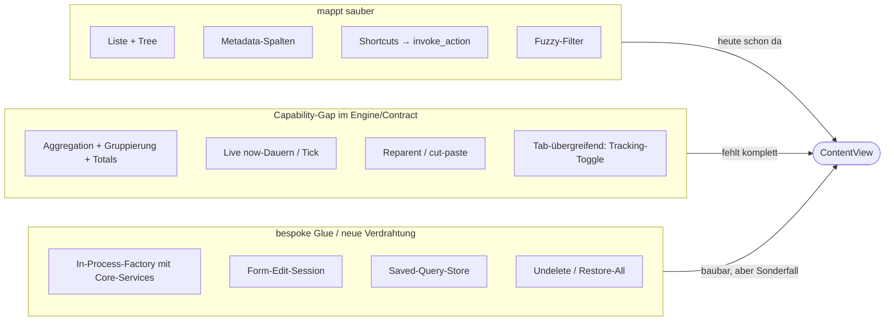

# Tasks- & Trackings-Tabs als ContentAdapter — Analyse

Status: **Analyse** (noch keine Entscheidung, keine Implementierung).

Ziel der Untersuchung: Können (und sollten) die heute nativen Tabs
**Tasks** und **Trackings** hinter denselben `ContentAdapter`-Contract
gebracht werden wie Jira/Taiga/Confluence/Postgres/Stoat? Dieses Dokument
hält die Schwierigkeiten und mögliche Lösungswege fest, damit ein
späterer Phasen-Plan auf einer geklärten Grundlage aufsetzt.

## Ausgangslage: zwei Welten

Heute existieren zwei getrennte Render-/Lade-Welten:

- **Generische Adapter-Welt** — `ContentView` + `ContentAdapter`/`Node` +
  YAML-`ViewDef`. Async, lazy, paginiert, netzwerk-orientiert. Ein Tab
  entsteht aus `~/.config/not_yet_done/views/*.yaml` + einer
  `AdapterFactory`. Diese Welt bekommt „gratis": Splits, Action-Chains,
  Links, Tree-Mode, Multiline-Rows, Smooth-Scroll, Column-Cursor,
  Markdown-Rendering, Retries, Saved-Query-Store.
- **Native Welt** — `TasksView`, `TrackingsView`. Bespoke Komponenten,
  laden alles eager aus SQLite (SeaORM), bauen einen `Forest` im
  Speicher, halten Tree-/Expand-State lokal, filtern via `FilterExpr`→SQL,
  und haben Sub-Views sowie Aggregation, die es generisch nicht gibt.

Adapterisieren = die nativen Tabs hinter denselben Contract bringen.
Reiz: ein einziges Konfig-Modell, Wegfall von bespoke-Code, und
YAML-konfigurierbare Spalten/Shortcuts/Subtabs auch für Tasks/Trackings.

### Der Contract, den ein Adapter erfüllen muss

`ContentAdapter` (in `not-yet-done-content`) liefert einen Baum über
`root()` / `get_by_id()`. Jeder `Node` exponiert:

- Identität: `id()`, `label()`, `node_type()`, `metadata()`
- Navigation: `children_types()`, `list(params)`, `get_child(id)`
- Aktionen (Menü-Pfad): `actions()`, `prepare()`, `picker_options()`,
  `execute()`
- Aktionen (Shortcut-Pfad): `invoke_action()` → `ActionDispatch`
  (`OpenEditor` | `ExecuteQuery` | `CreateChild` | `DeleteSelf` |
  `Reload` | `Noop` | `Error`)

Eine `ViewDef`/`ChildDef`-Hierarchie bindet einen Pfad durch diesen Baum:
`node_type` je Ebene, `columns` (aus `metadata`/`label`), `shortcuts`
(→ `invoke_action`), `tree_label` (Tree-Mode), `actions` (Menü-Pfad).
Adapter werden via `AdapterFactory::create(instance_id, yaml_config)`
instanziiert und im TUI nach Typ registriert.

### Wie die nativen Tabs heute funktionieren

- **Tasks** (`TasksView`): lädt via `TaskService::list_filtered_with_options()`
  eager, baut aus `parent_id` einen unveränderlichen `Forest`,
  Expand/Collapse lebt separat in `TasksTreeState` (inkl.
  transient-open für `/`-Suche durch kollabierte Knoten). Sub-Views
  List/Tree. Aktionen: Add/Edit/EditNode(reparent)/Delete/Undelete/
  Notes/Script/Tree-Toggle/Tracking-Toggle. Edit ist ein **Formular**.
- **Trackings** (`TrackingsView`): lädt via `TrackingRepository`
  (`find_all`/`find_filtered`), joint Task-Beschreibung + Pfad lokal,
  rechnet Dauer als `ended_at.unwrap_or(now) − started_at`, markiert
  laufende Trackings (`active`). Sub-Views **Normal / Condensed / Tree**
  plus **Grouping** Day/Week/Month/Year mit Gruppen-Header, Gruppen-Total
  und Footer-Total. Soft-Delete mit Zeit-Erhalt + Undelete + Restore-All.

Beide nutzen **nicht** die generische `ViewDef`/`ChildDef`-Maschinerie.
Beide laden async off-thread (tokio + `LoadMsg`), wie die Adapter — aber
direkt aus den lokalen Repos, ohne Adapter-Contract dazwischen. Es gibt
**keinen** existierenden In-Process-Adapter über reine Lokaldaten als
Präzedenzfall (Postgres fasst nur zusätzlich lokale Skript-Dateien an).

## Schwierigkeiten nach Schweregrad

### Schwer — brauchen einen Mechanismus, den es heute nicht gibt

1. **Aggregations- & Gruppen-Sub-Views (Trackings).** `Normal` mappt 1:1
   auf das Node-Modell. Aber `Condensed` (eine Zeile pro Task, Summe
   aller Trackings), `Tree` (Dauern entlang der Task-Hierarchie nach oben
   gefaltet: `own` vs. `cumulated`) und `Grouping` (Day/Week/Month/Year
   mit Gruppen-Header-Zeile, Gruppen-Total, Footer-Total) existieren im
   generischen Table-Engine **gar nicht**. Der Node/Metadata-Contract
   liefert flache Items mit String-Feldern — keine Gruppen-Header, keine
   Aggregat-Zeilen, keine Footer-Totals. Größter Mismatch, betrifft fast
   nur Trackings.

2. **Live, now-relative Dauern.** Laufendes Tracking = `now − started_at`,
   tickt pro Frame; `⏱`-Marker. Adapter liefern statische
   Metadaten-Snapshots (Strings). Es gibt keinen „pro Frame neu
   berechnen"-Pfad; `subscribe_invalidations` ist grob (Node/All).
   Live-Ticking braucht client-seitiges `now`.

3. **Strukturelle Moves / Reparenting.** Tasks: Knoten ausschneiden und
   unter einen anderen einfügen (cut/paste-node), Reparent im
   Edit-Node-Formular. `ActionDispatch` kennt kein „verschiebe X unter Y"
   — die Aktion spannt zwei beliebige Knoten auf. (Der
   DB-Script-Folders-Plan stieß auf dasselbe und löste es App-seitig mit
   mark/paste-State plus `Noop`-Dispatch — Präzedenz, aber bespoke.)

4. **Tab-übergreifende Aktions-Seiteneffekte.** „Tracking starten/stoppen"
   lebt auf **Tasks UND Trackings** und mutiert App-Level-`tracked_ids`
   plus erzeugt eine Tracking-Zeile. Eine Task-Aktion mutiert also
   Tracking-Daten — über die Adapter-Grenze hinweg. Im Adapter-Modell ist
   jeder Adapter eine isolierte Insel.

### Mittel — lösbar, aber bespoke Glue oder neue Verdrahtung nötig

5. **In-Process-Adapter — kein Präzedenzfall.** Ein `TaskAdapter`/
   `TrackingAdapter` würde die lokalen async-Repos umschließen —
   technisch okay, aber die **Factory baut Adapter heute nur aus einem
   YAML-String, ohne Zugriff auf den DI-Container / die Core-Services**.
   Nötig: ein neuer Wiring-Pfad (Factory mit injiziertem
   `Arc<dyn TaskService>` / DB-Handle).

6. **Formular- vs. Text-Editor-Editing.** Task-Edit ist ein
   strukturiertes Multi-Field-**Formular** (Beschreibung, Status,
   Priorität, Tags, Reparent) über `ratatui_form_widgets`. Der
   Adapter-Edit-Pfad ist `prepare()`→Text-Template→`execute()`
   (Buffer-Round-Trip wie Jira) oder Picker. Entweder Task-Edit wird ein
   Text-Template (Verlust des Formulars) oder wir routen das Formular über
   ein bespoke `ActionDispatch::OpenEditor { session_kind: "task_form" }`
   (machbar — es gibt bereits bespoke EditSessions wie
   `postgres_db_script` —, aber kein generischer Gewinn).

7. **Saved-Query-Persistenz-Fork.** Beide Tabs persistieren Saved Queries
   samt Shortcuts und `q`-Menü App-seitig unter Scope `"task"`/`"tracking"`
   (eigene DB-Tabellen). Adapter haben ihren eigenen `saved_query_store`.
   Migration heißt: bestehenden Store behalten (Sonderfall) oder auf
   Adapter-Store umziehen (Daten-/Verhaltens-Migration).

8. **Soft-Delete / Undelete / Restore-All.** `ActionDispatch::DeleteSelf`
   gibt es. Aber Undelete und „alle gelöschten wiederherstellen"
   operieren auf **gerade nicht sichtbaren** (gelöschten) Zeilen — es gibt
   keinen natürlichen Knoten, an den man „restore all" hängt, und keine
   Action-Vokabel dafür.

9. **Gestylte Taskpath-Spalte.** Der Walker entlang `parent_id` ist easy
   (Adapter hat den Baum ohnehin) — aber die **per-Segment-Stilierung**
   (fett-oranger `/`-Separator) ist ein View-Feature; Metadata sind nur
   Strings. Entweder ein Column-Level-Style-Feature oder der Style geht
   verloren.

### Einfach — mappt sauber

- Flache Liste als Nodes mit Metadata-Spalten.
- Tree via `children_types` + `list`/`get_child` (Adapter darf in `root()`
  auch eager den ganzen Baum laden und cachen).
- Shortcuts → `invoke_action`.
- Client-seitige Fuzzy-Filterung (macht `ContentView` bereits).

## Die Lage als Bild

## Lösungsweg

Zentrale Einsicht: **Tasks ist nah am Modell, Trackings ist der Brocken.**
Fast alle „Schwer"-Punkte (Aggregation, Gruppierung, Live-Tick) hängen an
Trackings; Tasks bringt vor allem „Mittel"-Punkte (Wiring, Form-Edit,
Reparent).

Sinnvolle Reihenfolge:

1. **Wiring-Pattern zuerst klären** (Punkt 5): Wie bekommt eine Factory
   die Core-Services? Fundament für beide Adapter, einmal sauber
   entscheiden.
2. **Tasks als Pilot** (näher am Tree-Modell): klärt In-Process-Adapter,
   Form-Edit-Session, Reparent und Saved-Query-Fork an einem
   überschaubaren Fall.
3. **Erst danach Trackings**, und dort die Schlüsselentscheidung treffen:
   Aggregation im Adapter (synthetische Gruppen-/Footer-Pseudo-Nodes)
   **oder** als neues View-Engine-Feature.

## Offene Architekturentscheidungen

Bevor daraus ein echter Phasen-Plan wird, hängen drei Entscheidungen
daran, die nicht geraten werden sollten:

1. **Ist „alles uniform machen" das Ziel — oder „Tasks/Trackings sollen
   die generischen Features (Splits/Links/Multiline/etc.) bekommen"?**
   Letzteres ginge evtl. auch ohne Voll-Adapterisierung (Engine-Features
   auf die nativen Views ziehen). Das ändert den gesamten Zuschnitt.
2. **Wo lebt die Trackings-Aggregation/Gruppierung?** (a) Adapter
   synthetisiert Gruppen-Header-/Total-Pseudo-Nodes und liefert sie als
   normale Nodes — Engine bleibt dumm, Adapter wird schlau; oder (b) der
   generische Table-Engine bekommt ein echtes Gruppierungs-/
   Aggregations-Feature — mehr Arbeit, aber dann hätten es alle Adapter.
3. **Wie gehen wir mit Live-Tick-Dauern um?** Staleness akzeptieren (nur
   bei Reload/Tastendruck neu rechnen) oder einen Frame-Tick einführen,
   der laufende Dauern client-seitig nachzieht?

## Relevante Dateien (Einstiegspunkte)

- Contract: `not-yet-done-content/src/lib.rs` (`ContentAdapter`, `Node`,
  `ActionDispatch`), `not-yet-done-content/src/node_ref.rs`
- Generische View: `not-yet-done-tui/src/views/content_view.rs`,
  `not-yet-done-tui/src/config/view_config.rs`
- Factory-Registry: `not-yet-done-tui/src/main.rs`
  (`build_adapter_factories`)
- Tasks: `not-yet-done-tui/src/views/tasks_view.rs`,
  `…/views/tasks_tree_state.rs`, `…/tabs/tasks_state.rs`,
  `not-yet-done-core/src/service/task_service.rs`
- Trackings: `not-yet-done-tui/src/views/trackings_view.rs`,
  `…/tabs/trackings_state.rs`,
  `not-yet-done-core/src/repository/tracking_repository.rs`
- Async-Lade-Pfad: `not-yet-done-tui/src/app/mod.rs`
  (`spawn_load`, `spawn_load_trackings`, `spawn_content_load`)
