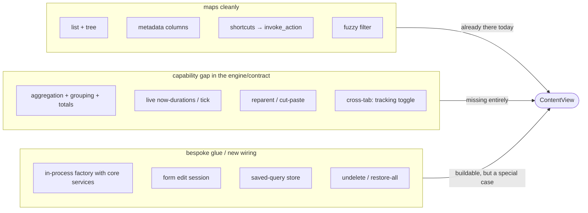

# Tasks and trackings tabs as a ContentAdapter — analysis

Status: **analysis** (no decision yet, no implementation).

Purpose of this investigation: can (and should) the tabs **Tasks** and
**Trackings**, which are native today, be brought behind the same
`ContentAdapter` contract as Jira/Taiga/Confluence/Postgres/Stoat? This document
records the difficulties and possible ways forward so that a later phase plan can
build on a clarified basis.

## Starting point: two worlds

Today two separate render/load worlds exist:

- **The generic adapter world** — `ContentView` + `ContentAdapter`/`Node` + a
  YAML `ViewDef`. Async, lazy, paginated, network-oriented. A tab is created from
  `~/.config/not_yet_done/views/*.yaml` plus an `AdapterFactory`. This world gets
  "for free": splits, action chains, links, tree mode, multi-line rows, smooth
  scrolling, column cursor, Markdown rendering, retries, the saved-query store.
- **The native world** — `TasksView`, `TrackingsView`. Bespoke components, they
  load everything eagerly from SQLite (SeaORM), build a `Forest` in memory, keep
  tree and expand state locally, filter via `FilterExpr`→SQL, and they have
  sub-views as well as aggregation that do not exist generically.

Adapterizing = bringing the native tabs behind the same contract. The appeal: a
single config model, bespoke code disappearing, and YAML-configurable
columns/shortcuts/subtabs for tasks and trackings too.

### The contract an adapter has to fulfil

`ContentAdapter` (in `not-yet-done-content`) provides a tree via `root()` /
`get_by_id()`. Every `Node` exposes:

- Identity: `id()`, `label()`, `node_type()`, `metadata()`
- Navigation: `children_types()`, `list(params)`, `get_child(id)`
- Actions (menu path): `actions()`, `prepare()`, `picker_options()`, `execute()`
- Actions (node path): `invoke_action()` → `ActionDispatch` (`OpenEditor` |
  `ExecuteQuery` | `CreateChild` | `DeleteSelf` | `Reload` | `Noop` | `Error`)

A `ViewDef`/`ChildDef` hierarchy binds a path through this tree: `node_type` per
level, `columns` (from `metadata`/`label`), `tree_label` (tree mode) and
`actions` — the one list that binds both the menu path and, with the default
`type: node`, `invoke_action`. Adapters are instantiated via
`AdapterFactory::create(instance_id, yaml_config)` and registered by type in the
TUI.

### How the native tabs work today

- **Tasks** (`TasksView`): loads eagerly via
  `TaskService::list_filtered_with_options()`, builds an immutable `Forest` from
  `parent_id`; expand/collapse lives separately in `TasksTreeState` (including
  transient-open for `/` search through collapsed nodes). Sub-views list and
  tree. Actions: add/edit/edit-node (reparent)/delete/undelete/notes/script/tree
  toggle/tracking toggle. Edit is a **form**.
- **Trackings** (`TrackingsView`): loads via `TrackingRepository`
  (`find_all`/`find_filtered`), joins the task description and path locally,
  computes the duration as `ended_at.unwrap_or(now) − started_at`, marks running
  trackings (`active`). Sub-views **normal / condensed / tree** plus **grouping**
  by day/week/month/year with a group header, a group total and a footer total.
  Soft delete with time preservation plus undelete and restore-all.

Neither of them uses the generic `ViewDef`/`ChildDef` machinery. Both load async
off-thread (tokio + `LoadMsg`), like the adapters — but straight out of the local
repositories, with no adapter contract in between. There is **no** existing
in-process adapter over purely local data as a precedent (Postgres only
additionally touches local script files).

## Difficulties by severity

### Hard — they need a mechanism that does not exist today

1. **Aggregation and grouping sub-views (trackings).** `Normal` maps 1:1 onto the
   node model. But `Condensed` (one row per task, the sum of all its trackings),
   `Tree` (durations folded upward along the task hierarchy: `own` vs.
   `cumulated`) and `Grouping` (day/week/month/year with a group header row, a
   group total and a footer total) do **not exist at all** in the generic table
   engine. The node/metadata contract yields flat items with string fields — no
   group headers, no aggregate rows, no footer totals. The biggest mismatch, and
   it concerns almost only trackings.

2. **Live, now-relative durations.** A running tracking = `now − started_at`,
   ticking per frame; the `⏱` marker. Adapters deliver static metadata snapshots
   (strings). There is no "recompute per frame" path;
   `subscribe_invalidations` is coarse (node/all). Live ticking needs a
   client-side `now`.

3. **Structural moves / reparenting.** Tasks: cut a node and paste it under
   another one (cut/paste node), reparent in the edit-node form. `ActionDispatch`
   has no "move X under Y" — the action spans two arbitrary nodes. (The DB script
   folders plan hit the same thing and solved it app-side with mark/paste state
   plus a `Noop` dispatch — a precedent, but bespoke.)

4. **Cross-tab action side effects.** "Start/stop tracking" lives on **both tasks
   and trackings** and mutates the app-level `tracked_ids` as well as creating a
   tracking row. So a task action mutates tracking data — across the adapter
   boundary. In the adapter model every adapter is an isolated island.

### Medium — solvable, but needing bespoke glue or new wiring

5. **In-process adapter — no precedent.** A `TaskAdapter`/`TrackingAdapter` would
   wrap the local async repositories — technically fine, but **the factory builds
   adapters today only from a YAML string, with no access to the DI container or
   the core services**. Needed: a new wiring path (a factory with an injected
   `Arc<dyn TaskService>` / DB handle).

6. **Form editing vs. text-editor editing.** Task edit is a structured
   multi-field **form** (description, status, priority, tags, reparent) built on
   `ratatui_form_widgets`. The adapter edit path is
   `prepare()`→text template→`execute()` (a buffer round trip like Jira) or a
   picker. Either task edit becomes a text template (losing the form), or we route
   the form through a bespoke `ActionDispatch::OpenEditor { session_kind: "task_form" }`
   (doable — bespoke edit sessions such as `postgres_db_script` already exist —
   but no generic gain).

7. **Saved-query persistence fork.** Both tabs persist saved queries including
   their shortcuts and the `q` menu app-side under the scope `"task"`/`"tracking"`
   (their own DB tables). Adapters have their own `saved_query_store`. Migration
   means: keep the existing store (a special case) or move to the adapter store (a
   data and behaviour migration).

8. **Soft delete / undelete / restore-all.** `ActionDispatch::DeleteSelf` exists.
   But undelete and "restore all deleted" operate on rows that are **currently not
   visible** (deleted ones) — there is no natural node to hang "restore all" on,
   and no action vocabulary for it.

9. **Styled taskpath column.** Walking along `parent_id` is easy (the adapter has
   the tree anyway) — but the **per-segment styling** (a bold orange `/`
   separator) is a view feature; metadata are only strings. Either a column-level
   style feature, or the styling is lost.

### Easy — maps cleanly

- A flat list as nodes with metadata columns.
- Tree via `children_types` + `list`/`get_child` (an adapter may also load and
  cache the whole tree eagerly in `root()`).
- Shortcuts → `invoke_action`.
- Client-side fuzzy filtering (`ContentView` already does this).

## The situation as a picture

## Way forward

The central insight: **tasks is close to the model, trackings is the hard part.**
Almost all the "hard" points (aggregation, grouping, live tick) hang on
trackings; tasks mainly brings "medium" points (wiring, form edit, reparent).

A sensible order:

1. **Clarify the wiring pattern first** (point 5): how does a factory get the
   core services? It is the foundation for both adapters, so decide it cleanly
   once.
2. **Tasks as the pilot** (closer to the tree model): it clarifies the in-process
   adapter, the form edit session, reparenting and the saved-query fork on a
   manageable case.
3. **Only then trackings**, and there make the key decision: aggregation in the
   adapter (synthetic group/footer pseudo nodes) **or** as a new view-engine
   feature.

## Open architecture decisions

Before this turns into a real phase plan, three decisions hang on it that should
not be guessed:

1. **Is "make everything uniform" the goal — or "tasks/trackings should get the
   generic features (splits/links/multiline/etc.)"?** The latter might also work
   without full adapterization (pulling engine features onto the native views).
   That changes the entire cut of the work.
2. **Where does the trackings aggregation/grouping live?** (a) The adapter
   synthesizes group-header and total pseudo nodes and delivers them as normal
   nodes — the engine stays dumb, the adapter gets smart; or (b) the generic
   table engine gets a real grouping/aggregation feature — more work, but then
   every adapter would have it.
3. **How do we handle live-ticking durations?** Accept staleness (only recompute
   on reload or a key press), or introduce a frame tick that updates running
   durations client-side?

## Relevant files (entry points)

- Contract: `not-yet-done-content/src/lib.rs` (`ContentAdapter`, `Node`,
  `ActionDispatch`), `not-yet-done-content/src/node_ref.rs`
- Generic view: `not-yet-done-tui/src/views/content_view.rs`,
  `not-yet-done-tui/src/config/view_config.rs`
- Factory registry: `not-yet-done-tui/src/main.rs` (`build_adapter_factories`)
- Tasks: `not-yet-done-tui/src/views/tasks_view.rs`,
  `…/views/tasks_tree_state.rs`, `…/tabs/tasks_state.rs`,
  `not-yet-done-core/src/service/task_service.rs`
- Trackings: `not-yet-done-tui/src/views/trackings_view.rs`,
  `…/tabs/trackings_state.rs`,
  `not-yet-done-core/src/repository/tracking_repository.rs`
- Async load path: `not-yet-done-tui/src/app/mod.rs` (`spawn_load`,
  `spawn_load_trackings`, `spawn_content_load`)
