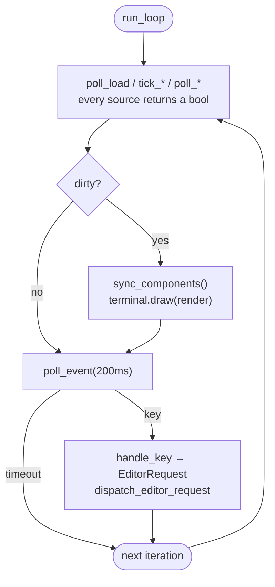
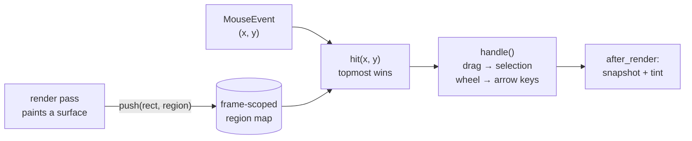
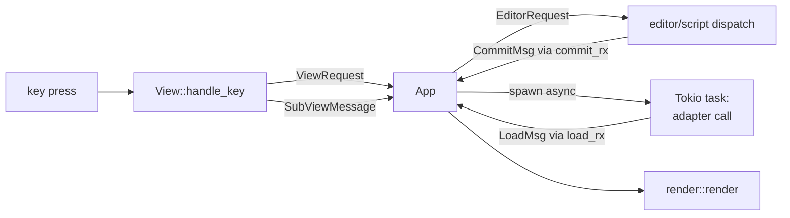

# Architecture

An overview of the crate structure, the central data flows and the
responsibilities of the components of **not-yet-done** — a terminal-based
task and time tracker with a TUI, a CLI and a Waybar integration.

This document describes the _current state_ and, above all, the _reasoning_
behind the cuts. Weighty individual decisions live as ADRs under
[`docs/decisions/`](decisions/) (for example
[0001 — render loop dirty gating](decisions/0001-render-loop-dirty-gating.md)).

## Guiding principles

These principles (also recorded in `CLAUDE.md`) explain _why_ the crates are
cut the way they are:

- **Separation of concerns** — every tab and view owns its own state. Shared
  state at the app level is kept to a minimum.
- **Open/closed** — new tabs and features can be added without changing
  existing tab code. Shared capabilities go through traits.
- **Encapsulation** — views manage their popups, filters, favourites and
  search internally. They communicate with the app only through message and
  request enums.
- **Adapter isolation** — content backends (Jira, Taiga, Postgres,
  Confluence, Stoat, local) depend exclusively on `not-yet-done-content`,
  never on the TUI. That keeps the dependency graph acyclic, and a new
  adapter touches no core code.
- **One adapter wiring for every frontend** — `not-yet-done-host` is the only
  crate that knows the contract _and_ every adapter. The TUI, the CLI (`nyd`)
  and Waybar build adapters byte for byte the same way through
  `host::resolve_adapter` instead of duplicating the factory selection.
  Reasoning in
  [ADR 0005](decisions/0005-host-crate-and-lifecycle-hooks.md).

## The crate landscape

The workspace splits into five layers: the **frontends** (what the user
starts), the **host layer** (one crate that builds adapters the same way for
every frontend), the **content adapter layer** (interchangeable backends),
the **UI building blocks** (render-adjacent helper crates) and the **data
core** (the legacy `core` plus the extracted task domain).


| Crate                               | Responsibility                                                                                                                                                                                                | Workspace deps                                                       |
| ----------------------------------- | ------------------------------------------------------------------------------------------------------------------------------------------------------------------------------------------------------------- | -------------------------------------------------------------------- |
| **not-yet-done-core**               | The legacy database (`nyd.db`): settings, saved queries, links, tags; config                                                                                                                                  | macros                                                               |
| **not-yet-done-task-core**          | The task/tracking domain (`tasks.db`): entities, services, bootstrap, backup                                                                                                                                  | filter                                                               |
| **not-yet-done-filter**             | The filter DSL (YAML query language, AST → query, tree operators)                                                                                                                                             | —                                                                    |
| **not-yet-done-host**               | The adapter wiring for every frontend: factory registry, `resolve_adapter`, hooks                                                                                                                             | content, every adapter                                               |
| **not-yet-done-tui**                | The terminal UI: event loop, views, app state                                                                                                                                                                 | core, content, filter, host, local, postgres, forest, table, ratatui |
| **not-yet-done-cli** (`nyd`)        | The generic adapter frontend (CLI) plus the `tag`/`backup`/`config` built-ins                                                                                                                                 | host, content, core, task-core, filter                               |
| **not-yet-done-task-cli** (`nyd-t`) | The native domain CLI for tasks and trackings (typed JSON, graded exit codes)                                                                                                                                 | task-core                                                            |
| **not-yet-done-waybar**             | The Waybar CFFI module (the active tracking in the status bar)                                                                                                                                                | content, host                                                        |
| **not-yet-done-content**            | The `ContentAdapter` trait, the `Node`/`Content` abstraction and auth orchestration                                                                                                                           | —                                                                    |
| **not-yet-done-local-adapter**      | Tasks/trackings/projects as a ContentAdapter (via `task-core`)                                                                                                                                                | content, task-core, filter                                           |
| **not-yet-done-jira-adapter**       | Jira tickets as a content tree                                                                                                                                                                                | content                                                              |
| **not-yet-done-taiga-adapter**      | Taiga items as a content tree                                                                                                                                                                                 | content                                                              |
| **not-yet-done-postgres-adapter**   | Postgres databases/schemas/tables/DB scripts as a content tree                                                                                                                                                | content, transport, sql-core                                         |
| **not-yet-done-sqlite-adapter**     | SQLite files (from `sources:` globs)/tables/rows/DB scripts as a content tree                                                                                                                                 | content, sql-core                                                    |
| **not-yet-done-sql-core**           | Backend-neutral SQL building blocks: identifier quoting, the SQL text sniffer, script file storage, `ScriptStore`, the DB script node tree, editor completions, buffer protocols for the view and row editors | content                                                              |
| **not-yet-done-confluence-adapter** | Confluence spaces/pages/comments/attachments                                                                                                                                                                  | content                                                              |
| **not-yet-done-stoat-adapter**      | Chat (the Stoat/Revolt fork) as a streaming content tree                                                                                                                                                      | content                                                              |
| **not-yet-done-transport**          | SSH tunnel support for adapters (e.g. Postgres behind a bastion)                                                                                                                                              | content                                                              |
| **not-yet-done-forest**             | Tree/forest → a flat list of rows (tree rendering)                                                                                                                                                            | table                                                                |
| **not-yet-done-table**              | Column layout and table rendering primitives                                                                                                                                                                  | —                                                                    |
| **not-yet-done-ratatui**            | Ratatui extensions (inline editor, widgets: TextInput/MultiChoice/Toggle plus the spec-driven form driver)                                                                                                    | grid-core                                                            |
| **not-yet-done-grid-core**          | The grid layout core                                                                                                                                                                                          | —                                                                    |
| **not-yet-done-macros**             | Proc macros (`ColumnRegistry` etc.)                                                                                                                                                                           | —                                                                    |
| **grid-render-sim**                 | A render simulation/test bed for the grid                                                                                                                                                                     | —                                                                    |

## The data core: `core` + `task-core` + `filter`

The data core was split up in block C. The **task/tracking domain** no longer
lives in the legacy database but in its own `tasks.db`, looked after by
`not-yet-done-task-core`; `not-yet-done-core` keeps only the TUI's
cross-cutting data (`nyd.db`); the filter DSL was extracted into
`not-yet-done-filter` so that both the domain and the adapters can use it
without `core`. The reasoning behind the split is in
[`adapterize-tasks-trackings.md`](adapterize-tasks-trackings.md).

- **`not-yet-done-task-core` (`tasks.db`)** — the actual domain: entities
  (`Task`, `Tracking`, `Project`, tags), services, `bootstrap`
  (`default_task_dsn()`, `open_module()` — connect + schema sync + DI) and
  the suffix-aware `backup` module. _One_ source of truth for the DSN and the
  backup directory, shared by the local adapter (TUI) **and** `nyd-t`. The
  default DSN is `<data-local>/not_yet_done/tasks.db`, overridable with
  `NYD_TASKS_DB`.
- **`not-yet-done-core` (`nyd.db`)** — the frontend-agnostic legacy core for
  settings, saved queries, query shortcuts, links and (still) global tags,
  plus `BackupServiceImpl` for the daily `nyd.db` backup at startup. Located
  at `dirs::data_local_dir()/not_yet_done/nyd.db`, config at
  `dirs::config_dir()/not_yet_done/config.yaml`, overridable with
  `DATABASE_URL`.
- **`not-yet-done-filter`** — the YAML filter DSL with natural-language date
  expressions: AST → query, including tree-specific operators. No workspace
  dependencies; used by `task-core`, `local-adapter`, `cli` and `tui`.

Both databases run a schema sync automatically at startup; targeted
migrations deal with old data (for example the tag `color` → `fg_color` +
`bg_color` + `symbol`).

> **Gotcha:** SeaORM `Uuid` primary keys end up in SQLite as `BLOB(16)`, not
> as text — a manual `TEXT` insert fails silently at decode time.

## The content adapter layer (`not-yet-done-content`)

External backends are abstracted through a shared pair of traits as a
navigable **tree of `Node`s**. That is the open/closed lever: every new
adapter implements only these traits and is registered in the TUI with a
factory plus YAML — no core code changes.

### `ContentAdapter` (the adapter level)

- `root()` / `get_by_id(id)` — the entry point and direct access to a node
- `list(params)` — children with sorting and pagination
- `actions_for_type(node_type)` — which actions a node type offers
  (synchronous; feeds the shortcut hints in the action and status bar)
- `execute_custom_query(query, ctx)` — adapter-native queries (SQL, for
  example), including cursor pagination
- `search_in_tree(params)` — a server-side tree search (Confluence CQL, for
  example) that returns hits **with their ancestor path** for lazy
  expand-to-hit. `params.view_query` carries the pane's active query, and an
  adapter that filters its levels by that query must apply it here too: a hit
  the query hides is not addressable, because the expand walk asks each level
  for its children and never gets the hit back. The tasks adapter therefore
  intersects its matches with the same visible set `list()` uses — otherwise
  searching for a ticket number offers the deleted namesakes the default
  query `[deleted, =, false]` hides, and the walk strands on them. The
  front-end still skips a hit it cannot reach (an adapter cannot always
  predict permissions or pagination caps), it just costs a round-trip each.
- `locate_node_path(node_id)` — where a node sits in the tree, in the same
  path shape as a search hit. Its only purpose is to let a **link** follow
  into a subtree that is not expanded yet; the default `Ok(None)` means "I
  cannot", and costs exactly that deep-link behaviour, nothing else. Adapters
  with `unstable_node_ids` (Postgres, SQLite — row IDs are offsets into a
  result set) leave the default in place, because their IDs would not survive
  a link anyway. Tasks return the ancestor chain from the snapshot,
  Confluence a one-line CQL on `id = <page>` — and it shares the path
  construction with `search_in_tree`, so that a link and a search expand the
  same way.
- `subscribe_status()` — a `watch::Receiver<AdapterStatus>` for live auth and
  connection status
  (`Idle`/`Connecting`/`Ready`/`Busy`/`NeedsCreds`/`Failed`)
- `submit_credentials(fields)` / `try_refresh_session()` — interactive and
  silent credential upkeep
- `saved_query_store()` — the adapter's own persistence for saved queries
- `child_process_env(node)` — environment variables for editor and script
  child processes

### `Node` / `Content` (the node level)

- `list(params)` — child nodes; `content()` — the read body (for preview and
  detail)
- `list_subtree(params, depth)` — a whole subtree (`depth + 1` levels) in
  **one** call. The default recurses over `list()` (one call per node);
  in-memory adapters (tasks, trackings) override it with a snapshot walk that
  does no I/O. Driven by the engine only under the `supports_eager_subtree`
  capability — where it then replaces the O(N²) cascade on the initial expand
  and on reload. See `docs/generic-view-spec.md` → eager subtree.
- `actions()` — the actions of this concrete node
- `invoke_action(name, ctx)` → `ActionDispatch` — shortcut-driven action
  dispatch that returns an intent for the UI flow
- `prepare(action)` / `picker_options(action)` / `execute(action, input)` —
  the three-stage action flow (render the editor buffer or supply the picker
  options → user input → finalize)

Implementations: `jira-`, `taiga-`, `postgres-`, `sqlite-`, `confluence-`
and `stoat-adapter`.

### The SQL adapters (Postgres + SQLite)

Two adapters speak SQL. They share **one** crate and **one** branch of the
tree — each builds the catalogue branch itself:

- **`not-yet-done-sql-core`** holds whatever is independent of the database:
  `quote_ident` (double quotes are the SQL standard, so one implementation
  serves both), the pure text sniffers in `sql_shape` (is this a `SELECT`?
  several statements?), the file storage for scripts and the **complete
  `ScriptStore` implementation**. The only adapter-specific part left is the
  ID grammar, behind the trait **`NodeScriptLayout`**: the adapter says which
  path segments a node ID decomposes into, everything else is shared. The
  reason for the cut: without it the second SQL adapter would have been a
  ~1100-line copy of the first.
- **The script branch itself is shared, not just its storage.**
  `db_script_nodes` returns it as finished `Node`s: the three node types
  (group/folder/script), their actions including form validation, the
  listings and the CRUD dispatches. An adapter only says _where_ the branch
  hangs (`DatabaseNode::get_child("db_scripts")`) and _under which key_. That
  this works is down to the host: the TUI keys purely on the **ID shape**
  `<key>/db_scripts/<segments…>`, never on type IDs — so another SQL adapter
  needs zero TUI changes.
  - The type IDs still carry an adapter prefix (`postgres:db_script` vs.
    `sqlite:db_script`) so that YAML views can tell them apart. The prefix is
    only known at runtime, but `Node::node_type()` returns a `&NodeType` —
    which means the types cannot be a `static LazyLock` and instead live in
    the shared `Arc<DbScriptTree>` that every node of the branch holds. A
    side effect: one `ScriptStore` per adapter instance instead of a fresh
    construction per action.
- **Editor completions share the mechanism, not the names.** The script
  editor gets an appended comment line (`-- table completions: …`) with a
  short token per table, which disappears again on save; on execution the
  tokens are expanded. Everything about that is backend-neutral except the
  question of how many levels qualify a name, and a single helper handles
  that: for two parts `script_completions::qualified_table` returns
  `tt_public__users` → `"public"."users"`, for one level
  `tt_notes` → `"notes"`. The adapter only supplies the list. Replacement
  happens in **one** pass over the identifier runs of the query rather than
  with one regex per table — which with 500 tables does not cost 500 regex
  compilations per execution, and makes a partial replacement
  (`tt_public__user` inside `tt_public__user_orders`) impossible by
  construction.
- **The writing editors share the buffer protocol, not the SQL.** Two things
  are editable: the **view definition** (`E` → `edit_view`, `view_ddl`) and a
  **data row** (`e` → `edit_row`, `row_edit`). The whole sequence is
  backend-neutral: render the buffer (header comment + content), set an error
  banner and strip it again on the next save, parse the buffer, diff it
  against the state at opening time and build the `UPDATE`. The adapter only
  supplies the dialect knowledge — how a view is replaced (SQLite: drop +
  create in _one_ transaction; Postgres: `CREATE OR REPLACE`), and what makes
  a row addressable (the primary key, otherwise SQLite's implicit `rowid` or
  the narrowest unique index over NOT NULL columns; deliberately not `ctid`,
  because it moves on every `UPDATE`).
  - **A rejection is never an error** but a `Reopen` with the user's own text
    plus a banner: the buffer is the only copy of what the user typed. If the
    statement itself fails, it goes **into** the banner — a type or
    constraint error is far easier to place with the `UPDATE` right in front
    of it. That is exactly why `build_update` splices literals instead of
    placeholders.
  - **The offset in a row ID addresses nothing.** Row IDs are
    `unstable_node_ids`; the offset is only _how_ the row was found. What
    counts are the key and cell values read at opening time; they travel
    along in the edit session's opaque `version` token and are what every
    later statement uses. A page shifting underneath therefore cannot
    redirect the write, and a cell value comparison detects a foreign change
    instead of silently overwriting it.
- **The catalogue trees differ deliberately**, because the backends differ.
  Postgres: `database → schemas → schema → tables → table → rows`. SQLite has
  no schema namespace, so the tree is one level flatter:
  `file → tables → table → rows`.
- **Where the root nodes come from is the real difference.** Postgres asks
  the server (`pg_database`) — there is nothing to configure. With SQLite a
  database _is_ a file, so there is no catalogue: `sources:` lists any number
  of glob patterns, and every file matched becomes a root child. The patterns
  are re-matched on every reload, so that a newly created file appears
  without a restart.
- **Node IDs have to be stable** (they end up in script paths on disk and in
  the `query_shortcut` table), but a file path is not a path segment. SQLite
  therefore identifies each source as
  `<sanitized stem>-<FNV-1a hash of the absolute path>`: readable, a single
  segment, and collision-free between `app/data.db` and `backup/data.db`.
- **Pagination differs, and the view says how.** Postgres can do server-side
  cursors (`pagination: mode: cursor`), SQLite cannot: the database is a
  local file, a higher `OFFSET` costs a page scan rather than a round trip,
  and an open cursor would only hold a write lock — so the adapter rejects
  the cursor intent instead of faking it (`mode: server`). The host **always**
  reads the mode from the `pagination:` block of the result pane, including
  for the first page; that way the config decides, not an assumption about
  the backend.

### Streaming adapters (the gateway pattern)

Most adapters are **pull-only**: they answer `list()`/`get_by_id()`
synchronously via `await`. Chat (Stoat, a fork of Revolt) breaks that model
and is the first **streaming adapter** — the reference pattern for future
push backends:

- **Bootstrap is push-only.** The server and channel list is available _only_
  through the WebSocket `Ready` event, not over REST. A **`StoatGateway`** (a
  single background Tokio task) is the only place with WS logic:
  `connect → Authenticate → Ready → event stream`, heartbeat ping, reconnect
  with backoff. `Ready` fills **`StoatState`** (an `Arc<RwLock>`, the
  in-memory source of truth for the tree) — deliberately **not** cached in
  SQLite (chat state is highly volatile; only the session token and the view
  sort are persisted).
- **`Node::list()` reads from `StoatState` synchronously** (no network
  `await` for the tree structure); message history stays a REST pull
  (paginated).
- **A unified status.** The adapter owns **one** `watch<AdapterStatus>`
  channel of its own. The login phase is forwarded into it from the
  `AuthOrchestrator` (whose `Ready` is suppressed), the socket phase is
  published by the gateway (`Connecting`/`Ready`/`Failed`). That way the
  banner reflects login **and** connection end to end.
- **Live push (phase 2, implemented).** Ongoing WS events are fed
  out-of-band into the `select!` loop as a generic `Invalidation` — the same
  mechanism as `subscribe_status`, only "node X is stale" instead of "the
  status changed". The building blocks:
  - The `Invalidation` enum plus `ContentAdapter::subscribe_invalidations()`
    in `not-yet-done-content` (a no-op default → pull-only adapters stay
    untouched, open/closed). It returns a **`broadcast::Receiver`** (discrete
    events, not a latest value like `watch`; one adapter instance can feed
    several views).
  - The gateway pushes `Invalidation::Node{id: <channel>}` on message and
    reaction events, and `Invalidation::All` on every `Ready` (both the first
    connect **and** a reconnect resync).
  - Per view the TUI spawns an **invalidation watcher** next to the status
    watcher, which pumps the receiver into the **existing** `load_tx` channel
    (`LoadMsg::AdapterInvalidation`). `poll_load` reloads the affected panes
    at their current level (`All` → every pane; `Node{id}` → only panes whose
    `parent_node_id` is that channel). On `Lagged` the watcher resyncs with
    `All`.
  - The precondition is the event-driven render loop (1b, see below); the
    design details are in ADR `0002`.
  - The limit: **structural** live events (a channel or server created or
    deleted) are not applied to `StoatState` incrementally yet — they only
    show up after a reconnect. Follow-up work.

### Auth orchestration

The `AuthOrchestrator` in `not-yet-done-content` decouples adapters from
obtaining credentials:

1. **Value providers** (literal, env, file, command, keyring) resolve
   synchronously on demand.
2. **Prompt fields** are bundled into an `AdapterStatus::NeedsCreds` form,
   published over the status channel, and wait for `submit_credentials(...)`
   from the TUI.
3. An adapter-supplied **login function** consumes the resolved credentials
   and returns a session blob.
4. A **session cache** (`SessionStore` + `SessionCachePolicy`) persists the
   blob (TTL, refresh token, …).
5. Concurrent `ensure_session` calls serialize over an internal mutex.

This is what keeps the TUI from ever blocking: an adapter that needs
credentials reports `NeedsCreds` over the status channel; the UI opens the
form without stopping the render loop.

### Anonymization (`NYD_ANON`)

For screenshots and screencasts taken against production instances, a
**decorator in the content layer** supplies plausible fake data instead of
real customer, ticket and person names — independent of the frontend and
impossible to forget, because it sits at the _one_ chokepoint
`host::factories()` (see the host layer).

- `ContentAdapter::anonymizer() -> Arc<dyn Anonymizer>` is a **mandatory
  contract with a safe default**: without an override the domain-blind,
  guaranteed leak-free `StandardAnonymizer` applies (it replaces free-text
  tokens with neutral pool words and lets structure — empty, numeric, ISO
  date, duration — through). Domain adapters override it only for _realism_,
  never to become safe in the first place.
- `AnonymizingAdapter`/`AnonymizingNode` delegate everything to the inner
  adapter and push only the **displayable** return values through
  `Anonymizer::scrub_value(key, value)`: list rows, eager subtrees,
  `row_summary()`, live tick rows, `metadata()` + `label()`, picker labels,
  tree search hits. Tree and row **labels** go through
  `scrub_label(node_type, label)` (default = `scrub_value("label", …)`) so
  that domain adapters can use the `NodeType` to tell a Postgres schema from
  a table, or a Stoat server from a channel, and keep the _kind_ readable
  (`big_schema`, `jolly_channel`). What stays **raw** are `id()` and paths
  (addressing) and the editable/exportable bodies
  (`content`/`prepare`/`form_prep`/`picker_options`/custom query/batch
  `downloaded`) — anonymization is a pure read mask, the store is never
  overwritten.
- Consistency comes from `stable_hash(real name)`: the same real value → the
  same fake, stable across runs and versions; the same task reads identically
  in every tab.

The details and trade-offs are in
[ADR 0006](decisions/0006-anonymization-content-layer.md).

## The TUI (`not-yet-done-tui`)

### The render and event loop

`main.rs::run_loop` is **event-driven and dirty-gated** (variant 1b): a
`tokio::select!` over the crossterm `EventStream`, `load_rx`, `commit_rx` and
a **conditional** 200 ms `interval` (armed only while an editor or script is
pending, a busy banner is running or an active tracking is ticking —
otherwise the loop parks and idle is ~0 % CPU). The arrival of a message _is_
the redraw signal; `sync_components()` + `terminal.draw()` still only run if
this iteration changed something (`dirty`). Every source of change
(`poll_*`/`tick_*`/`handle_*_msg`) reports through a `bool` return value
whether it touched visible state. That is at the same time the precondition
for out-of-band adapter invalidation (streaming adapters, above). The
reasoning, the tricky parts (`EventStream` ↔ editor suspend) and the
consequences are in
[ADR 0001](decisions/0001-render-loop-dirty-gating.md).



### Mouse input

Optional (`mouse` cargo feature, on by default). Mouse events enter
`run_loop` next to the key events and take the same route — `App::handle_mouse`
returns an `EditorRequest` and goes through the same dispatch, so nothing about
the loop changes.

What the layer adds is the missing translation from a cell coordinate back to
a surface. It is recorded **while painting**: `render::render` calls
`mouse::begin_frame()` and every surface it draws pushes one `(Rect, Region)`
entry — the bars, the editor, one entry per content pane (inside its focus
border, in `PaneNode::render`) and one per popup, the last of these covered by
a single line in `PanelChrome::render` because every popup draws on that
chrome. The lookup walks the list backwards, so the topmost surface wins.

Paint order is therefore also precedence, which is what lets a surface refine
itself: the tab bar registers its whole rectangle first and then one rect per
label as `set_stringn` writes it, so the label the pointer is over wins and a
click in the gap between two labels falls through to the bar and does nothing.
Nothing re-measures a label after the fact; the rect handed to the map is the
one that was drawn, emoji and truncation included.



The first use is **window-local selection**: a drag is clipped to the rectangle
it started in, so selecting inside a popup no longer grabs whole terminal rows.
`Alt` makes it a block selection, release copies (system clipboard, else
OSC 52). A release on the press cell is not a drag at all but a **click**, and
`mouse::click` routes it — tab, sub-tab, pane focus, row, fold marker, column
header, popup entry —
through `pub(crate)`
entry points on `App` that end in the same `sync_components()` the key paths do
and decline the same way while an input popup owns the input. The mouse is a
second way in, never a second implementation; the wheel makes that literal by
feeding synthetic arrow keys through `App::handle_key`.

Inside a pane the same principle repeats one level down, but the map stays out
of it. A table knows where it put its rows; the mouse module does not, and
`not-yet-done-ratatui` must not learn about regions to say so. So the table
widget records its own geometry while painting — one `RowSpan` per data row
(recorded around the inner line loop, which is what makes a multiline row, a
reserved image line and a top row clipped by smooth scroll all come out right)
and one `ColSpan` per header column, taken from the very spans handed to the
paragraph. `Table::row_at` / `column_at` / `is_header_line` answer from that,
and `ContentView` turns the answer into the same `set_selected` +
`SelectionChanged` a `j` produces. A header click routes into `App::apply_sort`
— the one write path the `S` hint mode and the sort menu already share.

The fold marker is the same idea split over the two halves that each already
know their part. The rebuild that projects a tree row's connector — indent, box
glyphs, arrow, clamped to the label column — is the only place its width is
known, so it records that one number per row in `ContentPane::last_fold_zones`,
and only for rows that can actually expand. Where the label column ended up is
the table's business: `Table::column_bounds`. `ContentView::fold_marker_at`
multiplies the two, guarded by `is_row_top` so continuation lines of a
multiline row and a top row clipped by smooth scroll — neither of which carries
a connector — stay out. It needs no handler of its own: on a tree row `Enter`
is the fold toggle, so `App::click_content_row` simply takes the double-click
path for a single click that lands on the marker.

Popup lists get the same treatment with one twist. `LeaderList` records a
`LeaderRow` per painted entry — which resolves the search prompt, the title and
the scroll offset that sit between the panel edge and the first row — but a
click cannot simply say "select entry 7", because there is no one popup to say
it to: fifteen of them own a list, and a resolver over all of them would be
exactly the second implementation this layer avoids. So the region carries a
**delta** instead: `mouse::push_list_rows` labels each row with the distance
from the cursor as it stood when the frame was painted, and the click walks the
cursor there with `App::handle_key("up"/"down")`, through whichever popup
currently holds the input. Bounded by the visible window, since both ends of
the walk are on screen. Lists without a cursor register nothing.

Rows and labels are pushed _on top of_ the panel or bar they sit in, which
would otherwise trap a text selection in a single line, so the press that
anchors a drag looks up `hit_surface` — the topmost region that is not a
control — while the click uses `hit`.

Why the map is recorded rather than recomputed, why it is ambient rather than
threaded through, and why the reporting modes are written by hand instead of
using `EnableMouseCapture`:
[ADR 0008](decisions/0008-mouse-hit-map-at-render-time.md).

### Message and request enums

Communication between the views and the app runs exclusively over enums — no
direct method access across tab boundaries, no shared mutable state.



| Enum               | Location               | Role                                                                                                             |
| ------------------ | ---------------------- | ---------------------------------------------------------------------------------------------------------------- |
| **ViewRequest**    | `views/mod.rs`         | View → app: open the editor, service calls, popups, load content, drill down                                     |
| **SubViewMessage** | `views/mod.rs`         | Sub-view → parent view: hints, selection, forwarding a request                                                   |
| **LoadMsg**        | `app/mod.rs`           | Async results via `load_rx` (content items, preview, action result, adapter status, tree children, custom query) |
| **EditorRequest**  | `app/editor.rs`        | App → editor dispatch: inline / launch / script / none                                                           |
| **CommitMsg**      | `app/editor.rs`        | The editor's save result via `commit_rx` (a reopen with a conflict buffer, for example)                          |
| **NodeAction**     | `not-yet-done-content` | An adapter-declared action per node type (the source of the shortcut hints)                                      |

Async results arrive over two `tokio::mpsc::Unbounded` channels: `load_rx`
(adapter lists, previews, status) and `commit_rx` (editor commits). Both are
drained once per loop iteration — their `recv()` is at the same time what
enables the planned `select!` loop (ADR 0001).

### The views layer

A single view family that owns its own state:

- **ContentView** (`content_view.rs`) — the generic, adapter-driven tree
  view, one per configured adapter. One **ContentPane** per drill-down
  context, with its own `nav_stack`, `items` and search, sort and pagination
  state; split panes interconnect several panes. Tasks and time tracking
  (trackings) run through ContentView as well — as adapter-driven tabs with a
  live-updating duration column (adaptive tick interval), no longer as a view
  family of their own.

Tree presentation goes through `not-yet-done-forest` (nested nodes → a flat
list of rows) on top of `not-yet-done-table` (column layout).

The tree level of each row (columns, label column, actions, preview) is
resolved through that row's `node_type_chain`, not through its depth — which
is what makes multi-branch trees with branches of differing depth render
correctly too. The label column is determined once from the cursor level;
every row paints its label there. The only rule (enforced by the validator):
`tree_label` has to be a column key of that row's **own** level. The
reasoning and the rejected alternatives are in
[ADR 0003](decisions/0003-tree-level-resolution-by-chain.md).

### Configuration

Views are data-driven: one YAML `ViewDef` per view with recursive
`ChildDef`s (the node type chain), columns, action shortcuts and preview
options. The theme and colours come from `ThemeConfig` plus the user's
`tui.yaml` — colours are never hard-coded. Details on the view format are in
[`generic-view-spec.md`](generic-view-spec.md), on the adapter contract in
[`content-adapter-spec.md`](content-adapter-spec.md).

## The host layer (`not-yet-done-host`)

`host` is the **only** crate that knows the `ContentAdapter` contract _and_
every concrete adapter crate — the shared adapter wiring that the TUI, `nyd`
and Waybar use so that every frontend builds adapters exactly the same way.
It exports:

- `factories()` / the factory registry — an `adapter:` type → factory. Adding
  an adapter to the product means registering it here **once**; every
  frontend inherits it.
- `host_context()` — builds the `HostContext` (in-process event bus, paths).
- `discover_instances()` — reads the view files and parses one
  **`ViewFileHead`** from each (only `adapter:` plus an optional `hooks:`;
  the rest of the view file is none of the host's business).
- `resolve_adapter(instance, ctx)` — instance → a finished
  `Box<dyn ContentAdapter>`.

Before block D this logic lived in the TUI binary; the CLI and Waybar could
not use it without pulling in the whole TUI. A crate of its own breaks that
open, keeps the graph acyclic (frontends → `host` → adapters → `content`)
and fixes, among other things, the Waybar bug that read the wrong database
after the DB split. The details are in
[ADR 0005](decisions/0005-host-crate-and-lifecycle-hooks.md).

`factories()` is at the same time the chokepoint of the **anonymization**: if
`NYD_ANON` is truthy (evaluated in `host_context()` →
`HostContext.anonymize`), every registered factory is wrapped into an
`AnonymizingFactory` whose `create()` decorates the built adapter. That way
the TUI, `nyd` and Waybar inherit the anonymization without a line of code of
their own; in normal operation (flag off) there is no overhead. See
[ADR 0006](decisions/0006-anonymization-content-layer.md).

### Lifecycle hooks

A **hook** is a named point in an adapter's lifetime that a frontend config
turns into an action invocation. The adapter _declares_ its hook IDs
(`ContentAdapter::hooks()`, empty by default; the local adapter:
`["connected"]`, fired right after it was built successfully — which for the
in-process adapter means every program start). The instance config binds a
throttleable adapter action per hook:

```yaml
hooks:
  connected:
    - run: backup # the adapter action ID
      when: { throttle: 24h } # at most once per window (s/m/h/d)
```

The host fires hooks from every frontend — `fire_hook` against an
already-built adapter (the CLI, right after `resolve_adapter`),
`fire_connected_hooks` at TUI startup (which checks the throttle _before_
building the adapter, so that a launch inside the window constructs nothing).
The throttle state lives in a host-global, adapter-independent file
`~/.local/state/not_yet_done/hooks.json` (`"<instance>:<hook>:<action>"` →
the last fire). That turns the former hard-coded daily `tasks.db` backup into
a mere special case: `backup` on `connected` with a 24 h throttle — across
frontends, so that using only `nyd` triggers the daily backup too. Best
effort: bad config, an unknown hook, a failing action or an unwritable state
file never abort the caller.

## The frontends besides the TUI

- **`nyd`** (`not-yet-done-cli`) — the generic frontend over the
  `ContentAdapter` protocol: `nyd <instance> <verb>` addresses every
  configured adapter the same way (building it through
  `host::resolve_adapter`). Terse everyday forms are aliases (`cli.yaml`);
  `tag`/`backup`/`config` remain built-ins.
- **`nyd-t`** (`not-yet-done-task-cli`) — the native domain CLI directly on
  `task-core`, with typed, domain-shaped JSON and graded exit codes (a
  stability contract for batch scripts). Adapters are interop boundaries,
  `nyd-t` is our own domain in its own idiom — see
  [ADR 0004](decisions/0004-two-cli-binaries-adapter-vs-domain.md).
- **Waybar** (`not-yet-done-waybar`) — a CFFI `.so` that shows the active
  tracking in the status bar. A thin protocol frontend: it resolves the same
  in-process `trackings` adapter through the host as the TUI and `nyd` do
  (instead of opening the database itself) and therefore reads the
  adapter-configured `tasks.db`, no longer the `core` database.

## Further reading

- [`decisions/`](decisions/) — the ADRs (context, options, decision,
  consequences) for weighty individual decisions.
- [`content-adapter-spec.md`](content-adapter-spec.md) — the complete adapter
  contract.
- [`generic-view-spec.md`](generic-view-spec.md) — the YAML view format.
- [`smoke-tests.md`](smoke-tests.md) — manual test scenarios.
