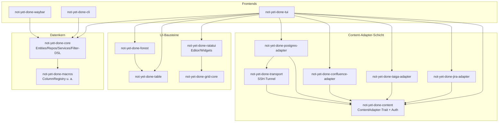

# Architektur

Überblick über die Crate-Struktur, die zentralen Datenflüsse und die
Verantwortlichkeiten der Komponenten von **not-yet-done** — einer
terminal-basierten Task- und Zeiterfassung mit TUI, CLI und
Waybar-Anbindung.

Dieses Dokument beschreibt den _Ist-Zustand_ und vor allem die
_Begründungen_ hinter den Schnitten. Gewichtige Einzel-Entscheidungen
liegen als ADRs unter [`docs/decisions/`](decisions/) (z. B.
[0001 — Render-Loop Dirty-Gating](decisions/0001-render-loop-dirty-gating.md)).

## Leitprinzipien

Diese Prinzipien (auch in der `CLAUDE.md` festgehalten) erklären, _warum_
die Crates so geschnitten sind:

- **Separation of Concerns** — jeder Tab/View besitzt seinen eigenen
  State. Shared State auf App-Ebene wird minimiert.
- **Open/Closed** — neue Tabs/Features sind hinzufügbar, ohne bestehenden
  Tab-Code zu ändern. Geteilte Fähigkeiten laufen über Traits.
- **Kapselung** — Views verwalten ihre Popups, Filter, Favoriten und
  Suche intern. Kommunikation mit der App nur über Message-/Request-Enums.
- **Adapter-Isolation** — Content-Backends (Jira, Taiga, Postgres,
  Confluence) hängen ausschließlich an `not-yet-done-content`, nie an
  `core` oder am TUI. Dadurch bleibt der Abhängigkeitsgraph azyklisch und
  ein neuer Adapter berührt keinen Kern-Code.

## Crate-Landschaft

Der Workspace teilt sich in vier Schichten: **Frontends** (was der Nutzer
startet), die **Content-Adapter-Schicht** (austauschbare Backends), die
**UI-Bausteine** (rendering-nahe Hilfs-Crates) und den **Datenkern**.

| Crate                               | Verantwortung                                                                    | Workspace-Deps                                      |
| ----------------------------------- | -------------------------------------------------------------------------------- | --------------------------------------------------- |
| **not-yet-done-core**               | DB, SeaORM-Entities, Repositories, Services, Filter-DSL, Config                  | macros                                              |
| **not-yet-done-tui**                | Terminal-UI: Event-Loop, Views, App-State                                        | core, content, alle Adapter, forest, table, ratatui |
| **not-yet-done-cli**                | CLI für Scripting/Automation                                                     | core                                                |
| **not-yet-done-waybar**             | Waybar-CFFI-Modul (aktives Tracking in der Statusbar)                            | core                                                |
| **not-yet-done-content**            | `ContentAdapter`-Trait + `Node`/`Content`-Abstraktion + Auth-Orchestrierung      | —                                                   |
| **not-yet-done-jira-adapter**       | Jira-Tickets als Content-Baum                                                    | content                                             |
| **not-yet-done-taiga-adapter**      | Taiga-Items als Content-Baum                                                     | content                                             |
| **not-yet-done-postgres-adapter**   | Postgres-DBs/Schemas/Tabellen/DB-Skripte als Content-Baum                        | content, transport                                  |
| **not-yet-done-confluence-adapter** | Confluence-Spaces/Pages/Kommentare/Attachments                                   | content                                             |
| **not-yet-done-transport**          | SSH-Tunnel-Support für Adapter (z. B. Postgres hinter Bastion)                   | content                                             |
| **not-yet-done-forest**             | Baum/Forest → flache Zeilenliste (Tree-Rendering)                                | table                                               |
| **not-yet-done-table**              | Spalten-Layout & Tabellen-Rendering-Primitive                                    | —                                                   |
| **not-yet-done-ratatui**            | Ratatui-Erweiterungen (Inline-Editor, Widgets)                                   | grid-core                                           |
| **not-yet-done-grid-core**          | Grid-Layout-Kern                                                                 | —                                                   |
| **not-yet-done-macros**             | Proc-Macros (`ColumnRegistry` etc.)                                              | —                                                   |
| **ratatui_form_widgets**            | Form-Widget-Komponenten (Workspace-Member, aktuell von keinem Crate eingebunden) | —                                                   |
| **grid-render-sim**                 | Render-Simulation/Testbett für Grid                                              | —                                                   |

## Datenkern (`not-yet-done-core`)

Der Kern ist frontend- und adapter-agnostisch — weder TUI noch CLI noch
Adapter sind ihm bekannt. Er stellt bereit:

- **Entities** (SeaORM): `Task`, `Project`, Tags (`GlobalTag` /
  `ProjectTag` plus Junctions), `Tracking`, `SavedQuery`, `QueryShortcut`,
  `Link`, `Settings`.
- **Repositories**: dünne, fokussierte DB-Zugriffsschicht pro Entity
  (`TaskRepository`, `TrackingRepository`, `TagRepository`,
  `SavedQueryRepository`, `QueryShortcutRepository`, `LinkRepository`,
  `SettingsRepository`).
- **Services**: höherwertige Operationen über mehrere Repos
  (`TaskService`, `TagService`, `BackupService` für den täglichen Backup
  beim Start).
- **Filter-DSL** (`filter/`): YAML-basierte Abfragesprache mit
  natürlichsprachlichen Datumsausdrücken. AST (`expr.rs`) → SeaORM-Query
  (`query_filter.rs`), inkl. baumspezifischer Operatoren (`tree_ops.rs`).

**Ablage:**

- DB (SQLite): `dirs::data_local_dir()/not_yet_done/nyd.db`
- Config (YAML): `dirs::config_dir()/not_yet_done/config.yaml`
- Override: Umgebungsvariable `DATABASE_URL`

Schema-Sync läuft beim Start automatisch; punktuelle Migrationen behandeln
Altdaten (z. B. Tag `color` → `fg_color` + `bg_color` + `symbol`).

> **Gotcha:** SeaORM-`Uuid`-PKs landen in SQLite als `BLOB(16)`, nicht als
> Text — ein manueller `TEXT`-Insert schlägt still beim Decode fehl.

## Content-Adapter-Schicht (`not-yet-done-content`)

Externe Backends werden über ein gemeinsames Trait-Paar als navigierbarer
**Baum aus `Node`s** abstrahiert. Das ist der Open/Closed-Hebel: jeder
neue Adapter implementiert nur diese Traits und wird im TUI per
Factory + YAML registriert — kein Kern-Code ändert sich.

### `ContentAdapter` (Adapter-Ebene)

- `root()` / `get_by_id(id)` — Einstieg bzw. Direktzugriff auf einen Knoten
- `list(params)` — Kinder mit Sort/Pagination
- `actions_for_type(node_type)` — welche Aktionen ein Knotentyp anbietet
  (synchron; speist die Shortcut-Hints in der Action-/Statusbar)
- `execute_custom_query(query, ctx)` — adapter-native Abfragen (z. B. SQL),
  inkl. Cursor-Pagination
- `search_in_tree(query, limit)` — serverseitige Baumsuche (z. B.
  Confluence CQL), liefert Treffer **mit Ancestor-Pfad** für lazy
  Expand-to-Hit
- `subscribe_status()` — `watch::Receiver<AdapterStatus>` für Live-Auth-/
  Verbindungsstatus (`Idle`/`Connecting`/`Ready`/`Busy`/`NeedsCreds`/`Failed`)
- `submit_credentials(fields)` / `try_refresh_session()` — interaktive bzw.
  stille Credential-Pflege
- `saved_query_store()` — adapter-eigene Persistenz gespeicherter Queries
- `child_process_env(node)` — Env-Variablen für Editor-/Skript-Kindprozesse

### `Node` / `Content` (Knoten-Ebene)

- `list(params)` — Kindknoten; `content()` — Lese-Body (für Preview/Detail)
- `list_subtree(params, depth)` — ganzer Teilbaum (`depth + 1` Ebenen) in
  **einem** Call. Default rekursiert über `list()` (ein Call pro Knoten);
  In-Memory-Adapter (Tasks, Trackings) überschreiben mit Snapshot-Walk ohne
  I/O. Engine-getrieben nur bei Capability `supports_eager_subtree` — ersetzt
  dann die O(N²)-Kaskade beim Initial-/Reload-Aufklappen. Siehe
  `docs/generic-view-spec.md` → Eager-Subtree.
- `actions()` — Aktionen dieses konkreten Knotens
- `invoke_action(name, ctx)` → `ActionDispatch` — Shortcut-getriebener
  Aktions-Dispatch, der eine UI-Flow-Absicht zurückgibt
- `prepare(action)` / `picker_options(action)` / `execute(action, input)` —
  der dreistufige Aktions-Flow (Editor-Buffer rendern bzw. Picker-Optionen
  liefern → Nutzereingabe → finalisieren)

Implementierungen: `jira-`, `taiga-`, `postgres-`, `confluence-`,
`stoat-adapter`.

### Streaming-Adapter (Gateway-Pattern)

Die meisten Adapter sind **Pull-only**: sie antworten synchron-via-`await`
auf `list()`/`get_by_id()`. Chat (Stoat, Fork von Revolt) bricht das Modell
und ist der erste **Streaming-Adapter** — Referenzmuster für künftige
Push-Backends:

- **Bootstrap ist push-only.** Die Server-/Channel-Liste gibt es _nur_ über
  das WebSocket-`Ready`-Event, nicht über REST. Ein
  **`StoatGateway`** (einzelner Hintergrund-Tokio-Task) ist die einzige
  Stelle mit WS-Logik: `connect → Authenticate → Ready → Event-Stream`,
  Heartbeat-Ping, Reconnect mit Backoff. `Ready` füllt **`StoatState`**
  (`Arc<RwLock>`, In-Memory-Source-of-Truth für den Baum) — bewusst
  **nicht** in SQLite gecacht (Chat-State ist hochvolatil; persistiert wird
  nur Session-Token + View-Sort).
- **`Node::list()` liest synchron aus `StoatState`** (kein Netz-`await` für
  die Baum-Struktur); Message-History bleibt REST-Pull (paginiert).
- **Status vereinheitlicht.** Der Adapter besitzt **einen** eigenen
  `watch<AdapterStatus>`-Kanal. Die Login-Phase wird aus dem
  `AuthOrchestrator` hineingeforwardet (dessen `Ready` wird unterdrückt),
  die Socket-Phase publiziert das Gateway (`Connecting`/`Ready`/`Failed`).
  So spiegelt das Banner Login **und** Verbindung Ende zu Ende.
- **Live-Push (Phase 2, umgesetzt).** Laufende WS-Events werden
  out-of-band als generische `Invalidation` in den `select!`-Loop
  gespeist — derselbe Mechanismus wie `subscribe_status`, nur „Knoten X
  ist stale" statt „Status geändert". Bausteine:
  - `Invalidation`-Enum + `ContentAdapter::subscribe_invalidations()` in
    `not-yet-done-content` (No-op-Default → Pull-only-Adapter bleiben
    unangetastet, Open/Closed). Rückgabe ist ein **`broadcast::Receiver`**
    (diskrete Events, nicht Latest-Value wie `watch`; eine Adapter-Instanz
    kann mehrere Views speisen).
  - Das Gateway pusht `Invalidation::Node{id: <channel>}` bei Message-/
    Reaction-Events und `Invalidation::All` bei jedem `Ready` (erster
    Connect **und** Reconnect-Resync).
  - Pro View spawnt die TUI neben dem Status-Watcher einen
    **Invalidation-Watcher**, der den Receiver in den **bestehenden**
    `load_tx`-Kanal umpumpt (`LoadMsg::AdapterInvalidation`). `poll_load`
    lädt die betroffenen Panes auf ihrem aktuellen Level neu (`All` → alle
    Panes; `Node{id}` → nur Panes, deren `parent_node_id` dieser Channel
    ist). Bei `Lagged` resynct der Watcher mit `All`.
  - Vorbedingung ist der event-getriebene Render-Loop (1b, siehe unten);
    Designdetails in ADR `0002`.
  - Grenze: **strukturelle** Live-Events (Channel/Server angelegt/gelöscht)
    sind noch nicht inkrementell auf `StoatState` angewendet — sie
    erscheinen erst nach einem Reconnect. Folgearbeit.

### Auth-Orchestrierung

Der `AuthOrchestrator` in `not-yet-done-content` entkoppelt Adapter von der
Credential-Beschaffung:

1. **Value-Provider** (literal, env, file, command, keyring) lösen
   synchron bei Bedarf auf.
2. **Prompt-Felder** werden zu einem `AdapterStatus::NeedsCreds`-Formular
   gebündelt, über den Status-Channel publiziert und warten auf
   `submit_credentials(...)` aus dem TUI.
3. Eine adapter-gelieferte **Login-Funktion** verbraucht die aufgelösten
   Credentials und liefert einen Session-Blob.
4. Ein **Session-Cache** (`SessionStore` + `SessionCachePolicy`)
   persistiert den Blob (TTL, Refresh-Token …).
5. Nebenläufige `ensure_session`-Aufrufe serialisieren über einen internen
   Mutex.

Dadurch ist die TUI nie blockiert: ein Adapter, der Credentials braucht,
meldet `NeedsCreds` über den Status-Channel; die UI öffnet das Formular,
ohne den Render-Loop zu stoppen.

## TUI (`not-yet-done-tui`)

### Render- und Event-Loop

`main.rs::run_loop` ist **event-getrieben und dirty-gated** (Variante 1b):
ein `tokio::select!` über die crossterm-`EventStream`, `load_rx`,
`commit_rx` und einen **bedingten** 200-ms-`interval` (nur armiert, solange
ein Editor/Skript pending ist, ein Busy-Banner läuft oder ein aktives
Tracking tickt — sonst parkt der Loop und Idle ist ~0 % CPU). Das Eintreffen
einer Message _ist_ das Redraw-Signal; `sync_components()` +
`terminal.draw()` laufen weiterhin nur, wenn diese Iteration etwas geändert
hat (`dirty`). Jede Änderungsquelle (`poll_*`/`tick_*`/`handle_*_msg`) meldet
per `bool`-Rückgabewert, ob sie sichtbaren State berührt hat. Das ist
zugleich die Vorbedingung für out-of-band Adapter-Invalidation
(Streaming-Adapter, oben). Begründung, Heikel-Punkte (`EventStream` ↔
Editor-Suspend) und Konsequenzen stehen in
[ADR 0001](decisions/0001-render-loop-dirty-gating.md).

### Nachrichten-/Request-Enums

Die Kommunikation zwischen Views und App läuft ausschließlich über Enums —
kein direkter Methodenzugriff über Tab-Grenzen, kein geteilter mutabler
State.

| Enum               | Ort                    | Rolle                                                                                                                  |
| ------------------ | ---------------------- | ---------------------------------------------------------------------------------------------------------------------- |
| **ViewRequest**    | `views/mod.rs`         | View → App: Editor öffnen, Service-Calls, Popups, Content laden, Drill-Down                                            |
| **SubViewMessage** | `views/mod.rs`         | Sub-View → Eltern-View: Hints, Selektion, Request-Weiterleitung                                                        |
| **LoadMsg**        | `app/mod.rs`           | async-Ergebnisse via `load_rx` (Content-Items, Preview, Aktions-Resultat, Adapter-Status, Tree-Children, Custom-Query) |
| **EditorRequest**  | `app/editor.rs`        | App → Editor-Dispatch: Inline / Launch / Script / None                                                                 |
| **CommitMsg**      | `app/editor.rs`        | Editor-Speicherergebnis via `commit_rx` (z. B. Reopen mit Konflikt-Buffer)                                             |
| **NodeAction**     | `not-yet-done-content` | adapter-deklarierte Aktion pro Knotentyp (Quelle der Shortcut-Hints)                                                   |

Async-Ergebnisse treffen über zwei `tokio::mpsc::Unbounded`-Channels ein:
`load_rx` (Adapter-Listen/Previews/Status) und `commit_rx`
(Editor-Commits). Beide werden im Loop pro Iteration gedrained — ihr
`recv()` ist zugleich der Enabler für den geplanten `select!`-Loop (ADR 0001).

### Views-Schicht

Drei View-Familien, jede besitzt ihren State selbst:

- **TasksView** (`tasks_view.rs`) — lokaler Task-Baum aus der Core-DB, mit
  List- und Tree-Sub-View; routet Tasten an den aktiven Sub-View.
  Tree-Expand/Collapse-State liegt isoliert in `TasksTreeState`.
- **TrackingsView** (`trackings_view.rs`) — Zeiterfassung; aktive Trackings
  mit live aktualisierter Dauer-Spalte (adaptives Tick-Intervall).
- **ContentView** (`content_view.rs`) — generischer, adapter-getriebener
  Baum-View, einer pro konfiguriertem Adapter. Pro Drill-Down-Kontext ein
  **ContentPane** mit eigenem `nav_stack`, `items`, Such-, Sort- und
  Pagination-State; Split-Panes verschalten mehrere Panes.

Tree-Darstellung läuft über `not-yet-done-forest` (verschachtelte Knoten →
flache Zeilenliste) auf Basis von `not-yet-done-table` (Spalten-Layout).

Die Tree-Ebene jeder Zeile (Spalten, Label-Spalte, Aktionen, Preview) wird
über die `node_type_chain` der Zeile aufgelöst, nicht über ihre Tiefe — so
rendern auch Multi-Branch-Bäume mit unterschiedlich tiefen Zweigen korrekt.
Die Label-Spalte wird einmal aus der Cursor-Ebene bestimmt; jede Zeile malt
ihr Label dorthin. Einzige (vom Validator erzwungene) Regel: `tree_label`
muss ein Spalten-Key der **eigenen** Ebene sein. Begründung und verworfene
Alternativen in
[ADR 0003](decisions/0003-tree-level-resolution-by-chain.md).

### Konfiguration

Views sind datengetrieben: pro View eine YAML-`ViewDef` mit rekursiven
`ChildDef`s (Knotentyp-Kette), Spalten, Aktions-Shortcuts und
Preview-Optionen. Theme/Farben kommen aus `ThemeConfig` + user-`tui.yaml`
— Farben werden nie hartkodiert. Details zum View-Format in
[`generic-view-spec.md`](generic-view-spec.md), zum Adapter-Vertrag in
[`content-adapter-spec.md`](content-adapter-spec.md).

## Frontends neben dem TUI

- **CLI** (`not-yet-done-cli`) — vollständige Kommandozeile über `core`,
  für Scripting/Automation; teilt DB und Config mit dem TUI.
- **Waybar** (`not-yet-done-waybar`) — CFFI-`.so`, zeigt das aktive
  Tracking in der Statusbar; liest dieselbe `core`-DB.

## Weiterführend

- [`decisions/`](decisions/) — ADRs (Kontext, Optionen, Entscheidung,
  Konsequenzen) für gewichtige Einzel-Entscheidungen.
- [`content-adapter-spec.md`](content-adapter-spec.md) — vollständiger
  Adapter-Vertrag.
- [`generic-view-spec.md`](generic-view-spec.md) — YAML-View-Format.
- [`smoke-tests.md`](smoke-tests.md) — manuelle Testszenarien.
