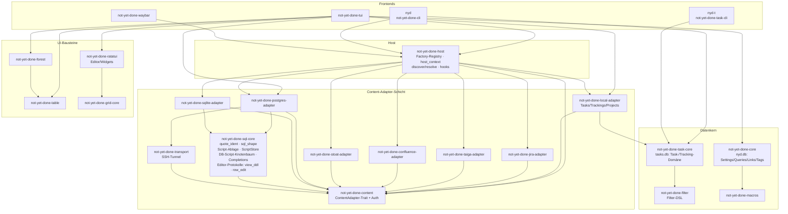

# Architektur

Überblick über die Crate-Struktur, die zentralen Datenflüsse und die
Verantwortlichkeiten der Komponenten von **not-yet-done** — einer
terminal-basierten Task- und Zeiterfassung mit TUI, CLI und
Waybar-Anbindung.

Dieses Dokument beschreibt den _Ist-Zustand_ und vor allem die
_Begründungen_ hinter den Schnitten. Gewichtige Einzel-Entscheidungen
liegen als ADRs unter [`docs/decisions/`](decisions/) (z. B.
[0001 — Render-Loop Dirty-Gating](decisions/0001-render-loop-dirty-gating.md)).

## Leitprinzipien

Diese Prinzipien (auch in der `CLAUDE.md` festgehalten) erklären, _warum_
die Crates so geschnitten sind:

- **Separation of Concerns** — jeder Tab/View besitzt seinen eigenen
  State. Shared State auf App-Ebene wird minimiert.
- **Open/Closed** — neue Tabs/Features sind hinzufügbar, ohne bestehenden
  Tab-Code zu ändern. Geteilte Fähigkeiten laufen über Traits.
- **Kapselung** — Views verwalten ihre Popups, Filter, Favoriten und
  Suche intern. Kommunikation mit der App nur über Message-/Request-Enums.
- **Adapter-Isolation** — Content-Backends (Jira, Taiga, Postgres,
  Confluence, Stoat, local) hängen ausschließlich an `not-yet-done-content`,
  nie am TUI. Dadurch bleibt der Abhängigkeitsgraph azyklisch und ein neuer
  Adapter berührt keinen Kern-Code.
- **Eine Adapter-Verdrahtung für alle Frontends** — `not-yet-done-host` ist die
  einzige Crate, die den Vertrag _und_ alle Adapter kennt. TUI, CLI (`nyd`) und
  Waybar bauen Adapter byte-gleich über `host::resolve_adapter`, statt die
  Factory-Auswahl zu duplizieren. Begründung in
  [ADR 0005](decisions/0005-host-crate-und-lifecycle-hooks.md).

## Crate-Landschaft

Der Workspace teilt sich in fünf Schichten: **Frontends** (was der Nutzer
startet), die **Host-Schicht** (eine Crate, die Adapter für alle Frontends
gleich baut), die **Content-Adapter-Schicht** (austauschbare Backends), die
**UI-Bausteine** (rendering-nahe Hilfs-Crates) und den **Datenkern**
(Legacy-`core` + die ausgelagerte Task-Domäne).



| Crate                               | Verantwortung                                                                                                                                                                                | Workspace-Deps                                                       |
| ----------------------------------- | -------------------------------------------------------------------------------------------------------------------------------------------------------------------------------------------- | -------------------------------------------------------------------- |
| **not-yet-done-core**               | Legacy-DB (`nyd.db`): Settings, Saved Queries, Links, Tags; Config                                                                                                                           | macros                                                               |
| **not-yet-done-task-core**          | Task-/Tracking-Domäne (`tasks.db`): Entities, Services, Bootstrap, Backup                                                                                                                    | filter                                                               |
| **not-yet-done-filter**             | Filter-DSL (YAML-Query-Sprache, AST → Query, Tree-Operatoren)                                                                                                                                | —                                                                    |
| **not-yet-done-host**               | Adapter-Verdrahtung für alle Frontends: Factory-Registry, `resolve_adapter`, Hooks                                                                                                           | content, alle Adapter                                                |
| **not-yet-done-tui**                | Terminal-UI: Event-Loop, Views, App-State                                                                                                                                                    | core, content, filter, host, local, postgres, forest, table, ratatui |
| **not-yet-done-cli** (`nyd`)        | Generisches Adapter-Frontend (CLI) + Built-ins `tag`/`backup`/`config`                                                                                                                       | host, content, core, task-core, filter                               |
| **not-yet-done-task-cli** (`nyd-t`) | Native Domänen-CLI für Tasks/Trackings (typed JSON, graded exit codes)                                                                                                                       | task-core                                                            |
| **not-yet-done-waybar**             | Waybar-CFFI-Modul (aktives Tracking in der Statusbar)                                                                                                                                        | content, host                                                        |
| **not-yet-done-content**            | `ContentAdapter`-Trait + `Node`/`Content`-Abstraktion + Auth-Orchestrierung                                                                                                                  | —                                                                    |
| **not-yet-done-local-adapter**      | Tasks/Trackings/Projects als ContentAdapter (über `task-core`)                                                                                                                               | content, task-core, filter                                           |
| **not-yet-done-jira-adapter**       | Jira-Tickets als Content-Baum                                                                                                                                                                | content                                                              |
| **not-yet-done-taiga-adapter**      | Taiga-Items als Content-Baum                                                                                                                                                                 | content                                                              |
| **not-yet-done-postgres-adapter**   | Postgres-DBs/Schemas/Tabellen/DB-Skripte als Content-Baum                                                                                                                                    | content, transport, sql-core                                         |
| **not-yet-done-sqlite-adapter**     | SQLite-Dateien (aus `sources:`-Globs)/Tabellen/Zeilen/DB-Skripte als Content-Baum                                                                                                            | content, sql-core                                                    |
| **not-yet-done-sql-core**           | Backend-neutrale SQL-Bausteine: Identifier-Quoting, SQL-Text-Sniffer, Script-Dateiablage, `ScriptStore`, DB-Script-Knotenbaum, Editor-Completions, Puffer-Protokolle für View-/Zeilen-Editor | content                                                              |
| **not-yet-done-confluence-adapter** | Confluence-Spaces/Pages/Kommentare/Attachments                                                                                                                                               | content                                                              |
| **not-yet-done-stoat-adapter**      | Chat (Stoat/Revolt-Fork) als Streaming-Content-Baum                                                                                                                                          | content                                                              |
| **not-yet-done-transport**          | SSH-Tunnel-Support für Adapter (z. B. Postgres hinter Bastion)                                                                                                                               | content                                                              |
| **not-yet-done-forest**             | Baum/Forest → flache Zeilenliste (Tree-Rendering)                                                                                                                                            | table                                                                |
| **not-yet-done-table**              | Spalten-Layout & Tabellen-Rendering-Primitive                                                                                                                                                | —                                                                    |
| **not-yet-done-ratatui**            | Ratatui-Erweiterungen (Inline-Editor, Widgets: TextInput/MultiChoice/Toggle + spec-getriebener Form-Treiber)                                                                                 | grid-core                                                            |
| **not-yet-done-grid-core**          | Grid-Layout-Kern                                                                                                                                                                             | —                                                                    |
| **not-yet-done-macros**             | Proc-Macros (`ColumnRegistry` etc.)                                                                                                                                                          | —                                                                    |
| **grid-render-sim**                 | Render-Simulation/Testbett für Grid                                                                                                                                                          | —                                                                    |

## Datenkern: `core` + `task-core` + `filter`

Der Datenkern wurde in Block C aufgeteilt. Die **Task-/Tracking-Domäne** liegt
nicht mehr in der Legacy-DB, sondern in einer eigenen `tasks.db`, betreut von
`not-yet-done-task-core`; `not-yet-done-core` behält nur noch die
TUI-Querschnitts-Daten (`nyd.db`); die Filter-DSL ist in `not-yet-done-filter`
ausgelagert, damit sowohl Domäne als auch Adapter sie ohne `core` nutzen können.
Begründung des Splits in
[`adapterize-tasks-trackings.md`](adapterize-tasks-trackings.md).

- **`not-yet-done-task-core` (`tasks.db`)** — die eigentliche Domäne: Entities
  (`Task`, `Tracking`, `Project`, Tags), Services, `bootstrap`
  (`default_task_dsn()`, `open_module()` — connect + Schema-Sync + DI) und das
  suffix-bewusste `backup`-Modul. _Eine_ Quelle der Wahrheit für DSN und
  Backup-Dir, die der local-Adapter (TUI) **und** `nyd-t` teilen. Default-DSN
  `<data-local>/not_yet_done/tasks.db`, Override `NYD_TASKS_DB`.
- **`not-yet-done-core` (`nyd.db`)** — frontend-agnostischer Legacy-Kern für
  Settings, Saved Queries, Query-Shortcuts, Links und (noch) globale Tags, plus
  `BackupServiceImpl` für den täglichen `nyd.db`-Backup beim Start. Ablage:
  `dirs::data_local_dir()/not_yet_done/nyd.db`, Config
  `dirs::config_dir()/not_yet_done/config.yaml`, Override `DATABASE_URL`.
- **`not-yet-done-filter`** — die YAML-Filter-DSL mit
  natürlichsprachlichen Datumsausdrücken: AST → Query inkl. baumspezifischer
  Operatoren. Keine Workspace-Deps; von `task-core`, `local-adapter`, `cli`
  und `tui` genutzt.

Schema-Sync läuft bei beiden DBs beim Start automatisch; punktuelle Migrationen
behandeln Altdaten (z. B. Tag `color` → `fg_color` + `bg_color` + `symbol`).

> **Gotcha:** SeaORM-`Uuid`-PKs landen in SQLite als `BLOB(16)`, nicht als
> Text — ein manueller `TEXT`-Insert schlägt still beim Decode fehl.

## Content-Adapter-Schicht (`not-yet-done-content`)

Externe Backends werden über ein gemeinsames Trait-Paar als navigierbarer
**Baum aus `Node`s** abstrahiert. Das ist der Open/Closed-Hebel: jeder
neue Adapter implementiert nur diese Traits und wird im TUI per
Factory + YAML registriert — kein Kern-Code ändert sich.

### `ContentAdapter` (Adapter-Ebene)

- `root()` / `get_by_id(id)` — Einstieg bzw. Direktzugriff auf einen Knoten
- `list(params)` — Kinder mit Sort/Pagination
- `actions_for_type(node_type)` — welche Aktionen ein Knotentyp anbietet
  (synchron; speist die Shortcut-Hints in der Action-/Statusbar)
- `execute_custom_query(query, ctx)` — adapter-native Abfragen (z. B. SQL),
  inkl. Cursor-Pagination
- `search_in_tree(query, limit)` — serverseitige Baumsuche (z. B.
  Confluence CQL), liefert Treffer **mit Ancestor-Pfad** für lazy
  Expand-to-Hit
- `locate_node_path(node_id)` — wo ein Knoten im Baum liegt, in derselben
  Pfadform wie ein Suchtreffer. Nur dafür da, einem **Link** in einen noch
  nicht aufgeklappten Subtree zu folgen; Default `Ok(None)` heißt „kann ich
  nicht", und kostet genau dieses Deep-Link-Verhalten, nichts weiter. Adapter
  mit `unstable_node_ids` (Postgres, SQLite — Zeilen-IDs sind Offsets in ein
  Result-Set) lassen den Default stehen, weil ihre IDs einen Link ohnehin
  nicht überleben. Tasks liefern die Ancestor-Kette aus dem Snapshot,
  Confluence eine Ein-Zeilen-CQL auf `id = <page>` — und teilt den
  Pfadbau mit `search_in_tree`, damit Link und Suche denselben Weg
  aufklappen.
- `subscribe_status()` — `watch::Receiver<AdapterStatus>` für Live-Auth-/
  Verbindungsstatus (`Idle`/`Connecting`/`Ready`/`Busy`/`NeedsCreds`/`Failed`)
- `submit_credentials(fields)` / `try_refresh_session()` — interaktive bzw.
  stille Credential-Pflege
- `saved_query_store()` — adapter-eigene Persistenz gespeicherter Queries
- `child_process_env(node)` — Env-Variablen für Editor-/Skript-Kindprozesse

### `Node` / `Content` (Knoten-Ebene)

- `list(params)` — Kindknoten; `content()` — Lese-Body (für Preview/Detail)
- `list_subtree(params, depth)` — ganzer Teilbaum (`depth + 1` Ebenen) in
  **einem** Call. Default rekursiert über `list()` (ein Call pro Knoten);
  In-Memory-Adapter (Tasks, Trackings) überschreiben mit Snapshot-Walk ohne
  I/O. Engine-getrieben nur bei Capability `supports_eager_subtree` — ersetzt
  dann die O(N²)-Kaskade beim Initial-/Reload-Aufklappen. Siehe
  `docs/generic-view-spec.md` → Eager-Subtree.
- `actions()` — Aktionen dieses konkreten Knotens
- `invoke_action(name, ctx)` → `ActionDispatch` — Shortcut-getriebener
  Aktions-Dispatch, der eine UI-Flow-Absicht zurückgibt
- `prepare(action)` / `picker_options(action)` / `execute(action, input)` —
  der dreistufige Aktions-Flow (Editor-Buffer rendern bzw. Picker-Optionen
  liefern → Nutzereingabe → finalisieren)

Implementierungen: `jira-`, `taiga-`, `postgres-`, `sqlite-`, `confluence-`,
`stoat-adapter`.

### SQL-Adapter (Postgres + SQLite)

Zwei Adapter sprechen SQL. Sie teilen **einen** Crate und **einen** Ast des
Baums — den Katalog-Ast baut jeder selbst:

- **`not-yet-done-sql-core`** hält, was von der Datenbank unabhängig ist:
  `quote_ident` (Doppelquote ist SQL-Standard, eine Impl reicht für beide),
  die reinen Text-Sniffer in `sql_shape` (ist das ein `SELECT`? mehrere
  Statements?), die Datei-Ablage der Skripte und die **komplette
  `ScriptStore`-Impl**. Adapterspezifisch bleibt allein die ID-Grammatik,
  hinter dem Trait **`NodeScriptLayout`**: der Adapter sagt, in welche
  Pfadsegmente eine Node-ID zerfällt, alles andere ist geteilt. Der Grund
  für den Schnitt: Ohne ihn wäre der zweite SQL-Adapter zu ~1100 Zeilen eine
  Kopie des ersten geworden.
- **Der Skript-Ast selbst ist geteilt, nicht nur seine Ablage.**
  `db_script_nodes` liefert ihn als fertige `Node`s: die drei Knotentypen
  (Gruppe/Ordner/Skript), ihre Actions samt Formular-Validierung, die
  Listings und die CRUD-Dispatches. Ein Adapter sagt nur noch, _wo_ der Ast
  hängt (`DatabaseNode::get_child("db_scripts")`) und _unter welchem Key_.
  Dass das geht, liegt am Host: die TUI keyt allein auf die **ID-Form**
  `<key>/db_scripts/<segmente…>`, nie auf Typ-IDs — ein weiterer SQL-Adapter
  braucht deshalb null TUI-Änderungen.
  - Die Typ-IDs tragen trotzdem ein Adapter-Präfix (`postgres:db_script`
    vs. `sqlite:db_script`), damit YAML-Views sie unterscheiden können. Das
    Präfix steht erst zur Laufzeit fest, `Node::node_type()` gibt aber
    `&NodeType` zurück — die Typen können also keine `static LazyLock` sein
    und liegen stattdessen im geteilten `Arc<DbScriptTree>`, das jeder Knoten
    des Astes hält. Nebeneffekt: ein `ScriptStore` pro Adapter-Instanz statt
    einer Neukonstruktion pro Action.
- **Editor-Completions teilen den Mechanismus, nicht die Namen.** Der
  Skript-Editor bekommt eine angehängte Kommentarzeile
  (`-- table completions: …`) mit einem kurzen Token pro Tabelle, die beim
  Speichern wieder verschwindet; beim Ausführen werden die Tokens expandiert.
  Backend-neutral ist daran alles außer der Frage, wie viele Ebenen einen
  Namen qualifizieren, und das erledigt ein einziger Helfer:
  `script_completions::qualified_table` liefert für zwei Teile
  `tt_public__users` → `"public"."users"`, für einen einstufig
  `tt_notes` → `"notes"`. Ein Adapter liefert nur die Liste. Ersetzt wird in
  **einem** Durchlauf über die Identifier-Läufe des Querys statt mit einer
  Regex pro Tabelle — das kostet bei 500 Tabellen
  nicht 500 Regex-Kompilate pro Ausführung, und eine Teil-Ersetzung
  (`tt_public__user` innerhalb von `tt_public__user_orders`) ist konstruktiv
  unmöglich.
- **Schreibende Editoren teilen das Puffer-Protokoll, nicht das SQL.** Zwei
  Dinge sind editierbar: die **View-Definition** (`E` → `edit_view`,
  `view_ddl`) und eine **Datenzeile** (`e` → `edit_row`, `row_edit`).
  Backend-neutral ist daran der ganze Ablauf: Puffer rendern (Kopfkommentar +
  Inhalt), Fehler-Banner setzen und beim nächsten Speichern wieder
  abschneiden, den Puffer parsen, gegen den Stand beim Öffnen diffen und das
  `UPDATE` bauen. Der Adapter liefert nur das Dialekt-Wissen — wie eine View
  ersetzt wird (SQLite: Drop + Create in _einer_ Transaktion; Postgres:
  `CREATE OR REPLACE`), und wodurch eine Zeile adressierbar ist (Primary Key,
  sonst SQLites impliziter `rowid` bzw. der schmalste Unique-Index über
  NOT-NULL-Spalten; `ctid` bewusst nicht, weil er bei jedem `UPDATE` wandert).
  - **Abgelehnt wird nie als Fehler**, sondern als `Reopen` mit dem eigenen
    Text plus Banner: der Puffer ist die einzige Kopie dessen, was der Nutzer
    getippt hat. Scheitert das Statement selbst, steht es **mit** im Banner —
    ein Typ- oder Constraint-Fehler ist mit dem `UPDATE` davor viel leichter
    zuzuordnen. Genau deshalb spleißt `build_update` Literale statt
    Platzhalter.
  - **Der Offset in einer Zeilen-ID adressiert nichts.** Row-IDs sind
    `unstable_node_ids`, der Offset ist nur, _wie_ die Zeile gefunden wurde.
    Was zählt, sind die beim Öffnen gelesenen Schlüssel- und Zellwerte; sie
    reisen im opaken `version`-Token der Edit-Session mit und sind es, was
    jedes spätere Statement benutzt. Eine Seite, die sich darunter
    verschiebt, kann das Schreiben deshalb nicht umlenken, und ein
    Zellwert-Vergleich erkennt eine fremde Änderung, statt sie stillschweigend
    zu überschreiben.
- **Die Katalog-Bäume unterscheiden sich bewusst**, weil die Backends sich
  unterscheiden. Postgres:
  `Datenbank → Schemas → Schema → Tables → Tabelle → Zeilen`. SQLite hat
  keinen Schema-Namensraum, also ist der Baum eine Ebene flacher:
  `Datei → Tables → Tabelle → Zeilen`.
- **Woher die Wurzelknoten kommen, ist der eigentliche Unterschied.**
  Postgres fragt den Server (`pg_database`) — es gibt nichts zu
  konfigurieren. Bei SQLite _ist_ eine Datenbank eine Datei, also gibt es
  keinen Katalog: `sources:` listet beliebig viele Glob-Patterns, und jede
  getroffene Datei wird ein Wurzelkind. Die Patterns werden bei jedem
  Reload neu gematcht, damit eine neu angelegte Datei ohne Neustart
  auftaucht.
- **Node-IDs müssen stabil sein** (sie landen in Skript-Pfaden auf Platte
  und in der `query_shortcut`-Tabelle), ein Dateipfad ist aber kein
  Pfadsegment. Deshalb identifiziert SQLite jede Quelle über
  `<sanitisierter stem>-<FNV-1a-Hash des absoluten Pfads>`: lesbar, ein
  einziges Segment, und kollisionsfrei zwischen `app/data.db` und
  `backup/data.db`.
- **Paginiert wird unterschiedlich, und die View sagt wie.** Postgres kann
  serverseitige Cursor (`pagination: mode: cursor`), SQLite nicht: die
  Datenbank ist eine lokale Datei, ein höherer `OFFSET` kostet einen
  Page-Scan statt eines Round-Trips, und ein offener Cursor würde nur eine
  Schreibsperre halten — der Adapter weist die Cursor-Absicht deshalb ab,
  statt sie vorzutäuschen (`mode: server`). Der Host liest den Modus **immer**
  aus dem `pagination:`-Block des Ergebnis-Panes, auch für die erste Seite;
  so entscheidet die Config und nicht eine Annahme über das Backend.

### Streaming-Adapter (Gateway-Pattern)

Die meisten Adapter sind **Pull-only**: sie antworten synchron-via-`await`
auf `list()`/`get_by_id()`. Chat (Stoat, Fork von Revolt) bricht das Modell
und ist der erste **Streaming-Adapter** — Referenzmuster für künftige
Push-Backends:

- **Bootstrap ist push-only.** Die Server-/Channel-Liste gibt es _nur_ über
  das WebSocket-`Ready`-Event, nicht über REST. Ein
  **`StoatGateway`** (einzelner Hintergrund-Tokio-Task) ist die einzige
  Stelle mit WS-Logik: `connect → Authenticate → Ready → Event-Stream`,
  Heartbeat-Ping, Reconnect mit Backoff. `Ready` füllt **`StoatState`**
  (`Arc<RwLock>`, In-Memory-Source-of-Truth für den Baum) — bewusst
  **nicht** in SQLite gecacht (Chat-State ist hochvolatil; persistiert wird
  nur Session-Token + View-Sort).
- **`Node::list()` liest synchron aus `StoatState`** (kein Netz-`await` für
  die Baum-Struktur); Message-History bleibt REST-Pull (paginiert).
- **Status vereinheitlicht.** Der Adapter besitzt **einen** eigenen
  `watch<AdapterStatus>`-Kanal. Die Login-Phase wird aus dem
  `AuthOrchestrator` hineingeforwardet (dessen `Ready` wird unterdrückt),
  die Socket-Phase publiziert das Gateway (`Connecting`/`Ready`/`Failed`).
  So spiegelt das Banner Login **und** Verbindung Ende zu Ende.
- **Live-Push (Phase 2, umgesetzt).** Laufende WS-Events werden
  out-of-band als generische `Invalidation` in den `select!`-Loop
  gespeist — derselbe Mechanismus wie `subscribe_status`, nur „Knoten X
  ist stale" statt „Status geändert". Bausteine:
  - `Invalidation`-Enum + `ContentAdapter::subscribe_invalidations()` in
    `not-yet-done-content` (No-op-Default → Pull-only-Adapter bleiben
    unangetastet, Open/Closed). Rückgabe ist ein **`broadcast::Receiver`**
    (diskrete Events, nicht Latest-Value wie `watch`; eine Adapter-Instanz
    kann mehrere Views speisen).
  - Das Gateway pusht `Invalidation::Node{id: <channel>}` bei Message-/
    Reaction-Events und `Invalidation::All` bei jedem `Ready` (erster
    Connect **und** Reconnect-Resync).
  - Pro View spawnt die TUI neben dem Status-Watcher einen
    **Invalidation-Watcher**, der den Receiver in den **bestehenden**
    `load_tx`-Kanal umpumpt (`LoadMsg::AdapterInvalidation`). `poll_load`
    lädt die betroffenen Panes auf ihrem aktuellen Level neu (`All` → alle
    Panes; `Node{id}` → nur Panes, deren `parent_node_id` dieser Channel
    ist). Bei `Lagged` resynct der Watcher mit `All`.
  - Vorbedingung ist der event-getriebene Render-Loop (1b, siehe unten);
    Designdetails in ADR `0002`.
  - Grenze: **strukturelle** Live-Events (Channel/Server angelegt/gelöscht)
    sind noch nicht inkrementell auf `StoatState` angewendet — sie
    erscheinen erst nach einem Reconnect. Folgearbeit.

### Auth-Orchestrierung

Der `AuthOrchestrator` in `not-yet-done-content` entkoppelt Adapter von der
Credential-Beschaffung:

1. **Value-Provider** (literal, env, file, command, keyring) lösen
   synchron bei Bedarf auf.
2. **Prompt-Felder** werden zu einem `AdapterStatus::NeedsCreds`-Formular
   gebündelt, über den Status-Channel publiziert und warten auf
   `submit_credentials(...)` aus dem TUI.
3. Eine adapter-gelieferte **Login-Funktion** verbraucht die aufgelösten
   Credentials und liefert einen Session-Blob.
4. Ein **Session-Cache** (`SessionStore` + `SessionCachePolicy`)
   persistiert den Blob (TTL, Refresh-Token …).
5. Nebenläufige `ensure_session`-Aufrufe serialisieren über einen internen
   Mutex.

Dadurch ist die TUI nie blockiert: ein Adapter, der Credentials braucht,
meldet `NeedsCreds` über den Status-Channel; die UI öffnet das Formular,
ohne den Render-Loop zu stoppen.

### Anonymisierung (`NYD_ANON`)

Für Screenshots/Screencasts gegen Produktiv-Instanzen liefert ein
**Dekorator im Content-Layer** plausible Fake-Daten statt echter Kunden-,
Ticket- und Personennamen — frontend-unabhängig und nicht vergessbar, weil
er am _einen_ Chokepoint `host::factories()` sitzt (siehe Host-Schicht).

- `ContentAdapter::anonymizer() -> Arc<dyn Anonymizer>` ist **Pflicht-Vertrag
  mit sicherem Default**: ohne Override greift der domänen-blinde, garantiert
  leckfreie `StandardAnonymizer` (ersetzt Freitext-Token durch neutrale
  Pool-Wörter, lässt Struktur — leer/numerisch/ISO-Datum/Dauer — durch).
  Domänen-Adapter überschreiben nur für _Realismus_, nie um erst sicher zu
  werden.
- `AnonymizingAdapter`/`AnonymizingNode` delegieren alles an den inneren
  Adapter und schieben nur die **anzeigbaren** Rückgaben durch
  `Anonymizer::scrub_value(key, value)`: Listenzeilen, Eager-Subtrees,
  `row_summary()`, Live-Tick-Zeilen, `metadata()` + `label()`, Picker-Labels,
  Tree-Such-Treffer. Baum-/Zeilen-**Labels** laufen über
  `scrub_label(node_type, label)` (Default = `scrub_value("label", …)`), damit
  Domänen-Adapter über den `NodeType` z. B. Postgres-Schema vs. -Tabelle bzw.
  Stoat-Server vs. -Channel unterscheiden und die _Art_ lesbar halten können
  (`big_schema`, `jolly_channel`). **RAW** bleiben `id()`/Pfade (Adressing) und
  editier-/exportierbare Bodies (`content`/`prepare`/`form_prep`/
  `picker_options`/Custom-Query/Batch-`downloaded`) — Anonymisierung ist eine
  reine Lese-Maske, der Store wird nie überschrieben.
- Konsistenz über `stable_hash(echter Name)`: gleicher Realwert → gleicher
  Fake, lauf- und versionsstabil; derselbe Task liest sich in allen Tabs
  identisch.

Details und Trade-offs in
[ADR 0006](decisions/0006-anonymisierung-content-layer.md).

## TUI (`not-yet-done-tui`)

### Render- und Event-Loop

`main.rs::run_loop` ist **event-getrieben und dirty-gated** (Variante 1b):
ein `tokio::select!` über die crossterm-`EventStream`, `load_rx`,
`commit_rx` und einen **bedingten** 200-ms-`interval` (nur armiert, solange
ein Editor/Skript pending ist, ein Busy-Banner läuft oder ein aktives
Tracking tickt — sonst parkt der Loop und Idle ist ~0 % CPU). Das Eintreffen
einer Message _ist_ das Redraw-Signal; `sync_components()` +
`terminal.draw()` laufen weiterhin nur, wenn diese Iteration etwas geändert
hat (`dirty`). Jede Änderungsquelle (`poll_*`/`tick_*`/`handle_*_msg`) meldet
per `bool`-Rückgabewert, ob sie sichtbaren State berührt hat. Das ist
zugleich die Vorbedingung für out-of-band Adapter-Invalidation
(Streaming-Adapter, oben). Begründung, Heikel-Punkte (`EventStream` ↔
Editor-Suspend) und Konsequenzen stehen in
[ADR 0001](decisions/0001-render-loop-dirty-gating.md).


### Nachrichten-/Request-Enums

Die Kommunikation zwischen Views und App läuft ausschließlich über Enums —
kein direkter Methodenzugriff über Tab-Grenzen, kein geteilter mutabler
State.


| Enum               | Ort                    | Rolle                                                                                                                  |
| ------------------ | ---------------------- | ---------------------------------------------------------------------------------------------------------------------- |
| **ViewRequest**    | `views/mod.rs`         | View → App: Editor öffnen, Service-Calls, Popups, Content laden, Drill-Down                                            |
| **SubViewMessage** | `views/mod.rs`         | Sub-View → Eltern-View: Hints, Selektion, Request-Weiterleitung                                                        |
| **LoadMsg**        | `app/mod.rs`           | async-Ergebnisse via `load_rx` (Content-Items, Preview, Aktions-Resultat, Adapter-Status, Tree-Children, Custom-Query) |
| **EditorRequest**  | `app/editor.rs`        | App → Editor-Dispatch: Inline / Launch / Script / None                                                                 |
| **CommitMsg**      | `app/editor.rs`        | Editor-Speicherergebnis via `commit_rx` (z. B. Reopen mit Konflikt-Buffer)                                             |
| **NodeAction**     | `not-yet-done-content` | adapter-deklarierte Aktion pro Knotentyp (Quelle der Shortcut-Hints)                                                   |

Async-Ergebnisse treffen über zwei `tokio::mpsc::Unbounded`-Channels ein:
`load_rx` (Adapter-Listen/Previews/Status) und `commit_rx`
(Editor-Commits). Beide werden im Loop pro Iteration gedrained — ihr
`recv()` ist zugleich der Enabler für den geplanten `select!`-Loop (ADR 0001).

### Views-Schicht

Eine einzige View-Familie, die ihren State selbst besitzt:

- **ContentView** (`content_view.rs`) — generischer, adapter-getriebener
  Baum-View, einer pro konfiguriertem Adapter. Pro Drill-Down-Kontext ein
  **ContentPane** mit eigenem `nav_stack`, `items`, Such-, Sort- und
  Pagination-State; Split-Panes verschalten mehrere Panes. Auch Tasks und
  Zeiterfassung (Trackings) laufen über ContentView — als adapter-getriebene
  Tabs mit live aktualisierter Dauer-Spalte (adaptives Tick-Intervall),
  nicht mehr als eigene View-Familie.

Tree-Darstellung läuft über `not-yet-done-forest` (verschachtelte Knoten →
flache Zeilenliste) auf Basis von `not-yet-done-table` (Spalten-Layout).

Die Tree-Ebene jeder Zeile (Spalten, Label-Spalte, Aktionen, Preview) wird
über die `node_type_chain` der Zeile aufgelöst, nicht über ihre Tiefe — so
rendern auch Multi-Branch-Bäume mit unterschiedlich tiefen Zweigen korrekt.
Die Label-Spalte wird einmal aus der Cursor-Ebene bestimmt; jede Zeile malt
ihr Label dorthin. Einzige (vom Validator erzwungene) Regel: `tree_label`
muss ein Spalten-Key der **eigenen** Ebene sein. Begründung und verworfene
Alternativen in
[ADR 0003](decisions/0003-tree-level-resolution-by-chain.md).

### Konfiguration

Views sind datengetrieben: pro View eine YAML-`ViewDef` mit rekursiven
`ChildDef`s (Knotentyp-Kette), Spalten, Aktions-Shortcuts und
Preview-Optionen. Theme/Farben kommen aus `ThemeConfig` + user-`tui.yaml`
— Farben werden nie hartkodiert. Details zum View-Format in
[`generic-view-spec.md`](generic-view-spec.md), zum Adapter-Vertrag in
[`content-adapter-spec.md`](content-adapter-spec.md).

## Host-Schicht (`not-yet-done-host`)

`host` ist die **einzige** Crate, die den `ContentAdapter`-Vertrag _und_ alle
konkreten Adapter-Crates kennt — die gemeinsame Adapter-Verdrahtung, die TUI,
`nyd` und Waybar teilen, damit jedes Frontend Adapter exakt gleich baut. Sie
exportiert:

- `factories()` / Factory-Registry — `adapter:`-Typ → Factory. Einen Adapter
  zum Produkt hinzufügen heißt: hier **einmal** eintragen; alle Frontends erben
  ihn.
- `host_context()` — baut den `HostContext` (In-Process-Event-Bus, Pfade).
- `discover_instances()` — liest die View-Files und parst je einen
  **`ViewFileHead`** (nur `adapter:` + optional `hooks:`; den Rest des
  View-Files geht den Host nichts an).
- `resolve_adapter(instance, ctx)` — Instanz → fertiger
  `Box<dyn ContentAdapter>`.

Vor Block D lebte diese Logik im TUI-Binary; CLI und Waybar konnten sie nicht
nutzen, ohne das ganze TUI zu ziehen. Die eigene Crate bricht das auf, hält den
Graph azyklisch (Frontends → `host` → Adapter → `content`) und behebt u. a. den
Waybar-Bug, der nach dem DB-Split die falsche DB las. Details in
[ADR 0005](decisions/0005-host-crate-und-lifecycle-hooks.md).

`factories()` ist zugleich der Chokepoint der **Anonymisierung**: ist
`NYD_ANON` truthy (ausgewertet in `host_context()` → `HostContext.anonymize`),
wird jede registrierte Factory in eine `AnonymizingFactory` gewickelt, deren
`create()` den gebauten Adapter dekoriert. So erben TUI, `nyd` und Waybar die
Anonymisierung ohne eigene Zeile Code; im Normalbetrieb (Flag aus) entsteht
kein Overhead. Siehe [ADR 0006](decisions/0006-anonymisierung-content-layer.md).

### Lifecycle-Hooks

Ein **Hook** ist ein benannter Punkt in der Lebenszeit eines Adapters, den eine
Frontend-Config zu einer Action-Invocation macht. Der Adapter _deklariert_ seine
Hook-Ids (`ContentAdapter::hooks()`, Default leer; der local-Adapter:
`["connected"]`, gefeuert direkt nach erfolgreichem Bau — beim In-Process-Adapter
also jeder Programmstart). Die Instanz-Config bindet pro Hook eine throttle-bare
Adapter-Action:

```yaml
hooks:
  connected:
    - run: backup # Adapter-Action-Id
      when: { throttle: 24h } # höchstens einmal pro Fenster (s/m/h/d)
```

Der Host feuert Hooks aus jedem Frontend — `fire_hook` gegen einen schon
gebauten Adapter (CLI, direkt nach `resolve_adapter`), `fire_connected_hooks`
beim TUI-Start (prüft den Throttle _vor_ dem Adapter-Bau, sodass ein Launch im
Fenster nichts konstruiert). Der Throttle-Zustand liegt in einer host-globalen,
adapter-unabhängigen Datei `~/.local/state/not_yet_done/hooks.json`
(`"<instanz>:<hook>:<action>"` → letzter Fire). So wird das frühere hartkodierte
tägliche `tasks.db`-Backup ein bloßer Spezialfall: `backup` an `connected` mit
24 h Throttle — frontend-übergreifend, sodass auch reine `nyd`-Nutzung das
tägliche Backup auslöst. Best-effort: schlechte Config, unbekannter Hook,
scheiternde Action oder unschreibbares State-File brechen den Aufrufer nie ab.

## Frontends neben dem TUI

- **`nyd`** (`not-yet-done-cli`) — generisches Frontend über das
  `ContentAdapter`-Protokoll: `nyd <instanz> <verb>` spricht jeden
  konfigurierten Adapter gleich an (baut ihn über `host::resolve_adapter`).
  Terse Alltagsformen sind Aliase (`cli.yaml`); `tag`/`backup`/`config` bleiben
  Built-ins.
- **`nyd-t`** (`not-yet-done-task-cli`) — native Domänen-CLI direkt auf
  `task-core`, mit typisiertem, domänengeformtem JSON und abgestuften
  Exit-Codes (Stabilkontrakt für Batch-Scripts). Adapter sind Interop-Grenzen,
  `nyd-t` ist die eigene Domäne in ihrem Idiom — siehe
  [ADR 0004](decisions/0004-zwei-cli-binaries-adapter-vs-domain.md).
- **Waybar** (`not-yet-done-waybar`) — CFFI-`.so`, zeigt das aktive Tracking in
  der Statusbar. Dünnes Protokoll-Frontend: löst über den Host denselben
  In-Process-`trackings`-Adapter auf wie TUI und `nyd` (statt selbst die DB zu
  öffnen) und liest damit die adapter-konfigurierte `tasks.db`, nicht mehr die
  `core`-DB.

## Weiterführend

- [`decisions/`](decisions/) — ADRs (Kontext, Optionen, Entscheidung,
  Konsequenzen) für gewichtige Einzel-Entscheidungen.
- [`content-adapter-spec.md`](content-adapter-spec.md) — vollständiger
  Adapter-Vertrag.
- [`generic-view-spec.md`](generic-view-spec.md) — YAML-View-Format.
- [`smoke-tests.md`](smoke-tests.md) — manuelle Testszenarien.
