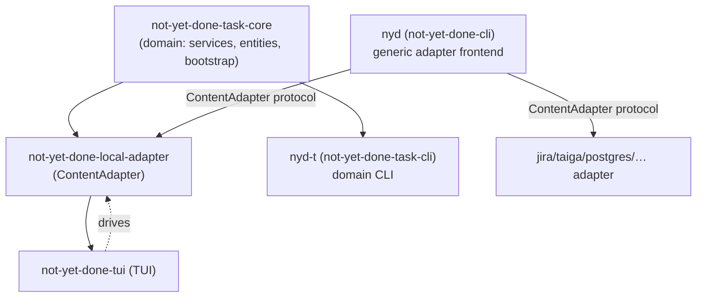

# 0004 — Two CLI binaries: `nyd` (adapter frontend) vs. `nyd-t` (domain CLI)

- **Status:** superseded by
  [0012](0012-one-interface-the-adapter-protocol.md) — the reasons for a
  second binary were measured and did not hold; scripts address the domain
  through the adapter protocol, and `nyd-t` is no longer installed. The
  core-side decisions below (`default_task_dsn`, `open_module`, backups
  against `tasks.db`) remain in force.
- **Date:** 2026-06-21
- **Affects:** `not-yet-done-cli` (`nyd`), the new `not-yet-done-task-cli`
  (`nyd-t`), `not-yet-done-task-core` (`bootstrap::open_module`,
  `bootstrap::default_task_dsn`), `not-yet-done-core`
  (`BackupServiceImpl::{create,restore}_backup_at`),
  `not-yet-done-local-adapter` (`default_task_dsn` re-export)

## Context

Over the course of block D the CLI was rebuilt into a **generic frontend
over the `ContentAdapter` protocol** (D2/D3): `nyd <instance> <verb>`
addresses every configured adapter the same way (tasks, trackings, Jira,
Taiga, Postgres, …). The hard-coded domain commands
(`task`/`project`/`track`/`query`/`db sync`) went away; the terse forms
became aliases over the generic verbs.

Reviewing the user scripts made it clear that this view went too far.
Several Python scripts (daily report, hour totals, "goto task" from
Jira/Taiga) need **domain-shaped** JSON:

- `track export --sort-by-started-at asc <ids>` → a list of
  `{tracking:{…}, task:{…}}` (a tracking with its task embedded).
- `task tree <id>` → the nested hierarchy `{id, description,
last_tracked_at, children:[…]}`.
- `task show --path …` → resolving a path with **graded exit codes**
  (4 = not found, 5 = ambiguous) that the goto scripts branch on.

The generic adapter protocol fundamentally cannot reproduce that: it
returns uniform `NodeSummary`/field projections, not domain-specific join
JSON, and the generic `finish()` path collapses every error onto exit
code 1.

The real mistake was conceptual: **adapters are interop boundaries** —
interfaces for putting _foreign_ systems (Jira, Confluence, Postgres)
behind one uniform protocol. They are not a domain API for our _own_ data.
Addressing tasks and trackings through the adapter protocol from the CLI
would mean squeezing our own domain through a lowest-common-denominator
interface merely because the same interface also serves foreign systems.

## Options

1. **Extend the adapter protocol** — actions taking arguments that return
   domain-shaped JSON (`do export …`). That bends the generic protocol for
   one special case; every new domain-specific output inflates the shared
   contract. Graded exit codes would remain unsolved.
2. **A separate domain CLI on a shared core.** `not-yet-done-task-core`
   stays the domain; both the in-process adapters (TUI) and a new
   standalone CLI include it and address it **each in its own idiom**. The
   CLI emits typed, domain-shaped JSON and controls its own exit codes.
3. **Status quo, rewrite the scripts** — force the scripts onto the
   generic protocol and exit code 1. That loses the exit code logic and the
   join JSON, and pushes domain logic into every script.

## Decision

**Option 2.** A new binary `nyd-t` (crate `not-yet-done-task-cli`), sitting
directly on `not-yet-done-task-core`. `nyd-t` owns the full native domain
(tasks, trackings, projects, tags, DB schema, backups); `nyd` stays
**unchanged** as the generic adapter frontend for foreign systems.

A shared core, two consumers:

Accompanying decisions that follow from the architecture:

- **Choosing the database belongs in the core.** After the DB split
  (block C) tasks and trackings live in their own `tasks.db`, no longer in
  the legacy core DB (`nyd.db`). The default DSN
  (`<data-local>/not_yet_done/tasks.db`) moves into
  `not-yet-done-task-core` as `bootstrap::default_task_dsn()` — the _one_
  source of truth for the adapter **and** `nyd-t`. `nyd-t` opens that
  database through the new `bootstrap::open_module()` (connect + schema
  sync + DI module); `bootstrap::open()` builds on top of it. Override it
  with `NYD_TASKS_DB`. **`nyd-t` deliberately does not read** the core
  config's `database.url` (= `nyd.db`) the way the old `nyd` did — that one
  points at the wrong, empty legacy database.
- **Backups target the task DB.** `BackupServiceImpl` gains
  `create_backup_at(db_url)`/`restore_backup_at(db_url, …)`; the existing
  trait methods delegate with the core config's database (for the daily TUI
  backup), and `nyd-t backup` passes its `tasks.db`. That way `nyd-t` backs
  up _its own_ domain, not the legacy database.

## Consequences

- The user scripts work unchanged again after a pure repointing
  (`not-yet-done-cli` → `nyd-t`): the join JSON and the graded exit codes
  are back.
- A clear separation: `nyd` = foreign systems over the generic protocol,
  `nyd-t` = our own domain in its natural idiom. New domain-specific
  outputs no longer weigh on the generic adapter contract.
- `tag` and `backup` exist in **both** binaries for now. In `nyd` they are
  historical built-ins over the legacy core DB; in `nyd-t` they are part of
  the domain and target `tasks.db`. A later cleanup round can remove the
  `nyd` variants once nothing points at them any more.
- **Test isolation is critical:** because `nyd-t` falls back to the _real_
  `tasks.db` without `NYD_TASKS_DB`, the integration test harness **must**
  point `NYD_TASKS_DB` at a temporary database. Otherwise tests mutate live
  data.
