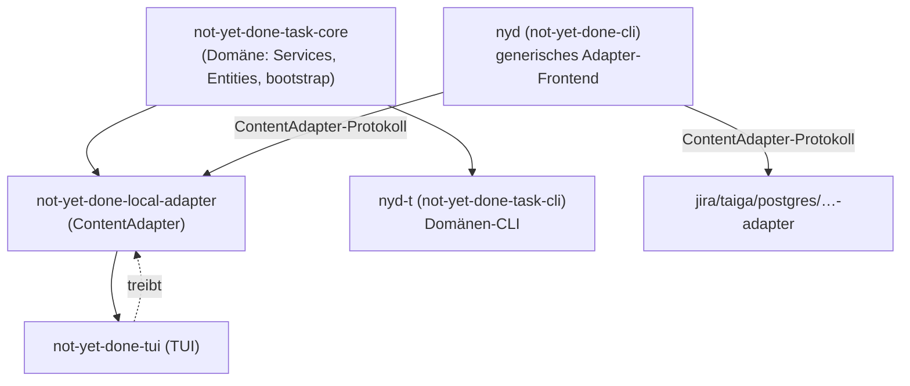

# 0004 — Zwei CLI-Binaries: `nyd` (Adapter-Frontend) vs. `nyd-t` (Domänen-CLI)

- **Status:** akzeptiert, umgesetzt
- **Datum:** 2026-06-21
- **Betrifft:** `not-yet-done-cli` (`nyd`), neues `not-yet-done-task-cli`
  (`nyd-t`), `not-yet-done-task-core` (`bootstrap::open_module`,
  `bootstrap::default_task_dsn`), `not-yet-done-core`
  (`BackupServiceImpl::{create,restore}_backup_at`),
  `not-yet-done-local-adapter` (`default_task_dsn` re-export)

## Kontext

Im Zuge von Block D wurde die CLI zu einem **generischen Frontend über das
`ContentAdapter`-Protokoll** umgebaut (D2/D3): `nyd <instanz> <verb>` spricht
jeden konfigurierten Adapter gleich an (tasks, trackings, Jira, Taiga,
Postgres, …). Die hart kodierten Domänen-Kommandos (`task`/`project`/`track`/
`query`/`db sync`) fielen weg; terse Formen wurden Aliase über die generischen
Verben.

Beim Prüfen der Nutzer-Scripts fiel auf, dass diese Sicht zu weit ging.
Mehrere Python-Scripts (Tagesreport, Stundenstände, „goto task" aus Jira/Taiga)
brauchen **domänengeformtes** JSON:

- `track export --sort-by-started-at asc <ids>` → Liste aus
  `{tracking:{…}, task:{…}}` (Tracking mit eingebettetem Task).
- `task tree <id>` → verschachtelte Hierarchie `{id, description,
last_tracked_at, children:[…]}`.
- `task show --path …` → Auflösung eines Pfads mit **abgestuften Exit-Codes**
  (4 = nicht gefunden, 5 = mehrdeutig), auf die die goto-Scripts verzweigen.

Das generische Adapter-Protokoll kann das prinzipiell nicht reproduzieren: es
liefert uniforme `NodeSummary`/Feld-Projektionen, kein domänenspezifisches
Join-JSON, und der generische `finish()`-Pfad kollabiert alle Fehler auf
Exit-Code 1.

Der eigentliche Denkfehler war konzeptionell: **Adapter sind
Interop-Grenzen** — Schnittstellen, um _fremde_ Systeme (Jira, Confluence,
Postgres) hinter ein einheitliches Protokoll zu bringen. Sie sind keine
Domänen-API für unsere _eigenen_ Daten. Tasks/Trackings über das
Adapter-Protokoll als CLI anzusprechen, hieße, die eigene Domäne durch eine
Lowest-Common-Denominator-Schnittstelle zu pressen, nur weil dieselbe
Schnittstelle auch fremde Systeme bedient.

## Optionen

1. **Adapter-Protokoll erweitern** — Actions mit Argumenten, die
   domänengeformtes JSON zurückgeben (`do export …`). Verbiegt das generische
   Protokoll für einen Einzelfall; jeder neue domänenspezifische Output bläht
   den gemeinsamen Vertrag auf. Exit-Code-Abstufung bliebe ungelöst.
2. **Separate Domänen-CLI auf gemeinsamem Core.** `not-yet-done-task-core`
   bleibt die Domäne; sowohl die In-Process-Adapter (TUI) als auch eine neue
   eigenständige CLi inkludieren ihn und sprechen ihn **je in ihrem eigenen
   Idiom** an. Die CLI gibt getyptes, domänengeformtes JSON aus und steuert
   ihre Exit-Codes selbst.
3. **Status quo + Scripts umschreiben** — die Scripts auf das generische
   Protokoll und Exit-Code 1 zwingen. Verliert die Exit-Code-Logik und das
   Join-JSON; verschiebt Domänenlogik in jedes Script.

## Entscheidung

**Option 2.** Neues Binary `nyd-t` (Crate `not-yet-done-task-cli`), direkt auf
`not-yet-done-task-core`. `nyd-t` besitzt die volle native Domäne (Tasks,
Trackings, Projekte, Tags, DB-Schema, Backups); `nyd` bleibt **unverändert**
das generische Adapter-Frontend für Fremdsysteme.

Geteilter Core, zwei Consumer:

Begleit-Entscheidungen, die aus der Architektur folgen:

- **DB-Auswahl gehört in den Core.** Nach dem DB-Split (Block C) liegen
  Tasks/Trackings in einer eigenen `tasks.db`, nicht mehr in der Legacy-Core-DB
  (`nyd.db`). Der Default-DSN (`<data-local>/not_yet_done/tasks.db`) wandert als
  `bootstrap::default_task_dsn()` in `not-yet-done-task-core` — die _eine_
  Quelle der Wahrheit für Adapter **und** `nyd-t`. `nyd-t` öffnet diese DB über
  den neuen `bootstrap::open_module()` (connect + Schema-Sync + DI-Modul);
  `bootstrap::open()` baut darauf auf. Override per `NYD_TASKS_DB`. **`nyd-t`
  liest bewusst nicht** die Core-Config `database.url` (= `nyd.db`), wie es das
  alte `nyd` tat — die zeigt auf die falsche, leere Legacy-DB.
- **Backup zielt auf die Task-DB.** `BackupServiceImpl` bekommt
  `create_backup_at(db_url)`/`restore_backup_at(db_url, …)`; die bestehenden
  Trait-Methoden delegieren mit der Core-Config-DB (für den täglichen
  TUI-Backup), `nyd-t backup` übergibt seine `tasks.db`. So sichert `nyd-t`
  _seine eigene_ Domäne, nicht die Legacy-DB.

## Konsequenzen

- Die Nutzer-Scripts funktionieren nach reinem Repointing
  (`not-yet-done-cli` → `nyd-t`) wieder unverändert: das Join-JSON und die
  Exit-Code-Abstufung sind zurück.
- Klare Trennung: `nyd` = Fremdsysteme über das generische Protokoll, `nyd-t` =
  eigene Domäne in ihrem natürlichen Idiom. Neue domänenspezifische Outputs
  belasten den generischen Adapter-Vertrag nicht mehr.
- `tag` und `backup` existieren vorerst in **beiden** Binaries. In `nyd` sind
  sie historische Built-ins über die Legacy-Core-DB; in `nyd-t` sind sie Teil
  der Domäne und zielen auf `tasks.db`. Eine spätere Aufräum-Runde kann die
  `nyd`-Varianten entfernen, sobald nichts mehr darauf zeigt.
- **Test-Isolation ist kritisch:** weil `nyd-t` ohne `NYD_TASKS_DB` auf die
  _echte_ `tasks.db` zurückfällt, **muss** das Integrationstest-Harness
  `NYD_TASKS_DB` auf eine Temp-DB setzen. Andernfalls mutieren Tests die
  Live-Daten.
