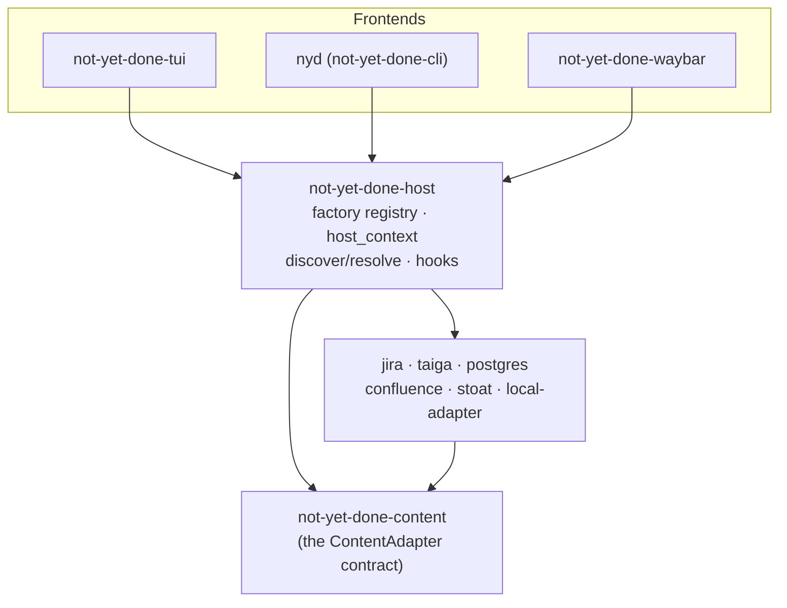

# 0005 — A host crate as the shared adapter wiring + lifecycle hooks

- **Status:** accepted, implemented
- **Date:** 2026-06-22
- **Affects:** the new `not-yet-done-host` (factory registry, `host_context`,
  `resolve_adapter`, `discover_instances`, the `hooks` module),
  `not-yet-done-cli` (`nyd`), `not-yet-done-waybar`, `not-yet-done-tui`,
  `not-yet-done-content` (`ContentAdapter::hooks`),
  `not-yet-done-local-adapter` (the `backup` action, `hooks()`)
- **Builds on:** [0004 — Two CLI binaries](0004-two-cli-binaries-adapter-vs-domain.md)
  (the `nyd`/`nyd-t` split; this ADR adds the _shared_ foundation
  underneath `nyd` + TUI + Waybar).

## Context

Block D turns **several frontends** into thin protocol clients over the same
`ContentAdapter` contract: the TUI, the generic CLI (`nyd`) and the Waybar
module. For "every frontend speaks to the adapter exactly like the TUI does"
to be true at all, all three have to build an adapter **identically**:

- discover the configured instances from the user's view configs
  (`~/.config/not_yet_done/views/*.yaml`),
- pick the right factory per instance (jira/taiga/postgres/confluence/
  stoat/local) and hand it the `config` block plus a `HostContext`
  (event bus, paths),
- return the result as a `Box<dyn ContentAdapter>`.

Before D1 that wiring lived **inside the TUI binary crate**. The CLI and
Waybar could not reuse it without pulling in the whole TUI (ratatui,
tuirealm, core, …) — so Waybar opened the database itself (and after the DB
split read the _wrong_ one, see below) and the CLI would have had to
duplicate the factory selection.

Second, there was a **hard-coded lifecycle effect**: on TUI startup
`main.rs` created a `tasks.db` backup once per day. As a concept that is
right (one backup on first use each day), but as a hard-coded call it sat in
the wrong place — it coupled a frontend to the backup logic of one specific
domain, ran only in the TUI (not if you spent days using only `nyd`), and
was not reusable for any other instance, action or cadence.

## Options

### A — adapter wiring

1. **Leave it in the TUI, duplicate it in CLI/Waybar.** Every frontend
   builds adapters itself. Guaranteed to drift apart (DSN and default
   drift) — that is exactly what made Waybar read the wrong database.
2. **A separate crate `not-yet-done-host`** that pulls in only `content`
   plus the adapter crates and exports the factory registry,
   `host_context()` and `resolve_adapter()`. The TUI, CLI and Waybar depend
   on `host` instead of on each other.
3. **Put it into `content`.** That blurs the boundary: `content` is the
   pure _contract_ and should not know any concrete adapter crate
   (otherwise there is a cycle risk, and every consumer of the contract
   would pull in all adapters).

### B — lifecycle effects (backup &c.)

1. **Status quo** — leave it hard-coded in the TUI. Does not run from the
   CLI, cannot be generalized.
2. **A declarative hook subsystem.** An adapter _declares_ named lifecycle
   points (`ContentAdapter::hooks()`); the instance config binds a
   throttleable adapter **action** (`run` + `on`/`with`/`when`) per hook.
   The host fires them — from any frontend. Backup becomes a special case:
   `backup` on `connected` with `throttle: 24h`.
3. **Shell hooks** (arbitrary commands per event). More powerful, but a new
   trust/quoting/portability surface, and the action we want (backup)
   already exists as an adapter action — a second, process-based execution
   path would be duplication.

## Decision

**A2 + B2.**

### `not-yet-done-host` — the one adapter wiring

`host` is the only crate that knows `content` **and** every adapter crate.
It exports:

- `factories()` / the factory registry — an instance's `adapter:` type →
  factory. Adding an adapter to the product = registering it here (and in
  the registry) **once**; every frontend inherits it.
- `host_context()` — builds the `HostContext` (in-process event bus,
  paths).
- `discover_instances()` — reads the view files, parses one
  **`ViewFileHead`** from each (only `adapter:` plus an optional `hooks:`;
  the rest of the view file is none of the frontend's business) and returns
  `DiscoveredInstance`s.
- `resolve_adapter(instance, ctx)` — instance → a finished
  `Box<dyn ContentAdapter>`.

The dependency graph stays acyclic: frontends → `host` → adapters →
`content`. `content` knows no concrete adapter crate.

### Lifecycle hooks — config instead of hard code

- `ContentAdapter::hooks() -> Vec<&str>` declares an adapter's hook IDs
  (default `[]`). The local adapter (tasks/trackings) declares
  `["connected"]`, fired right after the factory has built the adapter —
  which for the in-process adapter means **every program start** (a TUI
  launch or any `nyd <instance> …`).
- The instance config carries a top-level block
  `hooks: { <hook-id>: [ { run, on, with, when } ] }`. Each binding calls an
  adapter **action** (`run`), optionally on a target node (`on: {id}` /
  `on: {query}`, otherwise the root), with inputs (`with: {value,text}`),
  and can be throttled (`when: {throttle: 24h}`, units `s/m/h/d`).
- The **throttle state** is a host-global JSON file
  `~/.local/state/not_yet_done/hooks.json` (XDG state dir), independent of
  the adapter and shared across frontends: the key
  `"<instance>:<hook>:<action>"` → the last fire time. A binding without a
  `throttle` fires every time and is never stamped.
- Two entry points, depending on how the frontend builds adapters:
  - `fire_hook(adapter, instance, hook)` — against an **already built**
    adapter (the CLI calls this right after `resolve_adapter`, reusing the
    adapter it built for the command anyway).
  - `fire_connected_hooks()` — the startup helper for the TUI: it checks
    the throttle **before** building the adapter, so that inside the
    throttle window **no** adapter is constructed (otherwise every launch
    would pay for a pointless database open). Only instances with a due
    binding are resolved and fired.
- Best effort along the whole chain: broken config, an unknown hook name, a
  failing action or an unwritable state file never abort the caller —
  errors go to stderr (prefixed `nyd-hooks:`).

That **replaces** the hard-coded daily backup: `ensure_daily_task_backup` is
gone, and the shipped `tasks.yaml` binds `backup` → `connected` with
`throttle: 24h`. With that, `host` also loses its last
`not-yet-done-task-core` dependency — backup is now purely an adapter
action, no longer a domain call in the host.

## Consequences

- **One source of truth for building adapters.** The TUI, `nyd` and Waybar
  build adapters byte for byte the same way. Among other things that fixes
  the Waybar bug where, after the DB split, it still read the legacy
  `nyd.db` instead of `tasks.db` (D6).
- **Auto-backup now runs across frontends.** Someone who only uses `nyd`
  for days still gets their daily `tasks.db` backup — the throttle file is
  shared no matter which frontend fires first.
- **Generic instead of a one-off.** Any adapter can hang any of its actions
  on `connected` (or on future hook IDs), at any cadence, without a change
  to frontend code. New lifecycle points only require an adapter to declare
  them in `hooks()` and the host to fire them at the right seam.
- **No shell layer.** Hooks call the declarative action triple, not
  arbitrary commands — no new quoting or trust surface. Anyone wanting a
  shell command on an event still uses the TUI's `:script` paths; hooks are
  for adapter actions.
- **The top-level `hooks:` block is harmless for the TUI.** The TUI parses
  the _whole_ view file (`ViewFileConfig`), but without
  `deny_unknown_fields` at the top level — the extra key is simply ignored
  there, while the host reads only `adapter:` + `hooks:`.
- **The throttle state is a pure cache.** If it is missing or corrupt, the
  rule is "never fired" → the hook fires once and stamps anew. No data
  loss, at most one extra backup.
