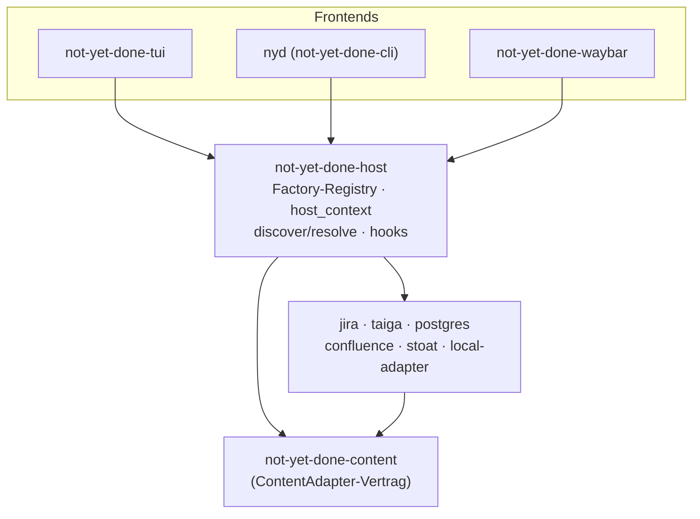

# 0005 — Host-Crate als gemeinsame Adapter-Verdrahtung + Lifecycle-Hooks

- **Status:** akzeptiert, umgesetzt
- **Datum:** 2026-06-22
- **Betrifft:** neues `not-yet-done-host` (Factory-Registry, `host_context`,
  `resolve_adapter`, `discover_instances`, `hooks`-Modul),
  `not-yet-done-cli` (`nyd`), `not-yet-done-waybar`, `not-yet-done-tui`,
  `not-yet-done-content` (`ContentAdapter::hooks`),
  `not-yet-done-local-adapter` (`backup`-Action, `hooks()`)
- **Baut auf:** [0004 — Zwei CLI-Binaries](0004-zwei-cli-binaries-adapter-vs-domain.md)
  (die `nyd`/`nyd-t`-Trennung; dieses ADR ergänzt das _gemeinsame_ Fundament
  unter `nyd` + TUI + Waybar).

## Kontext

Block D macht **mehrere Frontends** zu dünnen Protokoll-Clients über denselben
`ContentAdapter`-Vertrag: das TUI, die generische CLI (`nyd`) und das
Waybar-Modul. Damit „spricht jedes Frontend den Adapter genau wie das TUI"
überhaupt stimmt, müssen alle drei einen Adapter **identisch** bauen:

- aus den User-View-Configs (`~/.config/not_yet_done/views/*.yaml`) die
  konfigurierten Instanzen entdecken,
- pro Instanz die richtige Factory wählen (jira/taiga/postgres/confluence/
  stoat/local) und ihr den `config`-Block + einen `HostContext`
  (Event-Bus, Pfade) übergeben,
- das Ergebnis als `Box<dyn ContentAdapter>` zurückgeben.

Vor D1 lebte diese Verdrahtung **im TUI-Binary-Crate**. CLI und Waybar konnten
sie nicht wiederverwenden, ohne das ganze TUI (ratatui, tuirealm, core …) zu
ziehen — also öffnete Waybar die DB selbst (und las nach dem DB-Split die
_falsche_ DB, siehe unten) und die CLI hätte die Factory-Auswahl duplizieren
müssen.

Zweitens gab es einen **hartkodierten Lebenszyklus-Effekt**: beim TUI-Start
legte `main.rs` einmal täglich ein `tasks.db`-Backup an. Das ist als Konzept
richtig (eine Sicherung bei erster Nutzung pro Tag), aber als hartkodierter
Aufruf falsch verortet — es koppelte ein Frontend an die Backup-Logik einer
bestimmten Domäne, lief nur im TUI (nicht wenn man tagelang nur `nyd` nutzt),
und war für keine andere Instanz/Aktion/Kadenz wiederverwendbar.

## Optionen

### A — Adapter-Verdrahtung

1. **Im TUI lassen, in CLI/Waybar duplizieren.** Jedes Frontend baut Adapter
   selbst. Bricht garantiert auseinander (DSN-/Default-Drift), genau das hat
   Waybar die falsche DB lesen lassen.
2. **Eigene Crate `not-yet-done-host`**, die nur `content` + die Adapter-Crates
   zieht und die Factory-Registry, `host_context()` und `resolve_adapter()`
   exportiert. TUI, CLI und Waybar hängen an `host` statt aneinander.
3. **In `content` packen.** Verwischt die Grenze: `content` ist der reine
   _Vertrag_, soll keine konkreten Adapter-Crates kennen (sonst Zyklus-Gefahr,
   und jeder Vertrags-Consumer zöge alle Adapter).

### B — Lebenszyklus-Effekte (Backup &c.)

1. **Status quo** — hartkodiert im TUI lassen. Läuft nicht aus der CLI,
   nicht generalisierbar.
2. **Deklaratives Hook-Subsystem.** Ein Adapter _deklariert_ benannte
   Lebenszyklus-Punkte (`ContentAdapter::hooks()`); die Instanz-Config bindet
   pro Hook eine throttle-bare Adapter-**Action** (`run` + `on`/`with`/`when`).
   Der Host feuert sie — aus jedem Frontend. Backup wird ein Spezialfall:
   `backup` an `connected` mit `throttle: 24h`.
3. **Shell-Hooks** (beliebige Kommandos pro Event). Mächtiger, aber neue
   Vertrauens-/Quoting-/Portabilitäts-Oberfläche, und die Aktion, die wir
   wollen (Backup), existiert bereits als Adapter-Action — eine zweite,
   prozess-basierte Ausführungsschiene wäre Doppelung.

## Entscheidung

**A2 + B2.**

### `not-yet-done-host` — die eine Adapter-Verdrahtung

`host` ist die einzige Crate, die `content` **und** alle Adapter-Crates kennt.
Sie exportiert:

- `factories()` / Factory-Registry — Instanz-`adapter:`-Typ → Factory.
  Einen Adapter zum Produkt hinzufügen = hier (und in der Registry) **einmal**
  eintragen; alle Frontends erben ihn.
- `host_context()` — baut den `HostContext` (In-Process-Event-Bus, Pfade).
- `discover_instances()` — liest die View-Files, parst je einen
  **`ViewFileHead`** (nur `adapter:` + optional `hooks:`, der Rest des
  View-Files geht das Frontend nichts an) und liefert `DiscoveredInstance`s.
- `resolve_adapter(instance, ctx)` — Instanz → fertiger
  `Box<dyn ContentAdapter>`.

Der Abhängigkeitsgraph bleibt azyklisch: Frontends → `host` → Adapter →
`content`. `content` kennt keine konkrete Adapter-Crate.

### Lifecycle-Hooks — Config statt hartem Code

- `ContentAdapter::hooks() -> Vec<&str>` deklariert die Hook-Ids eines
  Adapters (Default `[]`). Der local-Adapter (Tasks/Trackings) deklariert
  `["connected"]`, gefeuert direkt nachdem die Factory den Adapter gebaut hat
  — beim In-Process-Adapter also **jeder Programmstart** (TUI-Launch oder
  jedes `nyd <instanz> …`).
- Die Instanz-Config trägt einen Top-Level-Block
  `hooks: { <hook-id>: [ { run, on, with, when } ] }`. Jede Bindung ruft eine
  Adapter-**Action** (`run`), optional auf einem Ziel-Knoten (`on: {id}` /
  `on: {query}`, sonst Wurzel), mit Inputs (`with: {value,text}`), throttle-bar
  (`when: {throttle: 24h}`, Einheiten `s/m/h/d`).
- **Throttle-State** ist eine host-globale JSON-Datei
  `~/.local/state/not_yet_done/hooks.json` (XDG-State-Dir), adapter-unabhängig
  und über Frontends geteilt: Key `"<instanz>:<hook>:<action>"` → letzter
  Fire-Zeitpunkt. Eine Bindung ohne `throttle` feuert jedes Mal und wird nie
  gestempelt.
- Zwei Einstiegspunkte, je nach wie das Frontend Adapter baut:
  - `fire_hook(adapter, instance, hook)` — gegen einen **schon gebauten**
    Adapter (die CLI ruft das direkt nach `resolve_adapter`, nutzt den Adapter
    der ohnehin für das Kommando gebaut wurde wieder).
  - `fire_connected_hooks()` — der Startup-Helfer fürs TUI: prüft den Throttle
    **vor** dem Adapter-Bau, sodass im Throttle-Fenster **kein** Adapter
    konstruiert wird (sonst zahlte jeder Launch einen unnötigen DB-Open). Nur
    Instanzen mit fälliger Bindung werden aufgelöst und gefeuert.
- Best-effort über die ganze Kette: kaputte Config, unbekannter Hook-Name,
  scheiternde Action oder unschreibbares State-File brechen den Aufrufer nie
  ab — Fehler gehen nach stderr (Präfix `nyd-hooks:`).

Das **ersetzt** das hartkodierte Daily-Backup: `ensure_daily_task_backup`
entfällt, das ausgelieferte `tasks.yaml` bindet `backup` → `connected` mit
`throttle: 24h`. Damit verliert `host` zugleich seine letzte
`not-yet-done-task-core`-Abhängigkeit — Backup ist jetzt rein eine
Adapter-Action, kein Domänen-Aufruf im Host mehr.

## Konsequenzen

- **Eine Quelle der Wahrheit fürs Adapter-Bauen.** TUI, `nyd` und Waybar bauen
  Adapter byte-gleich. Das fixt u. a. den Waybar-Bug, der nach dem DB-Split
  noch die Legacy-`nyd.db` statt der `tasks.db` las (D6).
- **Auto-Backup läuft jetzt frontend-übergreifend.** Wer tagelang nur `nyd`
  nutzt, bekommt trotzdem sein tägliches `tasks.db`-Backup — die Throttle-Datei
  ist geteilt, egal welches Frontend zuerst feuert.
- **Generisch statt Einzelfall.** Jeder Adapter kann jede seiner Actions an
  `connected` (oder künftige Hook-Ids) hängen, mit beliebiger Kadenz, ohne
  Frontend-Code-Änderung. Neue Lebenszyklus-Punkte erfordern nur, dass ein
  Adapter sie in `hooks()` deklariert und der Host sie an der passenden Naht
  feuert.
- **Keine Shell-Schicht.** Hooks rufen das deklarative Action-Triple, keine
  beliebigen Kommandos — keine neue Quoting-/Vertrauens-Oberfläche. Wer ein
  Shell-Kommando bei einem Ereignis will, nutzt weiterhin die `:script`-Wege
  des TUI; Hooks sind für Adapter-Actions.
- **Der Top-Level-`hooks:`-Block ist für das TUI unschädlich.** Das TUI parst
  das _ganze_ View-File (`ViewFileConfig`), aber ohne `deny_unknown_fields` auf
  der obersten Ebene — der zusätzliche Schlüssel wird dort schlicht ignoriert,
  während der Host nur `adapter:` + `hooks:` liest.
- **Throttle-State ist reiner Cache.** Fehlt/zerstört, gilt „nie gefeuert" → der
  Hook feuert einmal und stempelt neu. Kein Datenverlust, nur evtl. ein
  zusätzliches Backup.
