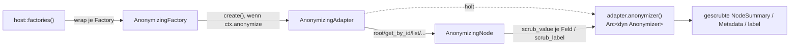

# 0006 — Anonymisierung als Content-Layer-Dekorator (`NYD_ANON`)

- **Status:** akzeptiert, umgesetzt
- **Datum:** 2026-06-23
- **Betrifft:** `not-yet-done-content` (neues `anonymize`-Modul: `Anonymizer`-Trait
  inkl. `scrub_label(node_type, label)`, `StandardAnonymizer`, Factory-/Adapter-/
  Node-Dekoratoren, geteilte Helper inkl. `pseudo_labeled`;
  `ContentAdapter::anonymizer()`, `HostContext.anonymize`),
  `not-yet-done-host` (`factories()`-Wrap, `NYD_ANON`-Auswertung),
  `not-yet-done-local-adapter` (`LocalAnonymizer` für Tasks/Trackings/Projects),
  `not-yet-done-jira-adapter` / `-taiga-adapter` / `-confluence-adapter`
  / `-postgres-adapter` / `-stoat-adapter` (Realismus-`Anonymizer`)
- **Baut auf:** [0005 — Host-Crate + Lifecycle-Hooks](0005-host-crate-und-lifecycle-hooks.md)
  (die `factories()`-Registry, an der der Dekorator ansetzt).

## Kontext

Die App läuft im Alltag gegen **Produktiv-Instanzen** (echte Jira-/Taiga-/
Confluence-Backends, die reale Task-/Tracking-DB). Für Screenshots und
Screencasts zur Produktvorstellung dürfen dort keine echten Kunden-, Ticket-
oder Personennamen auftauchen.

Der Wunsch: ein Schalter, der **alle** Adapter dazu bringt, vor der Ausgabe an
das Frontend plausible Fake-Daten zu liefern — und zwar so, dass sie noch „echt"
aussehen (eine Jira-Ticketnummer bleibt ticketnummern-förmig, ein Tracking-Zeit
bleibt real). Der Adapter kennt seine Domäne am besten und kann am sinnvollsten
faken; gleichzeitig darf das **nie** vom Frontend abhängen (sonst wäre nur das
TUI geschützt, nicht `nyd`/Waybar) und nie „vergessen" werden können.

## Optionen

### A — Wo sitzt die Anonymisierung?

1. **Pro Frontend** (das TUI scrubt vor dem Rendern). Müsste in TUI, CLI und
   Waybar **dreifach** implementiert werden, kann in jedem einzeln vergessen
   werden, und alles, was nicht durch genau diese Render-Pfade geht, leakt.
2. **Im Content-Layer als Adapter-Dekorator**, injiziert am _einen_
   Chokepoint `host::factories()`: jede Factory wird umhüllt, ihr `create()`
   wickelt den gebauten Adapter — wenn `HostContext.anonymize` gesetzt ist — in
   einen `AnonymizingAdapter`. Da **alle** Frontends ihre Factory-Map von dort
   beziehen (ADR 0005), erben TUI/CLI/Waybar die Anonymisierung ohne eigene
   Zeile Code.
3. **Im Kern / in der Render-Engine.** Die Engine sieht nur generische
   `NodeSummary`/`Metadata` und kennt die _Bedeutung_ der Spalten nicht — sie
   kann eine Ticketnummer nicht von Freitext unterscheiden, also weder sicher
   noch realistisch faken.

### B — Pflicht oder Opt-in?

1. **Capability / Opt-in:** ein Adapter meldet „ich kann anonymisieren"; wer es
   nicht meldet, gibt Rohdaten aus. Ein neuer oder fremder Adapter, der das
   vergisst, **leakt** — das ist genau das Gegenteil von dem, was ein
   Privacy-Feature leisten muss.
2. **Vertrag mit sicherem Default:** `ContentAdapter::anonymizer()` liefert
   per Default einen domänen-blinden, aber **immer sicheren**
   `StandardAnonymizer`. Domänen-Adapter überschreiben die Methode nur, um die
   Ausgabe _realistischer_ zu machen — nie, um überhaupt erst sicher zu werden.

### C — Wie bleibt eine Fake-Identität konsistent?

Derselbe Task erscheint im Tasks-Baum, in der `task`-Spalte eines Trackings und
in dessen `taskpath` — er muss überall **denselben** Pseudo-Namen tragen.

1. **Keying auf der DB-id.** Tasks und Trackings referenzieren denselben Namen
   über verschiedene ids (Task-id vs. Tracking-id) → würde auseinanderlaufen.
2. **Keying auf dem Hash des echten Namen-Strings.** Gleicher Name → gleicher
   Listenplatz → gleicher Fake, automatisch und über Läufe hinweg stabil
   (eigener `stable_hash`, kein `std`-`DefaultHasher`, dessen Stabilität die
   Standardbibliothek ausdrücklich nicht garantiert).

## Entscheidung

**A2 + B2 + C2.**

### Der Dekorator und sein Chokepoint

`host::factories()` umhüllt jede registrierte Factory in eine
`AnonymizingFactory`. `host_context()` liest `NYD_ANON` (truthy: `1`/`true`/
`yes`/`on`) in `HostContext.anonymize`. Nur wenn das Flag gesetzt ist, wickelt
`create()` den Adapter in den Dekorator — sonst gibt es den Adapter unverändert
zurück (Null-Overhead im Normalbetrieb).

`AnonymizingAdapter` und `AnonymizingNode` delegieren **alles** an den inneren
Adapter und schieben nur die _anzeigbaren_ Rückgaben durch dessen
`Anonymizer::scrub_value(key, value)`: Listenzeilen, Eager-Subtrees, die
Post-Edit-Row-Projektion (`row_summary()`), Live-Tick-Zeilen, Detail-Felder
(`metadata()`) + `label()`, Value-Picker-Labels und Tree-Such-Treffer
(Titel + `space_key`).

Für **Baum-/Zeilen-Labels** gibt es daneben `scrub_label(node_type, label)`. Ein
Label kommt immer mit `key = "label"`, der `scrub_value` also keinen Hinweis gäbe,
ob es ein Postgres-_Schema_, eine _Tabelle_ oder ein Discord-_Channel_ ist. Über
den `NodeType` kann ein Domänen-Anonymizer das unterscheiden und ein Label so
faken, dass die _Art_ des Knotens lesbar bleibt (`big_schema`, `nifty_channel`).
Der Default delegiert auf `scrub_value("label", …)` — Adapter ohne Override sind
damit unverändert.

**Bewusst NICHT gescrubt:**

- `id()` und `TreeFindHit::path` — internes Adressing; ein gescrubtes id bräche
  Navigation, `get_by_id` und Lazy-Expand.
- editierbare/exportierbare Bodies und deren Prefill (`content()`, `prepare()`,
  `form_prep()`, `picker_options()`-Werte, Batch-`downloaded`-Knoten,
  Custom-Query-Ergebnisse) — diese speisen den **Schreib-/Export**-Pfad. Würde
  man einen Body faken, den der Nutzer dann speichert, überschriebe der
  Platzhalter die echten Daten. Anonymisierung ist eine reine
  **Lese-/Anzeige**-Maske; der Store bleibt unangetastet. (Konsequenz: beim
  Screenshot keinen offenen Editor / keine Body-Preview einer echten Zeile
  zeigen — die Zeilen dahinter sind sauber, der offene Body nicht.)

Zahlen, Dauern und Zeitstempel bleiben **wörtlich** erhalten — bei einem
Time-Tracker sind die echten Dauern ja der Sinn des Screenshots.

### Der sichere Default: `StandardAnonymizer`

Der Pflicht-Fallback ist domänen-blind, aber garantiert leckfrei: er ersetzt
jedes Freitext-Token durch ein festes neutrales Pool-Wort (token-gekeyt, also
konsistent) und lässt strukturelle Werte (leer, numerisch, ISO-Datum, Dauer)
unverändert. Er _kann_ eine Jira-Nummer nicht wie eine Nummer aussehen lassen,
aber er leakt nie — und genau das ist die Aufgabe eines Defaults.

### Domänen-Anonymizer (nur Realismus)

- **Local (Tasks/Trackings/Projects):** ein `LocalAnonymizer` bildet Task-Namen
  (`label`/`ancestors`/Tracking-`task`/jedes `taskpath`-Segment) über eine
  geteilte, erfundene Task-Namen-Liste ab — dank C2-Keying liest derselbe Task
  in allen Tabs identisch. Projekte nutzen eine eigene Firmennamen-Liste.
  Strukturelle Spalten (Marker, Status, Daten, Dauern, ids) laufen durch;
  unbekannte Spalten fallen auf den `StandardAnonymizer` zurück.
- **Jira/Taiga/Confluence:** format-erhaltende Realismus-Overrides über geteilte
  Helper in `content::anonymize` (`pseudo_person`/`-username`/`-email`,
  `pseudo_project_code`, `pseudo_issue_key`, `pseudo_ref`, `pseudo_filename`).
  Ein Issue-Key bleibt key-förmig (`PREFIX-123` → `ACME-123`), ein Taiga-Ref
  ref-förmig (`slug#12` → `code#12`), ein Confluence-Space-Key code-förmig;
  Personen bleiben Namen, Dateinamen behalten ihre Endung. Der Jira-**Status**
  wird auf einen festen, generischen Pool (`To Do`/`In Progress`/`In Review`/
  `Blocked`/`Done`/`Backlog`) abgebildet statt wörtlich durchgereicht — ein
  angepasster Workflow-Status kann einen Kunden-/Projektbegriff tragen. `type`/
  `priority` bleiben wörtlich (Standard-Enums). Jeder nicht aufgezählte Key fällt
  auf den `StandardAnonymizer` zurück.
- **Postgres/Stoat:** `scrub_label`-Overrides nach `node_type`, die echte Namen
  über den geteilten Helper `pseudo_labeled(value, noun)` in ein
  `<adjektiv>_<nomen>`-Schema bringen — `big_database`, `nifty_schema`,
  `mellow_table`, `swift_server`, `jolly_channel`. So bleibt im Screenshot lesbar
  _was_ ein Knoten ist, ohne den echten Namen. Strukturelle Container bleiben
  **wörtlich** („Schemas", „Tables", „DB Scripts", `db_script_dir`-Ordner,
  Stoat-Root); Postgres-Zeilenzellen und Stoat-Message-Bodies laufen über den
  sicheren Standard-Scrub, Message-Autoren über `pseudo_person`. Das Adjektiv ist
  wert-gekeyt (C2), also trägt dieselbe Quelle stabil dasselbe Adjektiv.

Alle Pools sind englisch und vollständig erfunden (`PERSON_POOL`, `CODE_POOL`,
`WORD_POOL`, `ADJ_POOL`) — sie liegen im Repo und dürfen nie reale Begriffe
enthalten.

## Konsequenzen

- **Frontend-unabhängig und nicht vergessbar.** Ein einziger Wrap in
  `factories()` schützt TUI, `nyd` und Waybar gleichermaßen; ein neues Frontend
  erbt es automatisch.
- **Sicher per Default.** Ein neuer Adapter — oder bloß eine neue Spalte in
  einem bestehenden — leakt nie: ohne Override greift der `StandardAnonymizer`,
  schlimmstenfalls steht statt eines Klartexts ein neutrales Pool-Wort.
  Realismus ist das Opt-in, Sicherheit der Default.
- **Reine Anzeige-Maske.** Der Datenspeicher bleibt unberührt; Schreib-/
  Export-Pfade führen Rohdaten. Beim Screenshot daher keinen offenen Editor /
  keine Roh-Preview zeigen (siehe oben).
- **Deterministisch und konsistent.** Gleicher Realwert → gleicher Fake, im
  selben Lauf und morgen wieder; derselbe Task/Person/Space trägt überall
  denselben Pseudo-Wert. Ein erneut aufgenommener Screencast bleibt stimmig.
- **Repo-sicher.** Alle Lookup-Pools und Test-Fixtures sind vollständig
  erfundene Strings — keine realen Kunden-/Personen-/Projekt-Begriffe im Repo.
- **Bewusste Grenze.** Struktur, Zahlen und Zeiten bleiben echt (gewollt). Das
  Feature schützt vor Klartext-Leaks von Namen/Keys, nicht vor Korrelation über
  Baumform oder Zeitverteilung. Es ist für den Screenshot-/Demo-Zweck gedacht,
  nicht als Datenschutz-Garantie gegenüber einem Angreifer mit der echten DB.
- **Genau ein Schalter.** `NYD_ANON=1` an der `host_context()`-Naht; sonst Null
  Overhead. Siehe `README` → Anonymisierung.
