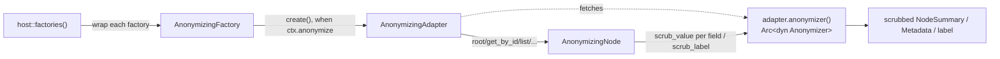

# 0006 — Anonymization as a content-layer decorator (`NYD_ANON`)

- **Status:** accepted, implemented
- **Date:** 2026-06-23
- **Affects:** `not-yet-done-content` (the new `anonymize` module: the
  `Anonymizer` trait including `scrub_label(node_type, label)`,
  `StandardAnonymizer`, factory/adapter/node decorators, shared helpers
  including `pseudo_labeled`; `ContentAdapter::anonymizer()`,
  `HostContext.anonymize`),
  `not-yet-done-host` (wrapping `factories()`, evaluating `NYD_ANON`),
  `not-yet-done-local-adapter` (`LocalAnonymizer` for tasks/trackings/projects),
  `not-yet-done-jira-adapter` / `-taiga-adapter` / `-confluence-adapter`
  / `-postgres-adapter` / `-stoat-adapter` (realism `Anonymizer`s)
- **Builds on:** [0005 — Host crate + lifecycle hooks](0005-host-crate-and-lifecycle-hooks.md)
  (the `factories()` registry the decorator hooks into).

## Context

Day to day the app runs against **production instances** (real Jira, Taiga
and Confluence backends, the real task/tracking database). Screenshots and
screencasts for presenting the product must not show any real customer,
ticket or person names.

What we want: a switch that makes **every** adapter emit plausible fake data
before it reaches the frontend — and do it so the result still looks "real"
(a Jira ticket number stays ticket-number-shaped, a tracked duration stays
real). The adapter knows its own domain best and can fake most sensibly; at
the same time this must **never** depend on the frontend (otherwise only the
TUI would be protected, not `nyd`/Waybar) and must never be forgettable.

## Options

### A — where does the anonymization live?

1. **Per frontend** (the TUI scrubs before rendering). It would have to be
   implemented **three times** across TUI, CLI and Waybar, can be forgotten
   in each of them individually, and anything not going through exactly
   those render paths leaks.
2. **In the content layer as an adapter decorator**, injected at the _one_
   chokepoint `host::factories()`: every factory is wrapped, and its
   `create()` wraps the built adapter — when `HostContext.anonymize` is set
   — into an `AnonymizingAdapter`. Since **all** frontends get their factory
   map from there (ADR 0005), the TUI, CLI and Waybar inherit the
   anonymization without a line of their own.
3. **In the core / the render engine.** The engine only sees generic
   `NodeSummary`/`Metadata` and does not know the _meaning_ of the columns —
   it cannot tell a ticket number from free text, so it can fake neither
   safely nor realistically.

### B — mandatory or opt-in?

1. **Capability / opt-in:** an adapter announces "I can anonymize"; whoever
   does not announce it emits raw data. A new or third-party adapter that
   forgets **leaks** — exactly the opposite of what a privacy feature has to
   deliver.
2. **A contract with a safe default:** `ContentAdapter::anonymizer()`
   returns, by default, a domain-blind but **always safe**
   `StandardAnonymizer`. Domain adapters override the method only to make
   the output _more realistic_ — never to become safe in the first place.

### C — how does a fake identity stay consistent?

The same task shows up in the tasks tree, in the `task` column of a tracking
and in that tracking's `taskpath` — it has to carry **the same** pseudonym
everywhere.

1. **Keying on the database ID.** Tasks and trackings reference the same
   name through different IDs (task ID vs. tracking ID) → they would drift
   apart.
2. **Keying on a hash of the real name string.** Same name → same slot in
   the list → same fake, automatically and stably across runs (our own
   `stable_hash`, not `std`'s `DefaultHasher`, whose stability the standard
   library explicitly does not guarantee).

## Decision

**A2 + B2 + C2.**

### The decorator and its chokepoint

`host::factories()` wraps every registered factory into an
`AnonymizingFactory`. `host_context()` reads `NYD_ANON` (truthy: `1`/`true`/
`yes`/`on`) into `HostContext.anonymize`. Only when the flag is set does
`create()` wrap the adapter into the decorator — otherwise it returns the
adapter unchanged (zero overhead in normal operation).

`AnonymizingAdapter` and `AnonymizingNode` delegate **everything** to the
inner adapter and only push the _displayable_ return values through its
`Anonymizer::scrub_value(key, value)`: list rows, eager subtrees, the
post-edit row projection (`row_summary()`), live tick rows, detail fields
(`metadata()`) and `label()`, value picker labels and tree search hits
(title and `space_key`).

For **tree and row labels** there is `scrub_label(node_type, label)` on top
of that. A label always arrives with `key = "label"`, which would give
`scrub_value` no hint whether it is a Postgres _schema_, a _table_ or a
Discord _channel_. Through the `NodeType` a domain anonymizer can tell them
apart and fake a label so that the _kind_ of node stays readable
(`big_schema`, `nifty_channel`). The default delegates to
`scrub_value("label", …)` — adapters without an override are therefore
unaffected.

**Deliberately NOT scrubbed:**

- `id()` and `TreeFindHit::path` — internal addressing; a scrubbed ID would
  break navigation, `get_by_id` and lazy expansion.
- editable/exportable bodies and their prefill (`content()`, `prepare()`,
  `form_prep()`, `picker_options()` values, batch `downloaded` nodes, custom
  query results) — these feed the **write/export** path. Faking a body that
  the user then saves would overwrite the real data with the placeholder.
  Anonymization is a pure **read/display** mask; the store stays untouched.
  (Consequence: when taking a screenshot, do not show an open editor or the
  body preview of a real row — the rows behind it are clean, the open body
  is not.)

Numbers, durations and timestamps are preserved **verbatim** — in a time
tracker the real durations are the point of the screenshot.

### The safe default: `StandardAnonymizer`

The mandatory fallback is domain-blind but guaranteed leak-free: it replaces
every free-text token with a fixed neutral word from a pool (keyed by token,
hence consistent) and leaves structural values (empty, numeric, ISO date,
duration) unchanged. It _cannot_ make a Jira number look like a number, but
it never leaks — and that is exactly a default's job.

### Domain anonymizers (realism only)

- **Local (tasks/trackings/projects):** a `LocalAnonymizer` maps task names
  (`label`/`ancestors`/a tracking's `task`/every `taskpath` segment) through
  a shared, invented list of task names — thanks to the C2 keying the same
  task reads identically in every tab. Projects use their own list of
  company names. Structural columns (markers, status, dates, durations, IDs)
  pass through; unknown columns fall back to the `StandardAnonymizer`.
- **Jira/Taiga/Confluence:** format-preserving realism overrides built on
  shared helpers in `content::anonymize`
  (`pseudo_person`/`-username`/`-email`, `pseudo_project_code`,
  `pseudo_issue_key`, `pseudo_ref`, `pseudo_filename`). An issue key stays
  key-shaped (`PREFIX-123` → `ACME-123`), a Taiga ref stays ref-shaped
  (`slug#12` → `code#12`), a Confluence space key stays code-shaped; people
  stay names, filenames keep their extension. The Jira **status** is mapped
  onto a fixed generic pool (`To Do`/`In Progress`/`In Review`/`Blocked`/
  `Done`/`Backlog`) instead of being passed through verbatim — a customized
  workflow status can carry a customer or project term. `type`/`priority`
  stay verbatim (standard enums). Any key not enumerated falls back to the
  `StandardAnonymizer`.
- **Postgres/Stoat:** `scrub_label` overrides by `node_type` that put real
  names through the shared helper `pseudo_labeled(value, noun)` into an
  `<adjective>_<noun>` scheme — `big_database`, `nifty_schema`,
  `mellow_table`, `swift_server`, `jolly_channel`. That keeps _what_ a node
  is readable in a screenshot, without the real name. Structural containers
  stay **verbatim** ("Schemas", "Tables", "DB Scripts", `db_script_dir`
  folders, the Stoat root); Postgres row cells and Stoat message bodies go
  through the safe standard scrub, message authors through `pseudo_person`.
  The adjective is keyed by value (C2), so the same source stably carries
  the same adjective.

All pools are English and entirely invented (`PERSON_POOL`, `CODE_POOL`,
`WORD_POOL`, `ADJ_POOL`) — they live in the repository and must never
contain a real term.

## Consequences

- **Frontend-independent and unforgettable.** A single wrap in `factories()`
  protects the TUI, `nyd` and Waybar alike; a new frontend inherits it
  automatically.
- **Safe by default.** A new adapter — or merely a new column in an existing
  one — never leaks: without an override the `StandardAnonymizer` kicks in,
  and the worst case is a neutral pool word instead of plain text. Realism
  is the opt-in, safety the default.
- **A pure display mask.** The data store stays untouched; write and export
  paths carry raw data. When taking a screenshot, therefore, do not show an
  open editor or a raw preview (see above).
- **Deterministic and consistent.** Same real value → same fake, within one
  run and again tomorrow; the same task, person or space carries the same
  pseudo value everywhere. A re-recorded screencast stays coherent.
- **Repository-safe.** All lookup pools and test fixtures are entirely
  invented strings — no real customer, person or project terms in the
  repository.
- **A deliberate limit.** Structure, numbers and times stay real (on
  purpose). The feature protects against plaintext leaks of names and keys,
  not against correlation via tree shape or time distribution. It is meant
  for screenshots and demos, not as a data protection guarantee against an
  attacker who has the real database.
- **Exactly one switch.** `NYD_ANON=1` at the `host_context()` seam;
  otherwise zero overhead. See `README` → Anonymization.
