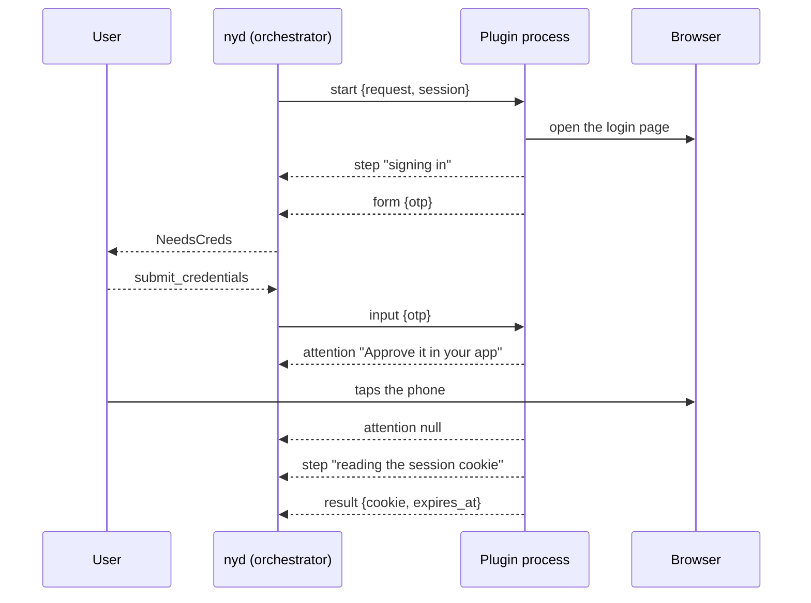

# 0010 — Out-of-process auth plugins

- **Status:** accepted, implemented
- **Date:** 2026-09-10
- **Affects:** `not-yet-done-content` — `auth.rs`, `auth/auth_plugin.rs` (new),
  `auth/resolver.rs`, `auth/orchestrator.rs`, `auth/session_store.rs`,
  `AdapterStatus`, `status_reporter.rs`; the TUI and CLI status renderers;
  the `auth_session` table of the jira, confluence, stoat and taiga adapters;
  the `cookie` mechanisms of `not-yet-done-jira-adapter` and
  `not-yet-done-confluence-adapter`; `not-yet-done-auth-drunken` (new)

## Context

A credential can be obtained in two places, and both must stay open. Inside
the adapter, in Rust: `taiga` and `stoat` speak `password-login` and derive
their own session with nothing but HTTP. Or outside, by a helper the user
configures — which is the only option when the login needs something no Rust
library has, and today means one of two providers:

- `command` — run a shell command, take stdout. One value per invocation,
  no way to ask anything.
- `script` / `script-result` — the round protocol in
  `auth/credential_script.rs`: one process per round, answering `result`,
  `form` or `error`, so several fields cost one invocation and a locked
  password store can ask for its passphrase through the frontend instead of
  opening its own `pinentry` window.

The case neither covers is an interactive SSO login that only a real browser
can perform. It is not hypothetical: it is why `not-yet-done-office365-web`
exists at all — Conditional Access closes the Graph route that
`not-yet-done-calendar-msgraph` takes. And the slot for it is already cut on
the other adapters. The `cookie` mechanism of `jira` and `confluence`
documents itself as

> Send a ready-made Cookie header — what an SSO login (Crowd, SAML) leaves
> behind. Fetch it with a script; the adapter never talks to a browser
> itself.

That script is what nothing fills. Three properties of the round protocol are
why it cannot be filled by `script-result`, and each is deliberate there:

1. **Every round is a fresh process that remembers nothing.** The module doc
   says so, and for `pass` it is a virtue. For a browser it is fatal: the
   half-finished login _is_ the process's state. Round two would open a
   second browser onto a login the first one had already half-passed.
2. **Nothing may be said between the start and the answer.** A login is not
   one wait but a sequence of them — `AdapterStatus::Connecting`'s own doc
   makes the point, and `StatusReporter::connect_step` restarts the clock per
   step so the one that is stuck is the one on screen. But only the _caller_
   can name a step, and the caller cannot see inside a child process.
   `CredentialProvider::progress_step()` therefore names one step for a whole
   provider — "running the cookie script" — for a login that is a dozen steps
   over a minute.
3. **Involving the user means a form, and a form waits for a submit.** A
   push-approval second factor has nothing to submit: the user taps a phone
   or types a code into an app, and all the login can do is say so, visibly,
   and keep waiting. A `NeedsCreds` with no fields would be a form that
   cannot be filled in.

A fourth limitation comes from the config side. `AuthSpec.script` is a single
string on the auth block, so one adapter gets one helper. But one adapter may
well want a browser for its session cookie and something else entirely for a
second slot, and there is no way to write that down.

## Options

### How a plugin survives a round

1. **A process per round, with state handed back and forth.** The plugin
   would return an opaque handle and re-open it next round. It pushes the
   hard part into every plugin, and for the motivating case it is not
   possible at all: a browser cannot serialise a login that is half done.
2. **One long-lived process, rounds as a conversation on its stdio
   (chosen).** The plugin is started once per `resolve()`, keeps whatever
   state it likes in its own memory, and is asked and answered over the
   pipes it already has.

### How progress leaves the plugin

1. **A side channel** — a third file descriptor, a socket, a status file.
   A second transport for one conversation, and a second thing to tear down.
2. **Unrequested messages on the same stdout, read as they arrive
   (chosen).** The reader is a loop over lines either way; the only change is
   that not every line ends a round. And the sink is already there:
   `CredentialResolver::report_to` exists precisely for this, its doc saying
   that what only the resolver knows is what happens inside one `resolve()`.
   The seam was cut before there was anything to put through it.

### How "the user must act somewhere else" is published

1. **`NeedsCreds` with an empty `fields`.** Every frontend's form code would
   need a special case for a form with nothing in it, and Esc would report a
   refusal of a question that was never asked.
2. **A new `AdapterStatus::NeedsAction { message, since, … }`.** A fourth
   login state for every frontend to learn, whose clock and deadline would
   duplicate `Connecting`'s exactly.
3. **`Connecting { attention: bool, … }` (chosen).** Waiting for a person
   _is_ what the login is doing right now, so it is a step like any other and
   keeps `step` as its only text — no second string for a frontend to choose
   between. The flag says how loud it is: raise a notification when it turns
   true, withdraw it when the next step arrives, and do not hold a stall
   deadline against a step that is deliberately waiting.

### Which plugin serves which secret

1. **One per auth block**, as `script:` is written today — then the cookie
   and a second slot can never come from different places.
2. **One per binding** — then a cookie and an XSRF token pulled from the same
   login open two browsers, which is the mistake `script-result` was
   introduced to avoid.
3. **A named table on the auth block, bindings pointing at an entry
   (chosen).** Fields naming the same entry are served by one invocation;
   fields naming different entries get different plugins. `script:` is the
   degenerate single-entry case of the same shape.

## Decision

### Config

```yaml
auth:
  mechanism: cookie
  session_cache: { type: ttl, ttl_secs: 28800 }
  plugins:
    - name: sso
      command: nyd-auth-drunken --flow jira-sso
      timeout_secs: 60 # per step, not per login
      attention_timeout_secs: 300 # while it waits on the user
  bindings:
    - field: cookie
      provider: { type: plugin, use: sso }
```

`use:` names an entry of `plugins:`. A binding naming an entry that does not
exist, a duplicate name, and a declared plugin no binding uses are all config
errors at read time, like every other auth validation
(`AuthSpec::validate_against`) — the last one for the reason `script` without
`script-result` is already rejected: half of a pair is a silent no-op. The
command runs through `sh -c`, so `~` and arguments work, as with `script:`.

`plugins:` is a list of named entries rather than a YAML map because
`bindings:` already keys by a name inside the item, and because the schema a
config wizard is generated from has no map shape — only scalars, nested types
and lists.

### Protocol

One JSON object per line, both ways. **stdout is the protocol, stderr is the
log**, and they are never mixed — a plugin that prints a diagnostic to stdout
breaks the conversation, which is why it has somewhere else to print it.
Unlike a credential script's, that stderr is inherited rather than captured
and quoted back on failure: a long-lived process writing into a pipe nobody
drains until it exits would eventually block on a full one. A plugin that
wants something shown to the user says `error`.

nyd writes:

| Line                                                           | Meaning                                                                                                                                                                                                                                                         |
| -------------------------------------------------------------- | --------------------------------------------------------------------------------------------------------------------------------------------------------------------------------------------------------------------------------------------------------------- |
| `{"start":{"protocol":1,"request":["cookie"],"session":null}}` | Once, first. `request` is the field names bound to this entry; `session` is the blob that just expired, so a plugin may refresh instead of logging in again — `null` on a first login, and on one the server rejected, where there is nothing worth refreshing. |
| `{"input":{"otp":"424242"}}`                                   | Answers to the form last asked — every answer so far, as `ScriptRequest.input` carries them.                                                                                                                                                                    |
| `{"cancel":{}}`                                                | Give up and shut down: the deadline passed, or the user cancelled.                                                                                                                                                                                              |

The plugin writes:

| Line                                                           | Meaning                                                                             |
| -------------------------------------------------------------- | ----------------------------------------------------------------------------------- |
| `{"step":"signing in"}`                                        | Any number, any time. Becomes `Connecting.step` and restarts its clock.             |
| `{"attention":"Approve the sign-in in your Authenticator"}`    | A step that will not move until a person acts. `Connecting` with `attention: true`. |
| `{"attention":null}`                                           | The wait is over; the next `step` says what is happening now.                       |
| `{"form":{…}}`                                                 | The existing `ScriptForm`, rendered as `NeedsCreds`, answered with `input`.         |
| `{"result":{"cookie":"…"},"expires_at_unix_ms":1757500000000}` | Ends it. Every name in `request` must be present. The expiry is optional.           |
| `{"error":"the account is locked"}`                            | Aborts, message shown to the user.                                                  |

`protocol: 1` is in `start` rather than in a handshake round-trip: a plugin
that cannot speak the version answers `error` and costs no extra exchange.
A non-zero exit before `result` aborts with stderr as the message, as it does
for a credential script.



### Deadlines

`timeout_secs` is a deadline **per step**, refreshed by every `step` line:
progress is the heartbeat, and a second liveness ping would be a second
truth about the same thing. While `attention` stands, the longer
`attention_timeout_secs` applies — a person at a second factor takes as long
as they take, and a login must not fail underneath them. No ETA is asked of a
plugin: for a wait on a human it could only be invented.

The round cap of the credential script (`MAX_SCRIPT_ROUNDS`) carries over as a
cap on `form` lines, so a plugin that keeps asking cannot loop forever.

### Secrecy

Only `result` carries secret values. `step`, `attention` and `form` reach the
status channel, the log and possibly a desktop notification, so a plugin must
put no value into them. nyd cannot verify this, which makes it part of the
plugin contract — and for the first plugin the flow language enforces it
anyway: drunken-browser's `tell:` refuses to say a secret.

### Where it lives

The protocol types and the line reader go into
`not-yet-done-content/src/auth/auth_plugin.rs`, so a plugin author has one
file to read.

Running one is the **orchestrator's** job, not a `CredentialResolver`'s,
beside `run_credential_script`. A resolver is the wrong place for three
reasons and each is decisive on its own: it hands back one value and a login
yields several, the dialog a `form` needs is reached through
`AuthOrchestrator::ask`, and the `StatusReporter` the steps are reported on is
the orchestrator's own. `CredentialProvider::Plugin` therefore answers `true`
to `needs_frontend()` and its `build_resolver` refuses, as `prompt` and
`script-result` already do. Fields naming the same entry are collected into
one `request` and served by one process, exactly as `script-result` bindings
share one script.

## Consequences

- **The two ways of getting a credential stay symmetric.** A plugin is one
  variant on the provider axis, not a layer everything passes through: an
  adapter whose login fits in Rust implements a mechanism and never meets
  this protocol. Nothing about `password-login` changes.
- **`AdapterStatus::Connecting` gains a field**, which is a compile error at
  every exhaustive match on it. That is the point: a frontend that renders a
  login must decide what it does about a step that is waiting for its user,
  and silently defaulting to "paint it like any other" is the outcome worth
  preventing.
- **`StatusReporter` gains `connect_attention(step, timeout_secs)`**, and
  leaving the state is the next ordinary `connect_step` — the reporter keeps
  the parts consistent, as it already does for phases. The timeout is a
  parameter because the countdown shown while a person acts is the longer
  one; showing the machine's would count down to a failure that is not
  coming.
- **The CLI's connect deadline is now against silence, not against the
  login.** It used to give a whole connection 60 seconds from the first
  report. A login that keeps naming its steps may take as long as it takes;
  what it may not do is go quiet, and while it waits on a person the patience
  is the longer one. A total budget could only have been a number that lies
  about an SSO bounce through a browser.
- **A plugin's values are not cached between logins**, unlike a prompt's.
  What a plugin fetches _is_ the session: replaying an expired cookie into a
  new login mints the same expired session again, and the plugin is the one
  party that can tell the difference. Asking a person twice for the same
  password, on the other hand, is rude — so prompts and script results keep
  their cache.
- **`SessionEntry` gains `expires_at`**, and the four adapters that persist
  sessions gain a nullable column for it. Without it the expiry a plugin
  states would hold until the next restart and then be forgotten, which is
  the kind of half-kept promise that is worse than none.
- **Jira and Confluence get an interactive SSO login with no adapter code.**
  Their `cookie` mechanism is unchanged; the script its doc has always
  promised becomes writable.
- **The first plugin is `nyd-auth-drunken`, a binary in this repo**
  (`not-yet-done-auth-drunken`). The protocol is nyd's, and drunken-browser
  stays an external program reached over its own documented socket wire;
  nothing of it is linked in here, and the JSON of that wire is written by
  hand. Two programs that share a socket can be built, released and broken
  separately; two that share a crate cannot. The translation is close to a
  table, because that wire already carries the same four kinds of message:

  | This protocol | drunken-browser `News`      |
  | ------------- | --------------------------- |
  | `step`        | `Run { happened }`, `began` |
  | `attention`   | `Told { said }`             |
  | `form`        | `Asking { hole }`           |
  | `input`       | `Ask::FlowAnswer`           |
  | `result`      | `Over { yielded }`          |

  Only a step the run _began_ becomes a `step`: every action inside one would
  be a status changing faster than anybody can read it, and the step is what
  the flow's author named. A `tell:` has no end of its own, so the next thing
  the run does is what withdraws the attention.

- **The nyd half of the protocol is a dependency of the plugin, the browser
  half is not.** `ToPlugin` and the line a plugin writes are public and
  round-trip, so a plugin written in Rust reads what nyd wrote instead of
  transcribing its shape into a second set of types. Writing one protocol
  down twice inside one workspace is how two spellings of it start to differ
  — which is the argument _against_ linking drunken-browser turned around,
  and lands the other way because that code is on the far side of a release
  boundary and this is not.

- **This plugin declines the session nyd offers it.** A browser's session is
  its profile, which is on disk and outlives the process; handing the blob
  back would mean putting a live cookie through the run's facts, which are
  shown as the run goes. The offer stands for plugins that can use it.

- **A browser a plugin starts is a browser a plugin quits.** It runs headless
  on a private socket and puts a window up only while the run needs a person,
  because a login that runs unattended cannot borrow the browser the user is
  reading the news in.

- **`not-yet-done-office365-web` is not touched.** It drives a browser for
  the _data_, not for a secret, and this protocol is about a secret. It may
  later hand its login half to a plugin; that is a separate decision.
- **A cancelled login gets a chance to clean up.** `cancel` plus a grace
  period before the child is killed, because a plugin that owns a browser
  leaves a browser process behind when its parent dies without a word.
- **`expires_at_unix_ms` gives the session cache a real deadline** instead of
  a configured guess. It is honoured as an upper bound on the configured
  `SessionCachePolicy`, never as an extension of it.
- **A plugin that reports nothing behaves like today's script**: one opaque
  step, one deadline, `result` at the end. Everything the protocol adds is
  something a plugin may decline to use.
