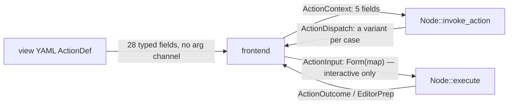

# Plan: named arguments for actions

## Goal

An action can be given data. Today it cannot — not from the view config, not
from the CLI, not from a frontend that knows something the adapter does not.
Every time the need came up, the framework grew a field instead: five on
`ActionContext`, twenty-eight on the view YAML's `ActionDef`, one per case in
`EditorPrep` and `ActionDispatch`. This plan replaces that reflex with one
concept — a declared, named, typed parameter — and one type used in every
direction data travels.

The immediate trigger: an adapter must name the file its editor opens
(`EditorPrep::file_path`), so the _location_ is the adapter's business even
though only the frontend knows where the user keeps things. The general
trigger is the field count.

## Where data flows today



Four channels, two of them general:

- **Config → action.** Nothing. Every parameter the config ever wanted to pass
  got its own typed field on `ActionDef`, gated on `action_type` and mutually
  exclusive with most of the others: `navigate_to`, `text_search`,
  `apply_query`, `tree_find`, `node_id_from`, `under_selection`, `option_menu`,
  `script_default_field`, … Twenty-eight fields, and the list only grows.
- **Frontend → adapter, non-interactive.** `ActionContext` carries `marked`,
  `confirmed`, `query`, `value`, `text`. The last two were already an attempt
  at generality, but they are singular: one id, one string. A second value has
  nowhere to go.
- **Frontend → adapter, interactive.** `ActionInput::Form(HashMap<String,
String>)` is effectively arbitrary named data — but only as the _answer to a
  prompt the adapter asked for_ via `InputSpec`. There is no way to say "here
  are the values, skip the form".
- **Adapter → frontend.** `EditorPrep`, `ActionDispatch`, `ActionOutcome`: a
  field or a variant per case.

The CLI already has key/value input — `--field k=v` into `ActionInput::Form`,
`--var k=v` into query variables — but nothing that reaches `ActionContext`.

## The design

### `ActionArgs`

An ordered map `String → ArgValue`, where `ArgValue` is a small **closed**
enum:

| variant | YAML         | why it exists                                  |
| ------- | ------------ | ---------------------------------------------- |
| `Text`  | scalar       | the common case                                |
| `Int`   | scalar       | limits, depths, page sizes                     |
| `Bool`  | `true/false` | flags, so they don't travel as `"true"`        |
| `List`  | sequence     | several ids, several labels                    |
| `Path`  | scalar       | expanded (`~`) and resolved once, not per read |

Deliberately not `serde_json::Value`. A closed enum keeps every `match`
exhaustive, keeps the YAML deserializer honest about what it accepts, and
cannot smuggle in nested structures nobody validates.

### 1. Declaration — `NodeAction::params`

`NodeAction` gains `params: Vec<ParamSpec>`, each with a key, a label, a type,
`required`, and an optional `default`. This is the action's _schema_, and it
sits next to `input: InputSpec`, which stays what it is — the shape of the
interactive prompt. An action that declares no params behaves exactly as it
does today.

Declaring rather than passing an untyped bag buys three things:

- `cli adapter <instance> help --full` can print an action's parameters, the
  way it already prints the column schema without a login;
- the config loader rejects an unknown or mistyped key at load time instead of
  ignoring it silently — the same treatment unknown view-YAML keys already get;
- a frontend can _prompt_ for a missing required parameter instead of failing.

### 2. Filling — three sources, one order

`ParamSpec::default` → view YAML `args:` → runtime supply. Later wins.

```yaml
- key: e e
  id: edit_markdown
  args:
    buffer: "{workspace}/{node_id}/ticket.edit.md"
```

Runtime supply is `--arg k=v` on the CLI (repeatable; the name is free, no
existing flag collides) and, in the TUI, whatever the binding already sources:
the option menu's focused value, a prompt answer, a cell of the current row.

**Placeholders expand on the parsed value, never on the YAML text.** This is a
scar, not a preference: substituting into the raw YAML once turned a search
string containing `#` into a comment and silently produced a null query. The
expansion runs after deserialisation, against a fixed, documented set:

| placeholder    | resolves to                                  |
| -------------- | -------------------------------------------- |
| `{node_id}`    | the target node's id                         |
| `{node_type}`  | its type id                                  |
| `{query}`      | the pane's active query text                 |
| `{cell:<key>}` | a metadata field of the current row          |
| `{workspace}`  | frontend-configured workspace/data directory |

An unresolved placeholder is an error at expansion time, not an empty string —
a path with a hole in it must not be silently created.

### 3. Delivery — `ActionContext::args`

`ActionContext` gains `args: ActionArgs`. `marked` and `confirmed` stay
fields: they are framework mechanics, not user data.

`value`, `text` and `query` **stay exactly where they are**. Migrating them
would mean two ways to read the same datum during a long transition, and the
bug that costs is worse than the tidiness it buys. The rule from here on is
about growth, not about rewriting: **new data travels as an arg; the struct
does not gain another field.**

### 4. The return direction

The same type, mirrored: `EditorPrep` and `ActionDispatch::OpenEditor` carry an
args map so an adapter can _answer_ with named data instead of the framework
growing a field per case.

This is what makes the editor-file question answerable without inventing a
second templating language. The adapter says `buffer_name: "ticket.edit.md"`
and keeps its veto on the directory (Jira's buffer must sit next to
`attachments/` or its image links break); the frontend resolves the location
from config. One place still computes the final path, and it is still the place
that creates the folder — the invariant whose absence let an export overwrite
an open editor buffer.

## Where the line is

**Args carry data. Action types carry behaviour.**

`apply_query` stays an action _type_ — it names a flow the TUI implements. The
column it reads may become an arg. The test for a new field is: would a
different value here make the action do something _else_, or the _same thing to
something else_? The second is an arg.

## Cost

- A stringly-typed layer, softened by `ParamSpec` plus load-time validation but
  not removed. Accepted knowingly.
- The migration is additive. `invoke_action` keeps compiling — a new field with
  a `Default` — and every action in the workspace is built through
  `NodeAction::new`, so declaring parameters cost no call site anything.
- No existing YAML key changes meaning, and no existing key is removed.

## Phases

Phases 1 to 3 are implemented. Building them made one thing explicit that the
design above had left implicit: arguments reach an adapter through
`ActionContext`, and only
`invoke_action` receives one — `prepare` and `execute` take an _input_, not a
context. So `--arg` serves the dispatch path today, and the editor path gets
its arguments in phase 4, where a context (or an args parameter) joins
`prepare`. That is the same phase that gives `EditorPrep` its own args, so the
two halves of the editor-file question land together.

| #   | what                                                                                                                                                                                                                                                                                                                  |
| --- | --------------------------------------------------------------------------------------------------------------------------------------------------------------------------------------------------------------------------------------------------------------------------------------------------------------------- |
| 1   | **done.** `ArgValue` / `ActionArgs` in `not-yet-done-content`, `ActionContext::args`, CLI `--arg k=v`. Data can move — on the `invoke_action` path.                                                                                                                                                                   |
| 2   | **done.** `ParamSpec`, `ArgKind`, `NodeAction::params`, `resolve_args` (collects every problem, normalises to the declared type), CLI validation before anything runs, and both help views print the parameters.                                                                                                      |
| 3   | **done.** View YAML `args:` on `ActionDef` (each value keeps its YAML type), placeholders (`{node_id}`, `{node_type}`, `{cell:<key>}`, `{query}`, `{workspace}`) expanded on the parsed value, validation at the TUI's dispatch point and in the host's hooks (`with.args`), and the arguments ride the confirm loop. |
| 4   | Arguments into `prepare`/`execute`, and the return direction: args on `EditorPrep` and `ActionDispatch::OpenEditor`; the Jira editor file uses it.                                                                                                                                                                    |

## Sources

- Content actions plan: [`plan-content-actions-unification.md`](plan-content-actions-unification.md)
- The view YAML surface: [`generic-view-spec.md`](generic-view-spec.md)
