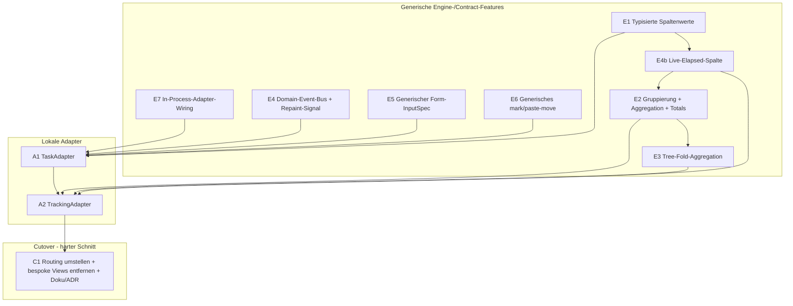

# Tasks & Trackings als ContentAdapter — Phasen-Plan

Status: **geplant** (noch keine Implementierung).
Grundlage: [`docs/adapterize-tasks-trackings.md`](adapterize-tasks-trackings.md)
(Analyse der Schwierigkeiten).
Tracking-Memory: `project_adapterize_tasks_trackings.md`.

## Ziel

Die heute bespoke nativen Tabs **Tasks** und **Trackings** vollständig
hinter den `ContentAdapter`-Contract bringen, sodass sie wie
Jira/Taiga/Postgres/Confluence/Stoat über `views/*.yaml` + Adapter laufen
und die generischen Features (Splits, Links, Action-Chains, Multiline,
Smooth-Scroll, Column-Cursor, Markdown, Retries) erben.

## Getroffene Entscheidungen (Eingangsbasis)

1. **Volle Uniformität.** Beide Tabs werden `ContentView`-getrieben; die
   bespoke `TasksView`/`TrackingsView` werden am Ende entfernt.
2. **Aggregation/Gruppierung wird ein echtes Engine-Feature** (Variante b),
   kein Adapter-Hack mit synthetischen Pseudo-Nodes. Alle Adapter
   profitieren davon.
3. **Keine Staleness.** Der Adapter muss regelmäßige Updates signalisieren
   können, ohne die TUI zu kennen. Gelöst über einen Core-Domain-Event-Bus,
   den Adapter in ihren Invalidation-Stream brücken; die TUI repaintet auf
   ein neues „soft refresh / repaint"-Signal.
4. **Sauberes Softwaredesign hat Priorität** vor Schnelligkeit.

## Leitidee

Die Capability-Lücken aus der Analyse werden als **generische
Engine-/Contract-Features** geschlossen (Phasen E\*), unabhängig
unit-testbar. Erst danach konsumieren zwei dünne **lokale Adapter**
(Phasen A\*) diese Features. Die nativen Views bleiben bis zur
verifizierten Parität bestehen und werden dann in einem harten Schnitt
entfernt (Phase C1).



## Querschnittsdesign (die neuen Mechanismen)

### M1 — Core-Domain-Event-Bus (löst Decision 3 + Tab-übergreifende Effekte)

Im Core ein `tokio::sync::broadcast` für Domänen-Events:

```text
DomainEvent::TaskChanged { id }
DomainEvent::TrackingStarted { task_id, tracking_id }
DomainEvent::TrackingStopped { task_id, tracking_id }
DomainEvent::TrackingTick            // 1 Hz, solange ein Tracking läuft
```

- Jeder Adapter abonniert die für ihn relevanten Events und **brückt** sie
  in seinen eigenen `subscribe_invalidations()`-Stream:
  - „harte" Änderung (neue Zeile, gelöscht) → `Invalidation::Node`/`All`
    (Refetch).
  - `TrackingTick` → neues, leichtes Signal `Invalidation::Repaint`
    (nur neu zeichnen, **kein** Refetch).
- Die TUI kennt weder Tasks noch Trackings: sie reagiert nur auf den
  generischen Invalidation-Stream. Der dirty-gated Render-Loop bekommt
  `Repaint` als Wake-/Dirty-Trigger.
- Cross-Tab: Ein Tracking-Toggle aus dem Tasks-Tab schreibt eine
  Tracking-Zeile und emittiert `TrackingStarted`; der TrackingAdapter
  refetcht, der Tasks-Marker aktualisiert sich, der App-/Waybar-Indikator
  hört am selben Bus. Adapter hängen nicht voneinander ab — nur am Bus.

### M2 — Typisierte Spaltenwerte (E1)

`MetadataField` bekommt neben dem Anzeige-String einen optionalen
**maschinenlesbaren Wert** (z. B. `value_kind: Number(f64) | Duration(secs)
| DateTime(utc) | Text | Path(segments)`). `ColumnDef` bekommt
`kind`/`format`, damit der Engine weiß, wie er aggregiert, bucketet,
formatiert und stylt (u. a. die gestylte Taskpath-Spalte als `Path` mit
Separator-Style).

### M3 — Gruppierung + Aggregation (E2)

`ViewDef`/View-State:

- `group_by`: Spaltenschlüssel **oder** Datums-Bucket (Day/Week/Month/Year),
  zur **Laufzeit umschaltbar** (View-State, kein Adapter-Roundtrip).
- `aggregates`: pro Spalte eine Aggregation (`sum` für Duration), liefert
  Gruppen-Total-Zeilen + Grand-Total-Footer.
- `summary_only`: Gruppen auf eine Zeile pro Gruppe kollabieren
  (= Trackings „Condensed").

### M4 — Tree-Fold-Aggregation (E3)

Im Tree-Mode eine numerische Spalte über den Teilbaum kumulieren
(`own` vs. `cumulated`) — generisch, getrieben durch eine
`tree_aggregate`-Deklaration auf der Spalte.

### M5 — Live-Elapsed-Spalte (E4b)

Spalten-`kind: elapsed_since(<datetime-feld>)`. Der Engine rendert
`now − feld` **pro Frame** neu (kein Refetch). Sichtbares Ticken kommt vom
`Repaint`-Signal aus M1. Damit ist die laufende Dauer live ohne Staleness.

### M6 — Generischer Form-InputSpec (E5)

Neuer `InputSpec::Form { fields: Vec<FormFieldSpec> }` (Text, Select mit
`allowed_values`, NodePicker für Reparent …). Die TUI rendert ihn generisch
über `ratatui_form_widgets`; `execute()` bekommt die Feldwerte. Damit
bleibt das Task-Formular erhalten **und** wird ein wiederverwendbares
Feature (auch Jira-Create etc. könnten es nutzen).

> Fallback, falls Form zu schwer wird: Task-Edit als Text-Template
> (YAML-Buffer im `$EDITOR`, parse-back) wie Jira. Weniger UX, aber
> uniform. Primär: Form-InputSpec.

### M7 — Generisches mark/paste-move (E6)

`ActionContext` trägt einen **markierten Knoten** (Clipboard). Standard-
Action-Vokabular `mark-move` / `paste-move`; `invoke_action("paste-move",
ctx)` führt den Move im Adapter aus. Verallgemeinert das bespoke
mark/paste aus dem DB-Script-Folders-Plan (der darauf umgestellt wird).

### M8 — In-Process-Adapter-Wiring (E7)

`build_adapter_factories()` bekommt ein `CoreHandle` (DB-Connection +
`Arc<dyn TaskService>`/`Arc<dyn TrackingRepository>` + Event-Bus-Sender).
Task-/Tracking-Factory captured diese Handles. Erster In-Process-Adapter
über reine Lokaldaten — Pattern wird hier einmal sauber etabliert.

## Phasen

Jede Phase: implementieren → `cargo build --release` → `cargo install` →
Unit-Tests → Commit. Smoke-Tests zentral in `docs/smoke-tests.md`.

### Engine-/Contract-Features

- **E0 — Plan + Memory** (dieses Dokument + Memory-Eintrag), committet vor
  Implementierung (übersteht `/compact`).
- **E7 — In-Process-Adapter-Wiring (M8).** `CoreHandle`, Factory-Signatur,
  No-Op-`LocalAdapter`-Skeleton zum Beweis der Verdrahtung, Registrierung.
- **E4a — Domain-Event-Bus + Repaint-Signal (M1).** Core-Broadcast,
  `Invalidation::Repaint`-Variante, Render-Loop-Wake darauf. Bridge-Helper
  für Adapter. Tests: Event → Invalidation → Dirty-Flag.
- **E1 — Typisierte Spaltenwerte (M2).** `value_kind` auf `MetadataField`,
  `kind`/`format` auf `ColumnDef`, Engine-Formatter + Path-Styling. Tests.
- **E4b — Live-Elapsed-Spalte (M5).** `kind: elapsed_since`, Per-Frame-
  Recompute, Repaint-getriebenes Ticken. Tests (deterministisch über
  injizierte `now`).
- **E2 — Gruppierung + Aggregation (M3).** `group_by` (inkl. Datums-Buckets,
  laufzeit-umschaltbar), `aggregates`, Gruppen-Header/-Total, Grand-Total,
  `summary_only`. Tests im Table-Engine.
- **E3 — Tree-Fold-Aggregation (M4).** Kumulation über Teilbaum,
  `own`/`cumulated`. Tests.
- **E5 — Generischer Form-InputSpec (M6).** `InputSpec::Form` +
  `FormFieldSpec`, generische Form-EditSession in der TUI. Tests.
- **E6 — Generisches mark/paste-move (M7).** `ActionContext.marked`,
  Standard-Actions, DB-Script-Folders-Pattern darauf konsolidieren. Tests.

### Lokale Adapter

- **A1 — TaskAdapter.** Wrappt `TaskService`. Tree über `parent_id`
  (eager-load + cache, `search_in_tree`), Spalten via E1, Filter als
  `FilterExpr` (Query-String → bestehende Core-Übersetzung),
  `saved_query_store` auf den bestehenden DB-Tabellen (Scope `task`,
  keine Datenmigration). Aktionen: add/edit (Form via E5),
  reparent (Form oder mark/paste via E6), delete (`DeleteSelf`),
  undelete/restore (View-Level-Actions am Root-Node), notes, scripts,
  tracking-toggle (emittiert `TrackingStarted/Stopped` auf den Bus).
  `views/tasks.yaml`.
- **A2 — TrackingAdapter.** Wrappt `TrackingRepository` + Task-Tree für
  Pfade. Typisierte Taskpath-Spalte (E1, `Path`-Style), Grouping/Condensed
  (E2), Tree-Fold own/cumulated (E3), Live-Dauern (E4b), Delete/Restore/
  Restore-All, scripts, Filter, tracking-toggle. Brückt `TrackingTick` →
  `Repaint`. `views/trackings.yaml`.

### Cutover (harter Schnitt)

- **C1 — Routing + Aufräumen (ein Schritt).** Erst die Paritäts-Checkliste
  (siehe unten) am Adapter-Pfad verifizieren. Dann in einem Zug:
  Render-Dispatch leitet Tasks/Trackings durch `ContentView`, und die
  bespoke `TasksView`/`TrackingsView` + toter Code werden entfernt — kein
  Übergangs-Flag, keine Fallback-Route. Doku: README,
  `docs/generic-view-spec.md` (neue ViewDef-Felder), `docs/smoke-tests.md`.
  **ADR** in `docs/decisions/` zu Domain-Event-Bus, Engine-Aggregation und
  In-Process-Adaptern.

## Parität (Cutover-Gate)

Vor C2 müssen über den Adapter-Pfad funktionieren:

- Tasks: Tree expand/collapse, `/`-Suche durch kollabierte Knoten, add/
  edit/reparent, delete + undelete, notes, scripts, Tracking-Toggle,
  Saved Queries + Shortcuts + Spalten-Config.
- Trackings: Normal/Condensed/Tree, Grouping Day/Week/Month/Year mit
  Totals + Footer, Live-Dauern (tickend), Taskpath-Spalte gestylt,
  Delete/Restore/Restore-All, scripts, Filter, Saved Queries.

## Bewusst außerhalb des Scopes (mögliche Follow-ups)

- „Trash als Teilbaum" (gelöschte Items als navigierbarer Node-Typ mit
  per-Item-Restore) — zunächst genügen Root-Level-Restore-Actions.
- Migration der Jira-/Postgres-Editing-Pfade auf den neuen Form-InputSpec.
- Persistenz-Umzug der Saved Queries vom bestehenden Store auf den
  generischen Adapter-Store (vorerst bleibt der bestehende Store hinter
  dem Adapter).

## Entschiedene Mikro-Entscheidungen (2026-06-09)

1. **Task-Edit:** generischer Form-InputSpec (M6/E5). Uniform und
   wiederverwendbar.
2. **Reparent:** mark/paste-move (M7/E6) — ein Mechanismus für Tasks und
   DB-Script-Folders.
3. **Undelete/Restore-All:** Root-Level-View-Actions am Root-Node (kein
   Trash-Teilbaum).
4. **Cutover:** **harter Schnitt** — kein Übergangs-Flag, keine
   Fallback-Route auf die nativen Views. C1 und C2 fallen zusammen:
   Routing-Umstellung und Entfernen der bespoke Views passieren in einem
   Schritt, sobald die Parität (siehe unten) am Adapter-Pfad verifiziert
   ist.
