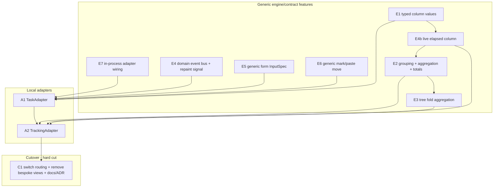

# Tasks & Trackings as ContentAdapter — phase plan

Status: **planned** (no implementation yet).
Basis: [`docs/adapterize-tasks-trackings.md`](adapterize-tasks-trackings.md)
(analysis of the difficulties).
Tracking memory: `project_adapterize_tasks_trackings.md`.

## Goal

Bring the currently bespoke native **Tasks** and **Trackings** tabs fully
behind the `ContentAdapter` contract, so that they run via `views/*.yaml` +
adapter just like Jira/Taiga/Postgres/Confluence/Stoat and inherit the
generic features (splits, links, action chains, multiline, smooth scroll,
column cursor, markdown, retries).

## Decisions taken (starting basis)

1. **Full uniformity.** Both tabs become `ContentView`-driven; the bespoke
   `TasksView`/`TrackingsView` are removed at the end.
2. **Aggregation/grouping becomes a real engine feature** (variant b), not
   an adapter hack with synthetic pseudo nodes. All adapters benefit from it.
3. **No staleness.** The adapter must be able to signal regular updates
   without knowing the TUI. Solved via a core domain event bus that adapters
   bridge into their invalidation stream; the TUI repaints on a new
   "soft refresh / repaint" signal.
4. **Clean software design takes priority** over speed.

## Guiding idea

The capability gaps from the analysis are closed as **generic
engine/contract features** (phases E\*), independently unit-testable. Only
afterwards do two thin **local adapters** (phases A\*) consume those
features. The native views stay in place until parity is verified and are
then removed in a hard cut (phase C1).



## Cross-cutting design (the new mechanisms)

### M1 — core domain event bus (solves decision 3 + cross-tab effects)

A `tokio::sync::broadcast` for domain events in the core:

```text
DomainEvent::TaskChanged { id }
DomainEvent::TrackingStarted { task_id, tracking_id }
DomainEvent::TrackingStopped { task_id, tracking_id }
DomainEvent::TrackingTick            // 1 Hz, as long as a tracking is running
```

- Every adapter subscribes to the events relevant to it and **bridges** them
  into its own `subscribe_invalidations()` stream:
  - "hard" change (new row, deleted) → `Invalidation::Node`/`All` (refetch).
  - `TrackingTick` → new, lightweight signal `Invalidation::Repaint`
    (redraw only, **no** refetch).
- The TUI knows neither tasks nor trackings: it only reacts to the generic
  invalidation stream. The dirty-gated render loop gets `Repaint` as a
  wake/dirty trigger.
- Cross-tab: a tracking toggle from the Tasks tab writes a tracking row and
  emits `TrackingStarted`; the TrackingAdapter refetches, the Tasks marker
  updates, the app/waybar indicator listens on the same bus. Adapters do not
  depend on each other — only on the bus.

### M2 — typed column values (E1)

**Decision: declared on the `ColumnDef`, not on the `MetadataField`.**
The type of a column lives exclusively in the view YAML; the adapters
themselves stay untouched. Rationale: `MetadataField` is constructed at
~50 struct-literal sites across all five adapter crates — a new mandatory
field there would mean churn across the whole workspace even though only
Tasks/Trackings need the type at all.

- `ColumnDef` gets `kind: ColumnKind` (`text` | `number` | `duration`
  | `datetime` | `path`; serde default `text`) plus optional
  `format`/`separator` fields.
- For typed columns adapters deliver **canonical strings** that the engine
  parses back unambiguously:
  - `duration` → seconds as an integer (`"3720"`),
  - `datetime` → RFC 3339 (`"2026-06-09T08:15:00Z"`),
  - `path` → segments separated by `/` (`"/a/b/c"`),
  - `number` → decimal number as a string.
- The engine formatter parses the canonical string per `kind`, formats it
  for display (`duration` via the existing `format_duration` → `H:MM:SS`,
  identical to the previous trackings display for parity; `datetime` →
  localized), sets the alignment (`number`/`duration` right-aligned) and
  styles it (`path` segments with a separator style via the existing theme
  color `taskpath_separator()`, modelled on the previous
  `build_taskpath_segments`).
- Remote adapters (Jira, Taiga, Postgres, Confluence, Stoat) stay implicitly
  `kind: text` → **zero** change to `MetadataField` and to the remote
  adapters.
- The canonical form is at the same time the basis on which M3
  (aggregation), M4 (tree fold) and M5 (live elapsed) compute, without
  having to parse the display string back.

### M3 — grouping + aggregation (E2)

`ViewDef`/view state:

- `group_by`: column key **or** date bucket (day/week/month/year),
  **switchable at runtime** (view state, no adapter round trip).
- `aggregates`: one aggregation per column (`sum` for duration), produces
  group total rows + a grand total footer.
- `summary_only`: collapse groups to one row per group
  (= trackings "condensed").

> **Implemented (variant 3, hybrid).** The **generic** partition/sum
> mechanism lives framework-agnostically in `not-yet-done-table`
> (`group.rs`: `GroupPlan`/`PlanRow`/`group()`), the **typed** extraction
> (ISO date buckets, duration parsing) as a pure TUI module
> `views/group_aggregate.rs` (mirroring `column_format.rs`). The grouped
> render path sits in `content_view::build_grouped_table`; runtime switching
> via the action `cycle_grouping` (default `zg`) or the direct-jump menu
> `group_menu` (default `u`, parity with the native `u`; not persisted — the
> native one persisted via `SaveTrackingGrouping`). Color of the
> header/footer rows via the theme `group_header`. Applies only to
> single-line flat tables (no `row_layout`, no tree). Capability only — not
> yet bound to any live view (like E1/E4b until the A1/A2 cutover).

### M4 — tree fold aggregation (E3)

In tree mode, accumulate a numeric column over the subtree
(`own` vs. `cumulated`) — generic, driven by a `tree_aggregate` declaration
on the column.

> **Implemented (adapter-driven).** The tree is **lazy** (`TreeState.cache`
> only holds the expanded subtree) → the TUI cannot fold by itself.
> Therefore: the **adapter** delivers both values per `NodeSummary` as
> metadata fields (own value under the column `key`, sum value under
> `cumulated_field`) and declares the capability
> `AdapterCapabilities.supports_tree_aggregation`. The view YAML declares
> `tree_aggregate: { cumulated_field, default: own|cumulated }` on the
> column; in the tree render path (`build_tree_data_rows`) the column reads
> either the own or the cumulated field depending on the toggle state, and
> formats it with the same `kind:`. The runtime action
> `toggle_tree_aggregate` (default `zt`, view state, not persisted) flips
> **all** `tree_aggregate` columns of the level. Own **and** sum value side
> by side = two normal columns on both fields (no new mechanism).
>
> **Capability gating (added later, A2c follow-up).** The gate on the action
> now hangs on **two** conditions, both required: **config presence**
> (`tree_aggregate` column present) **and** **capability**
> (`supports_tree_aggregation`). For that the generic path:
> `ContentView::new` snapshots the adapter capabilities **once**
> (`adapter.capabilities()`, without an adapter → all false) and passes a
> copy into **every** `ContentPane` (also on splits, inherited from the
> source pane). `level_has_tree_aggregate` reads
> `self.capabilities.supports_tree_aggregation` in addition to the column
> presence; that automatically gates both the claim (`build_claims`, i.e.
> key + hint) and the toggle itself. The **whole** `AdapterCapabilities` is
> deliberately kept on the pane, not just a bool — future affordances read
> their respective flag there instead of re-deriving the value. With that
> the original design line (adapter declares the capability, the TUI only
> displays it) is complete: a stray `tree_aggregate:` in the YAML stays
> without effect as long as the adapter does not report the capability.
> (M3 `cycle_grouping` deliberately stays config only — there is no
> `supports_grouping` capability; the mechanism is however ready should one
> ever be introduced.)
>
> Tests on three levels: config deserialization (`tree_aggregate` fields),
> render/toggle integration (`build_tree_data_rows` +
> `toggle_tree_aggregate`, own↔cumulated, no-op without the column, with a
> capability-reporting mock adapter) and the gate itself (column present +
> capability missing → unclaimable/no-op; column + capability → claimable).

### M5 — live elapsed column (E4b)

Column `kind: elapsed` with the companion field
`elapsed_from: <datetime-field>` (default: the column's own `key`). The
engine re-renders `now − field` on rebuild (no refetch). The visible ticking
comes from the `Repaint` signal of M1: the app repaint handler calls
`repaint_live_columns()`, which rebuilds exactly those panes that have an
`elapsed` column against a fresh `now`. That makes the running duration live
without staleness. (Encoding deliberately as its own `kind` + companion
field instead of a parameterized `elapsed_since(...)` — consistent with the
other companion fields `format:`/`separator:` and without a mini parser in
the YAML.)

> **Superseded for the tracking duration column by M9.** A render-side
> `kind: elapsed` cannot show one column live for running rows and static for
> finished ones, so the trackings view drives that column through
> adapter-pushed rows instead. `kind: elapsed` stays as the cheap mechanism
> wherever a column is live for _every_ row.

### M6 — generic form InputSpec (E5)

New `InputSpec::Form { fields: Vec<FormFieldSpec> }` (text, select with
`allowed_values`, node picker for reparent …). The TUI renders it
generically via `ratatui_form_widgets`; `execute()` receives the field
values. That keeps the task form **and** turns it into a reusable feature
(Jira create etc. could use it too).

> Fallback in case the form turns out too hard: task edit as a text template
> (YAML buffer in `$EDITOR`, parse back) like Jira. Less UX, but uniform.
> Primary: form InputSpec.

> **Implemented (form InputSpec, no fallback needed).** content crate:
> `InputSpec::Form { fields: Vec<FormFieldSpec> }`, `FormFieldSpec`
> (`Text` / `Select{allowed_values}` / `Toggle`, each with `key`/`label`/
> `required`/`default` + builder), `ActionInput::Form(HashMap)` and the
> `Node::form_prep(action_id) -> HashMap` hook for edit prefill. TUI:
> generic, headless-testable `ContentFormPopup` component (stack of
> `ratatui_form_widgets`, field focus, required-field validation) +
> `ContentFormPopupState`, wired at the `InputSpec` match in `app/mod.rs`
> (`form_prep` → popup → `ActionInput::Form` → `execute`), overlay render
> and popup guards. **Scope decision:** text/select/toggle only; the
> **node picker (reparent) mentioned in the plan is deferred to E6
> (mark/paste, M7)** — the reparent path uses the clipboard move there
> anyway, and a node-picker widget does not exist yet. The **native task
> add/edit (markdown `$EDITOR`) stays untouched for now** — E5 only builds
> the generic mechanism + tests; switching the TaskAdapter over to the form
> happens in **A1**. Tests: 7 popup unit tests
> (input/prefill/select/toggle/validation/submit/cancel) + 3 content
> contract tests (mock node: form declaration, `form_prep`, `execute`
> receives `ActionInput::Form`).

### M7 — generic mark/paste move (E6)

`ActionContext` carries a **marked node** (clipboard). Standard action
vocabulary `mark-move` / `paste-move`; `invoke_action("paste-move", ctx)`
performs the move in the adapter. Generalizes the bespoke mark/paste from
the DB script folders plan (which is switched over to it).

> **Implemented (generic mechanism, db-script consolidation as a
> follow-up).** User scope OK up front: (1) `ActionContext.marked` carries
> `MarkedNode { node_id, node_type, label }` (lightweight struct, no
> `NodeRef`); (2) generic mechanism + tests now, db-script migration as an
> explicit follow-up (see below).
>
> - **Contract (`content/src/lib.rs`):** new `MarkedNode` struct;
>   `ActionContext.marked: Option<MarkedNode>` (instead of an empty struct).
>   `paste-move` reads the source from `ctx.marked`; **the adapter** performs
>   the move and returns `ActionDispatch::Reload`. `mark-move` is frontend
>   state → the adapter returns `Noop`.
> - **TUI:** app field `content_marked_node: Option<MarkedNode>`;
>   `spawn_invoke_node_action` fills `ctx.marked` and captures the node's
>   label + type (for `mark-move` without a second `get_by_id`) in
>   `LoadMsg::NodeActionDispatched`. The pure decision
>   `node_actions::generic_mark_move_effect(action, node_id)` returns a
>   `MarkMoveEffect` (`Mark` | `ClearOnPasteSuccess` | `Ignore`);
>   `handle_node_action_dispatched` sets/clears the clipboard afterwards.
>   `esc` clears it (tail-end esc consumer), status bar indicator
>   `move: <label>` (after link-mark/db-script).
> - **db-script stays on its bespoke path for now**
>   (`marked_db_script_for_move` + `tui_owned_db_script_action` →
>   `Mark/PasteDbScriptMove`, the TUI performs the fs move).
>   `generic_mark_move_effect` returns `Ignore` for db-script nodes → both
>   clipboards are disjoint.
> - **Tests:** 3 content contract (`MoveNode`: no mark by default,
>   `paste-move` receives `ctx.marked`, without a mark → `Error`) + 4 pure
>   TUI (`generic_mark_move_effect`: mark/paste/other/db-script). 83 content
>   - 562 TUI green, installed, privacy clean.
> - **Docs:** generic-view-spec.md section "Marking & moving".
> - Capability only until A1/A2 (no adapter exposes `mark-move`/`paste-move`
>   today except the bespoke db-script path). A1 (TaskAdapter) is the first
>   live consumer (reparent).
>
> **Follow-up — consolidate db-script onto the generic path (with
> A2/M8).** Once the adapter is passed through anyway: the Postgres adapter
> `paste-move` performs the fs move itself (instead of `Noop` + TUI), the
> `ViewRequest::Mark/PasteDbScriptMove` special paths + the db-script gate in
> `generic_mark_move_effect` fall away, `marked_db_script_for_move` is
> replaced by `content_marked_node`. Its own smoke test, since a working
> feature is being rebuilt.

### M8 — in-process adapter wiring (E7)

`build_adapter_factories()` gets a `CoreHandle` (DB connection +
`Arc<dyn TaskService>`/`Arc<dyn TrackingRepository>` + event bus sender).
The task/tracking factory captures these handles. First in-process adapter
over purely local data — the pattern is established cleanly once here.

### M9 — adapter-driven live rows (variant 1, A2a)

> **Generic mechanism, designed by the user.** An adapter can **push**
> individual rows and **specify + dynamically change** the refresh interval;
> the TUI patches the row in place by `id`. Solves the tracking duration
> column (one column, live for running and static for finished ones — which
> a render-side `kind: elapsed` cannot do) and generalizes beyond durations
> (CI progress, edited chat rows).
>
> Two new `Invalidation` variants in `not-yet-done-content`:
>
> - `Invalidation::Row(NodeSummary)` — the **complete** new row.
>   `ContentView::patch_row` finds it by `id` in every pane, replaces the
>   loaded item and calls `rebuild_table_with` (re-derived cells and, with an
>   active `group_by`, group sums/footer). No refetch, selection/scroll stay.
> - `Invalidation::RefreshInterval(Option<Duration>)` — the adapter clocks
>   the **framework timer**: `Some(d)` starts/re-clocks, `None` stops.
>
> **Variant 1 (framework timer + pull).** A new app field
> `live_refresh_timers` of type `HashMap<view_index, JoinHandle>`;
> `set_live_refresh_timer` (re)spawns a
> `tokio::interval` per view which pulls `adapter.live_rows()` per tick and
> sends every row as an `Invalidation::Row` through the load channel. The new
> trait method `ContentAdapter::live_rows() -> Vec<NodeSummary>` (default
> empty) returns only those rows whose rendering changes. Fits the existing
> push-signal/pull-data separation; clocking in _one_ place.
>
> `NodeSummary`/`Metadata`/`MetadataField` got `PartialEq, Eq` (so that
> `Invalidation` keeps its derives — no test changes).
>
> Bootstrap is race free: the invalidation watcher subscribes **before** the
> first load, so a `RefreshInterval` that the adapter pushes at the end of
> its snapshot load is guaranteed to reach a receiver.
>
> **Adaptive interval (addendum, native parity):** the TrackingAdapter does
> not clock at a fixed 1 Hz but, like `App::tick_active_trackings`, according
> to the **most recent** running tracking duration (<60 s → 5 s, <10 min →
> 10 s, <1 h → 30 s, otherwise 60 s; `live_interval_for`). Every `live_rows`
> pull compares the target step with the last announced one and re-clocks the
> framework timer only on a step change (sending `RefreshInterval` again).
>
> **`revalidate()` (addendum, external changes):** new trait hook
> `ContentAdapter::revalidate()` (default no-op), spawned by the app on every
> switch to a content tab. The task and tracking adapters diff the running
> trackings of the DB (`find_all_active`) against their snapshot (`tracked`
> set resp. active IDs) and on drift drop the snapshot + send
> `Invalidation::All` — that way starts/stops from CLI/waybar (no in-process
> domain event) become visible on a tab switch; `r` (reload action) stays the
> manual way. Since then reloads also refresh expanded tree levels (engine,
> see generic-view-spec "Reload refreshes expanded levels").

## Phases

Every phase: implement → `cargo build --release` → `cargo install` →
unit tests → commit. Smoke tests centrally in `docs/smoke-tests.md`.

### Engine/contract features

- **E0 — plan + memory** (this document + memory entry), committed before
  implementation (survives `/compact`).
- **E7 — in-process adapter wiring (M8).** `CoreHandle`, factory signature,
  no-op `LocalAdapter` skeleton to prove the wiring, registration.
- **E4a — domain event bus + repaint signal (M1).** Core broadcast,
  `Invalidation::Repaint` variant, render loop wake on it. Bridge helper for
  adapters. Tests: event → invalidation → dirty flag.
- **E1 — typed column values (M2).** `value_kind` on `MetadataField`,
  `kind`/`format` on `ColumnDef`, engine formatter + path styling. Tests.
- **E4b — live elapsed column (M5).** `kind: elapsed` (plus `elapsed_from:`),
  per-frame recompute, repaint-driven ticking. Tests (deterministic via an
  injected `now`).
- **E2 — grouping + aggregation (M3).** `group_by` (incl. date buckets,
  switchable at runtime), `aggregates`, group header/total, grand total,
  `summary_only`. Tests on three levels: engine mechanism
  (`not-yet-done-table::group`), typed extraction (`group_aggregate`) and
  render path integration (`build_grouped_table` in the view layer).
- **E3 — tree fold aggregation (M4).** Accumulation over the subtree,
  `own`/`cumulated`. Tests.
- **E5 — generic form InputSpec (M6).** `InputSpec::Form` + `FormFieldSpec`,
  generic form EditSession in the TUI. Tests.
- **E6 — generic mark/paste move (M7).** `ActionContext.marked`, standard
  actions, consolidate the DB script folders pattern onto it. Tests.

### Local adapters

- **A1 — TaskAdapter.** Wraps `TaskService`. Tree via `parent_id`
  (eager load + cache, `search_in_tree`), columns via E1, filter as a
  `FilterExpr` (query string → existing core translation),
  `saved_query_store` on the existing DB tables (scope `task`, no data
  migration). Actions: add/edit (editor buffer instead of the E5 form, see
  the A1b box), reparent (mark/paste via E6), delete (`DeleteSelf`),
  undelete/restore, notes, scripts, tracking toggle (emits
  `TrackingStarted/Stopped` on the bus). `views/tasks.yaml`.

  > **A1a implemented (read path).** The `LocalAdapter` no-op from E7 has
  > been built out into the `TaskAdapter` (factory key `local` → `tasks`), in
  > the crate `not-yet-done-local-adapter` (`task.rs`). Read path: a
  > synthetic forest root (`task:root`) lists the top-level tasks, a
  > recursive `task:item` branch drills arbitrarily deep. The whole
  > non-deleted forest loads **once** into an immutable `ForestSnapshot`
  > (shared via `Arc` across all nodes, no DB round trip while drilling);
  > `root()` loads fresh (reload semantics), `get_by_id`/`list` from the
  > cache. Orphans (parent deleted) are re-rooted onto the root.
  > Typed columns (M2): `priority` as `number`, `created` as `datetime` —
  > the adapter delivers canonical strings. `search_in_tree` matches multiple
  > tokens across all descriptions and returns `path`-addressed hits in tree
  > render order. `capabilities`: `supports_search = true`, create/delete
  > still `false`. **Event bridge already final:** its own
  > `spawn_task_bridge` ignores `TrackingTick`, maps `TaskChanged` → `Node`,
  > `Tracking*` → `All`, and **clears the snapshot** before every refetch —
  > so that A1b mutations refetch correctly without cache rework.
  > Example + regression test: `docs/examples/views/tasks.yaml`
  > (parses + validates in the test). Capability only — the native
  > `TasksView` keeps running untouched until the C1 cutover.

  > **A1b implemented (mutations).** Add/edit run via **`InputSpec::Editor`**
  > (not the E5 form): a markdown buffer with `---` frontmatter
  > (`status`/`priority`/`tracking`/`parent`) and a
  > `## Description:` / `## Notes:` body. Rationale: tasks have multi-line
  > markdown descriptions plus a separate notes section, a single-line form
  > would be a regression. The buffer format is **adapter-owned**
  > (`editor_templates`/`notes` moved into the crate
  > `not-yet-done-local-adapter`, shared source with the transitional native
  > session until C1). `add` is a `type: create` action on the container
  > (root → top-level task, drilled-into task → subtask; the `parent:` field
  > in the buffer wins), `edit` a `type: edit` action on the task. `delete`
  > (recursive, with a confirm flow → `DeleteSelf` → `execute("delete")`),
  > `undelete` (`undelete_last`, ignores node identity),
  > `mark-move`/`paste-move` (reparent with a cycle guard, M7 — the adapter
  > performs the move in `invoke_action` from `ActionContext::marked`) hang
  > on the generic `shortcuts:` path (`d`/`u`/`m`/`p`). Every mutation emits
  > a `DomainEvent` on the bus (`TaskChanged`, plus `Tracking*` on toggle),
  > whereupon the bridge clears the snapshot. **Tracking toggle in the edit
  > buffer pulled forward** (instead of purely A1c): the `tracking:` field in
  > the shared template would otherwise be a dead field; `CoreHandle` now
  > carries `allow_parallel_tracking` (from `tracking.allow_parallel`).
  > `capabilities`: `supports_create`/`supports_delete` → `true`.
  >
  > **A1c-1 implemented (tracking marker + start/stop key).**
  > `ForestSnapshot` now carries a `tracked: HashSet<Uuid>` (one
  > `find_all_active()` in `load`); `task_metadata` emits a `tracking` field
  > (`⏱` on running rows, otherwise empty), the `tracking` column in
  > `tasks.yaml` renders it on both levels. New per-node action
  > `toggle-tracking` (key `t`, `shortcuts:` path → `invoke_action`): reads
  > the live state (`find_active_for_task`, no stale snapshot) and calls the
  > existing `apply_tracking(!is_tracked)` → respects the exclusivity policy,
  > emits `Tracking*`, the bridge invalidates → reload. `actions_for_type` +
  > the A1b action test carried along.
  > **A1c-2 implemented (saved queries + `FilterExpr` filter = one
  > feature).** A saved query is dead without evaluation, so they were built
  > together. Two design decisions: (1) a **filtered tree** instead of a flat
  > list — the hits plus their ancestors stay as a thinned-out tree so that
  > deep hits remain reachable; (2) a **fresh FS store** in the generic scope
  > `tasks/<id>/<view>` (`FsSavedQueryStore`, not the native `task` scope).
  > Mechanics in five layers:
  >
  > - **A (content):** new `AdapterCapabilities.propagates_query_to_subtree`
  >   (default `false`). Heterogeneous adapters (Jira epic→story) leave it
  >   off so that the parent JQL does not leak onto children of a different
  >   kind; the homogeneous task forest (`task:item`→`task:item`, one
  >   `FilterExpr` at every depth) opts in with `true`.
  > - **B (engine):** `spawn_tree_expand`/`spawn_content_drill_down` used to
  >   hand a hard-coded `query: None` to the child `list()`. Now
  >   `subtree_query_for_pane` passes the active (rendered) pane query on to
  >   every depth when `propagates_query_to_subtree` is set.
  > - **C (view state):** `TreeState::clear_for_new_query()` in both query
  >   setters discards `expanded`+`cache`+`entries` — otherwise stale
  >   children from the old filter. Correct for all tree adapters, not just
  >   tasks.
  > - **D (adapter):** `resolve_visible_set` parses the query
  >   (`query_filter::parse`) → `task_service.list_filtered(&expr)` → hits,
  >   then an **in-memory ancestor walk** over `snapshot.by_id[..].parent`
  >   (ancestors are structurally necessary, independent of
  >   `options.include_ancestors`). `child_summaries`/`summary` take
  >   `filter: Option<&HashSet<Uuid>>` (`has_children` only counts visible
  >   children). Stateless per call — the `ForestSnapshot` stays immutable;
  >   one `list_filtered` DB call per expand is negligible for a personal
  >   task DB.
  > - **E (config/doc):** `tasks.yaml` `query:` block (default `open tasks`:
  >   not `done`, not deleted), the `view_config` test parses the default
  >   body, smoke section A1c-2.
  >
  > **Accepted lifecycle edge:** a structural `DomainEvent`
  > (add/delete/reparent) clears the snapshot → the filter is lost until the
  > pane sends the query again. Deliberately not caught any further.
  >
  > **A1c-scripts implemented (zero adapter code).** The `:script` path is
  > already wired generically via `ContentView`/`ContentPane`
  > (`open_script_menu_from_current_tab` routes `Tab::Content` →
  > `open_script_menu_for_content` → `ScriptContext::ContentNode`). A
  > `type: script` action (key `x`) in `tasks.yaml` on both levels was
  > enough (`script` is not root-only like `search`/`fuzzy_filter`/
  > `tree_find`). The task goes out as a **uniform** `{"node": …}` JSON
  > (fields from `task_metadata`:
  > description/status/priority/tags/tracking/created), directory
  > `scripts/tasks/task_item/` — **not** the native `{"task": …}`
  > form + `scripts/tasks/` of the bespoke tab (which keeps running in
  > parallel; its own scripts are migrated only at C1). The `view_config`
  > test checks the action on both levels, smoke section A1c-scripts.
  >
  > **Addendum on script parity (port of `task_to_taiga.py`):** two gaps
  > compared to the native `{"task": …}` payload closed. (1) Generic: the
  > `{"node": …}` JSON now also carries `label` (the display label of the
  > row — for tasks the description, which as a `source: label` column is not
  > a metadata field). Applies to all adapters. (2) Adapter side: new
  > metadata field `ancestors` = JSON array string
  > `[{"id", "description"}, …]` root→parent excluding the task itself
  > (`ForestSnapshot::ancestors_json`, O(depth) per row on the in-memory
  > forest). With that a ported script reads the description from
  > `node.label` and the path convention from
  > `json.loads(node.fields.ancestors)` — functionally identical to the
  > native `task.description`/`task.ancestors`.
  >
  > **A1c convenience implemented (add child under selection + un-nest).**
  >
  > - **Add child in the tree (`A`)** — generic, one opt-in: new bool field
  >   `ActionDef.under_selection` (default false). In the `create` dispatch
  >   (`content_view`) the action then targets the **selected** node
  >   (`selected_item_id` + `selected_node_type_chain().last()` as the
  >   `child_type`) instead of the container (`parent_node_id` +
  >   `current_child_node_type`). That way `A` nests under the cursor in tree
  >   mode without drilling in first — the `add` action ID is reused
  >   (`TaskItemNode::prepare("add")` = `prepare_add(Some(self.id))`), **zero
  >   adapter code**. `a` (container) stays unchanged. Confluence is the only
  >   other tree view and has _no_ create action → no behavioral risk.
  >   Generic benefit: every tree adapter can opt into it via YAML.
  > - **Un-nest (`U`)** — adapter-side fire-and-forget action `unnest`
  >   (`invoke_unnest`): `update_task(id, parent=Some(None))`, no cycle check
  >   needed (the root is never a descendant), `move_notes` +
  >   `emit_task_changed` + reload; friendly error if already top level. The
  >   target-free inverse of mark/paste move. In `task_item_actions` +
  >   the `invoke_action` arm; `actions_for_type` returns it for hints too.
  >
  > `A` + `U: unnest` in `tasks.yaml` on **both** levels (so that they apply
  > in tree mode = root view, not only after a drill). The `view_config` test
  > checks both; new `content_view` dispatch test
  > `create_under_selection_targets_selected_node`; smoke section A1c
  > convenience.
  >
  > **A1 (TaskAdapter) is thereby complete.**

- **A2 — TrackingAdapter.** Wraps `TrackingRepository` + the task tree for
  paths. Typed taskpath column (E1, `Path` style), grouping/condensed (E2),
  tree fold own/cumulated (E3), live durations (E4b),
  delete/restore/restore-all, scripts, filter, tracking toggle. Bridges
  `TrackingTick` → `Repaint`. `views/trackings.yaml`.

  > **In subphases like A1 (a/b/c):**
  >
  > - **A2a — read path (DONE, unpushed).** `tracking.rs` in the local
  >   adapter (modelled on `task.rs`): `TrackingAdapter` +
  >   `TrackingSnapshot` (all non-deleted trackings, task path map, active
  >   set), flat `tracking:root` → `tracking:entry` leaves.
  >   Typed columns (taskpath `kind: path`, started/ended `datetime`,
  >   duration `duration`). Live durations via **M9** instead of
  >   `kind: elapsed` (one column live + static). Saved query filter via
  >   `TrackingRepository::find_filtered`. `group_by`/`aggregates` purely on
  >   the engine side from `trackings.yaml`. Factory `trackings` registered.
  >   51 adapter + 536 TUI tests green, installed. **Open in A2a:**
  >   `patch_row`/timer unit test (so far only build + adapter logic tests),
  >   smoke.
  > - **A2b — mutations (DONE, unpushed).** New domain event
  >   `TrackingChanged { tracking_id }` (delete/restore, **not** start/stop)
  >   → both bridges + `domain_event_to_invalidation` map it onto
  >   `Invalidation::All`, so that the list **and** the task marker reload.
  >   `tracking:entry` actions: `delete` (soft, times preserved, via the
  >   generic `DeleteSelf` confirm → `execute("delete")`), `restore`
  >   (find_by_id → deleted check → BFS `find_by_predecessor`/`hard_delete`
  >   of the successors → `undelete`), `toggle-tracking` (reuse of
  >   `crate::task::apply_tracking`, now `pub(crate)`). `tracking:root`
  >   action `restore-all` (best effort over the visible ids). YAML
  >   `shortcuts:` `d`/`R`/`t` + `A: parent:restore-all`.
  >   `capabilities.supports_delete = true`, `actions_for_type` for
  >   root/entry. Scripts already in A2a via `type: script`. **Known limit
  >   (parity with native):** the list only shows non-deleted rows, so `R`/`A`
  >   have no visible target today — a "show deleted" subview is future work.
  >   53 adapter + 536 TUI tests green, installed.
  > - **A2c — condensed (DONE) + tree (DONE, own/cumulated, M4) +
  >   capability gating (DONE).**
  >   - **Condensed (DONE).** Instead of a mode toggle, as a second `views:`
  >     entry (`key: v`, back with `a`) on the **generic nested grouping
  >     (M3 `then_by`)**: `group_by` by day + `then_by` by task +
  >     `summary_only`. Built out generically for that: `group.rs`
  >     `group_nested` (N levels, headers carry `level` + `representative`),
  >     `ViewDef`/`ChildDef` `then_by: Vec<GroupBy>`, `current_levels`/
  >     `current_then_by`, `build_grouped_table` renders the **innermost**
  >     `summary_only` level as a selectable **representative data row**
  >     (path + task from a member, aggregate columns = group total), outer
  >     levels as indented `── label ──` headers. `zg` rotates only the outer
  >     level. Adapter: just a hidden `task_id` field on the
  >     `tracking:entry` (inner group key, never as a column). 44 table
  >     (+3 nested) + 538 TUI (+nested render + `then_by` deser) + 53 adapter
  >     (+`task_id`) tests green, installed. **Limit:** no live tick in
  >     condensed (total instead of individual duration); apart from that the
  >     two-level form is faithful to the native parity.
  >   - **Tree (DONE).** A second projection of the same loads: the **task
  >     forest** as `tracking:tree-item` nodes ([`TreeProjection`] in
  >     `tracking.rs`), every node carrying `duration` (own seconds) +
  >     `duration_cumulated` (subtree sum, folded bottom-up, cycle-safe). The
  >     tree is **pruned** to tasks with tracked time (`cumulated_secs > 0`,
  >     the path to tracked leaves stays), durations are **baked at load
  >     time** (no live tick, like condensed). Wiring: **ONE root** exposes
  >     both child types (`tracking:entry` + `tracking:tree-item`),
  >     `root.list()` dispatches on `params.node_type`, `get_by_id`/
  >     `get_child` route via the **`tree:<task-uuid>`** prefix (tracking vs.
  >     task UUID would otherwise be indistinguishable).
  >     `supports_tree_aggregation: true`. trackings.yaml 3rd view `tree`
  >     (recursive `tracking:tree-item` branch) with
  >     `tree_aggregate: { cumulated_field: duration_cumulated, default: cumulated }`
  >     on the `duration` column (`zt` toggles own↔cumulated via the existing
  >     M4 engine). **Subtab key collision solved:** switch key `T`
  >     (shift+t), `t` stays toggle-tracking on the row —
  >     `canonicalize_key` does not lowercase, so they are distinct;
  >     validator green. `tracking:tree-item` actions only `toggle-tracking`
  >     (read-only aggregate). 6 new adapter tests
  >     (fold/prune/reroot/metadata/parse-id/actions) = 59 adapter; new
  >     `example_trackings_yaml_parses_and_validates` = 539 TUI; installed.
  >   - **Capability gating (DONE).** The E3/M4 follow-up: adapter
  >     capabilities are now plumbed into the panes. `ContentView::new`
  >     snapshots `adapter.capabilities()` **once** (without an adapter →
  >     all false) and passes a copy into every `ContentPane` (also on
  >     splits, inherited from the source pane). `level_has_tree_aggregate`
  >     now gates **twice**: config presence (`tree_aggregate` column)
  >     **and** `self.capabilities.supports_tree_aggregation` — so that the
  >     claim (key + hint via `build_claims`) and the toggle fall together as
  >     soon as the adapter does not report the capability. The **whole**
  >     `AdapterCapabilities` deliberately on the pane (not just a bool), so
  >     that future affordances read their respective flag there instead of
  >     re-deriving it — that is the generic path, not a narrow one-off fix.
  >     2 new gate tests (column without capability → unclaimable/no-op;
  >     column + capability → claimable) = 541 TUI; installed. (M3
  >     `cycle_grouping` stays config only in flat lists — no
  >     `supports_grouping` capability; in the **tree** it gates on
  >     `group_by_via_adapter`, see the next point.)
  >   - **Tree grouping (DONE, generic mechanism `group_by_via_adapter`).**
  >     Native parity point (3): the legacy tree grouped by day. A tree
  >     cannot group on the engine side (the adapter owns the per-bucket
  >     fold), so the responsibility is inverted: the engine hands the pane's
  >     active `group_by` as `ListParams.group_by` (`GroupSpec` from the new
  >     content module `grouping`, which also feeds the flat grouping of the
  >     TUI — keys + labels identical) into the root `list()`; the adapter
  >     answers with `tracking:tree-group` bucket nodes
  >     (`treegrp:<col>:<gran>:<key>`) whose subtrees are folded from the
  >     trackings of **that** bucket; item IDs below carry the bucket scope
  >     (`tree:<col>:<gran>:<key>:<uuid>`) so that `get_by_id` computes
  >     bucket-correctly without query context (the query additionally comes
  >     per `list()` via `propagates_query_to_subtree`). Engine side:
  >     `level_has_group_by`/`current_group_by`/`configured_grouping_base`
  >     capability-gated in the tree, `zg`/`u` = **reload** instead of
  >     rebuild, `current_levels` always empty in the tree (the grouped
  >     render path stays flat only); `spawn_content_load` + the synchronous
  >     query apply thread `adapter_group_spec`. **ONE view config for both
  >     forms:** root `node_type: tracking:tree-group` + a recursive
  >     `tracking:tree-item` ChildDef — "no grouping" delivers items instead
  >     of buckets, and the type-based chain resolution then matches the
  >     ChildDef from depth 0 (root `shortcuts:` removed: buckets are read
  >     only; `s: toggle-tracking` lives on the item level). 592 TUI
  >     (+5 gating/reload) + 68 adapter (+5 bucket/scope/refold) tests green,
  >     installed.

### Cutover (hard cut)

- **C1 — routing + cleanup (one step).** First verify the parity checklist
  (see below) on the adapter path. Then in one go: the render dispatch routes
  tasks/trackings through `ContentView`, and the bespoke
  `TasksView`/`TrackingsView` + dead code are removed — no transition flag,
  no fallback route. Docs: README, `docs/generic-view-spec.md` (new ViewDef
  fields), `docs/smoke-tests.md`. **ADR** in `docs/decisions/` on the domain
  event bus, engine aggregation and in-process adapters.

## Parity (cutover gate)

Before the cutover (C1, which subsumes C2) the following must work over the
adapter path:

- Tasks: tree expand/collapse, `/` search through collapsed nodes,
  add/edit/reparent, delete + undelete, notes, scripts, tracking toggle,
  saved queries + shortcuts + column config.
  > **Done (2026-06-11):** initial expand depth (`expand_depth` on the root
  > ViewDef, generic one-shot cascade over the normal expand path — parity
  > with `tasks.tree.default_expand_depth`) and the list view (second view
  > `list` on the new adapter type `task:flat`, flat DFS walk, filter = hits
  > only; subtab keys `v`/`t` replace the native `vl`/`vt` — `l` collides
  > with `content.open`).
- Trackings: normal/condensed/tree, grouping day/week/month/year with totals
  - footer, live durations (ticking), taskpath column styled,
    delete/restore/restore-all, scripts, filter, saved queries.

## Deliberately out of scope (possible follow-ups)

- "Trash as a subtree" (deleted items as a navigable node type with per-item
  restore) — root-level restore actions are enough for now.
- Migration of the Jira/Postgres editing paths onto the new form InputSpec.
- Moving the persistence of the saved queries from the existing store to the
  generic adapter store (for now the existing store stays behind the
  adapter).

## Decided micro-decisions (2026-06-09)

1. **Task edit:** generic form InputSpec (M6/E5). Uniform and reusable.
   — **superseded during A1b:** add/edit run through `InputSpec::Editor`
   (markdown buffer with frontmatter), because a single-line form would be a
   regression for multi-line descriptions plus notes. See the A1b box above.
2. **Reparent:** mark/paste move (M7/E6) — one mechanism for tasks and DB
   script folders.
3. **Undelete/restore-all:** root-level view actions on the root node (no
   trash subtree).
4. **Cutover:** **hard cut** — no transition flag, no fallback route to the
   native views. C1 and C2 coincide: switching the routing and removing the
   bespoke views happen in one step, as soon as parity (see below) is
   verified on the adapter path.
