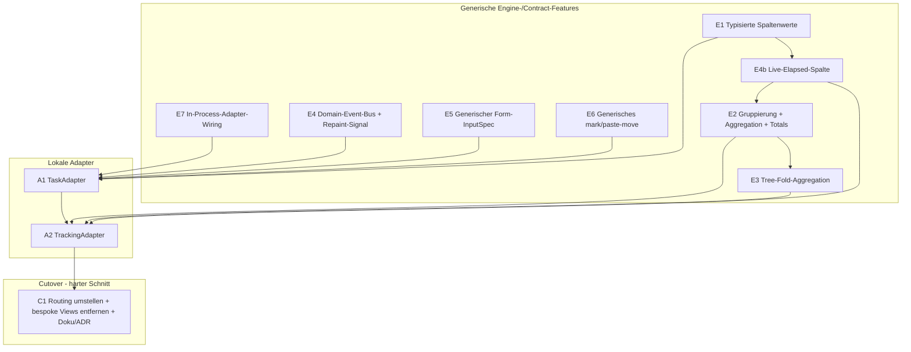

# Tasks & Trackings als ContentAdapter — Phasen-Plan

Status: **geplant** (noch keine Implementierung).
Grundlage: [`docs/adapterize-tasks-trackings.md`](adapterize-tasks-trackings.md)
(Analyse der Schwierigkeiten).
Tracking-Memory: `project_adapterize_tasks_trackings.md`.

## Ziel

Die heute bespoke nativen Tabs **Tasks** und **Trackings** vollständig
hinter den `ContentAdapter`-Contract bringen, sodass sie wie
Jira/Taiga/Postgres/Confluence/Stoat über `views/*.yaml` + Adapter laufen
und die generischen Features (Splits, Links, Action-Chains, Multiline,
Smooth-Scroll, Column-Cursor, Markdown, Retries) erben.

## Getroffene Entscheidungen (Eingangsbasis)

1. **Volle Uniformität.** Beide Tabs werden `ContentView`-getrieben; die
   bespoke `TasksView`/`TrackingsView` werden am Ende entfernt.
2. **Aggregation/Gruppierung wird ein echtes Engine-Feature** (Variante b),
   kein Adapter-Hack mit synthetischen Pseudo-Nodes. Alle Adapter
   profitieren davon.
3. **Keine Staleness.** Der Adapter muss regelmäßige Updates signalisieren
   können, ohne die TUI zu kennen. Gelöst über einen Core-Domain-Event-Bus,
   den Adapter in ihren Invalidation-Stream brücken; die TUI repaintet auf
   ein neues „soft refresh / repaint"-Signal.
4. **Sauberes Softwaredesign hat Priorität** vor Schnelligkeit.

## Leitidee

Die Capability-Lücken aus der Analyse werden als **generische
Engine-/Contract-Features** geschlossen (Phasen E\*), unabhängig
unit-testbar. Erst danach konsumieren zwei dünne **lokale Adapter**
(Phasen A\*) diese Features. Die nativen Views bleiben bis zur
verifizierten Parität bestehen und werden dann in einem harten Schnitt
entfernt (Phase C1).



## Querschnittsdesign (die neuen Mechanismen)

### M1 — Core-Domain-Event-Bus (löst Decision 3 + Tab-übergreifende Effekte)

Im Core ein `tokio::sync::broadcast` für Domänen-Events:

```text
DomainEvent::TaskChanged { id }
DomainEvent::TrackingStarted { task_id, tracking_id }
DomainEvent::TrackingStopped { task_id, tracking_id }
DomainEvent::TrackingTick            // 1 Hz, solange ein Tracking läuft
```

- Jeder Adapter abonniert die für ihn relevanten Events und **brückt** sie
  in seinen eigenen `subscribe_invalidations()`-Stream:
  - „harte" Änderung (neue Zeile, gelöscht) → `Invalidation::Node`/`All`
    (Refetch).
  - `TrackingTick` → neues, leichtes Signal `Invalidation::Repaint`
    (nur neu zeichnen, **kein** Refetch).
- Die TUI kennt weder Tasks noch Trackings: sie reagiert nur auf den
  generischen Invalidation-Stream. Der dirty-gated Render-Loop bekommt
  `Repaint` als Wake-/Dirty-Trigger.
- Cross-Tab: Ein Tracking-Toggle aus dem Tasks-Tab schreibt eine
  Tracking-Zeile und emittiert `TrackingStarted`; der TrackingAdapter
  refetcht, der Tasks-Marker aktualisiert sich, der App-/Waybar-Indikator
  hört am selben Bus. Adapter hängen nicht voneinander ab — nur am Bus.

### M2 — Typisierte Spaltenwerte (E1)

**Entscheidung: deklarativ am `ColumnDef`, nicht am `MetadataField`.**
Der Typ einer Spalte steht ausschließlich in der View-YAML; die Adapter
selbst bleiben unberührt. Begründung: `MetadataField` wird an ~50
Struct-Literal-Stellen über alle fünf Adapter-Crates konstruiert — ein
neues Pflichtfeld dort wäre Churn quer durch den ganzen Workspace, obwohl
nur Tasks/Trackings den Typ überhaupt brauchen.

- `ColumnDef` bekommt `kind: ColumnKind` (`text` | `number` | `duration`
  | `datetime` | `path`; serde-default `text`) plus optionale
  `format`/`separator`-Felder.
- Adapter liefern für typisierte Spalten **kanonische Strings**, die der
  Engine eindeutig zurückparst:
  - `duration` → Sekunden als Integer (`"3720"`),
  - `datetime` → RFC 3339 (`"2026-06-09T08:15:00Z"`),
  - `path` → mit `/` getrennte Segmente (`"/a/b/c"`),
  - `number` → Dezimalzahl als String.
- Der Engine-Formatter parst den kanonischen String pro `kind`, formatiert
  ihn fürs Display (`duration` über den vorhandenen `format_duration`
  → `H:MM:SS`, identisch zur bisherigen Trackings-Anzeige für Parität;
  `datetime` → lokalisiert), setzt die Ausrichtung (`number`/`duration`
  rechtsbündig) und stylt
  (`path`-Segmente mit Separator-Style über die vorhandene Theme-Farbe
  `taskpath_separator()`, Vorbild: bisheriger `build_taskpath_segments`).
- Remote-Adapter (Jira, Taiga, Postgres, Confluence, Stoat) bleiben
  implizit `kind: text` → **null** Änderung an `MetadataField` und an den
  Remote-Adaptern.
- Die kanonische Form ist zugleich die Basis, auf der M3 (Aggregation),
  M4 (Tree-Fold) und M5 (Live-Elapsed) rechnen, ohne den Anzeige-String
  rückparsen zu müssen.

### M3 — Gruppierung + Aggregation (E2)

`ViewDef`/View-State:

- `group_by`: Spaltenschlüssel **oder** Datums-Bucket (Day/Week/Month/Year),
  zur **Laufzeit umschaltbar** (View-State, kein Adapter-Roundtrip).
- `aggregates`: pro Spalte eine Aggregation (`sum` für Duration), liefert
  Gruppen-Total-Zeilen + Grand-Total-Footer.
- `summary_only`: Gruppen auf eine Zeile pro Gruppe kollabieren
  (= Trackings „Condensed").

> **Umgesetzt (Variante 3, Hybrid).** Der **generische** Partition-/Summen-
> Mechanismus liegt framework-agnostisch in `not-yet-done-table`
> (`group.rs`: `GroupPlan`/`PlanRow`/`group()`), die **typisierte** Extraktion
> (ISO-Datums-Buckets, Duration-Parsing) als reines TUI-Modul
> `views/group_aggregate.rs` (Spiegel von `column_format.rs`). Der gruppierte
> Render-Pfad sitzt in `content_view::build_grouped_table`; Laufzeit-Umschaltung
> via Aktion `cycle_grouping` (Default `zg`) oder Direktsprung-Menü
> `group_menu` (Default `u`, native-`u`-Parität; nicht persistiert — nativ
> persistierte via `SaveTrackingGrouping`). Farbe der Header/Footer-Zeilen über
> Theme `group_header`. Gilt nur für einzeilige Flat-Tabellen (kein
> `row_layout`, kein Tree). Capability-only — noch an keine Live-View gebunden
> (wie E1/E4b bis zum Cutover A1/A2).

### M4 — Tree-Fold-Aggregation (E3)

Im Tree-Mode eine numerische Spalte über den Teilbaum kumulieren
(`own` vs. `cumulated`) — generisch, getrieben durch eine
`tree_aggregate`-Deklaration auf der Spalte.

> **Umgesetzt (adapter-getrieben).** Der Tree ist **lazy** (`TreeState.cache`
> hält nur den aufgeklappten Teilbaum) → die TUI kann nicht selbst falten.
> Deshalb: der **Adapter** liefert pro `NodeSummary` beide Werte als
> Metadatenfelder (Eigenwert unter dem Spalten-`key`, Summenwert unter
> `cumulated_field`) und deklariert die Fähigkeit
> `AdapterCapabilities.supports_tree_aggregation`. Die View-YAML deklariert
> `tree_aggregate: { cumulated_field, default: own|cumulated }` auf der Spalte;
> im Tree-Render-Pfad (`build_tree_data_rows`) liest die Spalte je nach
> Umschalt-Status das eigene oder das kumulierte Feld, formatiert mit der
> gleichen `kind:`. Laufzeit-Aktion `toggle_tree_aggregate` (Default `zt`,
> View-State, nicht persistiert) flippt **alle** `tree_aggregate`-Spalten der
> Ebene. Eigen- **und** Summenwert nebeneinander = zwei normale Spalten auf
> beide Felder (kein neuer Mechanismus).
>
> **Capability-Gating (nachgezogen, A2c-Follow-up).** Das Gate auf die Aktion
> hängt jetzt an **zwei** Bedingungen, beide nötig: **Config-Präsenz**
> (`tree_aggregate`-Spalte vorhanden) **und** **Capability**
> (`supports_tree_aggregation`). Dafür der generische Pfad: `ContentView::new`
> snapshottet die Adapter-Capabilities **einmal** (`adapter.capabilities()`,
> ohne Adapter → all-false) und reicht eine Kopie in **jede** `ContentPane`
> (auch bei Splits, geerbt von der Quell-Pane). `level_has_tree_aggregate`
> liest `self.capabilities.supports_tree_aggregation` zusätzlich zur
> Spalten-Präsenz; gegated sind dadurch automatisch sowohl der Claim
> (`build_claims`, also Key + Hint) als auch der Toggle selbst. Bewusst die
> **ganze** `AdapterCapabilities` auf der Pane gehalten, nicht nur ein bool —
> künftige Affordanzen lesen die jeweilige Flag dort, statt den Wert neu
> abzuleiten. Damit ist die ursprüngliche Design-Linie (Adapter deklariert
> Fähigkeit, TUI zeigt nur an) vollständig: ein verirrtes `tree_aggregate:`
> in der YAML bleibt wirkungslos, solange der Adapter die Fähigkeit nicht
> meldet. (M3 `cycle_grouping` bleibt bewusst config-only — es gibt keine
> `supports_grouping`-Capability; der Mechanismus steht aber bereit, falls je
> eine eingeführt wird.)
>
> Tests auf drei Ebenen: Config-Deserialisierung (`tree_aggregate`-Felder),
> Render-/Toggle-Integration (`build_tree_data_rows` + `toggle_tree_aggregate`,
> own↔cumulated, No-op ohne Spalte, mit Capability-meldendem Mock-Adapter) und
> das Gate selbst (Spalte vorhanden + Capability fehlt → unclaimable/No-op;
> Spalte + Capability → claimable).

### M5 — Live-Elapsed-Spalte (E4b)

Spalten-`kind: elapsed` mit Begleitfeld `elapsed_from: <datetime-feld>`
(Default: der eigene `key` der Spalte). Der Engine rendert `now − feld`
beim Rebuild neu (kein Refetch). Sichtbares Ticken kommt vom `Repaint`-Signal
aus M1: der App-Repaint-Handler ruft `repaint_live_columns()`, das genau die
Panes mit einer `elapsed`-Spalte gegen ein frisches `now` neu baut. Damit ist
die laufende Dauer live ohne Staleness. (Encoding bewusst als eigener `kind` +
Begleitfeld statt parametrisiertem `elapsed_since(...)` — konsistent mit den
übrigen Begleitfeldern `format:`/`separator:` und ohne Mini-Parser im YAML.)

### M6 — Generischer Form-InputSpec (E5)

Neuer `InputSpec::Form { fields: Vec<FormFieldSpec> }` (Text, Select mit
`allowed_values`, NodePicker für Reparent …). Die TUI rendert ihn generisch
über `ratatui_form_widgets`; `execute()` bekommt die Feldwerte. Damit
bleibt das Task-Formular erhalten **und** wird ein wiederverwendbares
Feature (auch Jira-Create etc. könnten es nutzen).

> Fallback, falls Form zu schwer wird: Task-Edit als Text-Template
> (YAML-Buffer im `$EDITOR`, parse-back) wie Jira. Weniger UX, aber
> uniform. Primär: Form-InputSpec.

> **Umgesetzt (Form-InputSpec, kein Fallback nötig).** content-crate:
> `InputSpec::Form { fields: Vec<FormFieldSpec> }`, `FormFieldSpec`
> (`Text` / `Select{allowed_values}` / `Toggle`, je `key`/`label`/
> `required`/`default` + Builder), `ActionInput::Form(HashMap)` und der
> `Node::form_prep(action_id) -> HashMap` Hook für Edit-Prefill. TUI:
> generische, headless-testbare `ContentFormPopup`-Komponente (Stack aus
> `ratatui_form_widgets`, Feld-Fokus, Pflichtfeld-Validierung) +
> `ContentFormPopupState`, verdrahtet am `InputSpec`-Match in `app/mod.rs`
> (`form_prep` → Popup → `ActionInput::Form` → `execute`), Overlay-Render
> und Popup-Guards. **Scope-Entscheidung:** nur Text/Select/Toggle; der im
> Plan genannte **NodePicker (Reparent) ist auf E6 (mark/paste, M7)
> verschoben** — der Reparent-Pfad nutzt dort ohnehin das Clipboard-Move,
> und ein NodePicker-Widget existiert noch nicht. Das **native
> Task-Add/Edit (Markdown-`$EDITOR`) bleibt vorerst unangetastet** — E5
> baut nur den generischen Mechanismus + Tests; die Umstellung des
> TaskAdapters auf das Form passiert in **A1**. Tests: 7 Popup-Unit-Tests
> (Eingabe/Prefill/Select/Toggle/Validierung/Submit/Cancel) + 3
> content-Contract-Tests (Mock-Node: Form-Deklaration, `form_prep`,
> `execute` empfängt `ActionInput::Form`).

### M7 — Generisches mark/paste-move (E6)

`ActionContext` trägt einen **markierten Knoten** (Clipboard). Standard-
Action-Vokabular `mark-move` / `paste-move`; `invoke_action("paste-move",
ctx)` führt den Move im Adapter aus. Verallgemeinert das bespoke
mark/paste aus dem DB-Script-Folders-Plan (der darauf umgestellt wird).

> **Umgesetzt (generischer Mechanismus, db-script-Konsolidierung als
> Follow-up).** User-Scope-OK vorab: (1) `ActionContext.marked` trägt
> `MarkedNode { node_id, node_type, label }` (leichtes Struct, kein
> `NodeRef`); (2) generischen Mechanismus + Tests jetzt, db-script-
> Migration als expliziter Follow-up (s.u.).
>
> - **Contract (`content/src/lib.rs`):** neues `MarkedNode`-Struct;
>   `ActionContext.marked: Option<MarkedNode>` (statt leerem Struct).
>   `paste-move` liest die Quelle aus `ctx.marked`; **der Adapter** führt
>   den Move aus und gibt `ActionDispatch::Reload` zurück. `mark-move` ist
>   Frontend-State → Adapter gibt `Noop`.
> - **TUI:** App-Feld `content_marked_node: Option<MarkedNode>`;
>   `spawn_invoke_node_action` füllt `ctx.marked` und fängt Label+Typ des
>   Knotens (für `mark-move` ohne zweiten `get_by_id`) in
>   `LoadMsg::NodeActionDispatched` ein. Pure Entscheidung
>   `node_actions::generic_mark_move_effect(action, node_id)` liefert
>   `MarkMoveEffect` (`Mark` | `ClearOnPasteSuccess` | `Ignore`);
>   `handle_node_action_dispatched` setzt/leert das Clipboard danach.
>   `esc` leert es (Tail-End-Esc-Consumer), Status-Bar-Indikator
>   `move: <label>` (nach link-mark/db-script).
> - **db-script bleibt vorerst auf seinem bespoke Pfad**
>   (`marked_db_script_for_move` + `tui_owned_db_script_action` →
>   `Mark/PasteDbScriptMove`, TUI macht den fs-Move). `generic_mark_move_effect`
>   gibt für db-script-Knoten `Ignore` zurück → beide Clipboards disjunkt.
> - **Tests:** 3 content-Contract (`MoveNode`: default kein Mark,
>   `paste-move` empfängt `ctx.marked`, ohne Mark → `Error`) + 4 TUI-pure
>   (`generic_mark_move_effect`: mark/paste/other/db-script). 83 content +
>   562 TUI grün, installiert, Privacy-clean.
> - **Docs:** generic-view-spec.md Abschnitt „Markieren & Verschieben".
> - Capability-only bis A1/A2 (kein Adapter exponiert heute `mark-move`/
>   `paste-move` außer dem bespoke db-script-Pfad). A1 (TaskAdapter) ist
>   der erste Live-Konsument (Reparent).
>
> **Follow-up — db-script auf den generischen Pfad konsolidieren (bei
> A2/M8).** Wenn der Adapter ohnehin durchgereicht wird: Postgres-Adapter
> `paste-move` macht den fs-Move selbst (statt `Noop` + TUI), die
> `ViewRequest::Mark/PasteDbScriptMove`-Sonderpfade + die db-script-Gate
> in `generic_mark_move_effect` fallen weg, `marked_db_script_for_move`
> wird durch `content_marked_node` ersetzt. Eigener Smoke-Test, da ein
> funktionierendes Feature umgebaut wird.

### M8 — In-Process-Adapter-Wiring (E7)

`build_adapter_factories()` bekommt ein `CoreHandle` (DB-Connection +
`Arc<dyn TaskService>`/`Arc<dyn TrackingRepository>` + Event-Bus-Sender).
Task-/Tracking-Factory captured diese Handles. Erster In-Process-Adapter
über reine Lokaldaten — Pattern wird hier einmal sauber etabliert.

### M9 — Adapter-driven Live Rows (Variante 1, A2a)

> **Generischer Mechanismus, vom User entworfen.** Ein Adapter kann
> einzelne Zeilen **pushen** und das Refresh-Intervall **vorgeben +
> dynamisch ändern**; die TUI patcht die Zeile per `id` in-place. Löst die
> Tracking-Dauer-Spalte (eine Spalte, live für laufende, statisch für
> abgeschlossene — was ein render-seitiges `kind: elapsed` nicht kann) und
> generalisiert über Dauern hinaus (CI-Fortschritt, editierte Chat-Zeilen).
>
> Zwei neue `Invalidation`-Varianten in `not-yet-done-content`:
>
> - `Invalidation::Row(NodeSummary)` — die **vollständige** neue Zeile.
>   `ContentView::patch_row` findet sie per `id` in jedem Pane, ersetzt das
>   geladene Item und ruft `rebuild_table_with` (re-derived Zellen +, bei
>   aktivem `group_by`, Gruppensummen/Footer). Kein Refetch,
>   Selektion/Scroll bleiben.
> - `Invalidation::RefreshInterval(Option<Duration>)` — der Adapter taktet
>   den **Framework-Timer**: `Some(d)` startet/re-taktet, `None` stoppt.
>
> **Variante 1 (Framework-Timer + Pull).** `App.live_refresh_timers:
HashMap<view_index, JoinHandle>`; `set_live_refresh_timer` (re)spawnt je
> View einen `tokio::interval`, der pro Tick `adapter.live_rows()` zieht und
> jede Zeile als `Invalidation::Row` durch den Load-Channel schickt. Neue
> Trait-Methode `ContentAdapter::live_rows() -> Vec<NodeSummary>` (Default
> leer) liefert nur die Zeilen, deren Rendering sich ändert. Passt zur
> bestehenden Push-Signal/Pull-Daten-Trennung; Takten an _einer_ Stelle.
>
> `NodeSummary`/`Metadata`/`MetadataField` bekamen `PartialEq, Eq` (damit
> `Invalidation` seine Derives behält — keine Test-Änderungen).
>
> Bootstrap race-frei: der Invalidation-Watcher subscribt **vor** dem ersten
> Load, also erreicht ein `RefreshInterval`, das der Adapter am Ende seines
> Snapshot-Loads pusht, garantiert einen Empfänger.

## Phasen

Jede Phase: implementieren → `cargo build --release` → `cargo install` →
Unit-Tests → Commit. Smoke-Tests zentral in `docs/smoke-tests.md`.

### Engine-/Contract-Features

- **E0 — Plan + Memory** (dieses Dokument + Memory-Eintrag), committet vor
  Implementierung (übersteht `/compact`).
- **E7 — In-Process-Adapter-Wiring (M8).** `CoreHandle`, Factory-Signatur,
  No-Op-`LocalAdapter`-Skeleton zum Beweis der Verdrahtung, Registrierung.
- **E4a — Domain-Event-Bus + Repaint-Signal (M1).** Core-Broadcast,
  `Invalidation::Repaint`-Variante, Render-Loop-Wake darauf. Bridge-Helper
  für Adapter. Tests: Event → Invalidation → Dirty-Flag.
- **E1 — Typisierte Spaltenwerte (M2).** `value_kind` auf `MetadataField`,
  `kind`/`format` auf `ColumnDef`, Engine-Formatter + Path-Styling. Tests.
- **E4b — Live-Elapsed-Spalte (M5).** `kind: elapsed_since`, Per-Frame-
  Recompute, Repaint-getriebenes Ticken. Tests (deterministisch über
  injizierte `now`).
- **E2 — Gruppierung + Aggregation (M3).** `group_by` (inkl. Datums-Buckets,
  laufzeit-umschaltbar), `aggregates`, Gruppen-Header/-Total, Grand-Total,
  `summary_only`. Tests auf drei Ebenen: Engine-Mechanismus
  (`not-yet-done-table::group`), typisierte Extraktion (`group_aggregate`) und
  Render-Pfad-Integration (`build_grouped_table` im View-Layer).
- **E3 — Tree-Fold-Aggregation (M4).** Kumulation über Teilbaum,
  `own`/`cumulated`. Tests.
- **E5 — Generischer Form-InputSpec (M6).** `InputSpec::Form` +
  `FormFieldSpec`, generische Form-EditSession in der TUI. Tests.
- **E6 — Generisches mark/paste-move (M7).** `ActionContext.marked`,
  Standard-Actions, DB-Script-Folders-Pattern darauf konsolidieren. Tests.

### Lokale Adapter

- **A1 — TaskAdapter.** Wrappt `TaskService`. Tree über `parent_id`
  (eager-load + cache, `search_in_tree`), Spalten via E1, Filter als
  `FilterExpr` (Query-String → bestehende Core-Übersetzung),
  `saved_query_store` auf den bestehenden DB-Tabellen (Scope `task`,
  keine Datenmigration). Aktionen: add/edit (Editor-Buffer statt E5-Form,
  siehe A1b-Box), reparent (mark/paste via E6), delete (`DeleteSelf`),
  undelete/restore, notes, scripts,
  tracking-toggle (emittiert `TrackingStarted/Stopped` auf den Bus).
  `views/tasks.yaml`.

  > **A1a umgesetzt (Read-Pfad).** Der `LocalAdapter`-No-op aus E7 ist
  > zum `TaskAdapter` (Factory-Key `local` → `tasks`) ausgebaut, im Crate
  > `not-yet-done-local-adapter` (`task.rs`). Read-Pfad: synthetischer
  > Forest-Root (`task:root`) listet die Top-Level-Tasks, eine rekursive
  > `task:item`-Branch drillt beliebig tief. Die ganze nicht-gelöschte
  > Forest lädt **einmal** in einen unveränderlichen `ForestSnapshot`
  > (`Arc`-geteilt über alle Nodes, kein DB-Roundtrip beim Drillen);
  > `root()` lädt frisch (Reload-Semantik), `get_by_id`/`list` aus dem
  > Cache. Orphans (Parent gelöscht) werden auf Root re-gewurzelt.
  > Typisierte Spalten (M2): `priority` als `number`, `created` als
  > `datetime` — Adapter liefert kanonische Strings. `search_in_tree`
  > matcht Multi-Token über alle Beschreibungen, liefert
  > `path`-adressierte Hits in Tree-Render-Reihenfolge.
  > `capabilities`: `supports_search = true`, create/delete noch
  > `false`. **Event-Bridge schon final:** eigener `spawn_task_bridge`
  > ignoriert `TrackingTick`, mappt `TaskChanged` → `Node`,
  > `Tracking*` → `All`, und **leert den Snapshot** vor jedem Refetch —
  > damit A1b-Mutationen ohne Cache-Nacharbeit korrekt refetchen.
  > Beispiel + Regressionstest: `docs/examples/views/tasks.yaml`
  > (parst + validiert im Test). Capability-only — die native
  > `TasksView` läuft bis zum C1-Cutover unangetastet weiter.

  > **A1b umgesetzt (Mutationen).** Add/Edit laufen über
  > **`InputSpec::Editor`** (nicht die E5-Form): ein Markdown-Buffer mit
  > `---`-Frontmatter (`status`/`priority`/`tracking`/`parent`) und
  > `## Description:` / `## Notes:`-Body. Begründung: Tasks haben
  > mehrzeilige Markdown-Beschreibungen + einen separaten Notes-Abschnitt,
  > eine Single-Line-Form wäre eine Regression. Buffer-Format ist
  > **adapter-eigen** (`editor_templates`/`notes` ins Crate
  > `not-yet-done-local-adapter` verschoben, gemeinsame Quelle mit der
  > transitorischen nativen Session bis C1). `add` ist eine
  > `type: create`-Action auf dem Container (Root → Top-Level-Task,
  > Drill-in-Task → Subtask; das `parent:`-Feld im Buffer gewinnt), `edit`
  > eine `type: edit`-Action auf dem Task. `delete` (rekursiv, mit
  > Confirm-Flow → `DeleteSelf` → `execute("delete")`), `undelete`
  > (`undelete_last`, ignoriert Node-Identität), `mark-move`/`paste-move`
  > (Reparent mit Zyklus-Guard, M7 — Adapter macht den Move in
  > `invoke_action` aus `ActionContext::marked`) hängen am generischen
  > `shortcuts:`-Pfad (`d`/`u`/`m`/`p`). Jede Mutation emittiert ein
  > `DomainEvent` auf den Bus (`TaskChanged`, plus `Tracking*` beim
  > Toggle), worauf die Bridge den Snapshot leert. **Tracking-Toggle im
  > Edit-Buffer vorgezogen** (statt rein A1c): das `tracking:`-Feld im
  > geteilten Template wäre sonst ein totes Feld; `CoreHandle` trägt jetzt
  > `allow_parallel_tracking` (aus `tracking.allow_parallel`).
  > `capabilities`: `supports_create`/`supports_delete` → `true`.
  >
  > **A1c-1 umgesetzt (Tracking-Marker + Start/Stop-Taste).** `ForestSnapshot`
  > trägt jetzt ein `tracked: HashSet<Uuid>` (einmal `find_all_active()` in
  > `load`); `task_metadata` emittiert ein `tracking`-Feld (`⏱` auf laufenden
  > Rows, sonst leer), die `tracking`-Spalte in `tasks.yaml` rendert es auf
  > beiden Ebenen. Neue Per-Node-Action `toggle-tracking` (Key `t`,
  > `shortcuts:`-Pfad → `invoke_action`): liest den Live-Stand
  > (`find_active_for_task`, kein Stale-Snapshot) und ruft das vorhandene
  > `apply_tracking(!is_tracked)` → respektiert die Exklusiv-Policy, emittiert
  > `Tracking*`, Bridge invalidiert → Reload. `actions_for_type` + der
  > A1b-Action-Test mitgezogen.
  > **A1c-2 umgesetzt (Saved Queries + `FilterExpr`-Filter = ein Feature).**
  > Eine Saved Query ist ohne Auswertung tot, darum zusammen gebaut. Zwei
  > Design-Entscheidungen: (1) **gefilterter Baum** statt Flach-Liste — die
  > Treffer plus ihre Vorfahren bleiben als ausgedünnter Tree stehen, damit
  > tiefe Treffer erreichbar sind; (2) **frischer FS-Store** im generischen
  > Scope `tasks/<id>/<view>` (`FsSavedQueryStore`, nicht der native
  > `task`-Scope). Mechanik in fünf Schichten:
  >
  > - **A (content):** neues `AdapterCapabilities.propagates_query_to_subtree`
  >   (Default `false`). Heterogene Adapter (Jira Epic→Story) lassen es aus,
  >   damit die Parent-JQL nicht auf andersartige Kinder leakt; der homogene
  >   Task-Forest (`task:item`→`task:item`, ein `FilterExpr` auf jeder Tiefe)
  >   opt-in `true`.
  > - **B (engine):** `spawn_tree_expand`/`spawn_content_drill_down` reichten
  >   bisher hart `query: None` an Kind-`list()`. Neu reicht
  >   `subtree_query_for_pane` die aktive (gerenderte) Pane-Query bei
  >   `propagates_query_to_subtree` an jede Tiefe weiter.
  > - **C (view-state):** `TreeState::clear_for_new_query()` in beiden
  >   Query-Settern verwirft `expanded`+`cache`+`entries` — sonst Stale-Kinder
  >   vom alten Filter. Korrekt für alle Tree-Adapter, nicht nur Tasks.
  > - **D (adapter):** `resolve_visible_set` parst die Query
  >   (`query_filter::parse`) → `task_service.list_filtered(&expr)` → Treffer,
  >   dann **In-Memory-Vorfahren-Walk** über `snapshot.by_id[..].parent`
  >   (Vorfahren strukturell nötig, unabhängig von `options.include_ancestors`).
  >   `child_summaries`/`summary` nehmen `filter: Option<&HashSet<Uuid>>`
  >   (`has_children` zählt nur sichtbare Kinder). Stateless pro Call — der
  >   `ForestSnapshot` bleibt immutable; ein `list_filtered`-DB-Call pro Expand
  >   ist für eine persönliche Task-DB vernachlässigbar.
  > - **E (config/doc):** `tasks.yaml` `query:`-Block (Default `open tasks`:
  >   nicht-`done`, nicht gelöscht), `view_config`-Test parst den Default-Body,
  >   Smoke-Sektion A1c-2.
  >
  > **Akzeptierte Lifecycle-Kante:** Eine strukturelle `DomainEvent`
  > (add/delete/reparent) leert den Snapshot → der Filter ist verloren, bis
  > die Pane die Query erneut sendet. Bewusst nicht weiter abgefangen.
  >
  > **A1c-scripts umgesetzt (null Adapter-Code).** Der `:script`-Pfad ist
  > schon generisch über `ContentView`/`ContentPane` verdrahtet
  > (`open_script_menu_from_current_tab` routet `Tab::Content` →
  > `open_script_menu_for_content` → `ScriptContext::ContentNode`). Es genügte
  > eine `type: script`-Action (Key `x`) in `tasks.yaml` auf beiden Ebenen
  > (`script` ist nicht root-only wie search/fuzzy*filter/tree_find). Der Task
  > geht als **uniformes** `{"node": …}`-JSON raus (Felder aus `task_metadata`:
  > description/status/priority/tags/tracking/created), Verzeichnis
  > `scripts/tasks/task_item/` — \_nicht* die native `{"task": …}`-Form +
  > `scripts/tasks/` des bespoke Tabs (der parallel weiterläuft, eigene
  > Skripte migrieren erst bei C1). `view_config`-Test prüft die Action beide
  > Ebenen, Smoke-Sektion A1c-scripts.
  >
  > **A1c-Komfort umgesetzt (Add-Child-unter-Selektion + Un-nest).**
  >
  > - **Add-Child im Tree (`A`)** — generisch, ein opt-in: neues Bool-Feld
  >   `ActionDef.under_selection` (default false). Im `create`-Dispatch
  >   (`content_view`) targetet die Action dann den **selektierten** Node
  >   (`selected_item_id` + `selected_node_type_chain().last()` als
  >   child*type) statt des Containers (`parent_node_id` +
  >   `current_child_node_type`). So nistet `A` im Tree-Mode unter dem Cursor,
  >   ohne vorher reinzudrillen — die `add`-Action-ID wird wiederverwendet
  >   (`TaskItemNode::prepare("add")` = `prepare_add(Some(self.id))`), **null
  >   Adapter-Code**. `a` (Container) bleibt unverändert. Confluence ist der
  >   einzige andere Tree-View und hat \_keine* create-Action → kein
  >   Verhaltens-Risiko. Generischer Nutzen: jeder Tree-Adapter kann es
  >   per YAML opt-in nutzen.
  > - **Un-nest (`U`)** — adapter-seitige fire-and-forget Action `unnest`
  >   (`invoke_unnest`): `update_task(id, parent=Some(None))`, kein
  >   Cycle-Check nötig (Root ist nie Nachfahre), `move_notes` +
  >   `emit_task_changed` + Reload; friendly Error wenn schon top-level. Der
  >   target-freie Inverse von mark/paste-move. In `task_item_actions` +
  >   `invoke_action`-Arm; `actions_for_type` liefert sie für Hints mit.
  >
  > `A` + `U: unnest` in `tasks.yaml` auf **beiden** Ebenen (damit sie im
  > Tree-Mode = Root-View greifen, nicht nur nach Drill). `view_config`-Test
  > prüft beide; neuer `content_view`-Dispatch-Test
  > `create_under_selection_targets_selected_node`; Smoke-Sektion A1c-Komfort.
  >
  > **A1 (TaskAdapter) ist damit vollständig.**

- **A2 — TrackingAdapter.** Wrappt `TrackingRepository` + Task-Tree für
  Pfade. Typisierte Taskpath-Spalte (E1, `Path`-Style), Grouping/Condensed
  (E2), Tree-Fold own/cumulated (E3), Live-Dauern (E4b), Delete/Restore/
  Restore-All, scripts, Filter, tracking-toggle. Brückt `TrackingTick` →
  `Repaint`. `views/trackings.yaml`.

  > **In Unterphasen wie A1 (a/b/c):**
  >
  > - **A2a — Read-Path (FERTIG, ungepusht).** `tracking.rs` im
  >   local-adapter (Vorlage `task.rs`): `TrackingAdapter` +
  >   `TrackingSnapshot` (alle nicht-gelöschten Trackings, Task-Pfad-Map,
  >   Active-Set), flache `tracking:root` → `tracking:entry`-Leaves.
  >   Typisierte Spalten (taskpath `kind: path`, started/ended `datetime`,
  >   duration `duration`). Live-Dauern über **M9** statt `kind: elapsed`
  >   (eine Spalte live+statisch). Saved-Query-Filter via
  >   `TrackingRepository::find_filtered`. `group_by`/`aggregates` rein
  >   Engine-seitig aus `trackings.yaml`. Factory `trackings` registriert.
  >   51 adapter + 536 TUI Tests grün, installiert. **Offen A2a:**
  >   `patch_row`-/Timer-Unit-Test (bisher nur Build + Adapter-Logik-Tests),
  >   Smoke.
  > - **A2b — Mutationen (FERTIG, ungepusht).** Neuer Domain-Event
  >   `TrackingChanged { tracking_id }` (Delete/Restore, **kein**
  >   Start/Stop) → beide Bridges + `domain_event_to_invalidation`
  >   mappen ihn auf `Invalidation::All`, sodass die Liste **und** der
  >   Task-Marker neu laden. `tracking:entry`-Actions: `delete` (soft,
  >   Zeiten erhalten, über generischen `DeleteSelf`-Confirm →
  >   `execute("delete")`), `restore` (find_by_id → deleted-Check → BFS
  >   `find_by_predecessor`/`hard_delete` der Nachfolger →`undelete`),
  >   `toggle-tracking` (Reuse `crate::task::apply_tracking`, jetzt
  >   `pub(crate)`). `tracking:root`-Action `restore-all` (best-effort
  >   über die sichtbaren ids). YAML `shortcuts:` `d`/`R`/`t` +
  >   `A: parent:restore-all`. `capabilities.supports_delete = true`,
  >   `actions_for_type` für root/entry. Scripts schon in A2a via
  >   `type: script`. **Bekannte Grenze (Parität mit Native):** die Liste
  >   zeigt nur nicht-gelöschte Zeilen, also haben `R`/`A` heute kein
  >   sichtbares Ziel — eine „show deleted"-Subview ist Future-Work. 53
  >   adapter + 536 TUI Tests grün, installiert.
  > - **A2c — Condensed (FERTIG) + Tree (FERTIG, own/cumulated, M4) +
  >   Capability-Gating (FERTIG).**
  >   - **Condensed (FERTIG).** Statt eines Modus-Toggles als zweite `views:`
  >     (`key: v`, zurück mit `a`) auf der **generischen verschachtelten
  >     Gruppierung (M3 `then_by`)**: `group_by` nach Tag + `then_by` nach
  >     Task + `summary_only`. Dazu generisch ausgebaut: `group.rs`
  >     `group_nested` (N Ebenen, Header tragen `level` + `representative`),
  >     `ViewDef`/`ChildDef` `then_by: Vec<GroupBy>`, `current_levels`/
  >     `current_then_by`, `build_grouped_table` rendert die **innerste**
  >     `summary_only`-Ebene als selektierbare **repräsentative Daten-Zeile**
  >     (Pfad+Task aus Member, Aggregat-Spalten = Gruppen-Total), äußere
  >     Ebenen als eingerückte `── label ──`-Header. `zg` rotiert nur die
  >     äußere Ebene. Adapter: nur ein verstecktes `task_id`-Feld am
  >     `tracking:entry` (innerer Gruppen-Key, nie als Spalte). 44 table
  >     (+3 nested) + 538 TUI (+nested-render+`then_by`-Deser) + 53 adapter
  >     (+`task_id`) Tests grün, installiert. **Grenze:** Live-Tick im
  >     Condensed nicht (Total statt Einzel-Dauer); zweistufig sonst
  >     paritätstreu zum Native.
  >   - **Tree (FERTIG).** Zweite Projektion derselben Loads: der **Task-Forest**
  >     als `tracking:tree-item`-Knoten ([`TreeProjection`] in `tracking.rs`),
  >     jeder Knoten trägt `duration` (eigene Sekunden) + `duration_cumulated`
  >     (Teilbaum-Summe, bottom-up gefaltet, zyklus-gesichert). Der Baum wird
  >     auf Tasks mit getrackter Zeit **geprunt** (`cumulated_secs > 0`, Pfad zu
  >     getrackten Blättern bleibt), Dauern **backen beim Load** (kein Live-Tick,
  >     wie Condensed). Verdrahtung: **EIN Root** exponiert beide Child-Typen
  >     (`tracking:entry` + `tracking:tree-item`), `root.list()` dispatcht auf
  >     `params.node_type`, `get_by_id`/`get_child` routen über das
  >     **`tree:<task-uuid>`**-Präfix (Tracking- vs. Task-UUID sonst
  >     ununterscheidbar). `supports_tree_aggregation: true`. trackings.yaml 3. View `tree` (rekursiver `tracking:tree-item`-Branch) mit
  >     `tree_aggregate: { cumulated_field: duration_cumulated, default:
cumulated }` auf der `duration`-Spalte (`zt` toggelt own↔cumulated über
  >     die vorhandene M4-Engine). **Subtab-Key-Kollision gelöst:** Switch-Key
  >     `T` (Shift+t), `t` bleibt toggle-tracking auf der Zeile —
  >     `canonicalize_key` lowercased nicht, also distinkt; Validator grün.
  >     `tracking:tree-item`-Actions nur `toggle-tracking` (read-only Aggregat).
  >     6 neue Adapter-Tests (Fold/Prune/Reroot/Metadata/parse-id/actions) =
  >     59 adapter; neuer `example_trackings_yaml_parses_and_validates` = 539
  >     TUI; installiert.
  >   - **Capability-Gating (FERTIG).** Der E3/M4-Follow-up: Adapter-
  >     Capabilities werden jetzt in die Panes geplumbt. `ContentView::new`
  >     snapshottet `adapter.capabilities()` **einmal** (ohne Adapter →
  >     all-false) und reicht eine Kopie in jede `ContentPane` (auch bei Splits,
  >     geerbt von der Quell-Pane). `level_has_tree_aggregate` gated jetzt
  >     **zweifach**: Config-Präsenz (`tree_aggregate`-Spalte) **und**
  >     `self.capabilities.supports_tree_aggregation` — damit fallen Claim
  >     (Key + Hint via `build_claims`) und Toggle gemeinsam, sobald der
  >     Adapter die Fähigkeit nicht meldet. Bewusst die **ganze**
  >     `AdapterCapabilities` auf der Pane (nicht nur ein bool), damit künftige
  >     Affordanzen die jeweilige Flag dort lesen statt sie neu abzuleiten —
  >     das ist der generische Pfad, kein Narrow-Einzelfix. 2 neue Gate-Tests
  >     (Spalte ohne Capability → unclaimable/No-op; Spalte + Capability →
  >     claimable) = 541 TUI; installiert. (M3 `cycle_grouping` bleibt
  >     in Flat-Listen config-only — keine `supports_grouping`-Capability;
  >     im **Tree** gated es auf `group_by_via_adapter`, siehe nächster
  >     Punkt.)
  >   - **Tree-Gruppierung (FERTIG, generischer Mechanismus
  >     `group_by_via_adapter`).** Native Parität Punkt (3): der Legacy-Tree
  >     gruppierte nach Tag. Ein Tree kann nicht engine-seitig gruppieren
  >     (der Adapter besitzt den per-Bucket-Fold), also dreht sich die
  >     Zuständigkeit: Engine reicht das aktive `group_by` der Pane als
  >     `ListParams.group_by` (`GroupSpec` aus dem neuen Content-Modul
  >     `grouping`, das auch die Flat-Gruppierung der TUI speist — Keys +
  >     Labels identisch) in den Root-`list()`; der Adapter antwortet mit
  >     `tracking:tree-group`-Bucket-Knoten (`treegrp:<col>:<gran>:<key>`),
  >     deren Teilbäume aus den Trackings **dieses** Buckets gefaltet sind;
  >     Item-IDs darunter tragen den Bucket-Scope
  >     (`tree:<col>:<gran>:<key>:<uuid>`), damit `get_by_id` ohne
  >     Query-Kontext bucket-korrekt rechnet (Query kommt zusätzlich pro
  >     `list()` via `propagates_query_to_subtree`). Engine-Seite:
  >     `level_has_group_by`/`current_group_by`/`configured_grouping_base`
  >     capability-gated im Tree, `zg`/`u` = **Reload** statt Rebuild,
  >     `current_levels` im Tree immer leer (gruppierter Render-Pfad bleibt
  >     flat-only); `spawn_content_load` + synchroner Query-Apply threaden
  >     `adapter_group_spec`. **EIN View-Config für beide Formen:** Root
  >     `node_type: tracking:tree-group` + rekursive
  >     `tracking:tree-item`-ChildDef — „No grouping" liefert Items statt
  >     Buckets, die typbasierte Chain-Auflösung matcht die ChildDef dann ab
  >     Tiefe 0 (Root-`shortcuts:` entfernt: Buckets sind read-only;
  >     `s: toggle-tracking` lebt auf der Item-Ebene). 592 TUI (+5 Gating/
  >     Reload) + 68 adapter (+5 Bucket/Scope/Refold) Tests grün,
  >     installiert.

### Cutover (harter Schnitt)

- **C1 — Routing + Aufräumen (ein Schritt).** Erst die Paritäts-Checkliste
  (siehe unten) am Adapter-Pfad verifizieren. Dann in einem Zug:
  Render-Dispatch leitet Tasks/Trackings durch `ContentView`, und die
  bespoke `TasksView`/`TrackingsView` + toter Code werden entfernt — kein
  Übergangs-Flag, keine Fallback-Route. Doku: README,
  `docs/generic-view-spec.md` (neue ViewDef-Felder), `docs/smoke-tests.md`.
  **ADR** in `docs/decisions/` zu Domain-Event-Bus, Engine-Aggregation und
  In-Process-Adaptern.

## Parität (Cutover-Gate)

Vor C2 müssen über den Adapter-Pfad funktionieren:

- Tasks: Tree expand/collapse, `/`-Suche durch kollabierte Knoten, add/
  edit/reparent, delete + undelete, notes, scripts, Tracking-Toggle,
  Saved Queries + Shortcuts + Spalten-Config.
  > **Erledigt (2026-06-11):** initiale Aufklapptiefe (`expand_depth` auf
  > dem Wurzel-ViewDef, generische One-Shot-Kaskade über den normalen
  > Expand-Pfad — Parität zu `tasks.tree.default_expand_depth`) und die
  > Listenansicht (zweite View `list` auf neuem Adapter-Typ `task:flat`,
  > flacher DFS-Walk, Filter = nur Treffer; Subtab-Keys `v`/`t` ersetzen
  > das native `vl`/`vt` — `l` kollidiert mit `content.open`).
- Trackings: Normal/Condensed/Tree, Grouping Day/Week/Month/Year mit
  Totals + Footer, Live-Dauern (tickend), Taskpath-Spalte gestylt,
  Delete/Restore/Restore-All, scripts, Filter, Saved Queries.

## Bewusst außerhalb des Scopes (mögliche Follow-ups)

- „Trash als Teilbaum" (gelöschte Items als navigierbarer Node-Typ mit
  per-Item-Restore) — zunächst genügen Root-Level-Restore-Actions.
- Migration der Jira-/Postgres-Editing-Pfade auf den neuen Form-InputSpec.
- Persistenz-Umzug der Saved Queries vom bestehenden Store auf den
  generischen Adapter-Store (vorerst bleibt der bestehende Store hinter
  dem Adapter).

## Entschiedene Mikro-Entscheidungen (2026-06-09)

1. **Task-Edit:** generischer Form-InputSpec (M6/E5). Uniform und
   wiederverwendbar.
2. **Reparent:** mark/paste-move (M7/E6) — ein Mechanismus für Tasks und
   DB-Script-Folders.
3. **Undelete/Restore-All:** Root-Level-View-Actions am Root-Node (kein
   Trash-Teilbaum).
4. **Cutover:** **harter Schnitt** — kein Übergangs-Flag, keine
   Fallback-Route auf die nativen Views. C1 und C2 fallen zusammen:
   Routing-Umstellung und Entfernen der bespoke Views passieren in einem
   Schritt, sobald die Parität (siehe unten) am Adapter-Pfad verifiziert
   ist.
