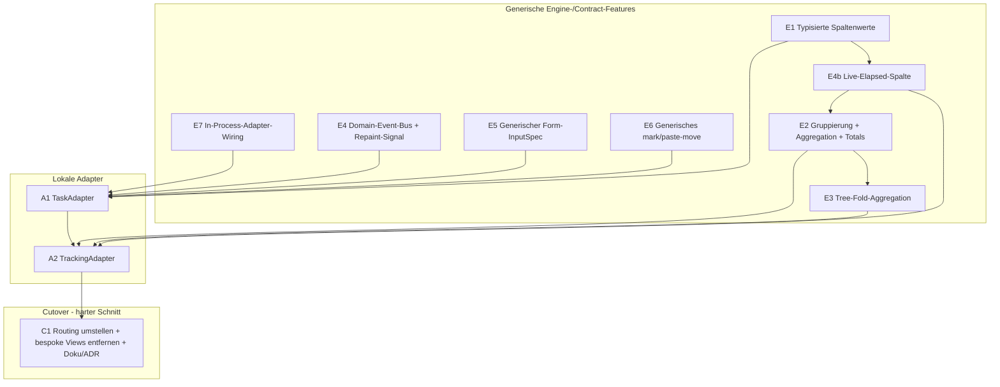

# Tasks & Trackings als ContentAdapter — Phasen-Plan

Status: **geplant** (noch keine Implementierung).
Grundlage: [`docs/adapterize-tasks-trackings.md`](adapterize-tasks-trackings.md)
(Analyse der Schwierigkeiten).
Tracking-Memory: `project_adapterize_tasks_trackings.md`.

## Ziel

Die heute bespoke nativen Tabs **Tasks** und **Trackings** vollständig
hinter den `ContentAdapter`-Contract bringen, sodass sie wie
Jira/Taiga/Postgres/Confluence/Stoat über `views/*.yaml` + Adapter laufen
und die generischen Features (Splits, Links, Action-Chains, Multiline,
Smooth-Scroll, Column-Cursor, Markdown, Retries) erben.

## Getroffene Entscheidungen (Eingangsbasis)

1. **Volle Uniformität.** Beide Tabs werden `ContentView`-getrieben; die
   bespoke `TasksView`/`TrackingsView` werden am Ende entfernt.
2. **Aggregation/Gruppierung wird ein echtes Engine-Feature** (Variante b),
   kein Adapter-Hack mit synthetischen Pseudo-Nodes. Alle Adapter
   profitieren davon.
3. **Keine Staleness.** Der Adapter muss regelmäßige Updates signalisieren
   können, ohne die TUI zu kennen. Gelöst über einen Core-Domain-Event-Bus,
   den Adapter in ihren Invalidation-Stream brücken; die TUI repaintet auf
   ein neues „soft refresh / repaint"-Signal.
4. **Sauberes Softwaredesign hat Priorität** vor Schnelligkeit.

## Leitidee

Die Capability-Lücken aus der Analyse werden als **generische
Engine-/Contract-Features** geschlossen (Phasen E\*), unabhängig
unit-testbar. Erst danach konsumieren zwei dünne **lokale Adapter**
(Phasen A\*) diese Features. Die nativen Views bleiben bis zur
verifizierten Parität bestehen und werden dann in einem harten Schnitt
entfernt (Phase C1).



## Querschnittsdesign (die neuen Mechanismen)

### M1 — Core-Domain-Event-Bus (löst Decision 3 + Tab-übergreifende Effekte)

Im Core ein `tokio::sync::broadcast` für Domänen-Events:

```text
DomainEvent::TaskChanged { id }
DomainEvent::TrackingStarted { task_id, tracking_id }
DomainEvent::TrackingStopped { task_id, tracking_id }
DomainEvent::TrackingTick            // 1 Hz, solange ein Tracking läuft
```

- Jeder Adapter abonniert die für ihn relevanten Events und **brückt** sie
  in seinen eigenen `subscribe_invalidations()`-Stream:
  - „harte" Änderung (neue Zeile, gelöscht) → `Invalidation::Node`/`All`
    (Refetch).
  - `TrackingTick` → neues, leichtes Signal `Invalidation::Repaint`
    (nur neu zeichnen, **kein** Refetch).
- Die TUI kennt weder Tasks noch Trackings: sie reagiert nur auf den
  generischen Invalidation-Stream. Der dirty-gated Render-Loop bekommt
  `Repaint` als Wake-/Dirty-Trigger.
- Cross-Tab: Ein Tracking-Toggle aus dem Tasks-Tab schreibt eine
  Tracking-Zeile und emittiert `TrackingStarted`; der TrackingAdapter
  refetcht, der Tasks-Marker aktualisiert sich, der App-/Waybar-Indikator
  hört am selben Bus. Adapter hängen nicht voneinander ab — nur am Bus.

### M2 — Typisierte Spaltenwerte (E1)

**Entscheidung: deklarativ am `ColumnDef`, nicht am `MetadataField`.**
Der Typ einer Spalte steht ausschließlich in der View-YAML; die Adapter
selbst bleiben unberührt. Begründung: `MetadataField` wird an ~50
Struct-Literal-Stellen über alle fünf Adapter-Crates konstruiert — ein
neues Pflichtfeld dort wäre Churn quer durch den ganzen Workspace, obwohl
nur Tasks/Trackings den Typ überhaupt brauchen.

- `ColumnDef` bekommt `kind: ColumnKind` (`text` | `number` | `duration`
  | `datetime` | `path`; serde-default `text`) plus optionale
  `format`/`separator`-Felder.
- Adapter liefern für typisierte Spalten **kanonische Strings**, die der
  Engine eindeutig zurückparst:
  - `duration` → Sekunden als Integer (`"3720"`),
  - `datetime` → RFC 3339 (`"2026-06-09T08:15:00Z"`),
  - `path` → mit `/` getrennte Segmente (`"/a/b/c"`),
  - `number` → Dezimalzahl als String.
- Der Engine-Formatter parst den kanonischen String pro `kind`, formatiert
  ihn fürs Display (`duration` über den vorhandenen `format_duration`
  → `H:MM:SS`, identisch zur bisherigen Trackings-Anzeige für Parität;
  `datetime` → lokalisiert), setzt die Ausrichtung (`number`/`duration`
  rechtsbündig) und stylt
  (`path`-Segmente mit Separator-Style über die vorhandene Theme-Farbe
  `taskpath_separator()`, Vorbild: bisheriger `build_taskpath_segments`).
- Remote-Adapter (Jira, Taiga, Postgres, Confluence, Stoat) bleiben
  implizit `kind: text` → **null** Änderung an `MetadataField` und an den
  Remote-Adaptern.
- Die kanonische Form ist zugleich die Basis, auf der M3 (Aggregation),
  M4 (Tree-Fold) und M5 (Live-Elapsed) rechnen, ohne den Anzeige-String
  rückparsen zu müssen.

### M3 — Gruppierung + Aggregation (E2)

`ViewDef`/View-State:

- `group_by`: Spaltenschlüssel **oder** Datums-Bucket (Day/Week/Month/Year),
  zur **Laufzeit umschaltbar** (View-State, kein Adapter-Roundtrip).
- `aggregates`: pro Spalte eine Aggregation (`sum` für Duration), liefert
  Gruppen-Total-Zeilen + Grand-Total-Footer.
- `summary_only`: Gruppen auf eine Zeile pro Gruppe kollabieren
  (= Trackings „Condensed").

> **Umgesetzt (Variante 3, Hybrid).** Der **generische** Partition-/Summen-
> Mechanismus liegt framework-agnostisch in `not-yet-done-table`
> (`group.rs`: `GroupPlan`/`PlanRow`/`group()`), die **typisierte** Extraktion
> (ISO-Datums-Buckets, Duration-Parsing) als reines TUI-Modul
> `views/group_aggregate.rs` (Spiegel von `column_format.rs`). Der gruppierte
> Render-Pfad sitzt in `content_view::build_grouped_table`; Laufzeit-Umschaltung
> via Aktion `cycle_grouping` (Default `zg`). Farbe der Header/Footer-Zeilen über
> Theme `group_header`. Gilt nur für einzeilige Flat-Tabellen (kein
> `row_layout`, kein Tree). Capability-only — noch an keine Live-View gebunden
> (wie E1/E4b bis zum Cutover A1/A2).

### M4 — Tree-Fold-Aggregation (E3)

Im Tree-Mode eine numerische Spalte über den Teilbaum kumulieren
(`own` vs. `cumulated`) — generisch, getrieben durch eine
`tree_aggregate`-Deklaration auf der Spalte.

> **Umgesetzt (adapter-getrieben).** Der Tree ist **lazy** (`TreeState.cache`
> hält nur den aufgeklappten Teilbaum) → die TUI kann nicht selbst falten.
> Deshalb: der **Adapter** liefert pro `NodeSummary` beide Werte als
> Metadatenfelder (Eigenwert unter dem Spalten-`key`, Summenwert unter
> `cumulated_field`) und deklariert die Fähigkeit
> `AdapterCapabilities.supports_tree_aggregation`. Die View-YAML deklariert
> `tree_aggregate: { cumulated_field, default: own|cumulated }` auf der Spalte;
> im Tree-Render-Pfad (`build_tree_data_rows`) liest die Spalte je nach
> Umschalt-Status das eigene oder das kumulierte Feld, formatiert mit der
> gleichen `kind:`. Laufzeit-Aktion `toggle_tree_aggregate` (Default `zt`,
> View-State, nicht persistiert) flippt **alle** `tree_aggregate`-Spalten der
> Ebene. Eigen- **und** Summenwert nebeneinander = zwei normale Spalten auf
> beide Felder (kein neuer Mechanismus).
>
> **Abweichung vom ursprünglichen Design (bewusst):** Das Gate auf die Aktion
> hängt an der **Config-Präsenz** (`tree_aggregate`-Spalte vorhanden), nicht an
> `supports_tree_aggregation` — TUI-Panes tragen heute **keine** Adapter-
> Capabilities (kein einziger `.capabilities()`-Aufruf im View-Layer). Das ist
> exakt der `cycle_grouping`-Präzedenzfall (M3, gated auf `level_has_group_by`,
> nicht auf eine Capability). Der View-Autor deklariert `tree_aggregate:` nur
> für Adapter, die das Summenfeld liefern, also ist Config-Präsenz das
> wirksame Gate. Capability-Plumbing in die Panes wäre ein eigener Cross-Layer-
> Pfad und wird, falls nötig, bei A1/A2 (M8-Wiring) nachgezogen.
>
> Tests auf zwei Ebenen: Config-Deserialisierung (`tree_aggregate`-Felder) und
> Render-/Toggle-Integration (`build_tree_data_rows` + `toggle_tree_aggregate`,
> own↔cumulated, No-op ohne Spalte). Capability-only bis A1/A2.

### M5 — Live-Elapsed-Spalte (E4b)

Spalten-`kind: elapsed` mit Begleitfeld `elapsed_from: <datetime-feld>`
(Default: der eigene `key` der Spalte). Der Engine rendert `now − feld`
beim Rebuild neu (kein Refetch). Sichtbares Ticken kommt vom `Repaint`-Signal
aus M1: der App-Repaint-Handler ruft `repaint_live_columns()`, das genau die
Panes mit einer `elapsed`-Spalte gegen ein frisches `now` neu baut. Damit ist
die laufende Dauer live ohne Staleness. (Encoding bewusst als eigener `kind` +
Begleitfeld statt parametrisiertem `elapsed_since(...)` — konsistent mit den
übrigen Begleitfeldern `format:`/`separator:` und ohne Mini-Parser im YAML.)

### M6 — Generischer Form-InputSpec (E5)

Neuer `InputSpec::Form { fields: Vec<FormFieldSpec> }` (Text, Select mit
`allowed_values`, NodePicker für Reparent …). Die TUI rendert ihn generisch
über `ratatui_form_widgets`; `execute()` bekommt die Feldwerte. Damit
bleibt das Task-Formular erhalten **und** wird ein wiederverwendbares
Feature (auch Jira-Create etc. könnten es nutzen).

> Fallback, falls Form zu schwer wird: Task-Edit als Text-Template
> (YAML-Buffer im `$EDITOR`, parse-back) wie Jira. Weniger UX, aber
> uniform. Primär: Form-InputSpec.

> **Umgesetzt (Form-InputSpec, kein Fallback nötig).** content-crate:
> `InputSpec::Form { fields: Vec<FormFieldSpec> }`, `FormFieldSpec`
> (`Text` / `Select{allowed_values}` / `Toggle`, je `key`/`label`/
> `required`/`default` + Builder), `ActionInput::Form(HashMap)` und der
> `Node::form_prep(action_id) -> HashMap` Hook für Edit-Prefill. TUI:
> generische, headless-testbare `ContentFormPopup`-Komponente (Stack aus
> `ratatui_form_widgets`, Feld-Fokus, Pflichtfeld-Validierung) +
> `ContentFormPopupState`, verdrahtet am `InputSpec`-Match in `app/mod.rs`
> (`form_prep` → Popup → `ActionInput::Form` → `execute`), Overlay-Render
> und Popup-Guards. **Scope-Entscheidung:** nur Text/Select/Toggle; der im
> Plan genannte **NodePicker (Reparent) ist auf E6 (mark/paste, M7)
> verschoben** — der Reparent-Pfad nutzt dort ohnehin das Clipboard-Move,
> und ein NodePicker-Widget existiert noch nicht. Das **native
> Task-Add/Edit (Markdown-`$EDITOR`) bleibt vorerst unangetastet** — E5
> baut nur den generischen Mechanismus + Tests; die Umstellung des
> TaskAdapters auf das Form passiert in **A1**. Tests: 7 Popup-Unit-Tests
> (Eingabe/Prefill/Select/Toggle/Validierung/Submit/Cancel) + 3
> content-Contract-Tests (Mock-Node: Form-Deklaration, `form_prep`,
> `execute` empfängt `ActionInput::Form`).

### M7 — Generisches mark/paste-move (E6)

`ActionContext` trägt einen **markierten Knoten** (Clipboard). Standard-
Action-Vokabular `mark-move` / `paste-move`; `invoke_action("paste-move",
ctx)` führt den Move im Adapter aus. Verallgemeinert das bespoke
mark/paste aus dem DB-Script-Folders-Plan (der darauf umgestellt wird).

### M8 — In-Process-Adapter-Wiring (E7)

`build_adapter_factories()` bekommt ein `CoreHandle` (DB-Connection +
`Arc<dyn TaskService>`/`Arc<dyn TrackingRepository>` + Event-Bus-Sender).
Task-/Tracking-Factory captured diese Handles. Erster In-Process-Adapter
über reine Lokaldaten — Pattern wird hier einmal sauber etabliert.

## Phasen

Jede Phase: implementieren → `cargo build --release` → `cargo install` →
Unit-Tests → Commit. Smoke-Tests zentral in `docs/smoke-tests.md`.

### Engine-/Contract-Features

- **E0 — Plan + Memory** (dieses Dokument + Memory-Eintrag), committet vor
  Implementierung (übersteht `/compact`).
- **E7 — In-Process-Adapter-Wiring (M8).** `CoreHandle`, Factory-Signatur,
  No-Op-`LocalAdapter`-Skeleton zum Beweis der Verdrahtung, Registrierung.
- **E4a — Domain-Event-Bus + Repaint-Signal (M1).** Core-Broadcast,
  `Invalidation::Repaint`-Variante, Render-Loop-Wake darauf. Bridge-Helper
  für Adapter. Tests: Event → Invalidation → Dirty-Flag.
- **E1 — Typisierte Spaltenwerte (M2).** `value_kind` auf `MetadataField`,
  `kind`/`format` auf `ColumnDef`, Engine-Formatter + Path-Styling. Tests.
- **E4b — Live-Elapsed-Spalte (M5).** `kind: elapsed_since`, Per-Frame-
  Recompute, Repaint-getriebenes Ticken. Tests (deterministisch über
  injizierte `now`).
- **E2 — Gruppierung + Aggregation (M3).** `group_by` (inkl. Datums-Buckets,
  laufzeit-umschaltbar), `aggregates`, Gruppen-Header/-Total, Grand-Total,
  `summary_only`. Tests auf drei Ebenen: Engine-Mechanismus
  (`not-yet-done-table::group`), typisierte Extraktion (`group_aggregate`) und
  Render-Pfad-Integration (`build_grouped_table` im View-Layer).
- **E3 — Tree-Fold-Aggregation (M4).** Kumulation über Teilbaum,
  `own`/`cumulated`. Tests.
- **E5 — Generischer Form-InputSpec (M6).** `InputSpec::Form` +
  `FormFieldSpec`, generische Form-EditSession in der TUI. Tests.
- **E6 — Generisches mark/paste-move (M7).** `ActionContext.marked`,
  Standard-Actions, DB-Script-Folders-Pattern darauf konsolidieren. Tests.

### Lokale Adapter

- **A1 — TaskAdapter.** Wrappt `TaskService`. Tree über `parent_id`
  (eager-load + cache, `search_in_tree`), Spalten via E1, Filter als
  `FilterExpr` (Query-String → bestehende Core-Übersetzung),
  `saved_query_store` auf den bestehenden DB-Tabellen (Scope `task`,
  keine Datenmigration). Aktionen: add/edit (Form via E5),
  reparent (Form oder mark/paste via E6), delete (`DeleteSelf`),
  undelete/restore (View-Level-Actions am Root-Node), notes, scripts,
  tracking-toggle (emittiert `TrackingStarted/Stopped` auf den Bus).
  `views/tasks.yaml`.
- **A2 — TrackingAdapter.** Wrappt `TrackingRepository` + Task-Tree für
  Pfade. Typisierte Taskpath-Spalte (E1, `Path`-Style), Grouping/Condensed
  (E2), Tree-Fold own/cumulated (E3), Live-Dauern (E4b), Delete/Restore/
  Restore-All, scripts, Filter, tracking-toggle. Brückt `TrackingTick` →
  `Repaint`. `views/trackings.yaml`.

  > **Mitzunehmen (Follow-up aus E3, M4):** Hier den **Capability-Gating-
  > Pfad** sauber etablieren. Heute werden UI-Affordanzen durchgängig über
  > YAML (`actions:`, `tree_aggregate:`, …) gegated, nicht über
  > `AdapterCapabilities` — kein View-Layer-Code ruft `.capabilities()` auf.
  > Beim In-Process-Wiring (M8) liegt der Adapter ohnehin vor (er wird schon
  > in `action_bar_hints(... adapter)` durchgereicht); deshalb hier **einmal
  > generisch**: Capabilities (`supports_tree_aggregation`, `supports_create`,
  > `supports_delete`, `supports_search`, …) entweder in den Claim-Builder
  > reichen (analog zu den Hints) **oder** beim Pane-/View-Binding einmal in
  > ein Pane-Feld snapshotten. Dann `toggle_tree_aggregate` (und künftige
  > Affordanzen) zusätzlich auf die jeweilige Capability gaten statt nur auf
  > Config-Präsenz. Narrow-Einzelfix bewusst vermieden — siehe M4-Box.

### Cutover (harter Schnitt)

- **C1 — Routing + Aufräumen (ein Schritt).** Erst die Paritäts-Checkliste
  (siehe unten) am Adapter-Pfad verifizieren. Dann in einem Zug:
  Render-Dispatch leitet Tasks/Trackings durch `ContentView`, und die
  bespoke `TasksView`/`TrackingsView` + toter Code werden entfernt — kein
  Übergangs-Flag, keine Fallback-Route. Doku: README,
  `docs/generic-view-spec.md` (neue ViewDef-Felder), `docs/smoke-tests.md`.
  **ADR** in `docs/decisions/` zu Domain-Event-Bus, Engine-Aggregation und
  In-Process-Adaptern.

## Parität (Cutover-Gate)

Vor C2 müssen über den Adapter-Pfad funktionieren:

- Tasks: Tree expand/collapse, `/`-Suche durch kollabierte Knoten, add/
  edit/reparent, delete + undelete, notes, scripts, Tracking-Toggle,
  Saved Queries + Shortcuts + Spalten-Config.
- Trackings: Normal/Condensed/Tree, Grouping Day/Week/Month/Year mit
  Totals + Footer, Live-Dauern (tickend), Taskpath-Spalte gestylt,
  Delete/Restore/Restore-All, scripts, Filter, Saved Queries.

## Bewusst außerhalb des Scopes (mögliche Follow-ups)

- „Trash als Teilbaum" (gelöschte Items als navigierbarer Node-Typ mit
  per-Item-Restore) — zunächst genügen Root-Level-Restore-Actions.
- Migration der Jira-/Postgres-Editing-Pfade auf den neuen Form-InputSpec.
- Persistenz-Umzug der Saved Queries vom bestehenden Store auf den
  generischen Adapter-Store (vorerst bleibt der bestehende Store hinter
  dem Adapter).

## Entschiedene Mikro-Entscheidungen (2026-06-09)

1. **Task-Edit:** generischer Form-InputSpec (M6/E5). Uniform und
   wiederverwendbar.
2. **Reparent:** mark/paste-move (M7/E6) — ein Mechanismus für Tasks und
   DB-Script-Folders.
3. **Undelete/Restore-All:** Root-Level-View-Actions am Root-Node (kein
   Trash-Teilbaum).
4. **Cutover:** **harter Schnitt** — kein Übergangs-Flag, keine
   Fallback-Route auf die nativen Views. C1 und C2 fallen zusammen:
   Routing-Umstellung und Entfernen der bespoke Views passieren in einem
   Schritt, sobald die Parität (siehe unten) am Adapter-Pfad verifiziert
   ist.
