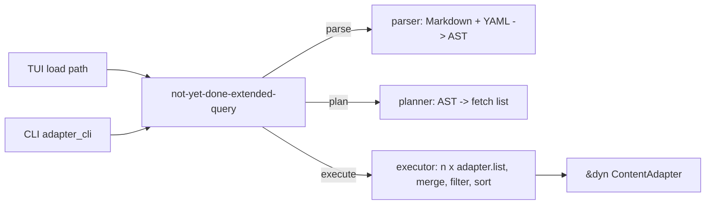

# Plan: Extended Queries

Status: **implementation under way** — phases 1–4 done, phase 5 under way (the
adapter bridge and the root-level load landed), phases 6–7 open
(2026-08-11). See section 8 for the phase list.

A framework that lets a user combine several adapter-native queries with
set operations, filter each result locally, and impose an explicit order —
without any adapter having to know that it happened.

## 1. Problem

Every adapter speaks its own query language (JQL, CQL, SQL, the YAML
`FilterExpr` DSL). A view can hold exactly one such query at a time, and it
is passed through to the adapter as an opaque string (`ListParams::query`,
`not-yet-done-content/src/lib.rs:317`). There is no way to say "everything
assigned to me, plus everything mentioning this token, minus what I already
closed" unless the backend's own language happens to express it — and no way
at all to filter on a locally stored column.

## 2. File format

An extended query is a **Markdown document**. The Markdown container is what
keeps the format unambiguous: a bare YAML file could not be told apart from
the YAML-`FilterExpr` bodies that the local, tracking, taiga and calendar
adapters already store as their native query.

````markdown
```yaml
or:
  - query: assignee = currentUser() OR key = ${key}
    local_filter:
      - [my_custom_column, ">", 5]
      - [my_other_custom_column, "=", hello]
  - and:
      - query-ref: mentioned_in
      - query: summary ~ "Some Summary"
order_by:
  - updated: desc
  - summary: asc
```

Free prose may sit between the fences — that is the point of using Markdown.

```jql mentioned_in
comment ~ "SOMETOKEN" AND updated >= -30d
```

```jql by_key
assignee = currentUser() OR key = ${key}
```
````

Rules:

- The **first `yaml` fence without a name** is the specification. Every fence
  **with** a name (`jql mentioned_in`) is a library entry addressable via
  `query-ref:`.
- The fence's info-string names the **query language**, not just the syntax
  highlighting. It is validated against the adapter (see
  `query_language()` in section 6); a mismatch is an error, not a silent
  pass-through. Omitting the language means "the adapter's own".
- `query:` is an inline literal, `query-ref:` a reference to a named fence.
  (`q:` may be accepted as an alias for `query:`.)

### Default template

What the editor scaffolds for a _new_ extended query — a pure pass-through,
behaving exactly like the conventional query it wraps:

````markdown
```yaml
and:
  - query-ref: default
```

```jql default
# the conventional query goes here
```
````

## 3. Semantics

### Nodes

| Key             | Meaning                                                      |
| --------------- | ------------------------------------------------------------ |
| `query:`        | inline adapter-native query; produces a result set           |
| `query-ref:`    | named fence; produces a result set                           |
| `and:`          | intersection of its operands                                 |
| `or:`           | union of its operands                                        |
| `without:`      | first operand minus all following ones                       |
| `local_filter:` | predicate applied to the set produced by the node it sits on |
| `order_by:`     | document-level sort (top level only)                         |

`not:` exists only inside `local_filter` (it is part of `FilterExpr`). A
unary `not` on a fetch node is impossible — there is no universe to
complement against. `without:` covers the useful cases.

### local_filter

`local_filter` is an **attribute of a node**, never a sibling operand. That
placement is what makes it unambiguous: the node it hangs on brings its own
result set, so the question "filtered against which base set?" cannot arise.
It is allowed on any node that produces a set — `query:`, `query-ref:`,
`and:`, `or:`, `without:`.

Its value is a list of `FilterExpr` leaves, implicitly AND-ed. Leaves are
written in the existing DSL form (`[column, op, value]`), so the whole
operator set, `not`/`in` nesting, column-vs-column comparison and
natural-language date resolution come for free. An infix short form
(`my_column > 5`) is a possible later addition, not part of the first
iteration — quoting and escaping make it less cheap than it looks.

Operators (from `not-yet-done-filter/src/expr.rs:112`):
`=`/`==`/`eq`, `!=`/`<>`/`ne`, `>`/`gt`, `>=`/`ge`/`gte`, `<`/`lt`,
`<=`/`le`/`lte`, `like`, `not_like`, `has` (substring), `is_null`,
`is_not_null`, `in`, `not_in`, plus the task-only `has_ancestor`/`in_tree`.

### Identity and deduplication

Set operations key on `NodeSummary::id`. On union the **first occurrence
wins** — including its hydrated fields, which may differ between branches.

### Ordering

`order_by` is a list of single-key maps; list position is sort significance.
A bare string is shorthand for ascending. This maps 1:1 onto the existing
`SortKey { column, direction }` and is applied with
`not_yet_done_content::apply_sort` (`not-yet-done-content/src/lib.rs:471`) —
stable, least-significant-key-first, resolving each key through
`SortableColumn`'s `SortKind`.

Rules:

- **Default order is merge order** — tree walked left to right, first
  occurrence fixing the position. Deterministic (rows must not jump between
  reloads) and, crucially, it makes the single-branch default template a true
  pass-through: the adapter's own `ORDER BY` survives untouched. A native
  `ORDER BY` only becomes meaningless once branches are actually combined;
  warn there, when `order_by` is absent and the tree has more than one fetch.
- **Unknown sort keys are surfaced, not swallowed.** `apply_sort` silently
  drops keys it cannot resolve, which is right for the interactive `S` sort
  but wrong here — the user wrote the key deliberately.
- `order_by` is the pane's _initial_ sort, not a lock. Interactive sort wins
  and is reported back through `applied_sort` so the header arrows stay
  truthful.

### Local columns are sortable here

The custom-columns decorator injects its cells _after_ the inner adapter's
`list()` returned (`not-yet-done-custom-columns/src/decorator.rs:240`) and
passes `sortable_columns` through unchanged — so custom columns cannot be
sorted today: the adapter sorts before the cells exist.

The extended framework does not have that problem, because it sorts after the
merge, when the cells are long since injected. It only needs the `SortKind`,
which it derives from `describe_columns()` → `ColumnSchema::value_type`
(`text`/`number`/`duration`/`datetime`, `not-yet-done-content/src/lib.rs:416`)
→ `SortKind::{Text, Number, Number, DateTime}`. Calling `apply_sort` with the
union of adapter `SortableColumn`s and described custom columns makes local
columns sortable as a side effect, at no extra cost. The same union is what
`local_filter` resolves its column references against.

### Pagination

Intersection and difference cannot be computed page-wise, so every branch
must be fetched **completely**. Consequences:

- the pane falls back to `PaginationMode::All`; paging happens engine-side
  over the merged set;
- each branch needs a `limit:` and a visible truncation signal — silently
  turning "5000 Jira hits" into "the first 100" is the failure mode to avoid;
- branches are fetched concurrently, and identical rendered query texts
  within one run are executed once (memoised per run).

### Variables

`query_variables()` is collected across all branches and de-duplicated, so a
`${key}` appearing in three branches is prompted **once**; `render_query` then
runs per branch with the same binding. If two branches declare conflicting
defaults for the same name (`${key:A}` vs `${key:B}`), the first declaration
wins and a warning is emitted.

## 4. Storage

| Artefact                  | Location                                                 |
| ------------------------- | -------------------------------------------------------- |
| extended query documents  | `<instance_data_dir>/extended_queries/<name>.md`         |
| conventional query bodies | `<instance_data_dir>/queries/<name><suffix>` (unchanged) |
| shortcuts / ★ default     | DB `query_shortcut`, `settings` (unchanged)              |

`instance_data_dir` is `<data_local_dir>/not_yet_done/<adapter_type>/<instance_id>`
(`not-yet-done-content/src/lib.rs:1667`).

A **separate store trait** (not a second root under the existing
`SavedQueryStore`): `SavedQueryStore::list()` is rendered 1:1 as the picker,
so mixing both kinds into one flat namespace would force every consumer to
guess what it is holding. Two stores, two namespaces — one menu with two
sections.

**Names are unique across both stores, per scope.** The distinction between a
saved and an extended query is deliberately invisible to the user — two menu
entries called `foo` would be meaningless. Creation therefore validates the
typed name against _both_ stores and refuses a collision (offering to open the
existing entry instead).

A **`kind` column** (`saved` | `extended`) is still added to `query_shortcut`,
existing rows migrated to `saved` — not to disambiguate names, but so that a
stored shortcut resolves deterministically to the store that owns its body,
instead of probing both. The same applies to the `default_query:{scope}`
setting, which records the kind alongside the name.

## 5. Frontend integration

### Menu

Extended queries appear in the existing query menu (`q`) as ordinary entries —
same flat list, no separate section, no marker. The user picks a query; that
it happens to fan out to three backend calls is the framework's business.

Creation gets two prefixes, both input syntax only (the menu never lists them):

| Typed        | Effect                                                            |
| ------------ | ----------------------------------------------------------------- |
| `+Name`      | force-create a **saved** query, even if a fuzzy match is selected |
| `++Name`     | force-create an **extended** query                                |
| `Name` (new) | unchanged: creates a saved query when nothing matches             |

`+` does not exist in the query menu today — Enter takes the fuzzy-selected
entry and only falls through to `CreateNew` when nothing is selected
(`not-yet-done-tui/src/components/query_menu.rs:174`). The script menu already
has exactly this `+` idiom for the same purpose
(`not-yet-done-tui/src/components/script_menu.rs:142`), so `+` is introduced
here for symmetry and `++` reads as its natural extension rather than as a
rule out of nowhere.

### Load feedback

An extended query fans out to _n_ backend calls, so a silent wait is a worse
failure mode than it already is. Most of the machinery exists:
`AdapterStatus::Busy { label, started_at_unix_ms, timeout_secs, progress }`
formats as `"Label… 45 % (12s/30s)"` (`busy_banner`,
`not-yet-done-tui/src/views/content_view.rs:11788`), and the render loop arms a
1 Hz ticker while any view is busy (`has_live_banner` → `needs_periodic_tick`,
consumed in `not-yet-done-tui/src/main.rs:264`).

#### Where a banner may appear

Three surfaces exist today, and one of them is already tab-local:

| Surface                                                | Visibility                                      | Fed by                                             |
| ------------------------------------------------------ | ----------------------------------------------- | -------------------------------------------------- |
| view banner line (`content_view.rs:10537`)             | **active tab only** (drawn inside the tab area) | `auth_status_banner()` — `Busy`, auth, fetch error |
| prominent alert bar (`render.rs:79`, `App::alert_bar`) | global, across tabs                             | `notify` actions with `prominent: true` (e.g. MFA) |
| bottom notification bar                                | global                                          | ordinary `notify` actions                          |

So `Busy` already renders tab-locally. Two things are missing:

- **The choice is not configurable.** Add `notifications.load_banner:
tab | global | off` (default `tab`), overridable per view file so a single
  tab may be loud. Precedent: `alert_enabled`
  (`not-yet-done-tui/src/config/tui_config.rs:268`) already downgrades
  prominent messages to the bottom bar. Defaults differ by message class on
  purpose — an MFA challenge _must_ be global (otherwise the user never learns
  from another tab that something is waiting), whereas a load counter is
  cross-tab noise. A globally routed banner must name its tab
  (`"Jira — Loading… 40 % (3s)"`); a tab-local one must not.
- **The two surfaces have opposite ownership models**, and only one of them
  suits a live message.

  The tab-local line is **pull**: nothing is stored. `Busy` carries
  `started_at_unix_ms`, and `busy_banner` recomputes `now − started_at` on every
  frame; when the status leaves `Busy` the line is simply not drawn. The 1 Hz
  ticker only ensures a frame happens at all while the app is otherwise idle.

  The alert bar is **push**: the text _is_ state (`messages: Vec<String>`),
  appended by `push` and retracted by `remove(&msg)`, which deletes the first
  value-equal entry (`not-yet-done-tui/src/app/mod.rs:1714`).

  A ticking entry there is not impossible — `remove(previous) + push(next)` once
  per second, remembering last second's exact string, is exactly what
  `event_notices` already does. It breaks down for two concrete reasons.
  **Collision:** two tabs loading at once produce identical strings (a
  tab-local wording carries no tab name), so `remove` deletes an arbitrary one
  of the duplicates and the message stays on screen after the first tab
  finished. **Bookkeeping:** every ticking sender must retain its last exact
  string forever, and any lapse leaks the message permanently. That is
  affordable for `event_notices`, which holds one static message per
  connection, and not for _n_ tabs re-pushing every second.

  **Keyed slots** fix both by changing identity from "same text" to "same
  sender": `set_keyed(key, text)` overwrites instead of remove-then-append, and
  `clear_keyed(key)` cannot hit the wrong entry. `key = (view, class)`. The same
  change retires the `event_notices` string-matching workaround.

- **Multi-line growth already works; the cap is what needs attention.**
  `required_height` wraps every message to the available width, sums the lines
  and caps at `max_lines` (`notification_bar.rs:78`); `view` renders a bullet on
  the first line and indents continuations by two columns. The alert bar's cap
  defaults to 3 (`default_alert_max_lines`, `tui_config.rs:284`).

  What the cap does is **truncate silently** — anything that does not fit is
  simply not drawn, with no indication. Harmless today, because the bar rarely
  holds more than one message; dangerous with live keyed slots, where several
  tabs fill three lines quickly and a load counter can push out the MFA prompt,
  i.e. the very message the bar is global for. Three additions:
  - **Priority before capping.** Sort slots by class — auth/MFA, then errors,
    then load counters — so scarcity always evicts the least actionable
    message, never the most.
  - **Show the overflow.** When truncated, the last line ends in `(+2 more)`.
  - **Collapse load counters.** Several tabs loading at once render as _one_
    line (`"3 tabs loading… (4s)"`) instead of _n_, which keeps the bar small
    enough that the cap rarely binds. Cheap, because slots are keyed by class
    anyway.

  The cap itself stays, and stays configurable: an unbounded bar eats the
  table, and the user only notices once the content is gone.

#### Where the busy state comes from — free for the adapter

Only postgres and calendar _push_ `Busy` today; a Jira query loads with no
banner at all. Of the three possible seams, two are dead ends:

- **A trait default cannot work.** A default method cannot wrap `list()` —
  Rust offers no interception point inside a default impl.
- **A host decorator** around every adapter (like `anonymizing` / `scripts` /
  `custom_columns`) would have to _pretend to own_ the status channel:
  intercept `subscribe_status()`, forward the inner adapter's messages and
  overlay its own. Worse, it sees **every** `list()` — hydration calls and
  other decorators' sub-fetches included — none of which the user perceives as
  "a load", so the banner would flap. And it cannot tell that five parallel
  calls are one extended query.

The **call site** knows all of it: the exact in-flight window, which loads are
user-visible, and how many branches are outstanding. Therefore:

- `ContentPane` gains `in_flight: Option<InFlightLoad { label,
started_at_unix_ms, timeout_secs, total: Option<usize>, done: usize }>`, set
  in `spawn_content_load` / `spawn_content_drill_down`, cleared when the result
  `LoadMsg` arrives.
- `auth_status_banner()` gains a fallback branch through the existing
  `busy_banner()` — same formatting, no second render path.
- `has_live_banner()` also returns true while any pane is in flight, so the
  existing 1 Hz ticker arms itself.
- The extended executor reports each finished branch upwards → `done` / `total`
  → fills the existing `progress` field, which already renders as a percentage.

For an adapter this is **zero lines**: implementing `list()` with a query is
enough to get the elapsed-seconds banner. An adapter that can do better — real
label, real timeout, incremental progress like postgres and calendar — keeps
pushing `Busy` and keeps precedence, because it is the more specific message.
Reporting turns from an obligation into a refinement.

One limitation follows from the seam: the caller does not know the adapter's
timeout, so the synthesised banner reads `(3s)` rather than `(3s/30s)`. That is
not a special case — `busy_banner` already treats `timeout_secs == 0` exactly
this way.

This whole subsection is useful independently of extended queries and can land
before them.

## 6. No adapter boilerplate

An adapter that implements a normal query gets extended queries for free.
The framework needs only `list()` plus trait methods that already have usable
defaults: `query_variables` / `render_query`
(`not-yet-done-content/src/lib.rs:2060`, `:2074`) and `describe_columns`
(`:2211`).

The single addition is `ContentAdapter::query_language() -> &str` for fence
validation, and even that gets a default derived from the existing
`query_body_suffix()` (`.jql` → `jql`, `.cql` → `cql`, `.yaml` → `yaml`), so
no adapter has to be touched.

## 7. Placement

A new crate `not-yet-done-extended-query`, sitting **above** the adapter, not
as a decorator around it. A decorator would see `ListParams::query` as an
opaque string and would have to guess from its content whether an extended
document is in play, and would then have to route its own sub-fetches back
through itself. The natural seam is where `render_query` + `content::list`
are already called.



Three modules, all frontend-free and unit-testable:

- `parse` — Markdown container + YAML spec + named fences → AST
- `plan` — AST → list of fetches, variable union, language validation
- `exec` — runs the fetches against a `&dyn ContentAdapter`, merges, applies
  `local_filter`, sorts, returns one `ListResult`

## 8. Phases

1. ~~**Crate skeleton + parser.**~~ **Done.** `not-yet-done-extended-query`
   with `ast` / `markdown` / `parse`. Two notes for later phases:
   `check_languages` is a separate entry point rather than part of `parse`,
   because the adapter is known only at execution time and a document must
   stay parseable — and therefore editable, and therefore fixable — without
   one; and `query_filter::resolve_dates` became `pub` in
   `not-yet-done-filter` so a `local_filter` resolves dates exactly like a
   saved query's `query:` instead of growing a second walk that could drift.
2. ~~**Row evaluator for `local_filter`.**~~ **Done.** The calendar's
   evaluator now lives in `not-yet-done-filter::eval`, generalised over a
   `RowFields` trait; the calendar keeps only its column mapping and delegates
   the rest. `not-yet-done-extended-query::rows` implements the trait for
   `NodeSummary` via `ColumnTypes`, the union of adapter `SortableColumn`s and
   described `ColumnSchema`s that phase 3 also sorts by. Three things fell out
   of it:
   - `Field::Number` was added, since custom columns are numeric and comparing
     them as text makes 5 > 10;
   - an empty or type-contradicting cell (`1h 30m` in a `duration` column,
     `running` in a `datetime` one) reads as **absent** rather than comparing
     wrongly, which is also what makes `is_null` meaningful on a row;
   - `query_filter::try_resolve_date` now refuses bare numbers — it read `5`
     as a year in antiquity and `5.5` as the time 03:05, so a quoted number on
     the right-hand side used to match nothing at all.
3. ~~**Executor.**~~ **Done.** `executor.rs`: concurrent branch fetch with
   memoisation, set algebra by id, merge-order default, `apply_sort` over the
   union of adapter and described custom columns, truncation reporting. It
   talks to the adapter through its own three-method `Backend` trait rather
   than `ContentAdapter`, so a run needs no node, parent id or `ListParams` —
   the caller owns that plumbing and the set algebra stays testable against a
   table of fixed answers. Four decisions the code alone does not explain:
   - **`limit` runs before `local_filter`**, on every node kind. It is the
     only order under which a limit can bound a _round-trip_; a filter running
     first could only shrink what was already paid for.
   - **The fetch budget is `limit + 1`.** Asking for exactly the limit cannot
     tell a complete result from a cut one, which is the whole point of
     reporting truncation.
   - **Memoisation keys on the rendered text _and_ the budget**, and
     `parse` now trims a fetch's trailing whitespace — a fence always ends in
     a newline and an inline `query:` never does, so without it the same query
     written both ways would pay for two round-trips.
   - **`local_filter` and `order_by` resolve against the typed columns _plus_
     every metadata key the returned rows carry.** The typed set alone is too
     narrow (an adapter advertises what it can sort, its rows carry more);
     untyped columns compare as text, exactly as they do elsewhere. What the
     union still catches is the typo, which would otherwise fall back to the
     label and compare against something unrelated. On an empty result set
     both checks are skipped rather than rejecting a good column name in the
     one case where it changes nothing.
4. ~~**Store + persistence.**~~ **Done.** `ExtendedQueryStore` as its own
   trait, `FsSavedQueryStore` renamed to `FsQueryStore` and implementing
   both (one file layout, two roots and suffixes); `existing_query_kind` for
   the cross-store name check; `QueryKind` / `DefaultQuery` for the encoded
   setting value; `query_shortcut.kind` with the `add_query_shortcut_kind`
   auto-migration. Four decisions worth keeping:
   - **`extended_query_store()` is a default method returning an owned box.**
     The store is stateless — a root path and a suffix — so there is nothing
     to borrow from and no adapter needs a field, which is what section 6
     promises. The gate is `saved_query_store().is_some()`: having a normal
     query story is exactly the precondition, and Postgres keeps opting out
     without saying so a second time. Decorators inherit it for free, since
     they all forward `saved_query_store` and `instance_data_dir`.
   - **The setting splits at the _first_ colon and accepts only a known
     prefix.** A legacy value is a bare name that may itself contain a colon
     (`urgent: mine`); splitting at the last one, or rejecting unknown
     prefixes, would silently drop such a default instead of reading it as
     the saved query it is.
   - **`kind` is rewritten on every `set`, not just on insert.** Names are
     unique across both stores, so a name reappearing under the other kind
     means the old body is gone — leaving the stale kind would point the row
     at a store that no longer holds it.
   - **The text-uuid fix carries `kind` along.** It is a delete-and-reinsert
     with an explicit column list, so a hard-coded one would quietly reset
     every rewritten row to `saved`. Script shortcuts share the table and
     keep the default: they resolve through their scope, never through the
     kind.
5. **Frontend wiring.** `+name` / `++name` creation, editor session for `.md`
   bodies, shortcut and `query.default` resolution through `kind`, drill-down
   re-execution; CLI equivalent.
   - _The bridge is done._ `adapter::AdapterBackend` binds the executor's
     `Backend` to `children::list` under one node and child type — all
     branches share those coordinates, since a document combines queries, not
     places. `prepare` (parse + language check) is exposed next to `run`
     because bindings have to be collected from the parsed document before the
     run, and `ContentAdapter::query_language()` derives its default from
     `query_body_suffix()` so no adapter had to be touched. A branch fetch
     asks for no sort (the document orders after the merge) and pages only
     when a `limit` says to, which is what `PaginationMode::All` already
     means.
   - _The root level runs._ `kind` now rides from the store through
     `MergedSavedQuery` → `ContentPane` → `LoadRequest` into the loader, which
     branches to the executor instead of `children::list`. It has to ride
     along: nothing in a body says which store it came from, and a `yaml`
     adapter's own query would be indistinguishable from a spec fence.
     Consequences worth naming:
     - The variable prompt runs `document_variables` (parse + language check +
       scan across branches) instead of `ContentAdapter::query_variables`, so
       a document that does not parse is refused where the user can still fix
       it. It needs no node — declaring variables is a property of the query
       language, not of the place being listed.
     - An extended result carries no `PageInfo`: the merge is complete by
       construction, so there is no server page to continue from.
     - The pane's own sort still wins over the document's `order_by`, which
       keeps `s` working in an extended view.
     - Warnings (truncation, lost native order) reach the user as
       `LoadMsg::Notify` — they are notes on a _successful_ load, and the
       `error` field would paint it as failed.
     - Eager subtree pre-expansion is skipped for extended documents:
       `list_subtree` is one adapter call for the whole tree and cannot be
       split per level. The tree still opens lazily; only the eagerness is
       lost.
   - _Child levels re-run the document._ Drill-down and tree-expand are
     `children::list` under one parent, so decision 5 holds literally: the
     same document runs again with the parent as its coordinates.
     `subtree_query_for_pane` therefore returns the kind and — for an extended
     document — the _unrendered_ body plus its bindings, since each branch
     renders separately. Only the adapter-specific live paths cannot follow:
     `live_group_rows` recomputes a bucket under one native query, and the
     now-bucket refresh is another `list_subtree`. Both sit the tick out for an
     extended pane instead of refreshing it against a query it isn't showing;
     the rows update on the next reload.
   - _Creation and editing._ The query menu learned the `+` / `++` prefixes
     above, and the kind they pick travels through `OpenContentQueryEditor`
     into the edit session and back out on commit, deciding the editor's
     suffix, the template a new entry starts from, and the store the buffer is
     written to. Again it has to be stated rather than looked up: a query being
     created has no entry to look it up from. What fell out of it:
     - A new extended document starts from the framework's passthrough
       template, not the view's `query.template` — the latter is a single
       adapter-native query, which is exactly what a document is not.
     - Creation refuses a name either store already holds, naming the kind
       that holds it. The two share one namespace and the menu shows no
       difference between them, so an overwrite would destroy a body the user
       cannot see. A store that fails to list refuses too: "unreadable" is not
       "free".
     - Delete, save-on-shortcut-bind and the `default_query` setting all pick
       their store by kind now. They resolve it by name through the merged
       menu list — the list the user picked the entry from — rather than
       carrying it in every request.
     - `SavedQueryEditSession` no longer hard-codes `.yaml` for its editor
       buffer; it takes the suffix of the store the body came from, which also
       fixes `.jql` / `.cql` bodies opening as YAML in `:query edit`.
     - `:query new` stays adapter-native (a document wants the template that
       only the menu path can supply), but its collision check now covers both
       stores instead of only its own file path.
   - _The CLI runs stored queries of either kind._ `ls --query-name NAME`
     resolves the name through both stores and routes on the kind it finds;
     `queries` lists what there is to name; `--var name=value` binds the
     variables the TUI would prompt for. All of it in `adapter_query.rs`, so
     `adapter_cli.rs` keeps only the printing. What is worth knowing:
     - **A body and a reference to one are different flags.** `--query` keeps
       taking a body in the adapter's language, `--query-name` takes a name,
       and passing both is an error. An `@name` sigil on `--query` was
       rejected: it would make a body starting with `@` unaddressable, for no
       gain over one more flag.
     - **The kind still comes from the store, never from a flag.** The TUI
       reads it off the merged menu list; the CLI has no menu and asks
       `existing_query_kind` instead. Same rule, same reason: nothing in a body
       says which store it came from.
     - **An unbound variable is an error, not a guess.** A CLI cannot prompt,
       and passing the placeholder through would run a query nobody asked for.
       A variable with a default is fine — rendering falls back to it, exactly
       as confirming the TUI's prompt unchanged does. This also fixes `--query`
       bodies, whose variables previously reached the adapter as literal text.
     - **`--tree` refuses an extended document.** `list_subtree` is one call
       per subtree, and a document is not one query; the TUI has the same limit
       and skips its eager pre-expansion. Levels list one at a time.
     - **`queries` prints the kind, the menu does not.** The CLI is where a
       query is scripted and debugged, and the kind says which language the
       body is in and which directory holds the file. In the TUI the two stay
       interchangeable, as decided in section 9.
     - **`queries` answers before the connection is built**, like `help`: both
       stores sit next to the instance's data, so prompting for credentials to
       print local file names would be a connection nobody asked for.
     - Authoring bodies from the CLI is deliberately absent — no saved query
       could ever be created there either, so there is no equivalent to widen.
       `+`/`++` remain the menu's.
6. **Load banner.** Three independent steps, in this order (section 5):
   6a. keyed slots on the alert bar, replacing exact-string retraction, plus
   class priority before capping and an `(+N more)` overflow marker;
   6b. `notifications.load_banner` routing (`tab` / `global` / `off`) with
   per-view override, tab attribution for globally routed banners and the
   collapsed multi-tab counter;
   6c. call-site-synthesised `Busy` (`ContentPane::in_flight`) for every
   adapter, plus the branch-progress fraction fed by the executor from
   phase 3. Only 6c depends on the executor; 6a and 6b stand alone and may
   land before phase 1.

   _6a and 6b are done. Two deviations from section 5, both narrowing:_
   - **Two message classes, not three.** Section 5 asks for auth/MFA, then
     errors, then load counters. Nothing produces that middle rank: an MFA
     challenge reaches the bar as an ordinary `type: notify` action with
     `prominent: true` and carries no class, so auth and error are the same
     thing to the bar. The classes are therefore `Message` and `Load`, which
     still buys the guarantee the section is about — a counter can never
     evict a message the user has to answer.
   - **The collapsed counter moved from 6a to 6b**, because the bar is the
     wrong place to count: it sees slots, not tabs, and cannot tell two
     loading tabs from one tab that re-pushed. The App can, so it keeps
     **one** slot for every globally routed tab: one tab names itself in it,
     several collapse into `"3 tabs loading… (4s)"`. Elapsed runs from the
     oldest start, so the number never jumps backwards when a fast tab
     finishes.

   _Also decided while building 6b:_ only `Busy` is routable. A retry, a fetch
   error, a login prompt or a `manual_connect` hint stays on the tab's own line
   whatever the route says, because each of them names a place the user has to
   go — routing them to a shared bar would strip exactly that. And `off` really
   means off: `has_live_banner()` ignores such a tab, so no 1 Hz repaint is
   spent on a counter nobody sees.

7. **Docs.** User-facing format reference; this plan becomes explanation.

## 9. Decisions taken

Resolved on 2026-07-28; recorded here because the reasoning is not obvious
from the resulting code.

1. **`order_by` is a list of single-key maps**, list position = sort
   significance. A plain map was rejected: its key order depends on the YAML
   parser, so the significance would not be expressible.
2. **Both `+Name` and `++Name`** are introduced in the query menu (section 5).
3. **An extended query may be a view's `query.default`.** Saved and extended
   queries are interchangeable from the user's side — the syntax while editing
   is the only visible difference. The n-fetch cost at tab start is accepted
   and made visible by the load banner (section 5).
4. **`kind` column: yes**, but names stay unique across both stores per scope
   (section 4) — the column resolves shortcuts to a store, it does not
   disambiguate names.
5. **Drill-down behaves exactly like a normal query.** No forced difference:
   where `propagates_query_to_subtree`
   (`not-yet-done-content/src/lib.rs:658`) is set, the whole document is
   re-executed at the child level — every branch query goes to that level's
   `list()`, then merge, `local_filter`, sort. The cost is acceptable because
   the capability is only `true` for the local adapter
   (`not-yet-done-local-adapter/src/task.rs:2289`, `tracking.rs:2931`), so it
   means _n_ in-process SQLite queries instead of one. Every remote adapter
   leaves it `false` and its child loads stay query-free, exactly as today.

## 10. Prior art in this repo

- `not-yet-done-filter` — the `FilterExpr` language: AST, operators, YAML
  parsing, natural-date resolution.
- `not-yet-done-calendar-adapter/src/query.rs` — in-memory evaluation of that
  same DSL against typed fields; the closest thing to what `local_filter`
  needs.
- `not-yet-done-task-core/src/filter/builder.rs` — the SeaORM binding of the
  same DSL (third consumer, shows the language is genuinely reusable).
- `not_yet_done_content::apply_sort` — the generic multi-column sort engine.
