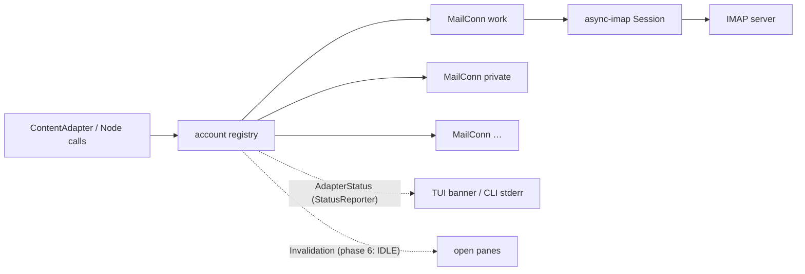
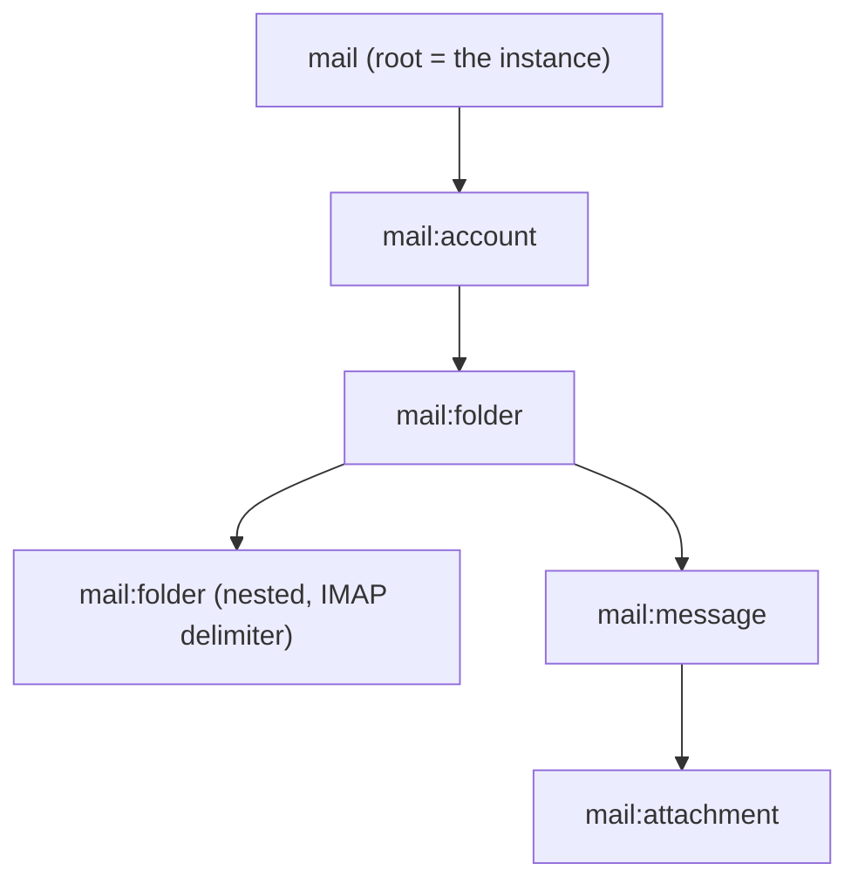

# Plan — Mail adapter (IMAP)

> Status: **draft, nothing implemented**. This plan is the proposal; the phase
> cut in §9 is what gets built once it is agreed.
>
> Target setup: every mail account the user currently has in Thunderbird must
> work in not-yet-done, **one adapter instance per account** (one tab per
> account, per the "one tab = one connection" rule of the view spec). The
> concrete accounts, hostnames and credentials live **outside** the repo — they
> never go into code, tests, fixtures or examples (see
> `feedback_no_real_data_in_repo`); example configs use invented data.

## 1. Context and motivation

The existing adapters cover tickets (Jira, Taiga), wikis (Confluence), chat
(Stoat), databases (Postgres, SQLite), time (Kimai), calendars and the local
task domain. Mail is the missing everyday surface, and it is a natural fit for
the content protocol: a mailbox is a tree of folders, a folder is a paginated,
searchable, sortable list of rows, a message has a body plus attachments —
exactly the shape `ContentAdapter` already speaks.

What makes mail its own case, and why this is not "Jira with different fields":

1. **IMAP is a stateful, single-command-at-a-time protocol.** A connection has
   a _selected_ mailbox; commands are serialised on it. Every other remote
   adapter here sends independent HTTP requests. The adapter therefore owns a
   connection actor, not a stateless client (§4.2).
2. **The row set is huge and server-side.** A folder can hold 100k messages.
   Nothing may load a folder eagerly; `UID SEARCH` + a windowed `UID FETCH`
   over `PageRequest` is the only sane read path (§6).
3. **Identity is `(UIDVALIDITY, UID)`, not a string the server invented for
   us.** Node ids must survive a reconnect and a folder rename, and must break
   loudly when the server renumbers (§4.3).
4. **A message body is MIME**, not text: multipart, transfer encodings, charsets,
   HTML alternatives, inline images. Parsing is a library job (§3).

## 2. What the target setup actually needs

Checked against the local Thunderbird profile (`prefs.js`), stated here only as
design constraints:

| Constraint                                      | Consequence for the adapter                                                                                               |
| ----------------------------------------------- | ------------------------------------------------------------------------------------------------------------------------- |
| All accounts are **IMAP** (no POP3)             | One backend is enough; POP3 is out of scope.                                                                              |
| Mixed transport: implicit TLS, STARTTLS, plain  | `security: tls \| starttls \| none` in the config, explicit, never guessed from the port.                                 |
| Two accounts run through a **local bridge**     | Plain-text on a loopback port must be configurable without a warning that blocks it.                                      |
| One account authenticates via **OAuth2**        | A second auth mechanism (`xoauth2`) whose token comes from a credential provider (§7).                                    |
| Passwords currently live in Thunderbird's store | not-yet-done never reads that store; credentials come from its own providers (§7).                                        |
| **Six accounts, one mail workflow**             | One adapter instance holds _all_ accounts (§4.2), the way the calendar holds several calendars — not one tab per account. |

## 3. Library choice

Liveness checked 2026-09-02.

| Purpose             | Pick                                                                                    | Stars | Last push  | Version / why                                                                                                                                                                                                            |
| ------------------- | --------------------------------------------------------------------------------------- | ----- | ---------- | ------------------------------------------------------------------------------------------------------------------------------------------------------------------------------------------------------------------------ |
| IMAP client         | **async-imap** (<https://github.com/async-email/async-imap>, now `chatmail/async-imap`) | 146★  | 2026-09-02 | 0.11.3, `runtime-tokio` feature. Async, the client Delta Chat ships, so it is exercised against the whole zoo of real servers. Has `uid_search`/`uid_fetch`/`uid_store`/`uid_mv`/`idle`/`authenticate` (SASL → XOAUTH2). |
| TLS                 | **async-native-tls** (<https://github.com/async-email/async-native-tls>)                | 74★   | 2026-02-20 | 0.6, `runtime-tokio`. Same org as async-imap, same openssl backend the workspace already uses for reqwest and tokio-tungstenite — no second TLS stack.                                                                   |
| MIME parsing        | **mail-parser** (<https://github.com/stalwartlabs/mail-parser>)                         | 456★  | 2026-08-22 | 0.11.8. Full RFC 5322/2045-2047 handling incl. charsets, encoded words, nested multipart, HTML/text alternatives, attachment metadata.                                                                                   |
| HTML → text         | **html2text** (<https://github.com/jugglerchris/rust-html2text>)                        | 243★  | 2026-08-14 | 0.17. Only needed for HTML-only mails in the TUI body; the existing `o p` preview pipeline stays the richer path.                                                                                                        |
| SMTP (phase 5 only) | **lettre** (<https://github.com/lettre/lettre>)                                         | 2257★ | 2026-08-03 | 0.11.23. Sending is a later phase; listed so the choice is not made twice.                                                                                                                                               |

Rejected alternatives, so the trade-off is on record:

| Rejected                                               | Stars | Last push  | Why not                                                                                                                                                                |
| ------------------------------------------------------ | ----- | ---------- | ---------------------------------------------------------------------------------------------------------------------------------------------------------------------- |
| `imap` (<https://github.com/jonhoo/rust-imap>)         | 583★  | 2026-08-08 | **Synchronous.** The whole workspace is tokio-async; every call would need `spawn_blocking`. Crate release is from 2025-02.                                            |
| `imap-codec` (<https://github.com/duesee/imap-codec>)  | 52★   | 2026-08-31 | Protocol codec only, no client/session layer — we would be writing async-imap ourselves.                                                                               |
| `mailparse` (<https://github.com/staktrace/mailparse>) | 225★  | 2026-07-27 | Fine and popular, but a thinner API than mail-parser (less charset/alternative handling), and mail-parser is the more active one.                                      |
| `tokio-native-tls`                                     | 261★  | 2024-02-16 | Works and is heavily used, but the repo has not moved since 2024-02 and the crate release is from 2023; async-native-tls is alive and pairs with async-imap by design. |

> Follow-up: add the picked crates to `~/.claude/rust-lib-reference.md` with this
> dated liveness snapshot once the choice is confirmed.

## 4. Architecture

### 4.1 Crate layout

One new workspace member:

- `not-yet-done-mail-adapter` — config, factory, auth bridge, the connection
  actor, the `ContentAdapter`/`Node` impls, the MIME projection.

Registered in `not-yet-done-host::factories()` under the type name **`mail`**.

The calendar domain is split into `calendar-core` + backend crates because it
really has three backends (CalDAV, MS Graph, O365 web). Mail has exactly one
protocol here, so a second crate would be structure without a second
implementation. The seam is kept **inside** the crate as a `backend` module
with a `MailBackend` trait (folders / search / fetch / store / move / append),
so a later JMAP or Maildir backend is a module today and can be promoted to a
crate the moment it exists.

### 4.2 One instance, many accounts

The first sketch gave every account its own adapter instance and therefore its
own tab. Six mail tabs in the tab bar is the wrong shape for a mail client, so
the adapter follows the **calendar** instead: one instance, an `accounts:` list
in its config, each account with its own host, security and credentials.

What that buys, from the same adapter:

- **One tab, one tree** — account → folder → message, so all mail is reachable
  without leaving the tab.
- **One subtab per account** — a subtab is a view over a node type plus a
  query, so `query: "account:work"` at the folder level pins a subtab to one
  account. Six accounts become `t w`, `t p`, … inside a single tab.

Both shapes read the same tree; the importer (§9, phase 3) writes the second
one, because that is what was asked for.



- One **actor task per account** owns its `Session`, receives command messages
  over an mpsc channel and answers on a oneshot — that serialises IMAP's
  one-command-at-a-time rule without a lock held across awaits. Accounts are
  independent: a hung server delays its own subtab, not the others.
- Each actor caches its currently selected mailbox, so listing the same folder
  twice costs no extra `SELECT`.
- Reconnect is the actor's job: a dropped connection re-logs-in and re-selects
  on the next command, reporting through `StatusReporter` (`begin_connect` →
  `connect_phase("logging in")` → `connected`), exactly like the Stoat adapter
  reports its socket.
- `busy(label)` guards each request so the tab says _what_ it is waiting for
  ("work: loading INBOX 1-50"), not merely that it is waiting. Every status line
  is prefixed with the account, because one banner now speaks for several
  connections.
- **Status aggregation**: the instance publishes one `AdapterStatus`. While any
  account is connecting the banner shows that account's phase; a single failure
  is reported as `Failed` naming the account, and `Ready` is reached when the
  accounts that were asked to connect are up. An account nobody has opened is
  not connected at all — connecting is lazy, per account.
- **Credentials are serialised.** `submit_credentials` carries no account
  discriminator, so at most one login may be waiting for a form at a time. The
  registry therefore logs accounts in one at a time and puts the account name
  into `NeedsCreds.header` ("Log in: Work"), which the frontend renders as the
  dialog title. With the `pass` provider (§7) this is invisible — a form only
  appears when the GPG agent is locked.
- Configurable connection limit **per account** (default 1, optional 2-3) so a
  body fetch does not block that account's folder list forever. IMAP servers cap
  concurrent connections per account, so the default stays conservative.

### 4.3 Node tree



| Node              | id                                       | Notes                                                                                                                                                    |
| ----------------- | ---------------------------------------- | -------------------------------------------------------------------------------------------------------------------------------------------------------- |
| root              | `"root"`                                 | The instance. Label = the config's `name`.                                                                                                               |
| `mail:account`    | the account's `id` from the config       | One row per configured account: name, address, unread, connection state.                                                                                 |
| `mail:folder`     | `<account>/<imap mailbox path>`          | Hierarchy comes from the server's delimiter; the tree nests on it. Row carries name, unread, total.                                                      |
| `mail:message`    | `<account>/<folder>#<uidvalidity>.<uid>` | UIDVALIDITY is part of the id on purpose: after a server renumber the old id no longer resolves and says so, instead of silently opening the wrong mail. |
| `mail:attachment` | `<message-id>/part/<mime part path>`     | No standalone address in IMAP — the part is re-resolved from its message, like Stoat's attachments.                                                      |

Every id below the root carries its account as its first segment. That is what
makes one instance over many accounts work at all: `get_by_id` routes to an
actor by reading the id, with no ambient "current account" to get out of step
with the cursor.

Columns per level (`Child::columns`, typed so sort and `kind:` work):

- account: `name` (text), `address` (text), `host` (text), `id` (text)
- folder: `name` (text), `unread_count` (number), `total` (number),
  `path` (text), `account` (text)
- message: `flags` (text, e.g. `●` unread / `★` flagged / `↩` answered),
  `from` (text), `subject` (text), `date` (datetime), `size` (number),
  `attachments` (number), `to` (text), `account` (text, so a merged view can
  say where a mail came from)
- attachment: `filename`, `content_type`, `size`

Folder and message rows additionally carry an **undeclared** `unread` metadata
field holding `"true"` — the key the frontend paints `unread_style` /
`unread_marker` from, here, in the tree and in the tab bar. It is not a column
(nothing renders it as text), and it is why the folder's count had to be named
`unread_count`: a number sitting on `unread` takes the name over and leaves the
highlight permanently dark.

### 4.4 Reusing what already exists

Nothing here is new machinery; it is wiring:

- **Unread** — the `unread` metadata field, `unread_style` / `unread_marker`,
  the tab-bar marker and `mark_read_on_reach_end:` were built for Stoat and are
  adapter-agnostic. A folder with unread mail and an unread message row light up
  with zero frontend work, and reaching the newest row can mark seen.
- **`cursor_on_open: first_unread`** — lands the cursor on the first unread mail.
- **Paging** — `PageRequest`/`PageInfo` already carry offset/limit/total.
- **Preview (`p`)** — body as markdown, same as the chat message body.
- **`option_menu`** — `list_values("folders")` + a `move` action gives the
  folder picker for moving mail with no bespoke UI.
- **Query variables** — `${…}` via `not_yet_done_content::query_vars`, so a
  saved search `FROM ${sender}` prompts like a Jira JQL variable.
- **`auto_connect` / `auto_reload`** — a mail tab can connect at startup and
  poll every few minutes without adapter code.

## 5. Config — the adapter YAML (one file, all accounts)

```yaml
# ~/.config/not_yet_done/views/mail-adapter.yaml
name: Mail # instance label (root node, tab title)

# Defaults every account inherits; each may override them.
page_size: 50
# connections_per_account: 1
retry:
  attempts: 2
  backoff_ms: 250

accounts:
  - id: work # stable, unique — first segment of every id below (§4.3)
    name: Work # what the account row and its subtab are called
    address: me@example.org # the From address; shown, never used to log in
    host: imap.example.org
    port: 993
    security: tls # tls | starttls | none
    default_folder: INBOX
    # exclude_folders: ["Junk", "Trash/*"]
    auth:
      mechanism: password
      # Both fields out of one script run, the way taiga/kimai/postgres already
      # source their secrets: one gpg call, and a locked store asks its
      # passphrase through the TUI instead of opening its own pinentry window.
      script: >-
        ~/.config/not_yet_done/scripts/pass_credentials.py
        username=mail/example/user
        password=mail/example/pass
      bindings:
        - field: username
          provider: { type: script-result }
        - field: password
          provider: { type: script-result }

  - id: bridge
    name: Bridged
    address: me@example.net
    host: 127.0.0.1
    port: 1143
    security: none # deliberate: a local bridge on loopback
    auth: { … }

# Backing store for the envelope cache (phase 4); defaults to a private
# SQLite file under the XDG data dir.
# db:
#   url: "sqlite:///home/me/.local/share/not_yet_done/mail.sqlite?mode=rwc"
```

Auth mechanisms published by the factory (`auth_mechanisms()`), so
`nyd config auth mail` and the `nyd config build mail` wizard render them:

| mechanism  | fields                 | speaks                                                                                                                                        |
| ---------- | ---------------------- | --------------------------------------------------------------------------------------------------------------------------------------------- |
| `password` | `username`, `password` | `LOGIN` / `AUTHENTICATE PLAIN`, whichever the server offers.                                                                                  |
| `xoauth2`  | `username`, `token`    | `AUTHENTICATE XOAUTH2`; the token comes from a provider — a `command:` script that mints/refreshes it, so no OAuth flow lives in the adapter. |

The `token` field being an ordinary credential provider is the important part:
it keeps the OAuth dance outside the adapter (a script, the way the calendar
adapter already sources secrets), and it means an OAuth account works as soon as
such a script exists — see §10, where the decision is to use an app password for
now.

One wrinkle the calendar does not have: the auth spec sits **per account**, so
the factory validates one spec per entry against the same mechanism table, and
the instance owns one `AuthOrchestrator` per account. Only the _prompting_ is
serialised (§4.2), not the accounts themselves.

## 6. Reading: query, sort, paging

- **Query language** = **IMAP SEARCH** (`query_language() -> "imap-search"`),
  opaque to the frontend exactly like JQL and SQL. Empty query = `ALL`.
  Examples that become saved queries: `UNSEEN`, `FROM ${sender}`,
  `SINCE 1-Aug-2026 UNSEEN`, `HEADER SUBJECT invoice`.
- **The account scope** is the one thing the adapter reads itself, and only
  above the message level: a query on the account or folder level may start with
  `account:<id>` (optionally followed by a folder glob, `folder:INBOX*`). That
  is what lets one subtab show one account (§4.2) without a second frontend
  mechanism. On the message level the whole string is IMAP SEARCH — the account
  is already fixed by the folder the messages hang under, so nothing there needs
  parsing.
- **The read path** for a folder page: `UID SEARCH <query>` → the UID set →
  order it → take the `PageRequest` window → `UID FETCH <window>
(UID FLAGS INTERNALDATE RFC822.SIZE ENVELOPE BODYSTRUCTURE)`. Only the window
  is fetched, so a 100k folder costs one search plus 50 envelopes.
- **Default order** is UID descending (newest first) — the natural IMAP order,
  no extra round trip.
- **Other sorts**: if the server advertises `SORT` (RFC 5256), issue
  `UID SORT (…)` as a raw command; otherwise the adapter reports what it
  actually applied via `ListResult::applied_sort` and the engine's local sort
  handles the page. Sorting a whole 100k folder client-side is deliberately not
  attempted; the honest answer is "sorted within the loaded window", reported
  through the existing `applied_sort` channel.
- **Body**: `Node::content()` on a message reads `BODY.PEEK[]` once, parses with
  mail-parser, prefers `text/plain`, falls back to HTML → text. `content()`
  is read-only (mail bodies are immutable); the preview and `markdown: true`
  render it.

## 7. Credentials

**Decided:** the password store, through the shared
`~/.config/not_yet_done/scripts/pass_credentials.py` — the same auth shape
taiga, kimai and postgres already use (`auth.script` + `script-result`
bindings). One script run per login serves both fields, and a locked GPG agent
asks its passphrase inside the TUI rather than in a pinentry window that knows
nothing about the login it blocks. Nothing but a store path ever appears in the
config file.

The other providers stay available for the odd account — `prompt` (asked once
per session over the normal `NeedsCreds` path), `env`, `file`, `literal` — but
they are not what the importer writes.

Thunderbird's own password store (`logins.json` + `key4.db`, NSS-encrypted) is
**not** read. It would mean linking NSS or shelling out to a decryptor, for a
one-time convenience — and it would put the passwords of every account into a
second place. The importer (§9, phase 3) instead writes the `pass_credentials.py`
block with a **guessed** store path per account (`<prefix>/<host>/user` and
`<prefix>/<host>/pass`, prefix `mail` by default, `--pass-prefix` to change it)
and prints, per account, which path it guessed — so a wrong guess shows up as a
line to fix, not as a mysterious login failure.

## 8. View YAML — what the user gets

**One** view file for all accounts, pointing at the one adapter config. Two
shapes, both supported by the same adapter:

**A — one subtab per account** (what the importer writes):

```yaml
tab: { name: Mail, unread_marker: true }
adapter: { type: mail, config: mail-adapter.yaml, auto_connect: never }
views:
  - name: Work
    key: w
    default: true
    node_type: mail:folder
    query: { default: "account:work" }
    tree_label: name
    children: [ … mail:message with a coupled split … ]
  - name: Private
    key: p
    node_type: mail:folder
    query: { default: "account:private" }
    …
```

**B — one tree over everything**, when the accounts should sit side by side:
top level `mail:account`, drilling into folders and messages. Same file, one
subtab, no query.

Either way the levels below are identical:

- View `mail:folder` as a **tree** (`tree_label: name`), unread highlight on,
  `/` = tree find.
- Child `mail:message` as a flat, paginated list with a coupled split to the
  right (the Stoat chat layout: folder tree left, mail list right),
  `cursor_on_open: first_unread`, `preview: { source: content, markdown: true }`,
  `mark_read_on_reach_end: mark-read`.
- Child `mail:attachment` with `open` / `download all`, verbatim the Stoat
  attachment level.

Because everything is one tab, `auto_connect` is a single decision for the tab,
and the per-account laziness of §4.2 does the rest: opening the Work subtab
connects Work and nothing else.

## 9. Phase cut

| Phase | Content                                                                                                                                                                                                                                                       | Done when                                                                                          |
| ----- | ------------------------------------------------------------------------------------------------------------------------------------------------------------------------------------------------------------------------------------------------------------- | -------------------------------------------------------------------------------------------------- |
| **0** | Crate skeleton, config + `deny_unknown_fields` + parse tests, auth mechanism table, factory, host registration, connection actor with login/logout/status, example YAMLs, docs.                                                                               | `nyd adapter mail help --full` prints the level docs; a login against a real account succeeds.     |
| **1** | Read folders: `LIST`/`STATUS`, hierarchy, unread/total columns, tree.                                                                                                                                                                                         | `nyd adapter mail ls` lists the folder tree headlessly.                                            |
| **2** | Read messages: search + windowed fetch, columns, paging, default sort, body + preview, attachment level (list/open/save).                                                                                                                                     | A folder opens in the TUI, `p` shows the body, `o` opens an attachment.                            |
| **3** | **Thunderbird importer** — `nyd config import-thunderbird` reads `prefs.js` and writes **one** adapter YAML holding every account plus **one** view YAML with a subtab per account (no secrets — a `pass_credentials.py` block with guessed store paths, §7). | Every Thunderbird account has a working subtab. **This is the goal line of the original request.** |
| **4** | Envelope cache in SQLite (`(account, folder, uidvalidity, uid)`), so a tab opens instantly and survives offline.                                                                                                                                              | Second open of a folder does no network round trip for rows already known.                         |
| **5** | Write actions: seen/unseen, flag, move (folder `option_menu`), delete/archive, and the unread wiring end to end.                                                                                                                                              | Marking read in nyd is visible in Thunderbird.                                                     |
| **6** | Live: `IDLE` per selected folder → `Invalidation`, so new mail appears without `r`.                                                                                                                                                                           | A mail sent from elsewhere shows up in an open pane.                                               |
| **7** | Compose / reply / forward via SMTP (lettre), reusing the editor-compose path Stoat's `n`/`e` already use.                                                                                                                                                     | A reply written in `$EDITOR` is sent and lands in Sent.                                            |
| **8** | Gmail XOAUTH2 token script (or app password, see §10).                                                                                                                                                                                                        | The OAuth account connects like the others.                                                        |

Phases 0-3 are the "all my accounts work" milestone; 4-8 are the comfort layer.

## 10. Risks and open points

- **Gmail / OAuth2 — decided: app password.** The `xoauth2` mechanism is cheap;
  the _token_ is not. An app password turns that account into an ordinary
  `password` account with no OAuth code anywhere, so phase 3 covers it like the
  rest. The `xoauth2` mechanism still ships in phase 0 (it costs one SASL line),
  and the refresh-token script behind it stays phase 8 for the day the app
  password is withdrawn. The importer therefore rewrites Thunderbird's
  `authMethod: 10` accounts to `mechanism: password` and says so in its output.
- **The bridged accounts** are reachable on loopback in plain text. That is a
  deliberate `security: none` and must not be silently upgraded or refused.
- **Server quirks.** Folder names are modified-UTF-7, delimiters differ (`/`
  vs `.`), `\Noselect` folders exist, some servers cap concurrent connections
  hard. All are handled in the folder layer; all are also the likeliest source
  of "works for account A, not B" bugs — hence one smoke run per account.
- **One credential channel, several accounts.** `submit_credentials` addresses
  the instance, not the account, so two logins asking for a form at once would
  be ambiguous. Logins are serialised and the account is named in the dialog
  header (§4.2). If that ever becomes a real bottleneck the honest fix is a
  discriminator on the protocol, not a race here.
- **Big folders.** Search over a huge folder can be slow server-side; the busy
  label plus the `retry`/timeout config make it visible rather than mysterious.
- **Deleting mail** is destructive and irreversible in a way a ticket edit is
  not. Phase 5 moves to Trash by default; a real `EXPUNGE` stays behind a
  confirmation.

## 11. Test and smoke strategy

- **Unit**: config parse/reject tests (the shipped example must parse, like
  Stoat's), id round-trips (`folder#uidvalidity.uid`), IMAP search-string
  building, MIME projection against **invented** `.eml` fixtures — never a real
  mail (`handling-real-data`).
- **Headless**: `nyd adapter mail ls` / `--query UNSEEN` against a real account
  verifies the read path without the TUI, the way the Jira adapter is checked.
- **Smoke**: one block per phase in `docs/smoke-tests.md`, and phase 3's block
  is run **once per account** — the whole point of the request is that all of
  them work, and account-specific server quirks are exactly what a single-account
  smoke would miss.

## 12. Keeping the docs in step

- `docs/examples/views/mail.yaml` + `mail-adapter.yaml` (invented data), parsed
  by a test.
- `README.md` adapter list, `docs/architecture.md` crate list.
- `docs/smoke-tests.md` blocks per phase.
- An ADR only if the connection-actor model turns out to be a decision worth
  recording beyond this plan.
