# Plan: Markdown-Rendering für Stoat-Chat-Messages

> **Status: Phasen 0–4 implementiert** (Kern fertig, installiert). Optionale
> Phasen 5 (MarkdownView-Pane-Komponente) und 6 (tree-sitter-Highlight) offen.
> Baut auf der Multi-Line-Row-Engine auf
> (`docs/plan-multiline-rows.md`). Läuft auf **ratatui 0.29** mit
> **`ratatui-markdown 0.3.6`** (letztes 0.29-Release). Das ratatui-0.30- +
> tuirealm-4-Upgrade ist bewusst ein _separates, späteres_ Projekt — dieses
> Feature ist davon nicht geblockt. Eval-Demo (kompiliert, Smoke grün):
> `../ratatui-markdown-demo` (außerhalb des Repos).

## Ziel

Eine Stoat-Message zeigt ihren **vollständigen Markdown-Body** als mehrere
physische Zeilen in der Chat-Tabelle: harte Zeilenumbrüche _und_ Soft-Wrap am
Pane-Rand, plus Inline-Styling (bold/italic/`code`), Listen, Blockquotes,
Überschriften. Heute kollabiert der Adapter den Body zu einer Zeile
(`message.rs:122`: `label = content.replace('\n', " ")`).

## Schlüssel-Erkenntnis: kein Render-Layer-Umbau nötig

Das Tabellen-Widget kann **schon** Rich-Text pro Zeile: `TableWidgetCell`
trägt `segments: Vec<(String, Option<usize>)>`, und der Render-Pfad
(`render.rs:315–327`) malt jedes Segment mit eigener **fg + Modifier**
(bold/italic) und legt die **Selektions-bg einheitlich** drüber — also genau
das „nur bg ändert sich bei Selektion"-Verhalten, das wir wollen. Eine
gewrappte Markdown-Zeile = eine `TableWidgetCell::from_segments(...)` über die
volle Content-Breite; die Styles landen in der ohnehin pro Rebuild gebauten
`StyleMap`.

→ Die gesamte Integration passiert in der **TUI-Schicht** (Content-View-Build-
Pfad + neues Markdown-Modul + Adapter + Config). `not-yet-done-table` und
`not-yet-done-ratatui` bleiben **unangetastet** (Separation of Concerns: die
Layout-Crate weiß nichts von Markdown).

## Datenfluss

```mermaid
flowchart LR
    A["StoatMessageNode<br/>content_body (roh, mit \\n)"] --> B["Metadata-Feld 'content'"]
    B --> C["column_value(item, col)<br/>→ roher Body in TRow-Zelle"]
    C --> D["build_multiline_widget_rows<br/>(Content-Zeile = markdown)"]
    D --> E["render_markdown(body, width, &theme)<br/>= ratatui-markdown"]
    E --> F["Vec&lt;Line&gt; (soft-wrapped)"]
    F --> G["Line → from_segments + StyleMap-Einträge"]
    G --> H["N physische TableWidgetLines"]
    H --> I["bestehende Multi-Line-Render-/Scroll-Engine"]
```

## Phase 0 — Dependency + Theme-Bridge

- `not-yet-done-tui/Cargo.toml`: `ratatui-markdown = { version = "=0.3.6",
default-features = false, features = ["markdown"] }`. **Exakt-Pin** (`=`),
  weil `0.3.7` auf ratatui 0.30 springt. `default-features = false` wirft
  image/mermaid/tree/preview/viewer/tree-sitter raus → schlanker Build; wir
  brauchen nur den Kern-Renderer (Soft-Wrap steckt darin).
- **Theme-Bridge** (neues kleines Modul, z.B. `views/markdown/theme_bridge.rs`):
  Newtype `MdTheme<'a>(&'a Theme)` implementiert
  `ratatui_markdown::theme::RichTextTheme`. Jeder der 15+ Slots wird auf eine
  **vorhandene** `ThemeConfig`/`Theme`-Farbe gemappt (kein Hardcode — siehe
  `feedback_configurable_colors`): text→`text_med`, primary→`accent`,
  muted→`text_dim`, json\_\*→Tag-/Wert-Farben usw. Fehlt ein sinnvolles
  Pendant, neuen `ThemeConfig`-Slot anlegen und in `tui.yaml` + Doku
  dokumentieren (was + warum).

## Phase 1 — Markdown-Render-Modul

Neues Modul `views/markdown/mod.rs`, reine Funktion (TUI-Layer, kein State):

- `render_markdown_lines(body: &str, width: usize, theme: &Theme) -> Vec<Line<'static>>`
  — `MarkdownRenderer::new(width).parse(body)` + `.render(&blocks, &MdTheme(theme))`.
- `lines_to_widget_lines(lines: Vec<Line>, style_map: &mut StyleMapBuilder,
highlight_on_select: bool) -> Vec<TableWidgetLine>` — konvertiert jede
  `Line` in eine `TableWidgetCell::from_segments`: pro `Span` ein Segment
  `(span.content, Some(id))`, wobei `id` über einen **dedupliziernden**
  `StyleMapBuilder` (fg + Modifier als Key) vergeben wird. Leere/whitespace-
  Spans bleiben erhalten (Layout).
- `StyleMapBuilder`: sammelt eindeutige `Style`s → Indizes, liefert am Ende den
  `Vec<Style>` für die `StyleMap`. Wird an die bestehende per-Spalten-StyleMap
  von `build_multiline_widget_rows` angehängt.

Unit-Tests: bekannter Markdown-String → erwartete Segment-/Style-Struktur;
Soft-Wrap (schmale vs. breite `width` → mehr/weniger Zeilen), wie im Demo.

## Phase 2 — Adapter: roher Body als Spaltenquelle

`not-yet-done-stoat-adapter/src/adapter/message.rs`:

- `label` bleibt collapsed (für Tree-/Single-Line-Nutzung, Suche-Anzeige).
- Neues Metadata-Feld `MetadataField { key: "content", value: view.content
(roh, mit \n), display_label: "Body", editable: false }`. Damit liefert das
  generische `column_value(item, col)` (content_view.rs:6107) für eine Spalte
  mit `key = "content"` und `source ≠ "label"` den **rohen** Body.
- Kein neuer Adapter-Code-Pfad nötig; das Feld ist die generische Brücke.

Trade-off: das Feld erscheint auch im Detail-/Metadata-Pane. Akzeptiert; falls
störend, später ein `hidden`-Flag auf `MetadataField` (separat).

## Phase 3 — Config: `markdown`-Flag

`not-yet-done-tui/.../view_config.rs`:

- `ColumnDef.markdown: bool` (default `false`, serde-default). „Der Wert dieser
  Spalte ist Markdown und wird mehrzeilig gerendert."
- **Validator** (`check_row_layout`-Nähe): eine `markdown`-Spalte muss in ihrer
  `row_layout`-Zeile **allein** stehen (Single-Column-Line) — eine
  Markdown-Spalte neben anderen Spalten auf einer Zeile ist nicht unterstützt
  (klare Fehlermeldung statt stiller Fallback).
- `docs/examples/views/stoat.yaml` + deployed `~/.config/.../stoat.yaml`:
  Content-Spalte `source: content` (statt `label`) + `markdown: true`.
- `docs/reference/generic-view-spec.md`: `markdown:`-Option dokumentieren
  (was + warum: Chat-/Langtext-Spalten mehrzeilig + soft-wrap).

## Phase 4 — Build-Pfad: Markdown-Zeile expandieren

`content_view.rs` `build_multiline_widget_rows`:

- Nach `compute_multiline_table` ist pro Template-Zeile die Content-Breite
  bekannt (`computed.line_col_widths[li][0]`).
- Für eine `LineLayout`, deren einzige Spalte `markdown == true` ist: **nicht**
  die gefittete Single-Line-Zelle verwenden, sondern den **rohen** Zellwert aus
  `data_rows[i]` (= roher Body) durch `render_markdown_lines(body, width,
theme)` jagen und via `lines_to_widget_lines` in **N** `TableWidgetLine`s
  expandieren (alle mit dem `highlight_on_select` der Layout-Zeile).
- Alle anderen Zeilen (author/time, Spacer) unverändert (je 1 Zeile).
- Ergebnis: Row-Höhe = 1 (Meta) + N (Body) + 1 (Spacer). Variable Höhe ist von
  der Engine schon abgedeckt (`height() = lines.len()`, Scroll height-aware).

Test: `multiline_widget_rows_chat_layout` erweitern — Body mit `\n` + langem
Absatz → erwartete Zeilenzahl > 1, Meta-/Spacer-Zeilen intakt.

## Phase 5 — (optional) `MarkdownView`-Komponente für Panes

Für Detail-/Preview-Panes (nicht für Tabellenzeilen — die sind Daten, keine
Sub-Komponenten): eine tuirealm-Komponente `MarkdownView`, die dasselbe
Phase-1-Modul nutzt und intern via `Paragraph` + Scroll rendert. Wiederverwend-
bar, aber **nicht** auf dem kritischen Pfad des Chat-Layouts → eigene, spätere
Phase.

> Architektur-Hinweis: Der User-Wunsch „Tui-Realm-Komponente, in der Tabelle
> verwendbar" wird durch das **geteilte Render-Modul** (Phase 1) erfüllt — die
> Tabelle ruft es im Build-Pfad auf. Eine echte Komponente _pro Zeile_ passt
> nicht ins Widget-Render-Modell der Tabelle.

## Phase 6 — (optional, später) Syntax-Highlighting

Tree-sitter-Highlighting (`HighlightHooks` + `highlight-lang-*`) hinter einem
**eigenen** Cargo-Feature (`markdown-highlight`, default aus) — zieht C-Grammar-
Builds rein. Erst zuschalten, wenn Code-Blöcke im Chat das rechtfertigen.

## Bekannte Scope-Schnitte / Limitierungen

- **`/`-Suche highlightet nicht im Body**: Der Segment-Pfad überlagert keine
  Fuzzy-Match-Ranges auf Markdown-Spans. Filtern/Matching läuft weiter über das
  Haystack (Label/Body); nur die _visuelle_ Treffer-Markierung im gerenderten
  Body entfällt. Bewusst akzeptiert.
- **Kein Code-Block-bg**: Der Segment-Pfad nutzt nur fg + Modifier der
  StyleMap-Einträge, nicht deren bg. Für Chat ausreichend; bg später separat.
- **Performance**: Markdown wird pro Message bei jedem Tabellen-Rebuild geparst
  (nicht pro Frame — der Render-Loop ist dirty-gated). Bei sehr langen Channels
  ggf. später Cache nach (message_id, width). Zunächst ohne Cache.
- **Spalten-Cursor / Jump-Mode**: bleiben Single-Line (primary_line) — der
  Chat-View nutzt beide nicht.

## Vorbedingung

Der bereits gebaute, aber **ungecommittete** fg-Präzedenz-Fix in `render.rs`
(Spaltenfarbe sichtbar; Selektion = nur bg) sollte zuerst committet werden — er
ist die Grundlage dafür, dass author=accent/time=text_dim überhaupt korrekt
erscheinen.

## Verifikation

1. Phase 1: `cargo test -p not-yet-done-tui markdown` (Modul-Tests).
2. Phasen 2–4: `cargo build --release`, erweiterte `content_view`-Tests grün.
3. `cargo install --path not-yet-done-tui --force`, dann Smoke gegen einen
   echten Channel (Checkliste in `docs/smoke-tests.md` ergänzen): mehrzeilige
   Message zeigt alle Zeilen; langer Absatz wrappt am Pane-Rand; Selektion
   deckt Meta+Body, ändert nur bg; **andere Tabs unverändert** (height==1).
4. `npx prettier --write` auf geänderte Markdown-Dateien.

## Reihenfolge

0 → 1 → 2 → 3 → 4 (Kern fertig & testbar), dann optional 5, 6.
