# Plan: Markdown rendering for Stoat chat messages

> **Status: phases 0–4 implemented** (core done, installed). The optional
> phases 5 (MarkdownView pane component) and 6 (tree-sitter highlighting) are
> still open. Builds on the multi-line row engine
> (`docs/plan-multiline-rows.md`). Runs on **ratatui 0.29** with
> **`ratatui-markdown 0.3.6`** (the last 0.29 release). The ratatui 0.30 +
> tuirealm 4 upgrade is deliberately a _separate, later_ project — this feature
> is not blocked by it. Eval demo (compiles, smoke green):
> `../ratatui-markdown-demo` (outside the repo).

## Goal

A Stoat message shows its **full Markdown body** as several physical lines in
the chat table: hard line breaks _and_ soft wrapping at the pane edge, plus
inline styling (bold/italic/`code`), lists, blockquotes, headings. Today the
adapter collapses the body into a single line (`message.rs:122`:
`label = content.replace('\n', " ")`).

## Key insight: no render-layer rebuild needed

The table widget can **already** do rich text per line: `TableWidgetCell`
carries `segments: Vec<(String, Option<usize>)>`, and the render path
(`render.rs:315–327`) paints every segment with its own **fg + modifier**
(bold/italic) and lays the **selection bg uniformly** on top — exactly the
"only the bg changes on selection" behaviour we want. One wrapped Markdown line
= one `TableWidgetCell::from_segments(...)` across the full content width; the
styles end up in the `StyleMap` that is built per rebuild anyway.

→ The whole integration happens in the **TUI layer** (content view build path +
new Markdown module + adapter + config). `not-yet-done-table` and
`not-yet-done-ratatui` stay **untouched** (separation of concerns: the layout
crate knows nothing about Markdown).

## Data flow

```mermaid
flowchart LR
    A["StoatMessageNode<br/>content_body (raw, with \\n)"] --> B["metadata field 'content'"]
    B --> C["column_value(item, col)<br/>→ raw body in the TRow cell"]
    C --> D["build_multiline_widget_rows<br/>(content line = markdown)"]
    D --> E["render_markdown(body, width, &theme)<br/>= ratatui-markdown"]
    E --> F["Vec&lt;Line&gt; (soft-wrapped)"]
    F --> G["Line → from_segments + StyleMap entries"]
    G --> H["N physical TableWidgetLines"]
    H --> I["existing multi-line render/scroll engine"]
```

## Phase 0 — dependency + theme bridge

- `not-yet-done-tui/Cargo.toml`: `ratatui-markdown = { version = "=0.3.6",
default-features = false, features = ["markdown"] }`. **Exact pin** (`=`),
  because `0.3.7` jumps to ratatui 0.30. `default-features = false` drops
  image/mermaid/tree/preview/viewer/tree-sitter → leaner build; we only need the
  core renderer (soft wrapping is part of it).
- **Theme bridge** (new small module, e.g. `views/markdown/theme_bridge.rs`):
  the newtype `MdTheme<'a>(&'a Theme)` implements
  `ratatui_markdown::theme::RichTextTheme`. Each of the 15+ slots is mapped onto
  an **existing** `ThemeConfig`/`Theme` colour (no hardcoding — see
  `feedback_configurable_colors`): text→`text_med`, primary→`accent`,
  muted→`text_dim`, json\_\*→tag/value colours and so on. Where no sensible
  counterpart exists, add a new `ThemeConfig` slot and document it in `tui.yaml`
  and the docs (what + why).

## Phase 1 — Markdown render module

New module `views/markdown/mod.rs`, pure functions (TUI layer, no state):

- `render_markdown_lines(body: &str, width: usize, theme: &Theme) -> Vec<Line<'static>>`
  — `MarkdownRenderer::new(width).parse(body)` + `.render(&blocks, &MdTheme(theme))`.
- `lines_to_widget_lines(lines: Vec<Line>, style_map: &mut StyleMapBuilder,
highlight_on_select: bool) -> Vec<TableWidgetLine>` — converts each `Line` into
  a `TableWidgetCell::from_segments`: one segment `(span.content, Some(id))` per
  `Span`, where `id` is handed out by a **deduplicating** `StyleMapBuilder` (fg +
  modifier as the key). Empty and whitespace spans are preserved (layout).
- `StyleMapBuilder`: collects unique `Style`s → indices, and finally yields the
  `Vec<Style>` for the `StyleMap`. It is appended to the existing per-column
  StyleMap of `build_multiline_widget_rows`.

Unit tests: a known Markdown string → the expected segment/style structure;
soft wrapping (narrow vs. wide `width` → more/fewer lines), as in the demo.

## Phase 2 — adapter: the raw body as a column source

`not-yet-done-stoat-adapter/src/adapter/message.rs`:

- `label` stays collapsed (for tree/single-line use and search display).
- New metadata field `MetadataField { key: "content", value: view.content
(raw, with \n), display_label: "Body", editable: false }`. With that, the
  generic `column_value(item, col)` (content_view.rs:6107) yields the **raw**
  body for a column with `key = "content"` and `source ≠ "label"`.
- No new adapter code path needed; the field is the generic bridge.

Trade-off: the field also shows up in the detail/metadata pane. Accepted; if it
turns out to be annoying, add a `hidden` flag on `MetadataField` later
(separately).

## Phase 3 — config: the `markdown` flag

`not-yet-done-tui/.../view_config.rs`:

- `ColumnDef.markdown: bool` (default `false`, serde default). "The value of
  this column is Markdown and is rendered across multiple lines."
- **Validator** (near `check_row_layout`): a `markdown` column must stand
  **alone** in its `row_layout` line (single-column line) — a Markdown column
  next to other columns on one line is not supported (clear error message
  instead of a silent fallback).
- `docs/examples/views/stoat.yaml` + the deployed `~/.config/.../stoat.yaml`:
  content column `source: content` (instead of `label`) + `markdown: true`.
- `docs/reference/generic-view-spec.md`: document the `markdown:` option (what +
  why: chat and long-text columns rendered multi-line + soft-wrapped).

## Phase 4 — build path: expand the Markdown line

`content_view.rs` `build_multiline_widget_rows`:

- After `compute_multiline_table` the content width is known per template line
  (`computed.line_col_widths[li][0]`).
- For a `LineLayout` whose only column has `markdown == true`: do **not** use
  the fitted single-line cell, but push the **raw** cell value from
  `data_rows[i]` (= the raw body) through `render_markdown_lines(body, width,
theme)` and expand it via `lines_to_widget_lines` into **N**
  `TableWidgetLine`s (all with the `highlight_on_select` of the layout line).
- All other lines (author/time, spacer) unchanged (1 line each).
- Result: row height = 1 (meta) + N (body) + 1 (spacer). Variable height is
  already covered by the engine (`height() = lines.len()`, scrolling is
  height-aware).

Test: extend `multiline_widget_rows_chat_layout` — a body with `\n` plus a long
paragraph → expected line count > 1, meta and spacer lines intact.

## Phase 5 — (optional) a `MarkdownView` component for panes

For detail and preview panes (not for table rows — those are data, not
sub-components): a tuirealm component `MarkdownView` that uses the same phase 1
module and renders internally via `Paragraph` + scrolling. Reusable, but **not**
on the critical path of the chat layout → its own, later phase.

> Architecture note: the user's wish for a "tuirealm component usable inside the
> table" is satisfied by the **shared render module** (phase 1) — the table
> calls it in the build path. A real component _per row_ does not fit the
> widget render model of the table.

## Phase 6 — (optional, later) syntax highlighting

Tree-sitter highlighting (`HighlightHooks` + `highlight-lang-*`) behind its
**own** cargo feature (`markdown-highlight`, off by default) — it pulls in C
grammar builds. Only enable it once code blocks in the chat justify it.

## Known scope cuts / limitations

- **`/` search does not highlight inside the body**: the segment path does not
  overlay fuzzy match ranges onto Markdown spans. Filtering and matching still
  run over the haystack (label/body); only the _visual_ hit marking in the
  rendered body is missing. Deliberately accepted.
- **No code block bg**: the segment path only uses fg + modifier of the StyleMap
  entries, not their bg. Good enough for chat; bg separately later.
- **Performance**: Markdown is parsed per message on every table rebuild (not
  per frame — the render loop is dirty-gated). For very long channels a cache
  keyed by (message_id, width) may be added later. No cache to begin with.
- **Column cursor / jump mode**: stay single-line (primary_line) — the chat view
  uses neither.

## Precondition

The already built but **uncommitted** fg precedence fix in `render.rs` (column
colour visible; selection = bg only) should be committed first — it is the basis
for author=accent/time=text_dim showing up correctly at all.

## Verification

1. Phase 1: `cargo test -p not-yet-done-tui markdown` (module tests).
2. Phases 2–4: `cargo build --release`, extended `content_view` tests green.
3. `cargo install --path not-yet-done-tui --force`, then a smoke test against a
   real channel (add the checklist to `docs/smoke-tests.md`): a multi-line
   message shows all its lines; a long paragraph wraps at the pane edge; the
   selection covers meta+body and only changes the bg; **other tabs unchanged**
   (height==1).
4. `npx prettier --write` on the changed Markdown files.

## Order

0 → 1 → 2 → 3 → 4 (core done and testable), then optionally 5, 6.
