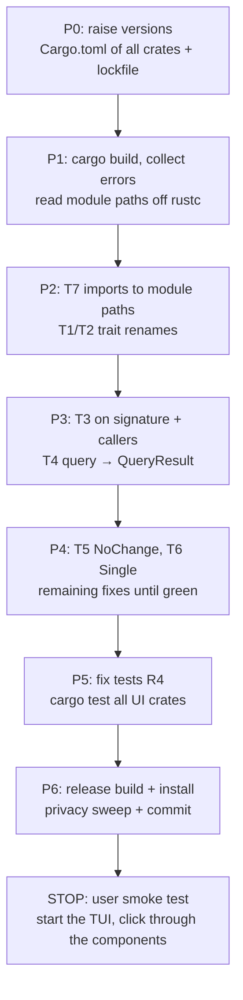

# Migration: ratatui 0.29 → 0.30 + tuirealm 3.3 → 4.1

Status: **done** (code + build + tests green, 2026-06-08) — the smoke-test stop
with the user is still open.

## Context

The last coupled dependency migration. ratatui 0.30.1 (March 2026) and tuirealm
4.1.0 (May 2026) have to be raised **together**: tuirealm 4.1 requires ratatui
`^0.30`. Unlike the previous updates (russh, tokio-tungstenite, reqwest — all
without any source change), this one is a real refactoring migration with
mechanical changes across ~33 files.

Affected crates (all close to the UI):

- `not-yet-done-tui` — main application, 15 `Component` impls (render-only)
- `not-yet-done-ratatui` — widget library, 6 full components (render + `on`)
- `not-yet-done-grid-core` — only `ratatui` (layout types), backend-free
- `ratatui_form_widgets` — `ratatui`
- `grid-render-sim` — `ratatui`
- `ratatui-markdown` — pinned `=0.3.6` (tied to ratatui 0.29) → must go to `0.3.7`

Not affected / all-clear from the recon:

- No `List`/`highlight_symbol`, no custom `Backend` impl.
- No use of tuirealm `Title`/`TextSpan`/`PropPayload::Tup{3,4}`.
- No `Application`/`TerminalBridge`/`EventListenerCfg`/`Update` trait (tuirealm
  is only used as a trait and widget layer, not as an app framework) → the
  biggest tuirealm 4 breaking changes do not apply.
- ratatui's `Alignment` is used through an explicit path → the type alias
  `Alignment = HorizontalAlignment` keeps it compatible.
- `tui-realm/` under `not-yet-done-ratatui/` is an **untracked reference
  checkout** (no path dependency, no submodule) → it is not built and not
  touched.
- MSRV 1.88 (tuirealm 4) ⊂ rustc 1.95 → fine.

## Breaking changes that hit us

### tuirealm 3.3 → 4.1

| #   | Change                                                                                      | Effect in the code                     |
| --- | ------------------------------------------------------------------------------------------- | -------------------------------------- |
| T1  | `MockComponent` → `Component` (rename)                                                      | 15 + 6 `impl` blocks, ~33 import sites |
| T2  | old `Component<Msg,Ev>` → `AppComponent<Msg,Ev>`                                            | 6 impls (widgets with `on`)            |
| T3  | `Component::on(ev: Event)` → `on(ev: &Event)`                                               | 6 `on` impls + callers                 |
| T4  | `query` → `Option<QueryResult<'a>>` instead of `Option<AttrValue>`                          | all `query` impls (~21)                |
| T5  | `CmdResult::None` → `NoChange`                                                              | ~13 sites                              |
| T6  | `State`/`PropPayload` `One`→`Single`, `Tup2`→`Pair`                                         | all `State::One` sites                 |
| T7  | top-level reexports removed → module paths (`tuirealm::component::*`, `tuirealm::state::*`) | all `use tuirealm::{…}`                |
| T8  | tuirealm 4's crossterm feature must match ratatui 0.30                                      | Cargo.toml                             |

The exact 4.1 `Component` signature (verified on docs.rs):

```rust
pub trait Component {
    fn view(&mut self, frame: &mut Frame<'_>, area: Rect);
    fn query<'a>(&'a self, attr: Attribute) -> Option<QueryResult<'a>>;
    fn attr(&mut self, attr: Attribute, value: AttrValue);
    fn state(&self) -> State;
    fn perform(&mut self, cmd: Cmd) -> CmdResult;
}
```

> Module paths (T7) are verified **compiler-driven** — on an "unresolved import"
> rustc suggests the correct path. Do not rely on guessed docs.rs paths.

### ratatui 0.29 → 0.30

| #   | Change                                                             | Effect in the code                                          |
| --- | ------------------------------------------------------------------ | ----------------------------------------------------------- |
| R1  | crossterm bump (0.29 → the version ratatui 0.30 requires)          | Cargo.toml, lockfile                                        |
| R2  | `Alignment` → `HorizontalAlignment` (the alias remains)            | only a problem with a glob import → probably no change      |
| R3  | `Style` no longer implements `Styled`; methods directly on `Style` | `.fg/.bg/.add_modifier` remain; `.reset()` is unused → fine |
| R4  | `TestBackend` uses `Infallible` instead of `io::Error`             | 1 file (`content_view.rs` tests)                            |
| R5  | `Flex::SpaceAround` semantics changed                              | no use of `Flex` → fine                                     |
| R6  | `Marker` is non-exhaustive                                         | no use of Canvas → fine                                     |

## Strategy

tuirealm and ratatui are coupled — the workspace does not compile while only one
half has been raised. Hence **one** coherent bump, then fix compiler-driven, then
**one** smoke-test stop at the end (not one per file).



## State (2026-06-08) — FINISHED

- **All phases P0–P6 done.** The workspace builds (`cargo build` + `cargo build
--release` exit 0) and installs (`cargo install --path not-yet-done-tui
--force`). Tests green: **98** (`not-yet-done-ratatui --lib`) + **502**
  (`not-yet-done-tui`). Privacy sweep clean. **Open: only the user smoke test.**
- The **tui crate migration** (the last open piece) was purely mechanical: all 15
  `query` impls either return `None` or delegate (`self.table.query(attr)`) —
  none built their own `AttrValue` returns, so it was just a signature swap
  (`-> Option<QueryResult<'_>>`) plus import module paths plus
  `MockComponent`→`Component`. No `.on(` callers except one
  (`AppComponent::on(&mut picker, &ev)` in `app/mod.rs`).
  `tuirealm::State`→`tuirealm::state::State` in 5 view impls.
- **Markdown — final state: our own fork instead of tui-markdown.** The interim
  solution was `tui-markdown 0.3.7` (which targets ratatui 0.30), but that is an
  experimental PoC that renders **neither tables nor links/images** — headings
  and tables arrived unstyled. Hence the switch to **our own fork of
  ratatui-markdown**, bumped to ratatui 0.30 ourselves (the lib compiles there
  unchanged, only the dev-deps `crossterm 0.29` + `ratatui-image 11` and two
  image examples needed adjusting).
  - Fork: <https://github.com/bschnitz/ratatui-markdown-fork> (branch `master`,
    commit `1667ea6`), pulled in as a git dependency in `not-yet-done-tui`
    (`default-features = false, features = ["markdown"]`, pinned by `rev`).
  - With that the Markdown module is back to the **original implementation**
    (HEAD): `MarkdownRenderer` + `MdTheme(RichTextTheme)`; full functionality
    (tables, lists, code, soft wrap) and theme colours through the bridge. The
    tui-markdown rework (`MdStyleSheet`, our own soft wrap) was discarded.

> **RECHECK at the next ratatui bump:** check whether upstream
> `ratatui-markdown` (crates.io) has a 0.30+/newer release by now. If so → drop
> the fork and go back to the crates.io crate. The pin comment on the
> `ratatui-markdown` line in `not-yet-done-tui/Cargo.toml` says the same.

### Remaining (not a blocker)

- **ratatui `examples/`** (3 of them use the removed Application/Update
  framework: `new_team_member`, `column_ordering`, `playlist_builder`) — they do
  NOT block `cargo build (--release)`, `cargo install` or the `--lib` tests, only
  a full `cargo test -p not-yet-done-ratatui` (which builds the examples too).
  User's decision: migrate them to tuirealm 4.1, or keep/remove them as outdated
  demos.

---

### Earlier notes (historical)

- **P0 done.** Lockfile: ratatui 0.30.1, ratatui-core 0.1.1, crossterm 0.29.0
  (one version, via ratatui-crossterm 0.1.1), tuirealm 4.1.0, tuirealm_derive
  4.1.0. **Blocker resolved:** ratatui-markdown 0.3.6 (capped at ratatui 0.29, no
  0.30 release) → replaced by **tui-markdown =0.3.7** (`default-features =
false`, `highlight-code`/syntect off).
- **Markdown module migrated.** `theme_bridge.rs`: `MdTheme` → `MdStyleSheet`
  impl `tui_markdown::StyleSheet` (6 methods onto theme slots). `render.rs`:
  `from_str_with_options` + our own span-preserving soft wrap
  (`wrap_line`/`break_word`/`split_ws_runs`/`merge_to_line`) + a base-fg patch.
  The public API (`render_markdown_lines`/`lines_to_widget_lines`/`StyleMapBuilder`)
  is unchanged → content_view.rs needs no change.
- **not-yet-done-ratatui FINISHED + green** (lib + 98 tests). All 6 widgets
  (text_input, grid, multi_choice, select_list, table, file_picker) plus
  grid/mod.rs (fully qualified paths) and smooth.rs migrated. file_picker: the
  `.query(...)` callers (tests + 2 in prod) needed `.map(|q| q.into_attr())`.
- **Renamed globally in both crates:** `State::One(`→`State::Single(`,
  `CmdResult::None`→`CmdResult::NoChange`.

### Verified migration recipe (for the tui crate)

- Imports (top-level reexports gone → module paths):
  - `tuirealm::MockComponent` → `tuirealm::component::Component`
  - old `tuirealm::Component<M,E>` (with `on`) → `tuirealm::component::AppComponent<M,E>`
  - `State`,`StateValue` → `tuirealm::state::{…}`
  - `Attribute`,`AttrValue` → `tuirealm::props::{…}`; where `query` is
    implemented, additionally `tuirealm::props::QueryResult`
  - the `command::*` and `event::*` modules are unchanged
- `impl MockComponent for X` → `impl Component for X`
- `query`: `-> Option<AttrValue>` → `-> Option<QueryResult<'_>>`; every return
  `Some(AttrValue::…)` → `Some(QueryResult::Owned(AttrValue::…))`. A
  **delegation** `fn query(..) { self.child.query(attr) }` stays unchanged (it
  already returns `Option<QueryResult>`).
- `on(ev: Event<E>)` → `on(ev: &Event<E>)` plus `let key = *key;` after the
  destructure (KeyEvent: Copy). Callers of `.on(x)` → `.on(&x)`.
- `query` callers that compare or match against `AttrValue`: `.map(|q| q.into_attr())`.

### Open

- **The tui crate (22 files)** is NOT migrated yet → the workspace currently does
  NOT compile. 15 `impl MockComponent` (render-only, no `on`) in components/_ and
  views/_; dispatch callers (app/mod.rs, render.rs, ui/tasks, ui/trackings). No
  `.on(` callers in tui (manual dispatch runs through other methods).
- **ratatui `examples/`** (3 use the Application/Update framework:
  new_team_member, column_ordering, playlist_builder) — they do NOT block
  `cargo build --release`/`cargo install`, only a full `cargo test` of the crate.
  User's decision: migrate or keep as demos.
- **P5/R4** `TestBackend`→`Infallible` in the content_view tests. **P6**
  build/install/commit + smoke-test stop.

## Phases

- [x] **P0** — versions: `ratatui 0.30`, `tuirealm 4.1` (in `tui` + `ratatui`),
      `ratatui-markdown 0.3.7`, `grid-core`/`form-widgets`/`grid-render-sim` to
      `0.30`, crossterm to match. `cargo update` for the lockfile.
- [x] **P1** — `cargo build` (first `not-yet-done-ratatui` alone, then the rest).
      The error list is the working basis; correct module paths come from the
      rustc hints.
- [x] **P2** — T7 (imports), T1/T2 (trait renames `MockComponent`→`Component`,
      `Component`→`AppComponent`).
- [x] **P3** — T3 (`on(&ev)` + call sites), T4 (`query` return to `QueryResult`;
      check per impl whether `Borrowed`/`Owned`).
- [x] **P4** — T5 (`CmdResult::NoChange`), T6 (`State::Single`), remaining errors.
- [x] **P5** — tests (R4 `TestBackend`), `cargo test` content_view + widgets.
- [x] **P6** — `cargo build --release`, `cargo install --path not-yet-done-tui
--force`, privacy sweep, commit. **Then the smoke-test stop.**

## Smoke test (after P6, by the user)

- The TUI starts, all tabs render (tasks list/tree, trackings, content views).
- Open and operate a form pane (TextInput, SelectList, MultiChoice).
- Open the FilePicker and navigate.
- Open a searchable popup (`:` menus), type, press Enter.
- The Markdown column renders (Stoat body).
- Table: cursor, horizontal scroll, selection highlight.

## Rollback

A single commit at the end → rollback = `git revert`, or before the commit
`git checkout -- .` plus restoring `Cargo.lock`. No intermediate states in the
repo (the workspace only compiles as a whole anyway).
