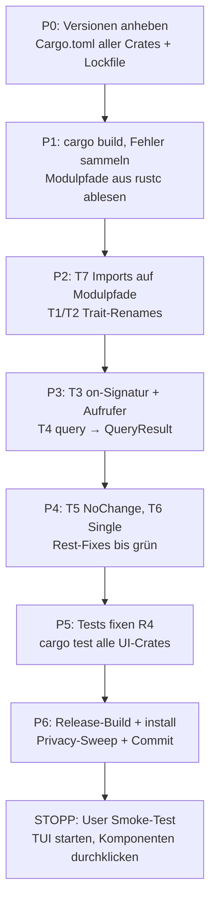

# Migration: ratatui 0.29 → 0.30 + tuirealm 3.3 → 4.1

Status: **abgeschlossen** (Code + Build + Tests grün, 2026-06-08) — Smoke-Stopp
beim User offen.

## Kontext

Die letzte gekoppelte Dependency-Migration. ratatui 0.30.1 (März 2026) und
tuirealm 4.1.0 (Mai 2026) müssen **zusammen** angehoben werden: tuirealm 4.1
verlangt ratatui `^0.30`. Anders als die vorherigen Updates (russh,
tokio-tungstenite, reqwest — alle ohne Quelltext-Änderung) ist das hier eine
echte Refactoring-Migration mit mechanischen Änderungen über ~33 Dateien.

Betroffene Crates (alle UI-nah):

- `not-yet-done-tui` — Hauptanwendung, 15 `Component`-Impls (render-only)
- `not-yet-done-ratatui` — Widget-Bibliothek, 6 Voll-Komponenten (render + `on`)
- `not-yet-done-grid-core` — nur `ratatui` (Layout-Typen), backend-frei
- `ratatui_form_widgets` — `ratatui`
- `grid-render-sim` — `ratatui`
- `ratatui-markdown` — Pin `=0.3.6` (hängt an ratatui 0.29) → muss auf `0.3.7`

Nicht betroffen / Entwarnung aus Recon:

- Kein `List`/`highlight_symbol`, kein custom `Backend`-Impl.
- Keine tuirealm-`Title`/`TextSpan`/`PropPayload::Tup{3,4}`-Nutzung.
- Kein `Application`/`TerminalBridge`/`EventListenerCfg`/`Update`-Trait
  (tuirealm wird nur als Trait- + Widget-Schicht genutzt, nicht als
  App-Framework) → die größten tuirealm-4-Breaking-Changes entfallen.
- ratatui-`Alignment` wird über expliziten Pfad genutzt → Typ-Alias
  `Alignment = HorizontalAlignment` hält es kompatibel.
- `tui-realm/` unter `not-yet-done-ratatui/` ist ein **ungetrackter
  Referenz-Checkout** (keine Path-Dependency, kein Submodul) → wird nicht
  gebaut, nicht angefasst.
- MSRV 1.88 (tuirealm 4) ⊂ rustc 1.95 → ok.

## Breaking Changes, die uns treffen

### tuirealm 3.3 → 4.1

| #   | Änderung                                                                                      | Wirkung im Code                        |
| --- | --------------------------------------------------------------------------------------------- | -------------------------------------- |
| T1  | `MockComponent` → `Component` (Rename)                                                        | 15 + 6 `impl`-Blöcke, ~33 Import-Sites |
| T2  | alt-`Component<Msg,Ev>` → `AppComponent<Msg,Ev>`                                              | 6 Impls (Widgets mit `on`)             |
| T3  | `Component::on(ev: Event)` → `on(ev: &Event)`                                                 | 6 `on`-Impls + Aufrufer                |
| T4  | `query` → `Option<QueryResult<'a>>` statt `Option<AttrValue>`                                 | alle `query`-Impls (~21)               |
| T5  | `CmdResult::None` → `NoChange`                                                                | ~13 Sites                              |
| T6  | `State`/`PropPayload` `One`→`Single`, `Tup2`→`Pair`                                           | alle `State::One`-Sites                |
| T7  | Top-level Reexports entfernt → Modulpfade (`tuirealm::component::*`, `tuirealm::state::*`, …) | alle `use tuirealm::{…}`               |
| T8  | crossterm-Feature von tuirealm 4 muss zu ratatui 0.30 passen                                  | Cargo.toml                             |

Exakte 4.1-`Component`-Signatur (docs.rs verifiziert):

```rust
pub trait Component {
    fn view(&mut self, frame: &mut Frame<'_>, area: Rect);
    fn query<'a>(&'a self, attr: Attribute) -> Option<QueryResult<'a>>;
    fn attr(&mut self, attr: Attribute, value: AttrValue);
    fn state(&self) -> State;
    fn perform(&mut self, cmd: Cmd) -> CmdResult;
}
```

> Modulpfade (T7) werden **compiler-getrieben** verifiziert — rustc schlägt
> bei „unresolved import" den korrekten Pfad vor. Nicht auf geratene
> docs.rs-Pfade verlassen.

### ratatui 0.29 → 0.30

| #   | Änderung                                                               | Wirkung im Code                                                |
| --- | ---------------------------------------------------------------------- | -------------------------------------------------------------- |
| R1  | crossterm-Bump (0.29 → von ratatui 0.30 verlangte Version)             | Cargo.toml, Lockfile                                           |
| R2  | `Alignment` → `HorizontalAlignment` (Alias bleibt)                     | nur bei Glob-Import problematisch → vermutlich keine Änderung  |
| R3  | `Style` implementiert `Styled` nicht mehr; Methoden direkt auf `Style` | `.fg/.bg/.add_modifier` bleiben; `.reset()` nicht genutzt → ok |
| R4  | `TestBackend` nutzt `Infallible` statt `io::Error`                     | 1 Datei (`content_view.rs`-Tests)                              |
| R5  | `Flex::SpaceAround`-Semantik geändert                                  | kein `Flex`-Gebrauch → ok                                      |
| R6  | `Marker` non-exhaustive                                                | kein Canvas-Gebrauch → ok                                      |

## Strategie

tuirealm und ratatui sind gekoppelt — der Workspace kompiliert nicht, solange
nur eine Hälfte angehoben ist. Deshalb **ein** zusammenhängender Bump, dann
compiler-getrieben fixen, dann **ein** Smoke-Stopp am Ende (nicht pro Datei).



## Stand (2026-06-08) — FERTIG

- **Alle Phasen P0–P6 erledigt.** Workspace baut (`cargo build` + `cargo build
--release` exit 0), installiert (`cargo install --path not-yet-done-tui
--force`). Tests grün: **98** (`not-yet-done-ratatui --lib`) + **502**
  (`not-yet-done-tui`). Privacy-Sweep sauber. **Offen: nur noch User-Smoke-Test.**
- **tui-Crate-Migration** (das letzte offene Stück) war rein mechanisch: alle 15
  `query`-Impls geben `None` zurück oder delegieren (`self.table.query(attr)`) —
  keine baute eigene `AttrValue`-Rückgaben, daher nur Signatur-Tausch
  (`-> Option<QueryResult<'_>>`) + Import-Modulpfade + `MockComponent`→`Component`.
  Keine `.on(`-Aufrufer außer einem (`AppComponent::on(&mut picker, &ev)` in
  `app/mod.rs`). `tuirealm::State`→`tuirealm::state::State` in 5 View-Impls.
- **Markdown — Endstand: eigener Fork statt tui-markdown.** Zwischenlösung war
  `tui-markdown 0.3.7` (zielt auf ratatui 0.30), aber das ist ein experimentelles
  PoC, das **weder Tabellen noch Links/Bilder** rendert — Überschriften/Tabellen
  kamen ungestylt an. Daher Wechsel auf den **eigenen Fork von ratatui-markdown**,
  selbst auf ratatui 0.30 gebumpt (Lib kompiliert dort unverändert, nur dev-deps
  `crossterm 0.29` + `ratatui-image 11` + zwei Image-Beispiele angepasst).
  - Fork: <https://github.com/bschnitz/ratatui-markdown-fork> (Branch `master`,
    Commit `1667ea6`), eingebunden als Git-Dependency in `not-yet-done-tui`
    (`default-features = false, features = ["markdown"]`, per `rev` gepinnt).
  - Damit ist das Markdown-Modul wieder die **Original-Implementierung** (HEAD):
    `MarkdownRenderer` + `MdTheme(RichTextTheme)`; volle Funktionalität (Tabellen,
    Listen, Code, Soft-Wrap) und Theme-Farben über die Bridge. Der tui-markdown-
    Umbau (`MdStyleSheet`, eigener Soft-Wrap) wurde verworfen.

> **RECHECK beim nächsten ratatui-Bump:** Prüfen, ob Upstream
> `ratatui-markdown` (crates.io) inzwischen ein 0.30+/neueres Release hat. Wenn
> ja → Fork fallenlassen und zurück auf das crates.io-Crate. Der Pin-Kommentar
> in `not-yet-done-tui/Cargo.toml` an der `ratatui-markdown`-Zeile sagt dasselbe.

### Verbleibend (kein Blocker)

- **ratatui `examples/`** (3 nutzen das entfernte Application/Update-Framework:
  `new_team_member`, `column_ordering`, `playlist_builder`) — blockieren NICHT
  `cargo build (--release)`/`cargo install`/`--lib`-Tests, nur ein volles
  `cargo test -p not-yet-done-ratatui` (das die Examples mitbaut). Entscheidung
  User: auf tuirealm 4.1 migrieren oder als veraltete Demos belassen/entfernen.

---

### Frühere Notizen (historisch)

- **P0 erledigt.** Lockfile: ratatui 0.30.1, ratatui-core 0.1.1, crossterm 0.29.0
  (eine Version, via ratatui-crossterm 0.1.1), tuirealm 4.1.0, tuirealm_derive
  4.1.0. **Blocker gelöst:** ratatui-markdown 0.3.6 (cap auf ratatui 0.29, kein
  0.30-Release) → ersetzt durch **tui-markdown =0.3.7** (`default-features =
false`, `highlight-code`/syntect aus).
- **Markdown-Modul migriert.** `theme_bridge.rs`: `MdTheme` →
  `MdStyleSheet` impl `tui_markdown::StyleSheet` (6 Methoden auf Theme-Slots).
  `render.rs`: `from_str_with_options` + eigener span-erhaltender Soft-Wrap
  (`wrap_line`/`break_word`/`split_ws_runs`/`merge_to_line`) + Base-fg-Patch.
  Public API (`render_markdown_lines`/`lines_to_widget_lines`/`StyleMapBuilder`)
  unverändert → content_view.rs braucht keine Änderung.
- **not-yet-done-ratatui FERTIG + grün** (lib + 98 Tests). Alle 6 Widgets
  (text_input, grid, multi_choice, select_list, table, file_picker) + grid/mod.rs
  (voll-qualifizierte Pfade) + smooth.rs migriert. file_picker: `.query(...)`-
  Aufrufer (Tests + 2 prod) brauchten `.map(|q| q.into_attr())`.
- **Global gerenamed in beiden Crates:** `State::One(`→`State::Single(`,
  `CmdResult::None`→`CmdResult::NoChange`.

### Verifizierte Migrations-Recipe (für tui-Crate)

- Imports (top-level reexports weg → Modulpfade):
  - `tuirealm::MockComponent` → `tuirealm::component::Component`
  - alt `tuirealm::Component<M,E>` (mit `on`) → `tuirealm::component::AppComponent<M,E>`
  - `State`,`StateValue` → `tuirealm::state::{…}`
  - `Attribute`,`AttrValue` → `tuirealm::props::{…}`; wo `query` impl. ist:
    zusätzlich `tuirealm::props::QueryResult`
  - `command::*`, `event::*` Module unverändert
- `impl MockComponent for X` → `impl Component for X`
- `query`: `-> Option<AttrValue>` → `-> Option<QueryResult<'_>>`; jede Rückgabe
  `Some(AttrValue::…)` → `Some(QueryResult::Owned(AttrValue::…))`. **Delegation**
  `fn query(..) { self.child.query(attr) }` bleibt unverändert (gibt schon
  `Option<QueryResult>` zurück).
- `on(ev: Event<E>)` → `on(ev: &Event<E>)` + `let key = *key;` nach dem Destructure
  (KeyEvent: Copy). Aufrufer von `.on(x)` → `.on(&x)`.
- `query`-Aufrufer, die mit `AttrValue` vergleichen/matchen: `.map(|q| q.into_attr())`.

### Offen

- **tui-Crate (22 Dateien)** noch NICHT migriert → Workspace kompiliert aktuell
  NICHT. 15 `impl MockComponent` (render-only, kein `on`) in components/_ +
  views/_; Dispatch-Aufrufer (app/mod.rs, render.rs, ui/tasks, ui/trackings).
  Keine `.on(`-Aufrufer in tui (manuelles Dispatch läuft über andere Methoden).
- **ratatui `examples/`** (3 nutzen Application/Update-Framework:
  new_team_member, column_ordering, playlist_builder) — blockieren NICHT
  `cargo build --release`/`cargo install`, nur volles `cargo test` des Crates.
  Entscheidung User: migrieren oder als Demos belassen.
- **P5/R4** `TestBackend`→`Infallible` in content_view-Tests. **P6** Build/Install/
  Commit + Smoke-Stopp.

## Phasen

- [x] **P0** — Versionen: `ratatui 0.30`, `tuirealm 4.1` (in `tui` + `ratatui`),
      `ratatui-markdown 0.3.7`, `grid-core`/`form-widgets`/`grid-render-sim` auf
      `0.30`, crossterm passend. `cargo update` für Lockfile.
- [x] **P1** — `cargo build` (zuerst `not-yet-done-ratatui` allein, dann Rest).
      Fehlerliste als Arbeitsgrundlage; korrekte Modulpfade aus rustc-Hinweisen.
- [x] **P2** — T7 (Imports), T1/T2 (Trait-Renames `MockComponent`→`Component`,
      `Component`→`AppComponent`).
- [x] **P3** — T3 (`on(&ev)` + Aufrufstellen), T4 (`query`-Rückgabe auf
      `QueryResult`; pro Impl prüfen ob `Borrowed`/`Owned`).
- [x] **P4** — T5 (`CmdResult::NoChange`), T6 (`State::Single`), Resterrors.
- [x] **P5** — Tests (R4 `TestBackend`), `cargo test` content_view + Widgets.
- [x] **P6** — `cargo build --release`, `cargo install --path not-yet-done-tui
--force`, Privacy-Sweep, Commit. **Dann Smoke-Stopp.**

## Smoke-Test (nach P6, durch User)

- TUI startet, alle Tabs rendern (Tasks-Liste/-Tree, Trackings, Content-Views).
- Formular-Pane (TextInput, SelectList, MultiChoice) öffnen + bedienen.
- FilePicker öffnen + navigieren.
- Searchable-Popup (`:`-Menüs) öffnen, tippen, Enter.
- Markdown-Spalte rendert (Stoat-Body).
- Tabelle: Cursor, H-Scroll, Selektion-Highlight.

## Rollback

Ein einziger Commit am Ende → Rollback = `git revert` bzw. vor Commit
`git checkout -- .` + `Cargo.lock` zurück. Keine Zwischenzustände im
Repo (Workspace kompiliert ohnehin nur als Ganzes).
