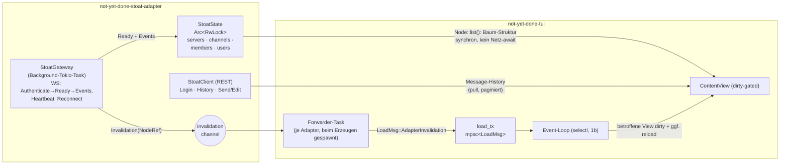

# Plan — Stoat-Adapter (Chat-Anbindung)

> Status: **Phase R + 0 + 1 + 2 + 2.1 + 3 + 4 erledigt** (Phase 4:
> 2026-06-06, lokal ungepusht). Fundament, read-only Baum, Live-Layer
> (Message-Events plus Reconnect), Tree-Ansicht mit Kategorien, **Write**
> (send/edit/delete/react) und **strukturelle Live-Events** (Channel
> create/rename/delete + Kategorie-CRUD) stehen. Offen: Unreact, MFA,
> Server join/leave live. Siehe §8 für den Phasen-Status im Detail.
>
> Test-Instanz: eine private Revolt-API-**0.13.7**-Instanz (Stoat-Frontend);
> Domain + Account-Credentials liegen **außerhalb** des Repos
> — kommen nie in Code/Tests/Fixtures
> (Fixtures auf erfundenen Daten, siehe `feedback_no_real_data_in_repo`).

## 1. Kontext & Motivation

Stoat ist ein Discord-/Slack-Alternative-Chat (Fork von Revolt, Rust-Backend).
Wir wollen ihn als weiteren `ContentAdapter` einbinden — analog zu Jira, Taiga,
Confluence, Postgres. Chat ist aber eine **fundamental andere Domäne** als die
bisherigen (Issue-/Wiki-/DB-)Adapter, weil zwei Eigenschaften das bestehende
Pull-/Request-Response-Modell brechen:

1. **Bootstrap ist push-only.** Es gibt **keinen** REST-Endpoint, der die Server
   des Users auflistet. Die Server-/Channel-Mitgliedschaften kommen
   ausschließlich über das WebSocket-`Ready`-Event.
2. **Live-Updates sind push.** Neue Nachrichten, Edits, Deletes, Reactions
   treffen als WS-Events ein und müssen out-of-band einen Redraw auslösen — das
   tut bislang kein Adapter (alle _antworten_ nur auf User-Aktionen).

Diese beiden Punkte sind **verschiedene Concerns** und werden im Plan getrennt
behandelt. Daraus ergibt sich ein sauberer Phasen-Schnitt: read-only zuerst,
write später; Live-Layer additiv obendrauf.

## 2. Verifizierte API-Fakten

Alle folgenden Punkte sind gegen die echte Test-Instanz mit einem echten Login
geprüft — inklusive der Write-Endpoints (in Phase 3 per `curl` gegen den eigenen
`SavedMessages`-Channel verifiziert, statt in fremde Channels zu posten).

### Discovery

- `GET /api/` (unauthentifiziert) liefert die Server-Config:
  `{ revolt, features{captcha,email,invite_only,autumn,january,livekit}, ws, app, vapid }`.
- Daraus self-discovern wir die WS-URL (`ws`) und die Datei-/Embed-Server
  (`autumn`, `january`). Die Adapter-Config braucht damit nur die Basis-Domain.
- Test-Instanz: `invite_only: true` (Registrierung gesperrt), `email: false`,
  Captcha aus, `ws = wss://<instanz>/ws`.

### Auth

- `POST /api/auth/session/login` mit `{email, password, friendly_name}`
  → `{ result:"Success", _id (session id), user_id, token, name }`.
- Folge-Requests tragen Header **`X-Session-Token: <token>`**.
- Test-Account hatte **keine MFA** — der Ticket-/MFA-Flow ist daher Risiko,
  nicht abgedeckt (siehe §9).
- Bot-Token (`X-Bot-Token`) existiert ebenfalls, ist aber **nicht** das Ziel
  (User-Login gewünscht).

### Lesen (REST, geprüft)

- `GET /api/users/@me` → eigener User (`_id, username, discriminator, relations`).
- `GET /api/users/dms` → Array aus `SavedMessages` / `Group` / `DirectMessage`
  Channel-Objekten (mit `last_message_id`, `recipients`, `name` bei Groups).
- `GET /api/channels/{id}/messages?limit=N` → Array von Messages
  (`_id, channel, author, content, system?, …`). Pagination über
  `before`/`after`/`sort` (Cursor = Message-ULID).
- **Kein** Server-List-REST-Endpoint: `GET /servers/@me`, `/users/@me/servers`
  → 404. `GET /servers/{id}` existiert (Einzelabruf).

### Bootstrap (WebSocket, geprüft)

- Connect `wss://…/ws`, dann senden: `{"type":"Authenticate","token":"<token>"}`.
- Server antwortet `{"type":"Authenticated"}`, danach **einmalig**
  `{"type":"Ready", users[], servers[], channels[], members[], emojis[],
voice_states[], policy_changes[]}`.
- `Ready` liefert **alles auf einen Schlag**: im Test 2 Server, 11 Channels
  (Server-Channels **und** DM-/Group-Channels), 2 Users, 2 Members.
- Server-Objekt: `_id, owner, name, channels[<id>], categories[], roles,
default_permissions`.
- TextChannel: `{channel_type:"TextChannel", _id, server, name,
last_message_id, default_permissions}`.
- Message-`_id` ist eine **ULID** → Erstell-Zeitstempel ist eingebettet (kein
  separates Timestamp-Feld nötig).

### Schreiben (REST, ✅ in Phase 3 per `curl` verifiziert)

Gegen den `SavedMessages`-Self-Channel der Test-Instanz geprüft (stört
niemanden; Probe-Messages danach gelöscht):

- ✅ `POST /api/channels/{id}/messages` mit `{content}` → neue Message
  (200, liefert `_id`). `nonce` ist **optional** (nur `{content}` reicht).
- ✅ `PATCH /api/channels/{id}/messages/{msg}` `{content}` → Edit
  (200, `edited`-Timestamp gesetzt).
- ✅ `DELETE /api/channels/{id}/messages/{msg}` → Delete (204).
- ✅ `PUT /api/channels/{id}/messages/{msg}/reactions/{emoji}` → Reaction
  (204; `emoji` als percent-encodetes Pfad-Segment). Unreact
  (`DELETE …/reactions/{emoji}`) ebenfalls 204, aber noch nicht verdrahtet.

### Laufende WS-Events (für Live-Layer, Auswahl)

`Message`, `MessageUpdate`, `MessageDelete`, `MessageReact`/`MessageUnreact`,
`ChannelCreate`/`ChannelUpdate`/`ChannelDelete`, `ServerUpdate`,
`ServerMemberJoin/Leave`. Keep-Alive: Client sendet periodisch
`{"type":"Ping","data":<n>}`, Server antwortet `Pong`.

## 3. Architektur-Überblick



Bausteine:

1. **`StoatClient` (REST).** Zustandsloser HTTP-Client (reqwest), trägt
   `X-Session-Token`. Verantwortlich für Login, Message-History (paginiert),
   Einzelabrufe, später Write. Passt 1:1 ins bestehende Pull-Modell.
2. **`StoatGateway` (Background-Task).** Die **einzige** Stelle mit WS-Logik.
   Hält die Verbindung (`Authenticate` → `Ready` → Event-Stream), sendet
   Heartbeat-Pings, reconnectet bei Disconnect (Backoff), spiegelt
   `AdapterStatus` (`Connecting`/`Ready`/`Failed`).
3. **`StoatState` (`Arc<RwLock<…>>`).** In-Memory-Source-of-Truth für die
   Baum-Struktur (Server, Channels, Members, Users), befüllt aus `Ready` und
   laufend aus Events aktualisiert. **Kein SQLite-Cache für Chat-State**
   (hochvolatil; persistentes Cachen bringt hier wenig — bewusst abweichend von
   den anderen Adaptern, mit User abgestimmt). SQLite nur für das Session-Token
   (wie üblich) und View-Sort-State.
4. **Invalidation-Push (generisch, neu).** Neue Trait-Methode auf
   `ContentAdapter` mit No-op-Default (Open/Closed — alle anderen Adapter
   unverändert). Das Gateway pusht bei relevanten Events einen
   `Invalidation`-Wert; ein Forwarder-Task in der TUI leitet ihn als neue
   `LoadMsg`-Variante in den **bestehenden** `load_tx`-Kanal.

### Schlüssel-Erkenntnis: der Push-Pfad existiert fast schon

- Es gibt bereits `subscribe_status() -> watch::Receiver<AdapterStatus>` als
  Adapter→TUI-Push-Präzedenz (`not-yet-done-content/src/lib.rs:722`).
- Es gibt bereits `load_tx: mpsc::UnboundedSender<LoadMsg>`, über den async-Tasks
  Ergebnisse in den Loop zurückmelden, gedraint von `App::poll_load()`
  (`not-yet-done-tui/src/app/mod.rs:50` ff., `main.rs:165`).
- **Live-Updates sind dieselbe Mechanik, generalisiert:** statt „Status hat sich
  geändert" → „Node X hat sich geändert". Das Gateway speist `load_tx`; der
  1b-`select!`-Loop wacht beim Eintreffen sofort auf. Kein neuer Kanal nötig.

## 4. Prerequisite — Render-Loop 1b (eigene, vorgelagerte Arbeit)

Begründung: Der Live-Layer (Phase 2) braucht einen Loop, der **out-of-band**
auf ein Push-Signal aufwacht. Der aktuelle 1a-Loop ist ein 200 ms-Poll-Loop
(`main.rs:149` ff.) — eine eintreffende Invalidation würde mit bis zu 200 ms
Latenz und nur über das Poll-Intervall sichtbar. 1b ist laut ADR ohnehin der
geplante Folgeschritt und „eine echte Teilmenge — kein Wegwerf-Code".

Schritte (Details/Heikles siehe `docs/decisions/0001-render-loop-dirty-gating.md`,
§Konsequenzen):

- **R1.** `tokio::select!`-Loop über: crossterm-`EventStream` (statt
  `event::poll`), `load_rx`, `commit_rx` und einen bedingten 1-Hz-`interval`
  (nur armiert, solange `has_live_banner()` oder ein aktives Tracking lebt).
- **R2.** Koexistenz mit Kitty-Protokoll-Enable/Disable und dem **synchronen
  Editor-Suspend/Restore** absichern — der `EventStream` muss um die
  Editor-Suspendierung herum sauber pausieren/fortsetzen. (ADR markiert das als
  Hauptrisiko von 1b.)
- **R3.** Die externen Poller ohne Kanal (`poll_live_editor`,
  `poll_editor_close`, `poll_detached_script`) über den bedingten Low-Freq-
  `interval` bedienen, der nur läuft, solange ein Editor/Script pending ist.
- **R4.** ADR `0001` auf „Variante 1b umgesetzt" fortschreiben (Konsequenzen,
  verbleibende Risiken). Idle = geparkt, ~0 % CPU; Async-Display-Latenz ohne
  200 ms-Deckel.
- **R5.** Regressions-Smoke: Tastendruck-Latenz, Busy-Banner-Sekundentakt,
  Editor-Rückkehr, async-Reload — alles wie vorher, plus Idle-CPU prüfen.

## 5. Generischer Invalidation-Mechanismus (in `not-yet-done-content`)

Im Anschluss an 1b, vor/mit Phase 2. Bewusst **adapterneutral** gehalten.

- **I1.** Neuer Typ in `not-yet-done-content/src/lib.rs`:

  ```rust
  /// Out-of-band-Signal eines Adapters, dass sich Inhalte geändert haben
  /// und betroffene Views neu geladen/neu gezeichnet werden sollten.
  #[derive(Clone, Debug)]
  pub enum Invalidation {
      /// Ein konkreter Knoten (und seine offene Kinderliste) ist stale.
      Node(NodeRef),
      /// Eine ganze Subtree-Wurzel ist stale (z. B. Channel-Liste änderte sich).
      Subtree(NodeRef),
      /// Adapter-weit alles stale (Reconnect, Resync nach Ready).
      All,
  }
  ```

- **I2.** Neue Trait-Methode auf `ContentAdapter`, **Default = leerer Stream**
  (Open/Closed; kein bestehender Adapter muss angefasst werden):

  ```rust
  /// Abonniere out-of-band Invalidations. Default: ein Receiver, dessen
  /// Sender für die Prozesslaufzeit lebt und nie sendet (Pull-only-Adapter).
  fn subscribe_invalidations(&self) -> tokio::sync::mpsc::UnboundedReceiver<Invalidation> {
      // analog zum subscribe_status-Default: statischer, nie-sendender Kanal
  }
  ```

- **I3.** TUI: neue `LoadMsg::AdapterInvalidation { instance_id: String,
inv: Invalidation }` (`app/mod.rs`). Beim Erzeugen jedes Adapters einen
  Forwarder-Task spawnen, der `subscribe_invalidations()` in `load_tx`
  umpumpt (mit `instance_id` getaggt).
- **I4.** `App::poll_load()`: neue Variante behandeln — betroffene
  Content-View(s) dieses `instance_id` ermitteln und (a) als dirty markieren
  und/oder (b) gezielt `spawn_content_load`/`reload` der betroffenen NodeRef
  triggern. `Invalidation::All` → alle Views dieses Adapters.
- **I5.** Tests: Default-Receiver blockt ewig ohne Sender-Drop-Error;
  Forwarder-Task taggt korrekt; `poll_load` markiert die richtige View dirty.

## 6. Crate-Layout & Node-Tree-Mapping

Neues Crate `not-yet-done-stoat-adapter`, registriert in `Cargo.toml`
(workspace members) und in `build_adapter_factories()`
(`not-yet-done-tui/src/main.rs:112`), Key `"stoat"`. Aufbau analog Taiga/
Confluence:

```
not-yet-done-stoat-adapter/src/
├── lib.rs                 # pub use adapter::{StoatAdapter, StoatAdapterFactory}
├── config.rs              # YAML-Config (url/name + AuthSpec)
├── client/                # REST
│   ├── mod.rs             # StoatClient, X-Session-Token
│   ├── auth.rs            # POST /auth/session/login
│   ├── discovery.rs       # GET /api/ → ws-url, autumn, january
│   ├── messages.rs        # GET/POST/PATCH/DELETE …/messages
│   └── users.rs           # GET /users/@me, /users/dms, /users/{id}
├── gateway/               # WS
│   ├── mod.rs             # StoatGateway (Connect, Ping, Reconnect)
│   ├── protocol.rs        # Authenticate/Ready/Event-(De)Serialisierung
│   └── state.rs           # StoatState (Arc<RwLock>), Event-Apply
├── db.rs / entity/ / auth_session_store.rs   # nur Session-Token + View-Sort
└── adapter/
    ├── mod.rs             # StoatAdapter impl ContentAdapter
    ├── factory.rs         # StoatAdapterFactory impl AdapterFactory
    ├── auth_bridge.rs     # AuthOrchestrator ↔ StoatClient
    ├── types.rs           # NodeType-Factories
    ├── root.rs            # StoatRoot: Server + DMs
    ├── server.rs          # StoatServerNode: Channels (nach categories)
    ├── channel.rs         # StoatChannelNode: Messages (paginiert)
    └── message/           # StoatMessageNode (+ Phase 3: send/edit/react)
```

Node-Tree:

| Ebene | Node     | `node_type`     | Kinder                               | Quelle                      |
| ----- | -------- | --------------- | ------------------------------------ | --------------------------- |
| 0     | Root     | —               | Server-Nodes + DMs/Groups            | `StoatState` (aus Ready)    |
| 1     | Server   | `stoat:server`  | Channels (sortiert via `categories`) | `StoatState`                |
| 1     | DM/Group | `stoat:channel` | Messages                             | `StoatState` + `/users/dms` |
| 2     | Channel  | `stoat:channel` | Messages                             | REST `…/messages` (pull)    |
| 3     | Message  | `stoat:message` | (P3: Reactions/Replies)              | REST/State                  |

Details:

- **Baum-Struktur (Ebene 0–2-Header) liest synchron aus `StoatState`** — kein
  Netz-await in `list()` für die Struktur.
- **Message-History (Ebene 2→3) ist REST-Pull mit Cursor-Pagination** (mappt auf
  `ListParams`/Cursor — passt zum geplanten `project_cursor_pagination_plan`).
  Konvention: neueste unten; Rückwärts-Scroll lädt ältere via `before=<ulid>`.
- **Message-Content** = `content` (Markdown-nah; `syntax: "markdown"`).
  Metadaten: Autor (über `StoatState.users` aufgelöst, Fallback
  `GET /users/{id}`), Zeitstempel aus der ULID, `edited`.
- **Voice-Channels** werden gelistet, aber als nicht-betretbar markiert
  (kein Read-Inhalt) — LiveKit ist out-of-scope.

## 7. Auth-Integration

Reuse des bestehenden `AuthOrchestrator` + `AuthBridge`-Musters (wie Taiga),
**kein neuer Mechanismus nötig**:

- `AuthMechanism::PasswordLogin`. ⚠ **Korrektur (Phase 0):** die Feldnamen sind
  **nicht** frei wählbar — `AuthSpec::validate()` erzwingt für `PasswordLogin`
  exakt `username` + `password`. Stoat loggt sich per E-Mail ein, deshalb trägt
  das `username`-Feld die **E-Mail-Adresse**. Die Login-Closure liest
  `creds["username"]` als E-Mail, baut den Body
  `{email, password, friendly_name:"not-yet-done"}` und gibt den `token` als
  Session-Blob zurück. (Alternativ ließe sich `PasswordLogin` in
  `not-yet-done-content` um ein `email`-Feld erweitern — bewusst nicht getan,
  da das den generischen Auth-Vertrag anfasst; mit User abzustimmen.)
- `SessionCachePolicy::UntilRejected`: Token im SQL-Session-Store persistiert
  (nur das Token, **nie** das Passwort), bei 401/403 → Re-Login.
- `AuthBridge::get_client()` validiert Token gegen `GET /users/@me`; bei 401
  Cache leeren + `ensure_session` erneut.
- ⚠ **MFA**: Falls der Login statt `Success` einen MFA-Ticket-Response liefert,
  ist das in Phase 0 noch nicht abgedeckt → als `Failed{reason}` melden und in
  §9 als Folgearbeit. (Test-Account: keine MFA.)

Beispiel-Config (`docs/examples/views/stoat-adapter.yaml`):

```yaml
url: https://chat.example.org # Basis; /api & /ws via GET /api/ self-discovered
name: chat

auth:
  mechanism: password-login
  session_cache:
    kind: until-rejected
  bindings:
    - field: username # mechanism-fixer Feldname; trägt die LOGIN-E-MAIL
      provider: { type: prompt }
    - field: password
      provider: { type: prompt }
```

View-Config (`docs/examples/views/stoat.yaml`):

```yaml
tab:
  name: Stoat
  order: 6
  icon: "󰭹"

adapter:
  type: stoat
  id: personal
  config: stoat-adapter.yaml
  manual_connect: false

views:
  - name: chats
    node_type: "stoat:server"
    default: true
    columns:
      - { key: name, label: Name, source: label, sizing: "flex(1)" }
    children:
      - name: Channels
        key: c
        node_type: "stoat:channel"
        columns:
          - { key: name, label: Channel, source: label }
        children:
          - name: Messages
            key: m
            node_type: "stoat:message"
            columns:
              - { key: author, label: Author, sizing: max }
              - {
                  key: content,
                  label: Message,
                  source: label,
                  sizing: "flex(1)",
                }
    preview:
      enabled: true
      source: content
      keybinding: p
    # Phase 3:
    # shortcuts: { i: send_message, e: edit_message }
```

## 8. Phasen-Schnitt

> Reihenfolge fix: **R vor allem anderen** (User-Entscheidung). Read vor Write.

- **Phase R — Render-Loop 1b** (§4). Vorbedingung für Live. Eigenständig
  mergebar; Nutzen auch ohne Stoat (echte 0-%-Idle, geringere Latenz).
- **Phase 0 — Fundament. ✅ ERLEDIGT 2026-06-04.** Crate
  `not-yet-done-stoat-adapter` (Workspace-Member + Factory-Registrierung Key
  `"stoat"`), `StoatClient` (REST: Login, Discovery, `/users/@me`-Validierung),
  `StoatGateway` (WS: Connect → Authenticate → Ready einsammeln, Heartbeat-Ping,
  Reconnect mit Backoff), `StoatState` (In-Memory, aus `Ready`). `AdapterStatus`
  vereinheitlicht über **einen** adaptereigenen `watch`-Kanal: Login-Phase aus
  dem Auth-Orchestrator geforwardet (dessen `Ready` wird unterdrückt), Socket-
  Phase vom Gateway (`Connecting`/`Ready`/`Failed`) — so spiegelt das Banner die
  Realität Ende zu Ende. `root()` startet den Gateway-Bootstrap im Hintergrund
  (nicht-blockierend) und liefert einen **leeren** Baum. 10 Unit-Tests
  (Protokoll-(De)Serialisierung auf erfundenen Daten, `StoatState`-Apply,
  Session-Store-Roundtrip, Config-Parsing). Referenz-Configs:
  `docs/examples/views/stoat-adapter.yaml` + `stoat.yaml`.
- **Phase 1 — Read-only Baum (Pull). ✅ ERLEDIGT 2026-06-04.**
  `StoatRoot` (listet Server **und** DM-/Group-Channels — je nach
  Top-Level-`node_type` der View), `StoatServerNode` (Channels in
  `server.channels[]`-Reihenfolge; Voice als `has_children: false`
  markiert), `StoatChannelNode` (Messages via REST
  `GET …/messages?limit&sort=Latest&include_users=true`, neueste unten),
  `StoatMessageNode` (Leaf mit `content()` für Preview). Struktur synchron
  aus `StoatState`, kein Netz-`await`. **Autor-Auflösung** über das
  `include_users`-Array der Listen-Antwort (Fallback: Roh-ID).
  **Zeitstempel** aus der Message-ULID dekodiert (`%Y-%m-%d %H:%M` UTC).
  **Komposit-IDs** `<channel>/msg/<ulid>` lassen `get_by_id` eine einzelne
  Message für den Preview-Pfad nachladen (`GET …/messages/{id}`) — analog
  zu Confluence-Komposit-IDs. **Stoat ist hier schon nutzbar (browsen +
  lesen).** ⚠ **Bewusste Phase-1-Grenze:** nur die _neueste_ Seite
  (`DEFAULT_MESSAGE_LIMIT = 50`); Backfill älterer Messages via
  `before=<ulid>` ist in `list_messages` als Parameter vorhanden, aber
  noch nicht in die TUI verdrahtet (wartet auf
  `project_cursor_pagination_plan`). Kein Live-Push — nach Connect
  manuelles `r`-Reload (Live = Phase 2). 12 weitere Unit-Tests (Messages-
  Parsing/ULID-Dekodierung, Node-Listing-Reihenfolge, Komposit-IDs).
- **Phase 2 — Live-Layer. ✅ ERLEDIGT 2026-06-04.** Generischer
  Invalidation-Mechanismus (§5): neuer `Invalidation`-Enum +
  `ContentAdapter::subscribe_invalidations()` (No-op-Default) in
  `not-yet-done-content`; TUI-Forwarder (`spawn_content_invalidation_watcher`,
  je View, neben dem Status-Watcher) pumpt in den **bestehenden**
  `load_tx`-Kanal via `LoadMsg::AdapterInvalidation`. Das Gateway pusht bei
  `Message`/`MessageUpdate`/`MessageDelete`/`MessageReact`/`MessageUnreact`
  ein `Invalidation::Node{id: <channel>}`, bei jedem `Ready` (erster
  Connect **und** Reconnect-Resync) ein `Invalidation::All`. `poll_load`
  lädt die betroffenen Panes auf ihrem **aktuellen Level** neu (`All` →
  alle Panes der View; `Node{id}` → nur Panes, deren `parent_node_id`
  dieser Channel ist — eine Nachricht in einem nicht offenen Channel
  kostet nichts). **Erster Ready pusht All ⇒ der initial leere Baum
  füllt sich jetzt ohne manuelles `r`.**
  - ⚠ **Abweichung ggü. §5-Skizze:** `subscribe_invalidations` liefert
    einen **`broadcast::Receiver`**, nicht `mpsc` — Invalidations sind
    diskrete _Events_ (kein Latest-Value wie `watch`, das würde
    Zwischenstände schlucken) und **eine** Adapter-Instanz kann **mehrere**
    Views speisen, die je unabhängig abonnieren (mpsc = Single-Consumer,
    geht nicht). Bei `Lagged` (Frontend zu langsam) resynct der Watcher
    konservativ mit `All` — kein Update geht verloren, nur vergröbert.
    Payload ist eine adapter-interne Node-ID (kein app-weiter `NodeRef`):
    der Watcher ist schon an eine View gebunden, mehr als „welches Level"
    braucht er nicht.
  - ⚠ **Phase-2-Grenze (in Phase 4 aufgelöst):** **strukturelle**
    Live-Events waren in Phase 2 noch nicht verdrahtet — ein neu
    angelegter/umbenannter Channel erschien erst nach Reconnect. Seit
    Phase 4 (siehe unten) sind Channel-CRUD + Kategorie-CRUD live; nur
    Server join/leave bleibt Reconnect.
  - Reload setzt den Cursor des Panes auf das Standardverhalten zurück
    (kein „an der Leseposition bleiben") — für Phase 2 akzeptiert.
- **Phase 2.1 — Kategorien + Tree-Ansicht. ✅ ERLEDIGT 2026-06-05.** Die
  flache Drill-Down-View wurde durch eine **Tree-View** ersetzt:
  `Server → (Kategorie | uncategorized Channel) → Channel → (Drill in
Messages)`. Wire-Shape `Server.categories: [{ id, title, channels[] }]`
  per WS-`Ready` an Stoat **0.13.7** curl-verifiziert (`id` ist plain,
  nicht immer ULID).
  - `protocol.rs`: `Category`-Struct + `Server.categories` (`#[serde(default)]`
    → fehlt das Feld, sind alle Channels uncategorized, kein Bruch).
  - `StoatServerNode` ist jetzt multi-typ: `list(stoat:category)` →
    Kategorien (Komposit-ID `<server>/cat/<catid>`, wie `<channel>/msg/<ulid>`),
    `list(stoat:channel)` → **nur uncategorized** Channels (die in keiner
    Kategorie stehen). Neuer `StoatCategoryNode` listet die Channels einer
    Kategorie. `get_by_id` dekodiert das Kategorie-Komposit.
  - Gemeinsamer `channel_summary`-Helper, damit ein Channel unter Server
    und unter Kategorie identisch rendert.
  - View-Config: heterogenes Server-Level (zwei tree-Branches: `stoat:category`
    - `stoat:channel`), `stoat:channel` auf zwei Tiefen (Duplikat-node_type-
      Regel ist pro Level/Geschwister, daher ok), `stoat:message` ohne
      `tree_label` → Channel **drillt** in flache Message-Liste statt inline
      zu expandieren. Reihenfolge: uncategorized Channels zuerst, dann
      Kategorien. Regressionstest
      `validate_accepts_heterogeneous_category_channel_tree`.
  - Live-Layer unberührt: Message-Events matchen weiter auf
    `parent_node_id == channel`, egal wo der Channel im Baum hängt.
  - 33 stoat- + 473 TUI-Tests grün, installiert. **Smoke offen.**
- **Phase 3 — Write — ERLEDIGT 2026-06-06 (lokal ungepusht).** Alle vier
  Write-Endpoints zuerst per `curl` gegen die echte Instanz verifiziert
  (gegen den `SavedMessages`-Self-Channel — stört niemanden; Probe-Messages
  danach gelöscht): `POST …/messages {content}` (`nonce` als optional
  bestätigt — Body aus nur `{content}` reicht), `PATCH …/messages/{id}
{content}`, `DELETE …/messages/{id}` (204), `PUT …/messages/{id}/
reactions/{emoji}` (204, Emoji als percent-encodeter Pfad-Segment).
  - `client/messages.rs`: `send_message` (→ Message-ID), `edit_message`,
    `delete_message`, `add_reaction` + dependency-freier
    `percent_encode_segment` (Unreserved-Set behalten, Rest `%XX`).
  - `StoatMessageNode` trägt jetzt `Arc<StoatClient>` + `channel_id` +
    `message_id` und implementiert `actions()`/`prepare()`/
    `picker_options()`/`execute()`: `edit_message` (Editor, **roher Body
    ohne Header** — Chat-Messages sind Markdown und dürfen mit `#` starten,
    ein Header-Strip würde das fressen; kein Optimistic-Concurrency-Token,
    Revolt bietet keins), `delete_message` (None), `react` (Picker über
    kurze Unicode-Emoji-Liste). `StoatChannelNode` bekommt `send_message`
    (Editor, leeres Template → Buffer = Nachricht). Andere-Nutzer-Edits/
    -Deletes weist der Server mit 403 ab → sauberer Fehler statt
    Per-Instance-Filter (deterministic-per-node_type-Vertrag).
  - `actions_for_type`: `stoat:channel → [send]`, `stoat:message →
[edit, delete, react]`; im Gleichschritt mit den Node-`actions()`.
    `capabilities` jetzt `supports_create`/`supports_delete = true`.
  - View-YAML (Beispiel + deployed): Message-Level-Actions `a` send
    (`type: create, id: send_message` — parent=channel, child=message),
    `e` edit, `d` delete, `+` react, `r` reload — in beiden `messages`-
    Blöcken (uncategorized + unter Kategorie).
  - Reload nach Write: `ContentActionDone` (delete/react) +
    `NodeActionEditSession`-Reload (send/edit) aktualisieren die Pane;
    zusätzlich kommt das Live-Event (Message/Update/Delete) und invalidiert.
  - 38 stoat- + 474 TUI-Tests grün, installiert. **Smoke offen.**
  - ⚠ **Noch nicht in Phase 3:** Unreact (DELETE-Reaction — `add_reaction`
    ist nur PUT), MFA-Login-Edge-Case.
- **Phase 4 — Strukturelle Live-Events — ERLEDIGT 2026-06-06 (lokal
  ungepusht).** Channel- und Kategorie-Struktur ändern sich jetzt live,
  ohne Reconnect. Wire-Shapes zuerst per WS-Capture-Probe (zweite Session
  am Gateway, außerhalb des Repos, Werte redactet, danach gelöscht) gegen
  Stoat **0.13.7** verifiziert:
  - `ChannelCreate` trägt das volle Channel-Objekt inline (gleiche Shape
    wie in `Ready`) → deserialisiert direkt in `Channel`.
  - `ChannelUpdate { id, data: { name? … }, clear: [] }` — partieller
    Patch (Rename).
  - `ChannelDelete { id }`.
  - `ServerUpdate { id, data: { channels? | categories? | name? }, clear }`
    — **Kategorie-CRUD existiert nicht als eigenes Event**: Anlegen/
    Löschen/Umbenennen/Zuordnen/Umsortieren kommt komplett als volle
    `data.categories`-Listen-Ersetzung. Channel-Create löst zusätzlich ein
    `ServerUpdate.data.channels` (volle Liste) aus.
  - `protocol.rs`: vier Varianten aus `Other` herausgezogen + `ChannelPatch`
    / `ServerPatch` (nur gerenderte Felder, alles andere ignoriert). Eine
    falsch geformte Variante scheitert beim Deserialisieren → ganzer Frame
    wird verworfen, der Socket bleibt (kein Crash).
  - `state.rs`: `insert_channel` (idempotent, hängt auch an `server.channels`
    an, falls das `ServerUpdate` ausbleibt), `patch_channel`, `remove_channel`
    (entkoppelt aus `server.channels` **und** allen Kategorien),
    `patch_server` (volle Listen-Ersetzung für channels/categories + Rename).
  - `gateway/mod.rs::handle_text`: vier neue Arme mutieren `StoatState` unter
    Write-Lock und pushen `Invalidation::All` (Tree-Shape geändert →
    Reload-Maschinerie greift; kein neues Invalidation-Variant, kein
    Cross-Crate-Change).
  - 50 stoat- + 474 TUI-Tests grün, installiert. **Smoke offen.**
  - ⚠ **Noch nicht in Phase 4:** `ServerCreate`/`ServerDelete` (Server
    beitreten/verlassen) — Wire-Shape nicht verifiziert (im Capture nicht
    getestet), bleibt bewusst über den Reconnect-`Ready`-Pfad abgedeckt.

## 9. Risiken & offene Punkte

- **MFA-Login** nicht abgedeckt (Test-Account ohne MFA). Ticket-Flow ggf. in
  Phase 0/3 nachziehen.
- **WS-Reconnect & State-Resync.** Nach Reconnect kommt ein frisches `Ready` →
  `StoatState` ersetzen + `Invalidation::All` pushen. Backoff + Ping-Timeout
  sauber definieren.
- **1b ↔ Editor-Suspend/Restore** (ADR-Hauptrisiko): `EventStream` muss um die
  synchrone Editor-Suspendierung herum sauber pausieren.
- **Berechtigungen/Rollen.** `default_permissions`/`roles` bestimmen sichtbare
  Channels; für read-only zunächst nur listen, was Ready liefert (Server
  filtert serverseitig). Keine eigene Permission-Logik in P1.
- **Große Channels / Pagination-Grenzen.** History-Limit (Revolt: max 100/Req)
  respektieren; Rückwärts-Scroll inkrementell. Kein stilles Truncating ohne
  Hinweis.
- **Author-Auflösung** für Autoren außerhalb des Ready-Caches → `GET /users/{id}`
  mit kleinem In-Memory-LRU.
- **Persistenz bewusst minimal** (nur Token + Sort) — falls später „letzte
  gelesene Nachricht über Restart" gewünscht, ist das eine additive Erweiterung.

## 10. Test- & Smoke-Strategie

- **Unit/Fixtures auf erfundenen Daten** (Ready-/Message-JSON nachgebaut, keine
  echten IDs/Namen/Inhalte). Protocol-(De)Serialisierung, `StoatState`-Event-
  Apply, ULID→Timestamp, Author-Auflösung.
- **Invalidation-Pfad** (§5: I5) ohne echtes Netz testbar (Fake-Sender →
  `poll_load`).
- **Manuelles `curl`-Probing** gegen die Test-Instanz vor jeder neuen
  Endpoint-Nutzung (insb. Write ⚠) — Muster wie `reference_taiga_init`, Token
  aus dem Login-Response, **nichts davon ins Repo**.
- **Smoke-Tests** zentral in `docs/smoke-tests.md` ergänzen (eigener Abschnitt
  „Stoat"), nicht als separate Datei (`feedback_smoke_tests_central`).
- Nach jeder Phase `cargo build --release`; nach TUI-Änderungen `cargo install`,
  damit der User direkt testen kann (`feedback_install_after_changes`).

## 11. Doku-Mitführung

Pro Phase mitpflegen (sonst Change unvollständig):

- `README.md`: Stoat in der Adapter-Liste.
- `docs/explanation/architecture.md`: Push-/Invalidation-Mechanik + Gateway-
  Pattern (erster Streaming-Adapter — Referenz für künftige).
- ADR `0001` fortschreiben (1b umgesetzt); ggf. neuer ADR „0002 — Adapter-
  Invalidation-Push / Streaming-Adapter" (Kontext, Optionen generisch vs.
  Stoat-lokal, Entscheidung generisch, Konsequenzen).
- `docs/examples/views/stoat*.yaml` als Referenz-Config.
- Jede Config-Option dokumentieren (was **und warum**).

```

```

## 12. @-Mentions (Anzeige + Edit-Autocomplete)

Revolt kodiert Erwähnungen im Body als `<@USERID>`. Ziel: in der Liste lesbare
`@username` zeigen, und beim Editieren dieselbe Autocomplete-/Roundtrip-Mechanik
wie bei Jira/Taiga (`@uu-slug` + CACHE-Section). Aufgesetzt auf die geteilte
`not_yet_done_content::slug::SlugTable`.

**Warum zwei Render-Formen?** Anzeige und Editor wollen Unterschiedliches:

- **Anzeige** (read-only, Liste/Preview): `<@ID>` → `@username` — lesbar.
- **Editor** (roundtrip): `<@ID>` ↔ `@uu-username` — slug-basiert, plus
  CACHE-Section; beim Speichern zurück nach `<@ID>` für die Wire-API.

**Datenquelle = server-scoped Member-Cache.** Completions dürfen nur Mitglieder
des Servers anbieten, zu dem der Channel gehört:

- `StoatClient::list_server_members(server_id)` → `GET /api/servers/{id}/members`
  (`users[]` → `id → username`, `exclude_offline=false`).
- `adapter::members::MemberCache`: `RwLock<HashMap<server_id, Arc<map>>>`, lazy,
  einmal pro Server pro Session (kein Live-Refresh; Reconnect baut den Adapter
  ohnehin neu). Fehler werden **nicht** gecacht (Retry beim nächsten Listing).
- `adapter::members::channel_user_map(state, members, client, channel_id)`:
  Server-Channel → Member-Cache; DM/Gruppe (kein Server) → Recipients aus dem
  `Ready`-User-Snapshot.

**Transformations-Modul `adapter::mentions`** (Spiegel von Jiras `slugs.rs`):

- `user_table(map)` — `SlugTable` mit `slug_source = username`, `original = id`.
- `render_display(text, map)` — `<@ID>` → `@username` (unbekannt: roh).
- `render_slugs(text, table)` / `parse_slugs(text, table)` — `<@ID>` ↔ `@uu-…`
  (Wortgrenzen-sicher; unbekannter Slug → `Err(slug)`).
- `cache_section(table)` / `strip_cache_section(text)` — CACHE-Block am
  Buffer-Ende, vor dem Parsen abgeschnitten.

**Knoten-Verdrahtung:**

- `StoatMessageNode` hält `content_body` **roh** (Source of Truth) + ein
  `Arc<HashMap<id,username>>`. `label`/`content`-Metadata werden display-
  gerendert; `prepare(edit)` rendert Slugs + CACHE, `execute(edit)` strippt +
  parst zurück; `Content::read` rendert Anzeige.
- `StoatChannelNode` hält `state` + `members`, baut die User-Map einmal pro
  `list()` (für Anzeige) und in `prepare/execute(send_message)` (für Slugs).

**Bekannte Schnitte:** Member-Liste einmal pro Server/Session gecacht (kein
Live-Refresh bei join/leave); Slug-Source ist der Username (Server-Nickname
noch nicht berücksichtigt) — beide als spätere Ausbaustufe vorgemerkt.
