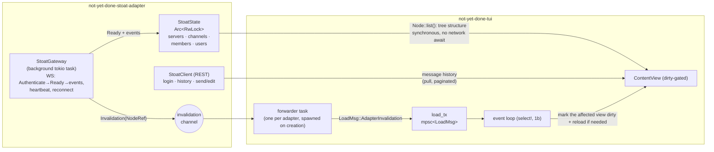

# Plan — Stoat adapter (chat integration)

> Status: **phases R + 0 + 1 + 2 + 2.1 + 3 + 4 done** (phase 4:
> 2026-06-06, local, unpushed). The foundation, the read-only tree, the live
> layer (message events plus reconnect), the tree view with categories, **write**
> (send/edit/delete/react) and **structural live events** (channel
> create/rename/delete + category CRUD) are in place. Open: unreact, MFA,
> server join/leave live. See §8 for the phase status in detail.
>
> Test instance: a private Revolt API **0.13.7** instance (Stoat frontend);
> the domain and the account credentials live **outside** the repo
> — they never go into code, tests or fixtures
> (fixtures use invented data, see `feedback_no_real_data_in_repo`).

## 1. Context and motivation

Stoat is a Discord/Slack alternative chat (a fork of Revolt, Rust backend).
We want to integrate it as another `ContentAdapter` — like Jira, Taiga,
Confluence and Postgres. But chat is a **fundamentally different domain** than
the previous (issue/wiki/DB) adapters, because two properties break the existing
pull/request-response model:

1. **Bootstrap is push-only.** There is **no** REST endpoint that lists the
   user's servers. The server and channel memberships arrive exclusively
   through the WebSocket `Ready` event.
2. **Live updates are push.** New messages, edits, deletes and reactions
   arrive as WS events and have to trigger a redraw out-of-band — which no
   adapter does so far (they all only _answer_ user actions).

These two points are **separate concerns** and are treated separately in this
plan. That yields a clean phase cut: read-only first, write later; the live
layer additive on top.

## 2. Verified API facts

All the points below were checked against the real test instance with a real
login — including the write endpoints (verified in phase 3 via `curl` against our
own `SavedMessages` channel, rather than posting into other people's channels).

### Discovery

- `GET /api/` (unauthenticated) returns the server config:
  `{ revolt, features{captcha,email,invite_only,autumn,january,livekit}, ws, app, vapid }`.
- From it we self-discover the WS URL (`ws`) and the file/embed servers
  (`autumn`, `january`). The adapter config therefore only needs the base domain.
- Test instance: `invite_only: true` (registration blocked), `email: false`,
  captcha off, `ws = wss://<instance>/ws`.

### Auth

- `POST /api/auth/session/login` with `{email, password, friendly_name}`
  → `{ result:"Success", _id (session id), user_id, token, name }`.
- Follow-up requests carry the header **`X-Session-Token: <token>`**.
- The test account had **no MFA** — the ticket/MFA flow is therefore a risk and
  is not covered (see §9).
- A bot token (`X-Bot-Token`) also exists, but it is **not** the target (a user
  login is wanted).

### Reading (REST, checked)

- `GET /api/users/@me` → our own user (`_id, username, discriminator, relations`).
- `GET /api/users/dms` → an array of `SavedMessages` / `Group` / `DirectMessage`
  channel objects (with `last_message_id`, `recipients`, and `name` for groups).
- `GET /api/channels/{id}/messages?limit=N` → an array of messages
  (`_id, channel, author, content, system?, …`). Pagination via
  `before`/`after`/`sort` (the cursor is the message ULID).
- **No** server-list REST endpoint: `GET /servers/@me`, `/users/@me/servers`
  → 404. `GET /servers/{id}` exists (a single fetch).

### Bootstrap (WebSocket, checked)

- Connect to `wss://…/ws`, then send: `{"type":"Authenticate","token":"<token>"}`.
- The server answers `{"type":"Authenticated"}`, then **once**
  `{"type":"Ready", users[], servers[], channels[], members[], emojis[],
voice_states[], policy_changes[]}`.
- `Ready` delivers **everything in one go**: in the test 2 servers, 11 channels
  (server channels **and** DM/group channels), 2 users, 2 members.
- Server object: `_id, owner, name, channels[<id>], categories[], roles,
default_permissions`.
- TextChannel: `{channel_type:"TextChannel", _id, server, name,
last_message_id, default_permissions}`.
- The message `_id` is a **ULID** → the creation timestamp is embedded (no
  separate timestamp field needed).

### Writing (REST, ✅ verified in phase 3 via `curl`)

Checked against the `SavedMessages` self-channel of the test instance (it
bothers nobody; the probe messages were deleted afterwards):

- ✅ `POST /api/channels/{id}/messages` with `{content}` → a new message
  (200, returns `_id`). `nonce` is **optional** (just `{content}` is enough).
- ✅ `PATCH /api/channels/{id}/messages/{msg}` `{content}` → edit
  (200, the `edited` timestamp gets set).
- ✅ `DELETE /api/channels/{id}/messages/{msg}` → delete (204).
- ✅ `PUT /api/channels/{id}/messages/{msg}/reactions/{emoji}` → reaction
  (204; `emoji` as a percent-encoded path segment). Unreact
  (`DELETE …/reactions/{emoji}`) is also 204, but not wired up yet.

### Ongoing WS events (for the live layer, a selection)

`Message`, `MessageUpdate`, `MessageDelete`, `MessageReact`/`MessageUnreact`,
`ChannelCreate`/`ChannelUpdate`/`ChannelDelete`, `ServerUpdate`,
`ServerMemberJoin/Leave`. Keep-alive: the client periodically sends
`{"type":"Ping","data":<n>}`, the server answers `Pong`.

## 3. Architecture overview



Building blocks:

1. **`StoatClient` (REST).** A stateless HTTP client (reqwest) that carries the
   `X-Session-Token`. Responsible for login, message history (paginated),
   single fetches, and later writes. Fits 1:1 into the existing pull model.
2. **`StoatGateway` (background task).** The **only** place with WS logic.
   It holds the connection (`Authenticate` → `Ready` → event stream), sends
   heartbeat pings, reconnects on disconnect (with backoff) and mirrors the
   `AdapterStatus` (`Connecting`/`Ready`/`Failed`).
3. **`StoatState` (`Arc<RwLock<…>>`).** The in-memory source of truth for the
   tree structure (servers, channels, members, users), filled from `Ready` and
   updated continuously from events. **No SQLite cache for chat state**
   (highly volatile; persistent caching buys little here — a deliberate deviation
   from the other adapters, agreed with the user). SQLite only for the session
   token (as usual) and the view sort state.
4. **Invalidation push (generic, new).** A new trait method on
   `ContentAdapter` with a no-op default (open/closed — all other adapters stay
   untouched). On relevant events the gateway pushes an
   `Invalidation` value; a forwarder task in the TUI feeds it as a new
   `LoadMsg` variant into the **existing** `load_tx` channel.

### Key insight: the push path almost already exists

- There is already `subscribe_status() -> watch::Receiver<AdapterStatus>` as an
  adapter→TUI push precedent (`not-yet-done-content/src/lib.rs:722`).
- There is already `load_tx: mpsc::UnboundedSender<LoadMsg>`, through which async
  tasks report results back into the loop, drained by `App::poll_load()`
  (`not-yet-done-tui/src/app/mod.rs:50` ff., `main.rs:165`).
- **Live updates are the same mechanism, generalized:** instead of "the status
  changed" → "node X changed". The gateway feeds `load_tx`; the
  1b `select!` loop wakes up immediately on arrival. No new channel needed.

## 4. Prerequisite — render loop 1b (its own, preceding work)

Rationale: the live layer (phase 2) needs a loop that wakes up **out-of-band**
on a push signal. The current 1a loop is a 200 ms poll loop
(`main.rs:149` ff.) — an arriving invalidation would become visible with up to
200 ms of latency, and only through the poll interval. According to the ADR, 1b
is the planned next step anyway and "a genuine subset — not throwaway code".

Steps (details and the tricky parts in
`docs/decisions/0001-render-loop-dirty-gating.md`, §Consequences):

- **R1.** A `tokio::select!` loop over: the crossterm `EventStream` (instead of
  `event::poll`), `load_rx`, `commit_rx` and a conditional 1 Hz `interval`
  (armed only while `has_live_banner()` or an active tracking is alive).
- **R2.** Secure the coexistence with the Kitty protocol enable/disable and the
  **synchronous editor suspend/restore** — the `EventStream` has to pause and
  resume cleanly around the editor suspension. (The ADR marks this as the main
  risk of 1b.)
- **R3.** Serve the external pollers without a channel (`poll_live_editor`,
  `poll_editor_close`, `poll_detached_script`) through the conditional low-frequency
  `interval`, which only runs while an editor or script is pending.
- **R4.** Update ADR `0001` to "variant 1b implemented" (consequences,
  remaining risks). Idle = parked, ~0 % CPU; async display latency without the
  200 ms ceiling.
- **R5.** Regression smoke: key-press latency, the busy banner's one-second beat,
  returning from the editor, async reload — all as before, plus a check of the
  idle CPU.

## 5. The generic invalidation mechanism (in `not-yet-done-content`)

Following 1b, before or together with phase 2. Deliberately kept
**adapter-neutral**.

- **I1.** A new type in `not-yet-done-content/src/lib.rs`:

  ```rust
  /// Out-of-band signal from an adapter that content has changed and
  /// the affected views should be reloaded / redrawn.
  #[derive(Clone, Debug)]
  pub enum Invalidation {
      /// One concrete node (and its open child list) is stale.
      Node(NodeRef),
      /// A whole subtree root is stale (e.g. the channel list changed).
      Subtree(NodeRef),
      /// Everything in the adapter is stale (reconnect, resync after Ready).
      All,
  }
  ```

- **I2.** A new trait method on `ContentAdapter`, **default = an empty stream**
  (open/closed; no existing adapter has to be touched):

  ```rust
  /// Subscribe to out-of-band invalidations. Default: a receiver whose
  /// sender lives for the process lifetime and never sends (pull-only adapters).
  fn subscribe_invalidations(&self) -> tokio::sync::mpsc::UnboundedReceiver<Invalidation> {
      // like the subscribe_status default: a static channel that never sends
  }
  ```

- **I3.** TUI: a new `LoadMsg::AdapterInvalidation { instance_id: String,
inv: Invalidation }` (`app/mod.rs`). When each adapter is created, spawn a
  forwarder task that pumps `subscribe_invalidations()` into `load_tx`
  (tagged with the `instance_id`).
- **I4.** `App::poll_load()`: handle the new variant — determine the affected
  content view(s) of that `instance_id` and (a) mark them dirty
  and/or (b) trigger a targeted `spawn_content_load`/`reload` of the affected
  NodeRef. `Invalidation::All` → all views of that adapter.
- **I5.** Tests: the default receiver blocks forever without a sender-drop error;
  the forwarder task tags correctly; `poll_load` marks the right view dirty.

## 6. Crate layout and node-tree mapping

A new crate `not-yet-done-stoat-adapter`, registered in `Cargo.toml`
(workspace members) and in `build_adapter_factories()`
(`not-yet-done-tui/src/main.rs:112`) under the key `"stoat"`. Structured like
Taiga/Confluence:

```
not-yet-done-stoat-adapter/src/
├── lib.rs                 # pub use adapter::{StoatAdapter, StoatAdapterFactory}
├── config.rs              # YAML config (url/name + AuthSpec)
├── client/                # REST
│   ├── mod.rs             # StoatClient, X-Session-Token
│   ├── auth.rs            # POST /auth/session/login
│   ├── discovery.rs       # GET /api/ → ws url, autumn, january
│   ├── messages.rs        # GET/POST/PATCH/DELETE …/messages
│   └── users.rs           # GET /users/@me, /users/dms, /users/{id}
├── gateway/               # WS
│   ├── mod.rs             # StoatGateway (connect, ping, reconnect)
│   ├── protocol.rs        # Authenticate/Ready/event (de)serialization
│   └── state.rs           # StoatState (Arc<RwLock>), event apply
├── db.rs / entity/ / auth_session_store.rs   # only the session token + view sort
└── adapter/
    ├── mod.rs             # StoatAdapter impl ContentAdapter
    ├── factory.rs         # StoatAdapterFactory impl AdapterFactory
    ├── auth_bridge.rs     # AuthOrchestrator ↔ StoatClient
    ├── types.rs           # NodeType factories
    ├── root.rs            # StoatRoot: servers + DMs
    ├── server.rs          # StoatServerNode: channels (by categories)
    ├── channel.rs         # StoatChannelNode: messages (paginated)
    └── message/           # StoatMessageNode (+ phase 3: send/edit/react)
```

Node tree:

| Level | Node     | `node_type`     | Children                           | Source                      |
| ----- | -------- | --------------- | ---------------------------------- | --------------------------- |
| 0     | Root     | —               | server nodes + DMs/groups          | `StoatState` (from Ready)   |
| 1     | Server   | `stoat:server`  | channels (sorted via `categories`) | `StoatState`                |
| 1     | DM/Group | `stoat:channel` | messages                           | `StoatState` + `/users/dms` |
| 2     | Channel  | `stoat:channel` | messages                           | REST `…/messages` (pull)    |
| 3     | Message  | `stoat:message` | (P3: reactions/replies)            | REST/state                  |

Details:

- **The tree structure (the level 0–2 headers) is read synchronously from
  `StoatState`** — no network await in `list()` for the structure.
- **Message history (level 2→3) is a REST pull with cursor pagination** (it maps
  onto `ListParams`/cursor — fitting the planned `project_cursor_pagination_plan`).
  Convention: newest at the bottom; scrolling backwards loads older ones via
  `before=<ulid>`.
- **Message content** = `content` (close to Markdown; `syntax: "markdown"`).
  Metadata: the author (resolved through `StoatState.users`, falling back to
  `GET /users/{id}`), the timestamp from the ULID, `edited`.
- **Voice channels** are listed, but marked as not enterable
  (no readable content) — LiveKit is out of scope.

## 7. Auth integration

Reuse of the existing `AuthOrchestrator` + `AuthBridge` pattern (as in Taiga),
**no new mechanism needed**:

- `AuthMechanism::PasswordLogin`. ⚠ **Correction (phase 0):** the field names are
  **not** freely choosable — `AuthSpec::validate()` enforces exactly
  `username` + `password` for `PasswordLogin`. Stoat logs in by e-mail, so the
  `username` field carries the **e-mail address**. The login closure reads
  `creds["username"]` as the e-mail, builds the body
  `{email, password, friendly_name:"not-yet-done"}` and returns the `token` as
  the session blob. (Alternatively `PasswordLogin` in
  `not-yet-done-content` could be extended by an `email` field — deliberately not
  done, since that would touch the generic auth contract; to be agreed with the
  user.)
- `SessionCachePolicy::UntilRejected`: the token is persisted in the SQL session
  store (only the token, **never** the password); on 401/403 → re-login.
- `AuthBridge::get_client()` validates the token against `GET /users/@me`; on a
  401 it clears the cache and runs `ensure_session` again.
- ⚠ **MFA**: if the login returns an MFA ticket response instead of `Success`,
  that is not covered in phase 0 → report it as `Failed{reason}` and treat it in
  §9 as follow-up work. (Test account: no MFA.)

Example config (`docs/examples/views/stoat-adapter.yaml`):

```yaml
url: https://chat.example.org # base; /api and /ws self-discovered via GET /api/
name: chat

auth:
  mechanism: password-login
  session_cache:
    kind: until-rejected
  bindings:
    - field: username # field name fixed by the mechanism; carries the LOGIN E-MAIL
      provider: { type: prompt }
    - field: password
      provider: { type: prompt }
```

View config (`docs/examples/views/stoat.yaml`):

```yaml
tab:
  name: Stoat
  order: 6
  icon: "󰭹"

adapter:
  type: stoat
  id: personal
  config: stoat-adapter.yaml
  manual_connect: false

views:
  - name: chats
    node_type: "stoat:server"
    default: true
    columns:
      - { key: name, label: Name, source: label, sizing: "flex(1)" }
    children:
      - name: Channels
        key: c
        node_type: "stoat:channel"
        columns:
          - { key: name, label: Channel, source: label }
        children:
          - name: Messages
            key: m
            node_type: "stoat:message"
            columns:
              - { key: author, label: Author, sizing: max }
              - {
                  key: content,
                  label: Message,
                  source: label,
                  sizing: "flex(1)",
                }
    preview:
      enabled: true
      source: content
      keybinding: p
    # Phase 3:
    # shortcuts: { i: send_message, e: edit_message }
```

## 8. Phase cut

> The order is fixed: **R before everything else** (the user's decision). Read
> before write.

- **Phase R — render loop 1b** (§4). A precondition for live. Mergeable on its
  own; useful even without Stoat (real 0 % idle, lower latency).
- **Phase 0 — foundation. ✅ DONE 2026-06-04.** The crate
  `not-yet-done-stoat-adapter` (workspace member + factory registration under the
  key `"stoat"`), `StoatClient` (REST: login, discovery, `/users/@me`
  validation), `StoatGateway` (WS: connect → authenticate → collect Ready,
  heartbeat ping, reconnect with backoff), `StoatState` (in memory, from
  `Ready`). The `AdapterStatus` is unified over **one** adapter-owned `watch`
  channel: the login phase is forwarded from the auth orchestrator (whose `Ready`
  is suppressed), the socket phase comes from the gateway
  (`Connecting`/`Ready`/`Failed`) — so the banner mirrors reality end to end.
  `root()` starts the gateway bootstrap in the background (non-blocking) and
  returns an **empty** tree. 10 unit tests (protocol (de)serialization on
  invented data, `StoatState` apply, session-store round trip, config parsing).
  Reference configs: `docs/examples/views/stoat-adapter.yaml` + `stoat.yaml`.
- **Phase 1 — read-only tree (pull). ✅ DONE 2026-06-04.**
  `StoatRoot` (lists servers **and** DM/group channels — depending on the
  top-level `node_type` of the view), `StoatServerNode` (channels in
  `server.channels[]` order; voice marked as `has_children: false`),
  `StoatChannelNode` (messages via REST
  `GET …/messages?limit&sort=Latest&include_users=true`, newest at the bottom),
  `StoatMessageNode` (a leaf with `content()` for the preview). The structure
  comes synchronously from `StoatState`, with no network `await`. **Author
  resolution** through the `include_users` array of the list response (fallback:
  the raw id). **Timestamps** decoded from the message ULID (`%Y-%m-%d %H:%M`
  UTC). **Composite IDs** `<channel>/msg/<ulid>` let `get_by_id` reload a single
  message for the preview path (`GET …/messages/{id}`) — like the Confluence
  composite IDs. **Stoat is already usable at this point (browse + read).**
  ⚠ **A deliberate phase 1 limit:** only the _newest_ page
  (`DEFAULT_MESSAGE_LIMIT = 50`); backfilling older messages via
  `before=<ulid>` exists as a parameter in `list_messages`, but is not
  wired into the TUI yet (it waits for
  `project_cursor_pagination_plan`). No live push — after connecting, a
  manual `r` reload (live = phase 2). 12 further unit tests (message
  parsing/ULID decoding, node listing order, composite IDs).
- **Phase 2 — live layer. ✅ DONE 2026-06-04.** The generic
  invalidation mechanism (§5): a new `Invalidation` enum +
  `ContentAdapter::subscribe_invalidations()` (no-op default) in
  `not-yet-done-content`; a TUI forwarder (`spawn_content_invalidation_watcher`,
  one per view, next to the status watcher) pumps into the **existing**
  `load_tx` channel via `LoadMsg::AdapterInvalidation`. On
  `Message`/`MessageUpdate`/`MessageDelete`/`MessageReact`/`MessageUnreact` the
  gateway pushes an `Invalidation::Node{id: <channel>}`, and on every `Ready`
  (both the first connect **and** a reconnect resync) an `Invalidation::All`.
  `poll_load` reloads the affected panes at their **current level** (`All` →
  all panes of the view; `Node{id}` → only panes whose `parent_node_id` is
  that channel — a message in a channel that is not open costs nothing).
  **The first Ready pushes All ⇒ the initially empty tree now fills up without a
  manual `r`.**
  - ⚠ **Deviation from the §5 sketch:** `subscribe_invalidations` returns
    a **`broadcast::Receiver`**, not an `mpsc` one — invalidations are
    discrete _events_ (not a latest value like `watch`, which would
    swallow intermediate states) and **one** adapter instance can feed
    **several** views that each subscribe independently (mpsc = single consumer,
    which does not work). On `Lagged` (the frontend is too slow) the watcher
    resyncs conservatively with `All` — no update is lost, only coarsened.
    The payload is an adapter-internal node id (not an app-wide `NodeRef`):
    the watcher is already bound to a view, and needs no more than "which
    level".
  - ⚠ **A phase 2 limit (resolved in phase 4):** **structural**
    live events were not yet wired up in phase 2 — a newly
    created or renamed channel only appeared after a reconnect. Since
    phase 4 (see below), channel CRUD + category CRUD are live; only
    server join/leave still needs a reconnect.
  - A reload resets the pane's cursor to the default behaviour
    (no "stay at the reading position") — accepted for phase 2.
- **Phase 2.1 — categories + tree view. ✅ DONE 2026-06-05.** The
  flat drill-down view was replaced by a **tree view**:
  `server → (category | uncategorized channel) → channel → (drill into
messages)`. The wire shape `Server.categories: [{ id, title, channels[] }]`
  via the WS `Ready` was curl-verified against Stoat **0.13.7** (`id` is plain,
  not always a ULID).
  - `protocol.rs`: a `Category` struct + `Server.categories` (`#[serde(default)]`
    → if the field is missing, all channels are uncategorized, nothing breaks).
  - `StoatServerNode` is now multi-type: `list(stoat:category)` →
    categories (composite id `<server>/cat/<catid>`, like `<channel>/msg/<ulid>`),
    `list(stoat:channel)` → **only uncategorized** channels (those in no
    category). A new `StoatCategoryNode` lists the channels of a
    category. `get_by_id` decodes the category composite.
  - A shared `channel_summary` helper, so that a channel renders identically
    under a server and under a category.
  - View config: a heterogeneous server level (two tree branches,
    `stoat:category` and `stoat:channel`), `stoat:channel` at two depths (the
    duplicate-node_type rule is per level/sibling, so this is fine), and
    `stoat:message` without a `tree_label` → a channel **drills** into a flat
    message list instead of expanding inline. Order: uncategorized channels
    first, then categories. Regression test
    `validate_accepts_heterogeneous_category_channel_tree`.
  - The live layer is untouched: message events still match on
    `parent_node_id == channel`, no matter where the channel hangs in the tree.
  - 33 stoat + 473 TUI tests green, installed. **Smoke test open.**
- **Phase 3 — write — DONE 2026-06-06 (local, unpushed).** All four
  write endpoints were verified via `curl` against the real instance first
  (against the `SavedMessages` self-channel — it bothers nobody; the probe
  messages were deleted afterwards): `POST …/messages {content}` (`nonce`
  confirmed as optional — a body of just `{content}` is enough), `PATCH …/messages/{id}
{content}`, `DELETE …/messages/{id}` (204), `PUT …/messages/{id}/
reactions/{emoji}` (204, the emoji as a percent-encoded path segment).
  - `client/messages.rs`: `send_message` (→ message id), `edit_message`,
    `delete_message`, `add_reaction` plus a dependency-free
    `percent_encode_segment` (keep the unreserved set, `%XX` for the rest).
  - `StoatMessageNode` now carries `Arc<StoatClient>` + `channel_id` +
    `message_id` and implements `actions()`/`prepare()`/
    `picker_options()`/`execute()`: `edit_message` (editor, **the raw body
    without a header** — chat messages are Markdown and may start with `#`,
    and a header strip would eat that; no optimistic-concurrency token,
    Revolt offers none), `delete_message` (None), `react` (a picker over
    a short Unicode emoji list). `StoatChannelNode` gets `send_message`
    (editor, empty template → the buffer is the message). Edits and deletes of
    other users' messages are rejected by the server with a 403 → a clean
    error instead of a per-instance filter (the deterministic-per-node_type
    contract).
  - `actions_for_type`: `stoat:channel → [send]`, `stoat:message →
[edit, delete, react]`; in lockstep with the nodes' `actions()`.
    `capabilities` now has `supports_create`/`supports_delete = true`.
  - View YAML (example + deployed): message-level actions `a` send
    (`type: create, id: send_message` — parent=channel, child=message),
    `e` edit, `d` delete, `+` react, `r` reload — in both `messages`
    blocks (uncategorized and under a category).
  - Reload after a write: `ContentActionDone` (delete/react) plus the
    `NodeActionEditSession` reload (send/edit) refresh the pane;
    on top of that the live event (message/update/delete) arrives and invalidates.
  - 38 stoat + 474 TUI tests green, installed. **Smoke test open.**
  - ⚠ **Not yet in phase 3:** unreact (the DELETE reaction — `add_reaction`
    is PUT only), and the MFA login edge case.
- **Phase 4 — structural live events — DONE 2026-06-06 (local,
  unpushed).** The channel and category structure now changes live,
  without a reconnect. The wire shapes were verified first via a WS capture probe
  (a second session on the gateway, outside the repo, values redacted, deleted
  afterwards) against Stoat **0.13.7**:
  - `ChannelCreate` carries the full channel object inline (the same shape
    as in `Ready`) → it deserializes straight into `Channel`.
  - `ChannelUpdate { id, data: { name? … }, clear: [] }` — a partial
    patch (rename).
  - `ChannelDelete { id }`.
  - `ServerUpdate { id, data: { channels? | categories? | name? }, clear }`
    — **category CRUD does not exist as an event of its own**: creating,
    deleting, renaming, assigning and reordering all arrive as a full
    replacement of the `data.categories` list. Creating a channel additionally
    triggers a `ServerUpdate.data.channels` (the full list).
  - `protocol.rs`: four variants pulled out of `Other` plus `ChannelPatch`
    and `ServerPatch` (only the rendered fields, everything else ignored). A
    malformed variant fails to deserialize → the whole frame
    is discarded and the socket survives (no crash).
  - `state.rs`: `insert_channel` (idempotent, it also appends to
    `server.channels` in case the `ServerUpdate` does not arrive),
    `patch_channel`, `remove_channel` (unlinked from `server.channels` **and**
    all categories), `patch_server` (full list replacement for
    channels/categories + rename).
  - `gateway/mod.rs::handle_text`: four new arms mutate `StoatState` under a
    write lock and push `Invalidation::All` (the tree shape changed →
    the reload machinery takes over; no new invalidation variant, no
    cross-crate change).
  - 50 stoat + 474 TUI tests green, installed. **Smoke test open.**
  - ⚠ **Not yet in phase 4:** `ServerCreate`/`ServerDelete` (joining and
    leaving servers) — the wire shape is not verified (it was not exercised in
    the capture), and stays deliberately covered by the reconnect `Ready` path.

## 9. Risks and open points

- **MFA login** is not covered (the test account has no MFA). The ticket flow may
  need to be added in phase 0/3.
- **WS reconnect and state resync.** After a reconnect a fresh `Ready` arrives →
  replace `StoatState` and push `Invalidation::All`. Define the backoff and the
  ping timeout cleanly.
- **1b ↔ editor suspend/restore** (the ADR's main risk): the `EventStream` has to
  pause cleanly around the synchronous editor suspension.
- **Permissions/roles.** `default_permissions`/`roles` determine the visible
  channels; for read-only, just list what Ready delivers to begin with (the
  server filters server-side). No permission logic of our own in P1.
- **Large channels / pagination limits.** Respect the history limit (Revolt: max
  100 per request); scroll backwards incrementally. No silent truncation without
  a hint.
- **Author resolution** for authors outside the Ready cache → `GET /users/{id}`
  with a small in-memory LRU.
- **Persistence deliberately minimal** (only the token + sort) — if "the last
  read message across a restart" is wanted later, that is an additive extension.

## 10. Test and smoke strategy

- **Unit tests/fixtures on invented data** (Ready and message JSON rebuilt, no
  real ids, names or content). Protocol (de)serialization, `StoatState` event
  apply, ULID→timestamp, author resolution.
- **The invalidation path** (§5: I5) is testable without a real network (a fake
  sender → `poll_load`).
- **Manual `curl` probing** against the test instance before every new
  endpoint use (especially writes ⚠) — the pattern from `reference_taiga_init`,
  the token from the login response, **none of it into the repo**.
- **Smoke tests** are added centrally in `docs/smoke-tests.md` (its own "Stoat"
  section), not as a separate file (`feedback_smoke_tests_central`).
- After every phase `cargo build --release`; after TUI changes `cargo install`,
  so that the user can test immediately (`feedback_install_after_changes`).

## 11. Keeping the docs in step

Maintain per phase (otherwise the change is incomplete):

- `README.md`: Stoat in the adapter list.
- `docs/explanation/architecture.md`: the push/invalidation mechanics + the
  gateway pattern (the first streaming adapter — a reference for future ones).
- Update ADR `0001` (1b implemented); possibly a new ADR "0002 — adapter
  invalidation push / streaming adapters" (context, the options generic vs.
  Stoat-local, the decision for generic, consequences).
- `docs/examples/views/stoat*.yaml` as the reference config.
- Document every config option (what **and why**).

## 12. @-mentions (display + edit autocomplete)

Revolt encodes mentions in the body as `<@USERID>`. The goal: show a readable
`@username` in the list, and when editing use the same autocomplete/round-trip
mechanics as with Jira/Taiga (`@uu_slug` + a CACHE section). Built on the shared
`not_yet_done_content::slug::SlugTable`.

**Why two render forms?** Display and editor want different things:

- **Display** (read-only, list/preview): `<@ID>` → `@username` — readable.
- **Editor** (round trip): `<@ID>` ↔ `@uu_username` — slug-based, plus a
  CACHE section; on save it goes back to `<@ID>` for the wire API.

**Data source = a server-scoped member cache.** Completions may only offer
members of the server the channel belongs to:

- `StoatClient::list_server_members(server_id)` → `GET /api/servers/{id}/members`
  (`users[]` → `id → username`, `exclude_offline=false`).
- `adapter::members::MemberCache`: `RwLock<HashMap<server_id, Arc<map>>>`, lazy,
  once per server per session (no live refresh; a reconnect rebuilds the adapter
  anyway). Errors are **not** cached (retry on the next listing).
- `adapter::members::channel_user_map(state, members, client, channel_id)`:
  a server channel → the member cache; a DM/group (no server) → the recipients
  from the `Ready` user snapshot.

**The transformation module `adapter::mentions`** (a mirror of Jira's `slugs.rs`):

- `user_table(map)` — a `SlugTable` with `slug_source = username`, `original = id`.
- `render_display(text, map)` — `<@ID>` → `@username` (unknown: raw).
- `render_slugs(text, table)` / `parse_slugs(text, table)` — `<@ID>` ↔ `@uu_…`
  (word-boundary safe; an unknown slug → `Err(slug)`).
- `cache_section(table)` / `strip_cache_section(text)` — a CACHE block at the
  end of the buffer, cut off before parsing.

**Node wiring:**

- `StoatMessageNode` holds `content_body` **raw** (the source of truth) plus an
  `Arc<HashMap<id,username>>`. The `label`/`content` metadata are
  display-rendered; `prepare(edit)` renders slugs + CACHE, `execute(edit)` strips
  and parses back; `Content::read` renders the display form.
- `StoatChannelNode` holds `state` + `members`, and builds the user map once per
  `list()` (for display) and in `prepare/execute(send_message)` (for slugs).

**Known cuts:** the member list is cached once per server/session (no live
refresh on join/leave); the slug source is the username (a server nickname is
not taken into account yet) — both noted as later build-out steps.
